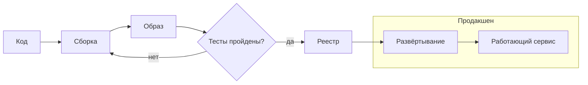
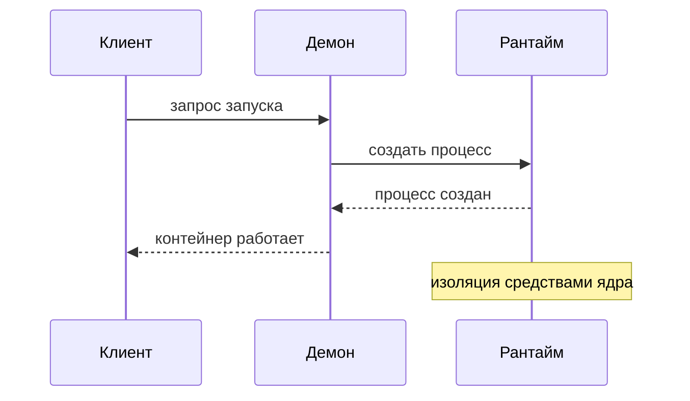

Лекция 0

# Шаблон презентации курса

Как устроены слайды, диаграммы и заметки докладчика

<!--
Добрый день. Это служебный шаблон: он показывает, как выглядят все типы слайдов курса — обложка, разделитель, обычный слайд, диаграммы, таблицы решений и карточки. Заметки докладчика пишутся вот в таких комментариях в конце каждого слайда.
-->

---
layout: section
---

01

# Разделитель смыслового блока

Короткое пояснение, о чём пойдёт речь дальше

<!--
Разделитель используется, когда лекция переходит к новому смысловому блоку. На нём я обычно напоминаю, что мы уже увидели, и формулирую вопрос, на который ответит следующий блок.
-->

---

# Обычный слайд с диаграммой

Поток поставки — путь артефакта от коммита до работающего сервиса:

<!--
Обычный контентный слайд: заголовок, одна мысль, одна диаграмма. Здесь я проговариваю каждый переход на схеме: код собирается в образ, образ проходит тесты, попадает в реестр и разворачивается. Обратите внимание на цикл при падении тестов — к нему мы ещё вернёмся.
-->

---
layout: two-cols
---

# Две колонки

Слева — модель взаимодействия:

::right::

## Что важно

- Каждый компонент отвечает за своё
- Границы ответственности видны на схеме
- Отказ одного слоя не валит остальные

Карточка-акцент для ключевого вывода слайда.

<!--
Двухколоночная раскладка: слева диаграмма, справа выводы. Так студент сначала видит модель, а потом — что из неё следует.
-->

---

# Таблица критериев выбора

| Критерий | Вариант А | Вариант Б |
| --- | --- | --- |
| Скорость запуска | секунды | минуты |
| Изоляция | ядро ОС | гипервизор |
| Плотность | высокая | низкая |
| Недоверенный код | нет | да |

<strong>Режим отказа:</strong> карточка с оранжевой рамкой — для рисков и типичных сбоев.

<strong>Заметка:</strong> жёлтая карточка — для оговорок и практических советов.

<!--
Таблицы решений — фирменный приём курса: каждая лекция заканчивается критериями выбора. Оранжевые карточки маркируют режимы отказа, жёлтые — практические оговорки.
-->

---
layout: fact
---

# 4 метрики

задают язык разговора о скорости и стабильности поставки

<!--
Слайд-факт: одна цифра или одно утверждение на весь экран. Используется редко, для самых важных акцентов.
-->

---
layout: center
---

# Итоги

- Обложка → разделители → контент → итоги
- Диаграмма на каждом содержательном слайде
- Заметки докладчика — полный текст выступления

**Дальше:** реальные лекции курса

<!--
Финальный слайд подводит итог и перекидывает мост к следующей лекции. На этом шаблон заканчивается.
-->
