
Лекция 1

# Системный анализ программной инфраструктуры

Инфраструктура — не набор инструментов, а проектируемая система

<!--
Добрый день. Эта лекция задаёт рамку всего курса. Мы не просто перечислим инструменты — мы научимся видеть программную инфраструктуру как систему со своими границами, компонентами и потоками. Рамка, которую мы введём сегодня, будет использоваться в каждой последующей лекции: проблема, модель, границы, критерии выбора, режимы отказа, свидетельства. Начнём с вопроса: что именно происходит между строкой кода и сервисом, работающим у пользователя?
-->

---

# Маршрут лекции

- **01.** Путь артефакта — от кода до работающего сервиса
- **02.** Поток создания ценности и три пути DevOps
- **03.** Модель CALMS и теория ограничений
- **04.** Инфраструктура как система
- **05.** Требования к инфраструктуре и критерии выбора
- **06.** Команды, роли и метрики потока

<!--
Шесть блоков сегодняшней лекции выстроены по нарастающей: сначала мы увидим путь одного артефакта, затем поймём, как устроен весь поток поставки, изучим модели и практики DevOps, научимся описывать инфраструктуру как систему с требованиями, командами и метриками. Именно эта последовательность станет нашим инструментом для анализа любого инфраструктурного решения на протяжении всего курса.
-->

---

# Проблема: воспроизводимость поставки

<strong>Типичные симптомы</strong> 
«Работает у меня» — у пользователя нет. 
Релиз раз в квартал с накопившимися изменениями. 
Ручные шаги в инструкции развёртывания. 
Команда не знает, что задеплоено в продакшене.

<strong>Вопрос курса</strong> 
Как сделать путь от кода до сервиса повторяемым, быстрым и наблюдаемым — независимо от разработчика и среды?

<!--
Прежде чем изучать инструменты, важно понять, какую боль они лечат. «Работает у меня, но не в продакшене» — это не просто неудобство. Это симптом отсутствия воспроизводимой цепочки поставки. Артефакт меняет форму на каждом переходе, и в каждой точке может возникнуть расхождение между средами. Задача инфраструктуры — сделать эту цепочку детерминированной: один и тот же код всегда порождает один и тот же результат, независимо от того, кто и когда его запускает.
-->

---
layout: section
---

01

# Путь артефакта

От исходного кода до работающего сервиса

<!--
Начнём с первого блока. Прежде чем говорить о системах и потоках, нужно увидеть путь одного артефакта. Что происходит с кодом от момента, когда разработчик нажал push, до момента, когда запрос пользователя обработан? Каждый переход на этом пути — точка потенциальной потери воспроизводимости, и именно на этих точках строится инфраструктура.
-->

---

# Трансформации артефакта

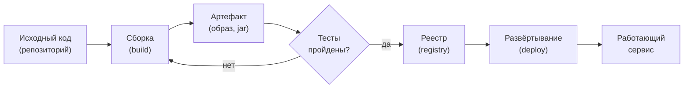

На каждом переходе артефакт меняет форму. На каждом переходе возможна потеря воспроизводимости.

<!--
Посмотрим на типичную цепочку. Исходный код компилируется или упаковывается в артефакт: это может быть Docker-образ, jar-файл или Python-пакет. Артефакт проходит тесты — если они не прошли, цикл начинается заново. Прошедший тесты артефакт публикуется в реестр и развёртывается. Обратите внимание: каждый переход — это граница, на которой окружение может отличаться. Именно поэтому нам нужна инфраструктура, делающая эти переходы воспроизводимыми.
-->

---

# Формы артефакта на каждом шаге

| Этап | Форма артефакта | Что теряется без контроля |
|---|---|---|
| Исходники | Файлы в репозитории | История изменений |
| После сборки | Скомпилированный пакет | Зависимость от окружения |
| После упаковки | Образ контейнера | Воспроизводимость среды |
| В реестре | Образ с digest (sha256) | Привязка к версии |
| В эксплуатации | Работающий процесс | Конфигурация и состояние |

Принцип: один артефакт проходит все среды. Среды различаются конфигурацией, не кодом.

<!--
Таблица показывает, что на каждом шаге форма артефакта меняется, и на каждом шаге есть риск потерять воспроизводимость. Ключевой принцип: артефакт должен быть неизменным после упаковки. Это значит, что один и тот же образ контейнера разворачивается в dev, stage и prod. Различия между средами вносятся только через конфигурацию. Если мы пересобираем артефакт в каждой среде, мы теряем гарантию того, что протестированное совпадает с развёрнутым в продакшене.
-->

---
layout: section
---

02

# Поток создания ценности и три пути DevOps

От идеи до работающей функции у пользователя

<!--
Второй блок. Один артефакт — это ещё не вся картина. Инфраструктура обслуживает непрерывный поток изменений от идеи до пользователя. Здесь нам поможет язык «Руководства по DevOps» Джима Кима и соавторов — концепция потока создания ценности и трёх путей, которые стали основой DevOps-практик.
-->

---

# Поток создания ценности

**Время поставки** — от идеи до пользователя. Инфраструктура ускоряет каждый переход в этой цепочке.

<!--
Поток создания ценности — это полная цепочка от бизнес-идеи до работающей функции у пользователя. В «Руководстве по DevOps» этот поток называется технологическим потоком поставки. Ключевой вопрос: сколько времени занимает путь от «записали задачу» до «пользователь использует»? Сократить это время — главная цель DevOps и всей программной инфраструктуры. Пунктирная стрелка обратной связи: она пунктирная, потому что без специальных усилий обратная связь сама не появляется.
-->

---

# Три пути DevOps

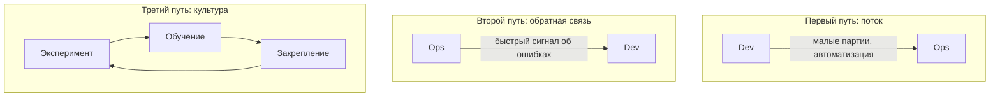

<!--
«Руководство по DevOps» формулирует три пути. Первый — ускорение потока слева направо: работа движется от разработки к эксплуатации малыми партиями и как можно быстрее. Второй — создание быстрой обратной связи справа налево: дефекты обнаруживаются там, где возникают, а не у пользователя. Третий — культура постоянного эксперимента и обучения на ошибках. Эти три пути задают архитектуру DevOps-практик, включая CI/CD, тестирование и инцидент-менеджмент.
-->

---

# Первый путь: ускорение потока

<strong>Малые партии изменений</strong> 
Меньше изменений за раз — меньше риск, быстрее откат, проще анализ при сбое.

<strong>Автоматизация шагов</strong> 
Ручная операция — источник ошибок и задержек. Сборка, тесты, деплой — автоматически.

<strong>Видимость потока</strong> 
Нужно видеть, где накапливается очередь и где работа застряла прямо сейчас.

<strong>Результат</strong> 
Частые, небольшие, безопасные релизы вместо редких и рискованных.

<!--
Первый путь — это ускорение движения работы слева направо. Главный инструмент — работа малыми партиями. Чем меньше изменение, тем проще его протестировать, тем легче откатить, тем быстрее оно доходит до пользователя. Автоматизация рутинных шагов убирает ошибки, которые неизбежно вносит человек при ручном выполнении. Видимость позволяет увидеть затор и устранить его до того, как он стал инцидентом. Результат: команда делает маленькие, частые, безопасные релизы.
-->

---

# Второй путь: обратная связь

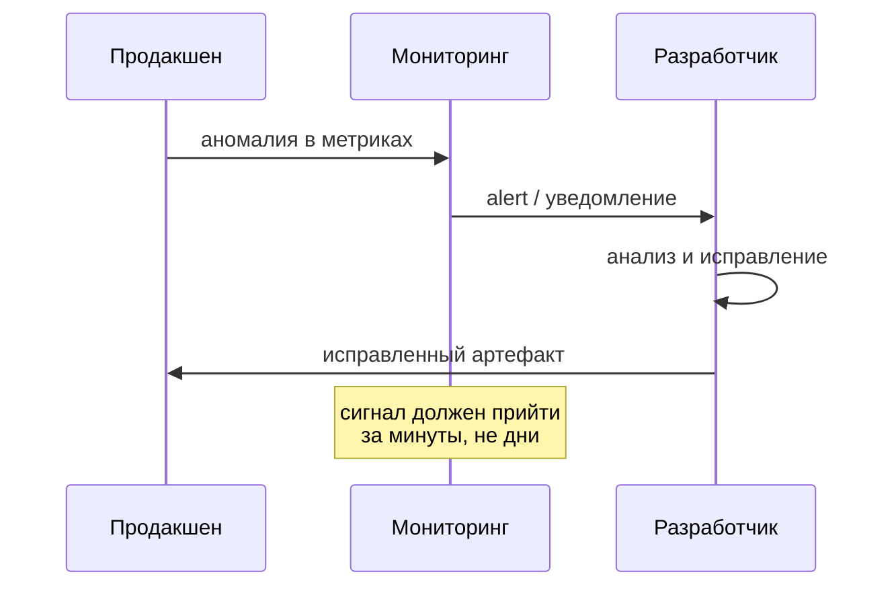

<!--
Второй путь отвечает на вопрос: насколько быстро мы узнаём о проблемах? Если дефект обнаруживается у пользователя через неделю после коммита, нам очень сложно найти причину и исправить её. Если продакшен сигнализирует об аномалии через несколько минут после деплоя, разработчик ещё помнит, что именно менял. Быстрая обратная связь — это инструмент качества. Именно поэтому в курсе мы уделяем столько внимания мониторингу, алертингу и наблюдаемости системы.
-->

---
layout: section
---

03

# Модель CALMS и теория ограничений

Пять опор DevOps и поиск узкого места

<!--
Третий блок. Мы увидели, что движется по потоку и как организована обратная связь. Теперь зафиксируем более полную модель: из чего состоит DevOps-культура и почему нельзя ускорить систему, не найдя узкое место. Эти два инструмента дополняют друг друга: CALMS описывает «что строить», теория ограничений объясняет «где начинать».
-->

---

# Модель CALMS

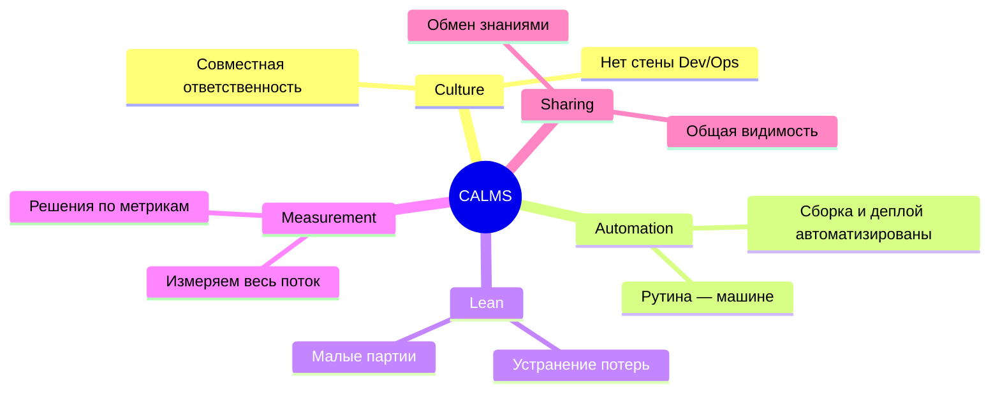

<!--
CALMS — это пять опор DevOps. Culture: разработка и эксплуатация несут общую ответственность за сервис. Automation: рутинные шаги поставки автоматизированы — человек делает только то, что требует суждения. Lean: работаем малыми партиями, выявляем и устраняем потери в потоке. Measurement: все решения принимаются на основе метрик, а не интуиции. Sharing: информация о состоянии системы открыта для всей команды. Заметьте: Culture стоит первой не случайно — без изменения культуры инструменты не работают.
-->

---

# Теория ограничений в потоке поставки

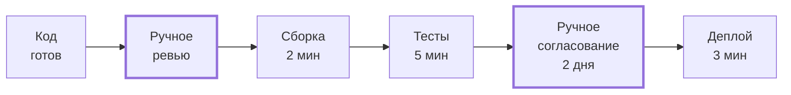

Ускорение любого участка, кроме узкого места, **не ускоряет систему** в целом.

<!--
Теория ограничений, разработанная Элияху Голдраттом, применима к любому потоку — в том числе к поставке программного обеспечения. Пропускная способность всего потока определяется самым медленным его участком. Если мы ускоряем сборку с пяти минут до одной, но ручное согласование занимает два дня — общее время поставки почти не изменится. Задача аналитика инфраструктуры — сначала найти ограничение, и только потом оптимизировать именно его.
-->

---

# Работа с ограничением: пять шагов

<strong>Типичные ограничения</strong> 
Медленная сборка (более 20 минут). 
Ручное согласование и подпись. 
Один общий стенд для всех разработчиков. 
Нет доступа к логам продакшена.

<strong>Алгоритм Голдратта</strong> 
1. Найти узкое место. 
2. Эксплуатировать его максимально. 
3. Подчинить всё остальное узкому месту. 
4. Расширить ограничение. 
5. Вернуться к шагу 1.

<!--
Голдратт описал пять шагов работы с ограничением, и они применимы к DevOps дословно. Сначала мы находим узкое место — это требует метрик и наблюдаемости. Затем максимально используем существующий ресурс: например, если ревью занимает много времени, автоматизируем всё, что можно автоматизировать. Потом расширяем ограничение: нанимаем людей, покупаем мощности, автоматизируем. Пятый шаг самый важный: после расширения узкое место перемещается, и процесс начинается заново.
-->

---
layout: section
---

04

# Инфраструктура как система

Границы, компоненты, интерфейсы и потоки

<!--
Четвёртый блок — ключевой для всего курса. Мы введём аналитическую рамку: как описывать инфраструктуру системно. Это не просто набор инструментов — это система с границами, компонентами и потоками данных. Именно системный взгляд позволяет рассуждать об отказах, принимать архитектурные решения и сравнивать альтернативы.
-->

---

# Системное описание инфраструктуры

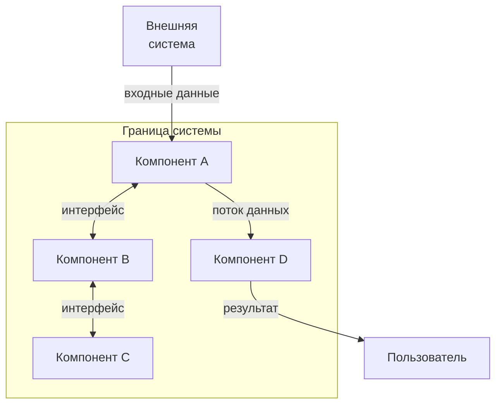

Система = **границы** + **компоненты** + **интерфейсы** + **потоки данных и управления**.

<!--
Системный взгляд — это не про конкретные инструменты, это про способ мышления. Чтобы описать инфраструктурную систему, нам нужно ответить на четыре вопроса. Где проходят её границы — что внутри, а что снаружи? Из каких компонентов она состоит? Через какие интерфейсы компоненты взаимодействуют? Какие данные и команды текут между компонентами? Отвечая на эти вопросы, мы получаем модель, по которой можно рассуждать, прогнозировать отказы и принимать решения.
-->

---

# voting-app: система для анализа

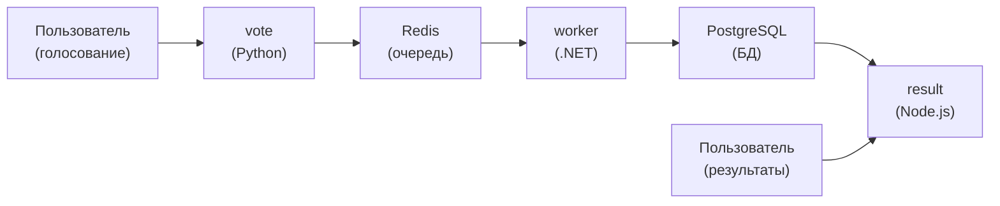

**voting-app** — многосервисное приложение, которое мы используем в каждой лекции и лабораторной.

<!--
На протяжении всего курса мы будем использовать один сквозной пример: voting-app, открытое учебное приложение Docker. В нём пять компонентов: сервис голосования на Python, Redis как очередь сообщений, worker на .NET, PostgreSQL как база данных и сервис результатов на Node.js. У каждого компонента своя ответственность и свой интерфейс. Когда мы будем изучать сети, контейнеры, оркестрацию или мониторинг — мы будем применять эти знания именно к этой системе.
-->

---

# Потоки данных в voting-app

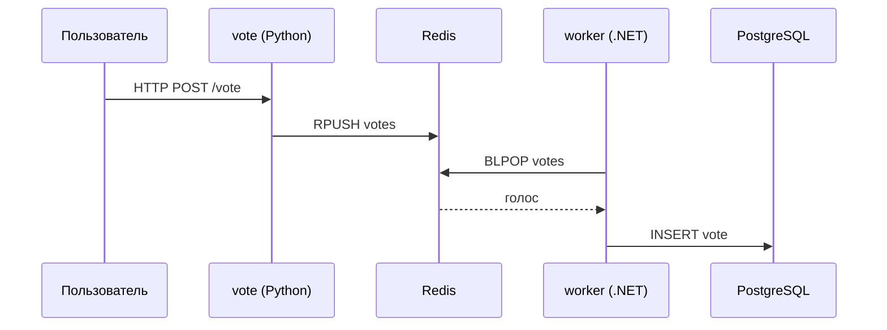

<!--
Посмотрим на потоки данных. Пользователь отправляет голос через HTTP POST на сервис vote. Vote кладёт голос в очередь Redis. Worker извлекает голос из очереди и записывает в PostgreSQL. Это асинхронная архитектура: vote и worker не вызывают друг друга напрямую, а общаются через очередь. Такой дизайн даёт устойчивость — если worker временно недоступен, голоса накапливаются в очереди. Понимать потоки данных — значит знать, где может возникнуть задержка и что произойдёт при отказе каждого компонента.
-->

---
layout: section
---

05

# Требования к инфраструктуре

Функциональные и нефункциональные

<!--
Пятый блок. Систему описывают не только компоненты, но и требования к ней. Большинство инфраструктурных решений определяются не функциональными требованиями — «что делать», — а нефункциональными — «насколько хорошо делать». Разберём оба типа и посмотрим, как они влияют на выбор инструментов.
-->

---

# Функциональные требования

Функциональные требования описывают **что** инфраструктура должна уметь делать.

<!--
Функциональные требования отвечают на вопрос «что должна делать система». Для инфраструктуры это: собрать исходный код в артефакт, запустить контейнер, развернуть в целевую среду, масштабировать компоненты при росте нагрузки, обновить сервис без простоя. Эти требования важны, но, как правило, их выполнение не вызывает споров — современные инструменты справляются со всем этим. Споры начинаются при обсуждении нефункциональных требований, которые определяют архитектуру.
-->

---

# Нефункциональные требования

<strong>Надёжность</strong> 
Сервис работает даже при отказах компонентов. Упал контейнер — поднялся автоматически.

<strong>Масштабируемость</strong> 
Система выдерживает рост нагрузки без переработки архитектуры.

<strong>Безопасность</strong> 
Секреты не в коде. Минимальные привилегии. Аудит доступа.

<strong>Стоимость</strong> 
Ресурсы используются эффективно. Стоимость измерима и предсказуема.

<strong>Эксплуатируемость</strong> 
Команда понимает, что происходит. Есть логи, метрики, playbooks.

<strong>Вывод</strong> 
NFR определяют выбор инструментов и архитектуру системы.

<!--
Нефункциональные требования задают качество работы системы. Надёжность: как система ведёт себя при частичном отказе. Масштабируемость: как реагирует на рост нагрузки. Безопасность: насколько ограничен и прослеживаем доступ. Стоимость: насколько эффективно используются ресурсы. Эксплуатируемость: могут ли люди понять, что происходит с системой. Именно нефункциональные требования определяют, нужен ли нам Kubernetes или хватит docker compose.
-->

---

# Критерии выбора инструментов инфраструктуры

| NFR | Малый проект | Средний проект | Крупный сервис |
|---|---|---|---|
| Надёжность | compose restart | Swarm / k8s basic | k8s + HA + PDB |
| Масштаб | 1 нода | 3–5 нод | &gt;10 нод, HPA |
| Стоимость | VPS, самообслуживание | PaaS, managed DB | FinOps, right-sizing |
| Безопасность | .env файлы | Vault / Secrets | Policy as code |
| Эксплуатируемость | docker logs | Centralised logs | Observability stack |

<!--
Эта таблица иллюстрирует принцип: инструмент выбирается под нефункциональные требования. Маленький проект с одной нодой может обойтись docker compose с автоматическим перезапуском контейнеров. Средний проект с требованиями к доступности потребует Swarm или базового Kubernetes. Крупный сервис с высокой нагрузкой нуждается в горизонтальном автомасштабировании и FinOps-подходе к стоимости. Нет универсального правильного ответа — есть выбор, обоснованный требованиями конкретного проекта.
-->

---
layout: section
---

06

# Команды, роли и метрики потока

Кто отвечает и как измерить результат

<!--
Шестой блок. Мы разобрали технические аспекты: артефакты, потоки, требования. Теперь поговорим о людях. Кто управляет этой системой и как мы измеряем, хорошо ли она работает? Ответы на эти вопросы — не менее важная часть DevOps, чем автоматизация.
-->

---

# Стена между Dev и Ops

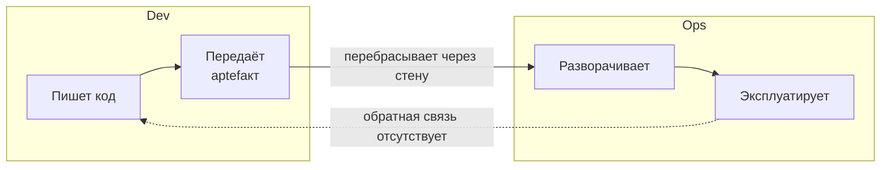

**Проблема:** Dev не знает, как код работает в продакшене. Ops не понимает, что именно изменилось.

<!--
Традиционная модель разделения разработки и эксплуатации создаёт хорошо известную проблему — «стену». Разработчик пишет код и передаёт его операционной команде. Операционная команда разворачивает и эксплуатирует, но не понимает деталей реализации. При инциденте разработчик не имеет доступа к продакшену, а операционный инженер не может исправить код. Обратная связь медленная, взаимные обвинения неизбежны. DevOps убирает эту стену через совместную ответственность.
-->

---

# Кросс-функциональная команда

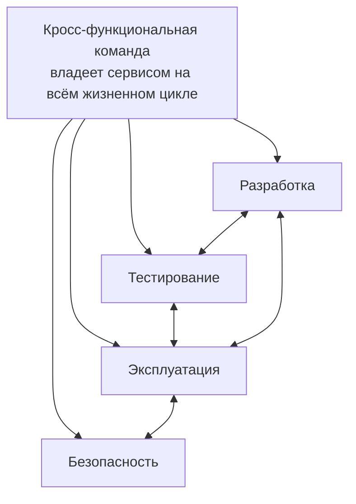

<!--
Кросс-функциональная команда объединяет разработку, тестирование, эксплуатацию и безопасность. Она отвечает за сервис полностью: от написания кода до мониторинга в продакшене. «Инструментарий agile-лидера» Пола Коннинга описывает три условия самоуправляемой команды: автономия — команда сама принимает решения об архитектуре и инструментах; ясная цель — команда понимает, какую ценность она создаёт; рост мастерства — команда постоянно улучшает свои компетенции.
-->

---

# Метрики DORA: четыре показателя потока

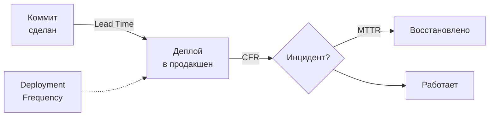

<!--
Исследование DORA (DevOps Research and Assessment) выявило четыре метрики, отличающие высокоэффективные команды. Первая: время поставки изменения — от коммита до продакшена. Вторая: частота деплоев — как часто команда выкатывает изменения. Третья: среднее время восстановления после инцидента. Четвёртая: доля изменений, приводящих к сбою. Эти метрики измеряют весь поток, а не отдельный инструмент. По ним мы будем оценивать архитектурные решения на протяжении всего курса.
-->

---

# Значения метрик DORA

| Метрика | Что измеряет | Elite performers |
|---|---|---|
| Lead Time | Скорость потока | Менее 1 часа |
| Deploy Frequency | Частота поставки | По запросу |
| MTTR | Стойкость к сбоям | Менее 1 часа |
| Change Failure Rate | Качество изменений | 0–15% |

Метрики DORA — диагностика состояния потока поставки, а не норматив для всех команд.

<!--
Конкретные значения метрик DORA по классификации elite performers: время поставки менее часа, деплой по запросу — то есть несколько раз в день или даже чаще, восстановление после инцидента менее чем за час, и не более 15% изменений приводят к проблемам. Это диагностика, а не норматив. Разные продукты имеют разные требования. Но если lead time измеряется неделями, а change failure rate превышает 30% — это сигнал о серьёзных проблемах в потоке поставки.
-->

---

# CI/CD: механизм сокращения петли обратной связи

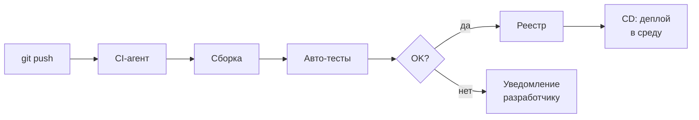

CI/CD реализует первый и второй пути: автоматизированный поток и быстрая обратная связь.

<!--
Непрерывная интеграция и непрерывная доставка — это техническая реализация первых двух путей DevOps. После каждого коммита автоматически запускаются сборка и тесты. Если что-то сломалось, разработчик получает уведомление через минуты, пока контекст ещё свеж. Если всё прошло — артефакт автоматически продвигается в следующую среду. CI/CD превращает ручной поток поставки в наблюдаемый, измеримый и воспроизводимый процесс. В этом контексте мы рассматриваем каждый инструмент курса.
-->

---

# Аналитическая рамка курса

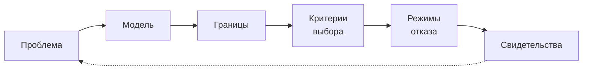

Каждая лекция курса следует этой рамке. Сегодня мы её ввели и прошли по ней полностью.

<!--
Подведём итог структурно. Аналитическая рамка курса — шесть шагов. Проблема: какую боль мы решаем. Модель: как устроена система. Границы: что внутри, что снаружи. Критерии выбора: по каким признакам мы выбираем решение. Режимы отказа: что может пойти не так. Свидетельства: как проверить руками, что система работает так, как мы думаем. Эта рамка — наш основной инструмент. Применяйте её каждый раз, когда встречаете новый инфраструктурный инструмент.
-->

---

# Режимы отказа: типовые ловушки

<strong>Инфраструктура-«снежинка»</strong> 
Ручная настройка сервера, которую никто не может воспроизвести. Один человек знает, как всё работает.

<strong>Монолитный деплой</strong> 
Один огромный релиз раз в квартал с накопившимися изменениями — риск максимален.

<strong>Отсутствие метрик</strong> 
Команда узнаёт о проблеме от пользователей, а не от мониторинга. Реакция запаздывает.

<strong>Разрыв Dev/Ops</strong> 
Разработчик не знает, как его код ведёт себя в продакшене. Ops не понимает, что изменилось.

<!--
Назовём четыре типичных режима отказа на уровне всей системы поставки. Первый — инфраструктура-«снежинка»: сервер, настроенный вручную, который невозможно воспроизвести. Второй — монолитный деплой с большим накоплением изменений и высоким риском. Третий — отсутствие метрик: команда реагирует, когда пользователи уже недовольны. Четвёртый — разрыв между разработкой и эксплуатацией. Каждый из этих режимов — нарушение одного из принципов, которые мы изучили сегодня.
-->

---

# Свидетельства: как проверить руками

<strong>Воспроизводимость</strong> 
Пересобери сервис с нуля на чистой машине. Работает? Занимает столько же времени?

<strong>Видимость узкого места</strong> 
Посмотри на граф CI/CD. Где дольше всего? Вот оно — ограничение потока.

<strong>Скорость обратной связи</strong> 
Сделай намеренную ошибку в тесте. Через сколько минут ты узнаешь о ней?

<strong>Метрики DORA</strong> 
Измерь lead time последних 10 изменений. Если данных нет — это уже сигнал.

<!--
Свидетельства — способы убедиться руками, что система работает так, как мы думаем. Попробуйте воспроизвести сборку с нуля — это покажет, насколько она детерминирована. Посмотрите на граф CI/CD и найдите самый долгий шаг — это ограничение. Намеренно сломайте тест и засеките время до уведомления — это скорость обратной связи. Посчитайте lead time последних изменений — если нет данных для расчёта, это само по себе говорит о проблеме с наблюдаемостью потока.
-->

---
layout: center
---

# Итоги

- Программная инфраструктура — проектируемая **система** с границами, компонентами и потоками.
- Поток создания ценности включает **три пути**: поток, обратная связь, культура эксперимента.
- Модель **CALMS** и теория ограничений задают способ анализа и поиска узких мест.
- Инфраструктурные решения определяются прежде всего **нефункциональными требованиями**.
- Четыре метрики **DORA** измеряют весь поток, а не отдельный инструмент.

**Дальше:** Лекция 2 — модели поставки и уровни абстракции: от физического сервера до serverless.

Опорная литература: Дж. Ким и соавт. «Руководство по DevOps» (МИФ, 2018), П. Коннинг «Инструментарий agile-лидера» (БХВ Петербург, 2021).

<!--
Сегодня мы заложили фундамент всего курса. Первое: инфраструктура — это не набор инструментов, а проектируемая система. Второе: DevOps — это три пути, и у каждого есть технические практики. Третье: узкое место всегда есть, и ускорять нужно именно его, а не всё подряд. Четвёртое: большинство инфраструктурных решений определяются нефункциональными требованиями. Пятое: четыре метрики DORA — наш язык разговора о скорости и стабильности. На следующей лекции мы поднимемся на уровень выше и посмотрим, как устроены модели поставки: от физического железа до serverless.
-->
