
Лекция 1

# Системный анализ программной инфраструктуры

Проектируемая система: границы, компоненты, интерфейсы, потоки

<!--
Между строкой кода и ответом пользователю — десятки шагов. Сборка, тестирование, упаковка, реестр, деплой, конфигурация, сеть, хранилище, мониторинг. Каждый шаг — потенциальный режим отказа. Курс разбирает этот путь системно: проблема, модель, границы, критерии, режимы отказа, свидетельства.
-->

---

# Маршрут лекции

- **01.** Путь артефакта — от кода до работающего сервиса
- **02.** Поток создания ценности и три пути DevOps
- **03.** Модель CALMS и теория ограничений
- **04.** Инфраструктура как система
- **05.** Требования к инфраструктуре и критерии выбора
- **06.** Команды, роли и метрики потока

<!--
Шесть блоков выстроены по нарастающей. Сначала пройдём путь одного артефакта от кода до сервиса. Затем поднимемся до всего потока поставки и трёх путей DevOps. Разберём две модели — CALMS и теорию ограничений. Научимся описывать инфраструктуру как систему с границами и потоками. Сформулируем требования к ней и критерии выбора инструментов. И закончим людьми: командами, ролями и метриками потока. Эта же последовательность дальше работает как чек-лист для разбора любого инфраструктурного решения.
-->

---

# Проблема: воспроизводимость поставки

<strong>Типичные симптомы</strong> 
«Работает у меня» — у пользователя нет. 
Релиз раз в квартал с накопившимися изменениями. 
Ручные шаги в инструкции развёртывания. 
Команда не знает, что задеплоено в продакшене.

<strong>Вопрос курса</strong> 
Как сделать путь от кода до сервиса повторяемым, быстрым и наблюдаемым — независимо от разработчика и среды?

<!--
Прежде чем брать инструменты, назовём боль, которую они лечат. «Работает у меня, но не в проде» — симптом отсутствия воспроизводимой цепочки поставки. Артефакт меняет форму на каждом переходе, и на каждом переходе среды могут разойтись: другая версия библиотеки, другой конфиг, другой порядок запуска. Задача инфраструктуры — сделать цепочку детерминированной: один и тот же код всегда даёт один и тот же результат, кто бы и когда его ни запускал. Правая карточка формулирует это как сквозной вопрос курса — к нему мы возвращаемся в каждой теме.
-->

---
layout: section
---

01

# Путь артефакта

От исходного кода до работающего сервиса

<!--
Начнём с первого блока. Прежде чем рассуждать о системах и потоках, посмотрим на судьбу одного артефакта. Что происходит с кодом от момента, когда разработчик сделал push, до момента, когда запрос пользователя обработан? Каждый переход на этом пути — граница, где может потеряться воспроизводимость. Инфраструктура существует ради того, чтобы удержать эти границы под контролем.
-->

---

# Трансформации артефакта

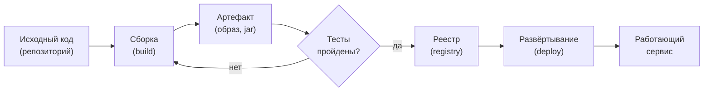

На каждом переходе артефакт меняет форму. На каждом переходе возможна потеря воспроизводимости.

<!--
Разберём типичную цепочку по стрелкам. Исходный код собирается или упаковывается в артефакт — Docker-образ, jar, Python-пакет. Артефакт проходит тесты; если они красные, возвращаемся к сборке. Зелёный артефакт публикуется в реестр и разворачивается в среду. Каждая стрелка — переход между средами, где окружение может отличаться от предыдущего. Отсюда прямое следствие: чем больше таких переходов делается вручную, тем выше шанс, что протестированное и развёрнутое разойдутся. Инфраструктура убирает ручные переходы и делает каждый воспроизводимым.
-->

---

# Формы артефакта на каждом шаге

| Этап | Форма артефакта | Что теряется без контроля |
|---|---|---|
| Исходники | Файлы в репозитории | История изменений |
| После сборки | Скомпилированный пакет | Зависимость от окружения |
| После упаковки | Образ контейнера | Воспроизводимость среды |
| В реестре | Образ с digest (sha256) | Привязка к версии |
| В эксплуатации | Работающий процесс | Конфигурация и состояние |

Принцип: один артефакт проходит все среды. Среды различаются конфигурацией, не кодом.

<!--
У таблицы одна мысль: форма артефакта меняется на каждом шаге, и на каждом шаге теряется что-то, если процесс не под контролем. Принцип, который снимает большинство проблем, — неизменяемость артефакта после упаковки. Один и тот же образ контейнера проходит dev, stage и prod; между средами меняется только конфигурация, не код. Стоит нам пересобрать артефакт отдельно для каждой среды — и гарантия «протестировано равно развёрнуто» исчезает: в прод уезжает то, что никто в таком виде не проверял.
-->

---
layout: section
---

02

# Поток создания ценности и три пути DevOps

От идеи до работающей функции у пользователя

<!--
«Руководство по DevOps» (Kim, Humble, Willis, Debois) описывает три пути: поток (код → пользователь), обратная связь (продакшен → разработка), непрерывное улучшение. Value stream map: визуализация шагов и времени ожидания между ними. Узкое место по теории ограничений Голдратта — именно там надо оптимизировать.
-->

---

# Поток создания ценности

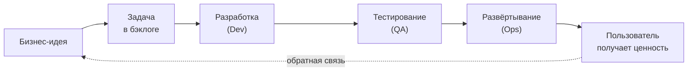

**Время поставки** — от идеи до пользователя. Инфраструктура ускоряет каждый переход в этой цепочке.

<!--
Поток создания ценности — полная цепочка от бизнес-идеи до работающей функции у пользователя; в «Руководстве по DevOps» её называют технологическим потоком поставки. Мерой служит время поставки: сколько проходит от «записали задачу» до «пользователь ею пользуется». Сокращение этого времени — главная цель и DevOps, и всей инфраструктуры. Стрелку обратной связи мы рисуем пунктиром намеренно: сама собой она не возникает, её выстраивают специально — метриками, логами, разбором инцидентов. Об этом второй путь.
-->

---

# Три пути DevOps

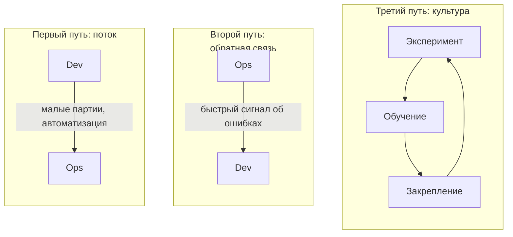

<!--
«Руководство по DevOps» формулирует три пути, и вся схема держится на них. Первый — поток слева направо: работа движется от разработки к эксплуатации малыми партиями и как можно быстрее. Второй — обратная связь справа налево: дефект обнаруживается там, где возник, а не у пользователя. Третий — культура постоянного эксперимента и обучения на ошибках, замкнутая в цикл. Три пути задают архитектуру DevOps-практик: CI/CD реализует первый, мониторинг и алертинг — второй, разбор инцидентов без поиска виноватых — третий.
-->

---

# Первый путь: ускорение потока

<strong>Малые партии изменений</strong> 
Меньше изменений за раз — меньше риск, быстрее откат, проще анализ при сбое.

<strong>Автоматизация шагов</strong> 
Ручная операция — источник ошибок и задержек. Сборка, тесты, деплой — автоматически.

<strong>Видимость потока</strong> 
Нужно видеть, где накапливается очередь и где работа застряла прямо сейчас.

<strong>Результат</strong> 
Частые, небольшие, безопасные релизы вместо редких и рискованных.

<!--
Первый путь ускоряет движение работы слева направо, и главный рычаг здесь — размер партии. Чем меньше изменение, тем проще его протестировать, откатить и довести до пользователя; крупный редкий релиз, наоборот, копит риск. Автоматизация рутинных шагов убирает ошибки, которые человек неизбежно вносит руками, и снимает задержки на ожидание. Видимость потока показывает, где скопилась очередь, — затор виден до того, как он превратился в инцидент. Складываясь, эти три вещи дают частые, небольшие и предсказуемые релизы.
-->

---

# Второй путь: обратная связь

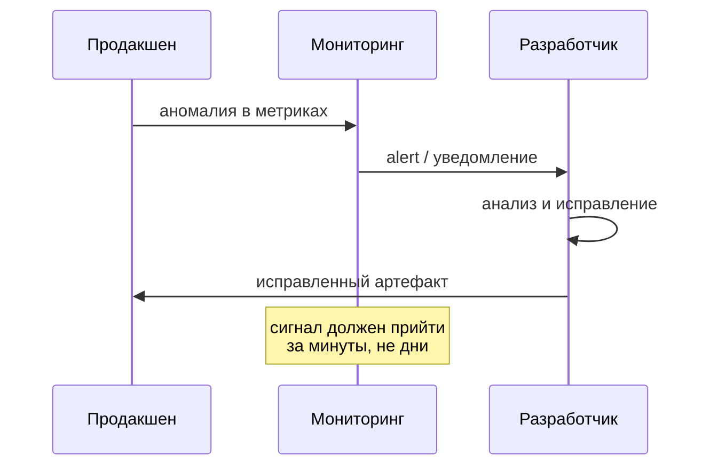

<!--
Второй путь измеряется одним вопросом: насколько быстро мы узнаём о проблеме. Дефект, найденный у пользователя через неделю после коммита, дорог — контекст утерян, причину искать долго. Аномалия, о которой продакшен сигналит через минуты после деплоя, ловится, пока разработчик ещё помнит, что менял. На диаграмме продакшен отдаёт аномалию мониторингу, тот шлёт алерт разработчику, разработчик правит и выкатывает исправление. Быстрая петля работает как инструмент качества, и ради неё в курсе столько внимания к мониторингу, алертингу и наблюдаемости.
-->

---
layout: section
---

03

# Модель CALMS и теория ограничений

Пять опор DevOps и поиск узкого места

<!--
CALMS (Culture, Automation, Lean, Measurement, Sharing) — пять опор DevOps-организации. Теория ограничений Голдратта: пропускная способность системы определяется узким местом. Оптимизировать не-узкое место не даёт результата. Найди бутылочное горлышко — ручное тестирование, ревью, деплой — и устрани его.
-->

---

# Модель CALMS

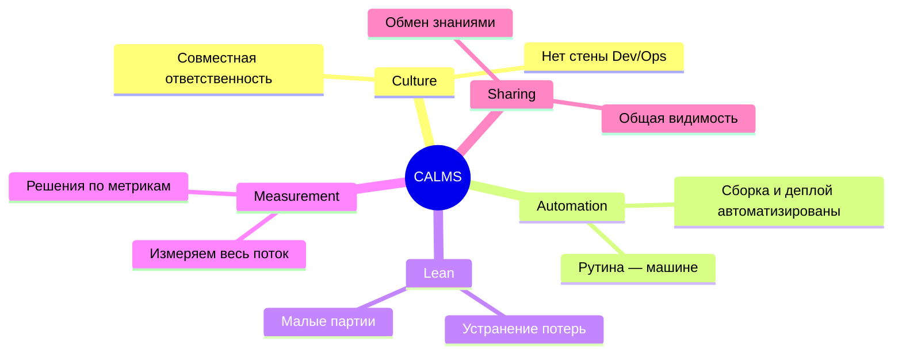

<!--
CALMS собирает DevOps в пять опор. Culture: разработка и эксплуатация несут общую ответственность за сервис. Automation: рутинные шаги поставки автоматизированы, человеку остаётся то, что требует суждения. Lean: работаем малыми партиями и вычищаем потери в потоке. Measurement: решения опираются на метрики всего потока, а не на интуицию. Sharing: состояние системы открыто всей команде. Порядок букв не декоративный — Culture стоит первой, потому что без общей ответственности остальные четыре опоры превращаются в инструменты, которыми никто толком не пользуется.
-->

---

# Теория ограничений в потоке поставки

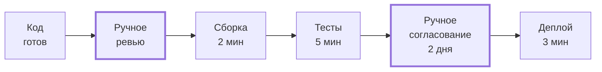

Ускорение любого участка, кроме узкого места, **не ускоряет систему** в целом.

<!--
Теория ограничений Элияху Голдратта применима к любому потоку, поставка ПО не исключение. Пропускную способность всей цепочки задаёт самый медленный участок. На диаграмме сборка и тесты вместе занимают семь минут, а ручное согласование — два дня; ускорив сборку вдвое, мы срежем минуты на фоне двухдневного ожидания и общего времени почти не изменим. Поэтому порядок работы аналитика жёсткий: сперва найти ограничение и только потом вкладываться в его расшивку — оптимизация всего остального лишь копит запасы перед узким местом.
-->

---

# Работа с ограничением: пять шагов

<strong>Типичные ограничения</strong> 
Медленная сборка (более 20 минут). 
Ручное согласование и подпись. 
Один общий стенд для всех разработчиков. 
Нет доступа к логам продакшена.

<strong>Алгоритм Голдратта</strong> 
1. Найти узкое место. 
2. Эксплуатировать его максимально. 
3. Подчинить всё остальное узкому месту. 
4. Расширить ограничение. 
5. Вернуться к шагу 1.

<!--
Пять шагов Голдратта ложатся на DevOps почти дословно. Первый — найти узкое место; без метрик и наблюдаемости мы будем оптимизировать наугад. Второй — выжать из ограничения максимум на текущих ресурсах: если тормозит ревью, автоматизируем всё, что можно, прежде чем звать людей. Третий — подчинить остальной поток ритму узкого места, чтобы перед ним не копилась очередь. Четвёртый — расширить ограничение: люди, мощности, инструменты. Пятый и главный — вернуться к первому шагу, потому что после расширения узкое место переезжает в другую часть потока.
-->

---
layout: section
---

04

# Инфраструктура как система

Границы, компоненты, интерфейсы и потоки

<!--
Систему описывают четыре вещи: границы (что внутри, что снаружи), компоненты (что делает каждый), интерфейсы (как общаются), потоки (данные и управление). На этом языке: «Kubernetes управляет Pod» — компонент и интерфейс. «Pod умирает — данные теряются» — граница и поток. Без рамки сравнение альтернатив — это мнения, не аргументы.
-->

---

# Системное описание инфраструктуры

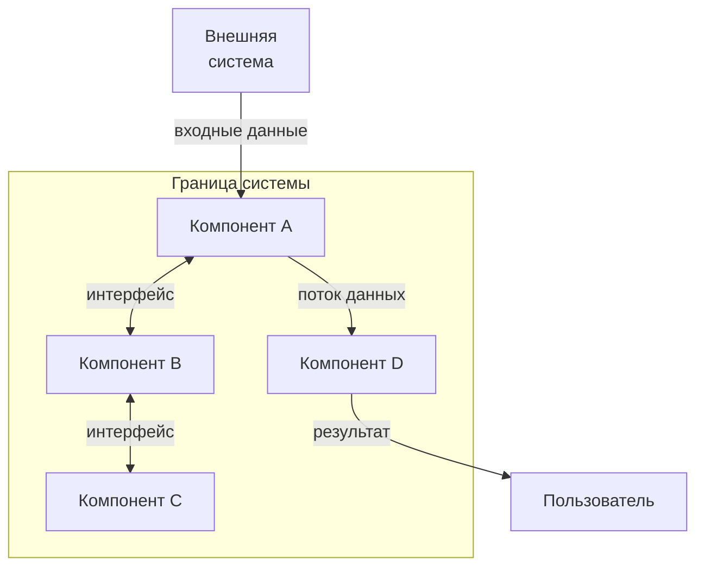

Система = **границы** + **компоненты** + **интерфейсы** + **потоки данных и управления**.

<!--
Системный взгляд — это способ мышления, переносимый с одного инструмента на другой. Чтобы описать инфраструктурную систему, отвечаем на четыре вопроса. Где проходят границы — что внутри системы, а что во внешнем мире? Из каких компонентов она собрана? Через какие интерфейсы компоненты общаются? Какие данные и команды текут между ними? Ответы дают модель, по которой можно прогнозировать отказы и принимать решения ещё до того, как что-то развёрнуто. Дальше приложим эти четыре вопроса к нашему сквозному примеру.
-->

---

# voting-app: система для анализа

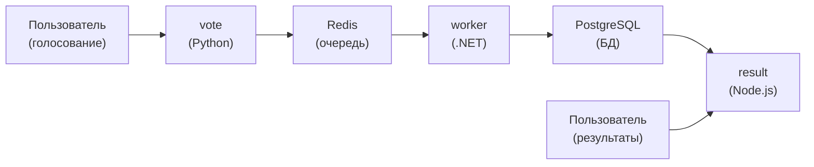

**voting-app** — многосервисное приложение, которое мы используем в каждой лекции и лабораторной.

<!--
Через весь курс проходит один сквозной пример — voting-app, открытое учебное приложение от Docker. В нём пять компонентов: сервис голосования на Python, Redis в роли очереди, worker на .NET, PostgreSQL как база и сервис результатов на Node.js. У каждого своя ответственность и свой интерфейс. Пять разных языков и хранилищ выбраны неслучайно — на такой разнородной системе видно все проблемы, ради которых и существует инфраструктура. Сети, контейнеры, оркестрацию и мониторинг мы будем разбирать на этих же пяти сервисах.
-->

---

# Потоки данных в voting-app

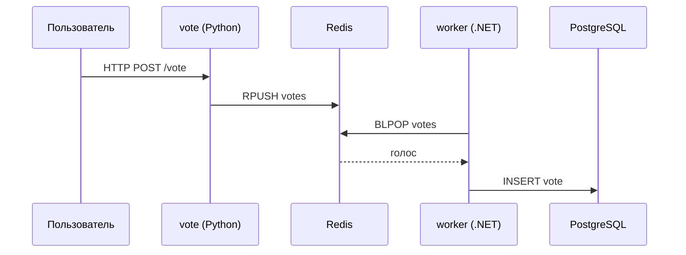

<!--
Проследим голос по стрелкам. Пользователь шлёт HTTP POST на сервис vote. Vote кладёт голос в очередь Redis командой RPUSH. Worker забирает его через BLPOP и пишет в PostgreSQL. Vote и worker не вызывают друг друга напрямую — они общаются через очередь, и это асинхронная архитектура. Плата за неё — лишняя подвижная часть, зато выигрыш в устойчивости: если worker временно лёг, голоса копятся в Redis и обрабатываются, когда он вернётся. Читая такой поток, мы сразу видим, где появится задержка и что случится при отказе каждого звена.
-->

---
layout: section
---

05

# Требования к инфраструктуре

Функциональные и нефункциональные

<!--
Нефункциональные требования диктуют архитектуру чаще, чем функциональные. Docker Compose достаточен при одном хосте. Kubernetes нужен при требованиях к автоматическому self-healing, rolling update, горизонтальному масштабированию. SLA 99,9% при одном хосте невозможен. Это нефункциональное требование, а не технический выбор.
-->

---

# Функциональные требования

Функциональные требования описывают **что** инфраструктура должна уметь делать.

<!--
Функциональные требования отвечают на вопрос «что система должна уметь». Для инфраструктуры это цепочка на слайде: собрать код в артефакт, запустить контейнер, развернуть в среду, отмасштабировать компонент под нагрузкой, обновить сервис без простоя. Список важный, но спор он вызывает редко — с этим справляется практически любой современный инструмент. Настоящие развилки начинаются на следующем слайде, с нефункциональных требований, — там и определяется архитектура.
-->

---

# Нефункциональные требования

<strong>Надёжность</strong> 
Сервис работает даже при отказах компонентов. Упал контейнер — поднялся автоматически.

<strong>Масштабируемость</strong> 
Система выдерживает рост нагрузки без переработки архитектуры.

<strong>Безопасность</strong> 
Секреты не в коде. Минимальные привилегии. Аудит доступа.

<strong>Стоимость</strong> 
Ресурсы используются эффективно. Стоимость измерима и предсказуема.

<strong>Эксплуатируемость</strong> 
Команда понимает, что происходит. Есть логи, метрики, playbooks.

<strong>Вывод</strong> 
NFR определяют выбор инструментов и архитектуру системы.

<!--
Нефункциональные требования задают качество работы системы. Надёжность — как система держится при частичном отказе. Масштабируемость — как отвечает на рост нагрузки без переписывания. Безопасность — насколько ограничен и прослеживаем доступ, где лежат секреты. Стоимость — эффективно ли расходуются ресурсы и предсказуема ли цена. Эксплуатируемость — способна ли команда понять, что происходит внутри. Из ответов на эти пять вопросов и вырастает выбор: хватит ли docker compose или нужен Kubernetes с автоперезапуском и репликами.
-->

---

# Критерии выбора инструментов инфраструктуры

| NFR | Малый проект | Средний проект | Крупный сервис |
|---|---|---|---|
| Надёжность | compose restart | Swarm / k8s basic | k8s + HA + PDB |
| Масштаб | 1 нода | 3–5 нод | &gt;10 нод, HPA |
| Стоимость | VPS, самообслуживание | PaaS, managed DB | FinOps, right-sizing |
| Безопасность | .env файлы | Vault / Secrets | Policy as code |
| Эксплуатируемость | docker logs | Centralised logs | Observability stack |

<!--
Одну и ту же функцию можно закрыть очень по-разному — таблица читается по строкам. Надёжность на малом проекте — это restart-политика в compose; на крупном — Kubernetes с HA и PodDisruptionBudget. Стоимость — от VPS на самообслуживании до FinOps и right-sizing. Секреты — от .env-файла до policy as code. Универсально правильного столбца тут нет: масштаб проекта двигает нас вправо, и переусложнение на маленьком проекте так же вредно, как недооснащённость на большом. Выбор обосновывается требованиями, а не модой на инструмент.
-->

---
layout: section
---

06

# Команды, роли и метрики потока

Кто отвечает и как измерить результат

<!--
Conway's Law: архитектура системы отражает структуру команд. Monolith у команды без чёткого разделения, микросервисы у команды с размытыми границами — источник конфликтов. Обратный закон Конвея: сначала проектируй желаемую архитектуру, потом — структуру команд. DORA измеряет результат: Deployment Frequency, Lead Time, MTTR, Change Failure Rate.
-->

---

# Стена между Dev и Ops

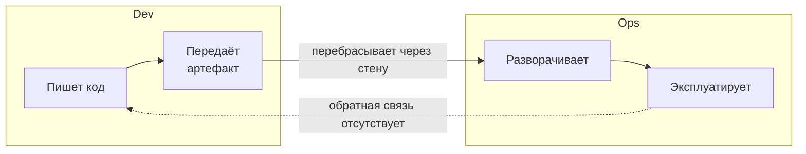

**Проблема:** Dev не знает, как код работает в продакшене. Ops не понимает, что именно изменилось.

<!--
Традиционная модель разделения разработки и эксплуатации создаёт хорошо известную проблему — «стену». Разработчик пишет код и передаёт его операционной команде. Операционная команда разворачивает и эксплуатирует, но не понимает деталей реализации. При инциденте разработчик не имеет доступа к продакшену, а операционный инженер не может исправить код. Обратная связь медленная, взаимные обвинения неизбежны. DevOps убирает эту стену через совместную ответственность.
-->

---

# Кросс-функциональная команда

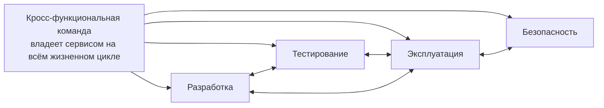

<!--
Кросс-функциональная команда объединяет разработку, тестирование, эксплуатацию и безопасность. Она отвечает за сервис полностью: от написания кода до мониторинга в продакшене. «Инструментарий agile-лидера» Пола Коннинга описывает три условия самоуправляемой команды: автономия — команда сама принимает решения об архитектуре и инструментах; ясная цель — команда понимает, какую ценность она создаёт; рост мастерства — команда постоянно улучшает свои компетенции.
-->

---

# Метрики DORA: четыре показателя потока

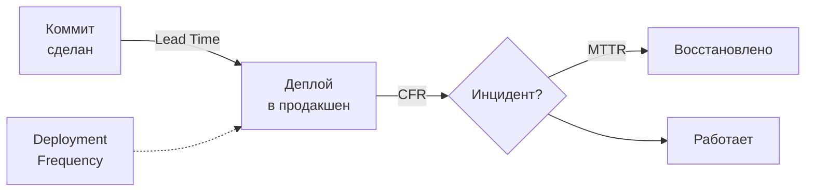

<!--
Исследование DORA (DevOps Research and Assessment) выявило четыре метрики, отличающие высокоэффективные команды. Первая: время поставки изменения — от коммита до продакшена. Вторая: частота деплоев — как часто команда выкатывает изменения. Третья: среднее время восстановления после инцидента. Четвёртая: доля изменений, приводящих к сбою. Эти метрики измеряют весь поток, а не отдельный инструмент. По ним мы будем оценивать архитектурные решения на протяжении всего курса.
-->

---

# Значения метрик DORA

| Метрика | Что измеряет | Elite performers |
|---|---|---|
| Lead Time | Скорость потока | Менее 1 часа |
| Deploy Frequency | Частота поставки | По запросу |
| MTTR | Стойкость к сбоям | Менее 1 часа |
| Change Failure Rate | Качество изменений | 0–15% |

Метрики DORA — диагностика состояния потока поставки, а не норматив для всех команд.

<!--
Конкретные значения метрик DORA по классификации elite performers: время поставки менее часа, деплой по запросу — то есть несколько раз в день или даже чаще, восстановление после инцидента менее чем за час, и не более 15% изменений приводят к проблемам. Это диагностика, а не норматив. Разные продукты имеют разные требования. Но если lead time измеряется неделями, а change failure rate превышает 30% — это сигнал о серьёзных проблемах в потоке поставки.
-->

---

# CI/CD: механизм сокращения петли обратной связи

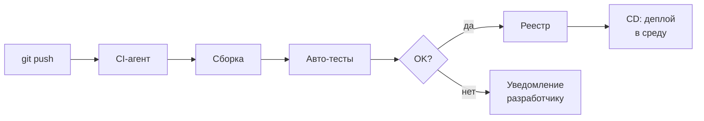

CI/CD реализует первый и второй пути: автоматизированный поток и быстрая обратная связь.

<!--
Непрерывная интеграция и непрерывная доставка — это техническая реализация первых двух путей DevOps. После каждого коммита автоматически запускаются сборка и тесты. Если что-то сломалось, разработчик получает уведомление через минуты, пока контекст ещё свеж. Если всё прошло — артефакт автоматически продвигается в следующую среду. CI/CD превращает ручной поток поставки в наблюдаемый, измеримый и воспроизводимый процесс. В этом контексте мы рассматриваем каждый инструмент курса.
-->

---

# Аналитическая рамка курса

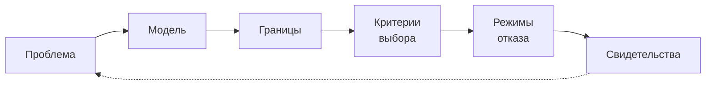

Каждая лекция курса следует этой рамке. Сегодня мы её ввели и прошли по ней полностью.

<!--
Подведём итог структурно. Аналитическая рамка курса — шесть шагов. Проблема: какую боль мы решаем. Модель: как устроена система. Границы: что внутри, что снаружи. Критерии выбора: по каким признакам мы выбираем решение. Режимы отказа: что может пойти не так. Свидетельства: как проверить руками, что система работает так, как мы думаем. Эта рамка — наш основной инструмент. Применяйте её каждый раз, когда встречаете новый инфраструктурный инструмент.
-->

---

# Режимы отказа: типовые ловушки

<strong>Инфраструктура-«снежинка»</strong> 
Ручная настройка сервера, которую никто не может воспроизвести. Один человек знает, как всё работает.

<strong>Монолитный деплой</strong> 
Один огромный релиз раз в квартал с накопившимися изменениями — риск максимален.

<strong>Отсутствие метрик</strong> 
Команда узнаёт о проблеме от пользователей, а не от мониторинга. Реакция запаздывает.

<strong>Разрыв Dev/Ops</strong> 
Разработчик не знает, как его код ведёт себя в продакшене. Ops не понимает, что изменилось.

<!--
Назовём четыре типичных режима отказа на уровне всей системы поставки. Первый — инфраструктура-«снежинка»: сервер, настроенный вручную, который невозможно воспроизвести. Второй — монолитный деплой с большим накоплением изменений и высоким риском. Третий — отсутствие метрик: команда реагирует, когда пользователи уже недовольны. Четвёртый — разрыв между разработкой и эксплуатацией. Каждый из этих режимов — нарушение одного из принципов, которые мы изучили сегодня.
-->

---

# Свидетельства: как проверить руками

<strong>Воспроизводимость</strong> 
Пересобери сервис с нуля на чистой машине. Работает? Занимает столько же времени?

<strong>Видимость узкого места</strong> 
Посмотри на граф CI/CD. Где дольше всего? Вот оно — ограничение потока.

<strong>Скорость обратной связи</strong> 
Сделай намеренную ошибку в тесте. Через сколько минут ты узнаешь о ней?

<strong>Метрики DORA</strong> 
Измерь lead time последних 10 изменений. Если данных нет — это уже сигнал.

<!--
Свидетельства — способы убедиться руками, что система работает так, как мы думаем. Попробуйте воспроизвести сборку с нуля — это покажет, насколько она детерминирована. Посмотрите на граф CI/CD и найдите самый долгий шаг — это ограничение. Намеренно сломайте тест и засеките время до уведомления — это скорость обратной связи. Посчитайте lead time последних изменений — если нет данных для расчёта, это само по себе говорит о проблеме с наблюдаемостью потока.
-->

---
layout: center
---

# Итоги

- Программная инфраструктура — проектируемая **система** с границами, компонентами и потоками.
- Поток создания ценности включает **три пути**: поток, обратная связь, культура эксперимента.
- Модель **CALMS** и теория ограничений задают способ анализа и поиска узких мест.
- Инфраструктурные решения определяются прежде всего **нефункциональными требованиями**.
- Четыре метрики **DORA** измеряют весь поток, а не отдельный инструмент.

**Дальше:** Лекция 2 — модели поставки и уровни абстракции: от физического сервера до serverless.

Опорная литература: Дж. Ким и соавт. «Руководство по DevOps» (МИФ, 2018), П. Коннинг «Инструментарий agile-лидера» (БХВ Петербург, 2021).

<!--
Сегодня мы заложили фундамент курса. Первое: инфраструктуру мы проектируем как систему — с границами, компонентами и потоками. Второе: DevOps держится на трёх путях, и у каждого есть свои технические практики. Третье: узкое место в потоке есть всегда, и расшивать надо именно его, а не всё подряд. Четвёртое: большинство инфраструктурных решений диктуют нефункциональные требования. Пятое: четыре метрики DORA дают общий язык для разговора о скорости и стабильности. На следующей лекции поднимемся на уровень выше — к моделям поставки от физического железа до serverless.
-->
