<div class="cover-kicker">Лекция 2</div>

# Модели поставки и уровни абстракции инфраструктуры

On-prem → IaaS → PaaS → контейнеры → serverless: где заканчивается ваша ответственность

<!--
Добро пожаловать на вторую лекцию курса. Сегодня мы разбираем фундаментальный вопрос: во что упаковывают приложение и на каком уровне абстракции его запускают. Это не академическая классификация — это карта компромиссов, которую системный аналитик использует каждый раз, когда нужно объяснить заказчику, почему одно решение предпочтительнее другого. Мы пройдём путь от физического сервера до serverless-функции и разберём, что именно каждый уровень даёт и чего лишает команду.
-->

---

# Маршрут лекции

- **01. Проблема** — почему «работает у меня» — это системный сбой
- **02. Лестница абстракций** — сервер, ВМ, контейнер, функция
- **03. Модели облачных услуг** — IaaS, PaaS, SaaS и разделение ответственности
- **04. Единицы поставки** — что именно передаётся на каждом уровне
- **05. Методология 12-factor** — контракт приложения с платформой
- **06. Serverless** — модель исполнения и её границы
- **07. Критерии выбора** — таблица решений
- **08. Режимы отказа** — протекающие абстракции
- **09. Итоги** — почему контейнер победил

<!--
Вот маршрут на сегодня. Мы движемся по аналитической рамке курса: сначала фиксируем проблему, затем строим модель, обозначаем её границы, формулируем критерии выбора, перечисляем режимы отказа и заканчиваем свидетельствами — тем, как проверить всё это руками. Каждый блок логически вытекает из предыдущего, так что потеряться будет сложно.
-->

---
layout: section
---

<div class="section-no">01</div>

# Проблема воспроизводимого запуска

Когда среда не зафиксирована, приложение зависит от везения

<!--
Начнём с проблемы. Без её понимания все дальнейшие абстракции выглядят академически. Я хочу, чтобы после этого блока стало очевидно: каждый уровень абстракции — это конкретный ответ на конкретную боль.
-->

---

# «Работает у меня»

Приложение зависит от четырёх категорий внешних условий:

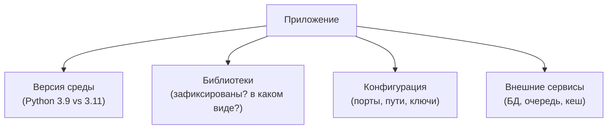

Если хотя бы одна из зависимостей не зафиксирована — воспроизводимость нарушена.

<!--
«Работает у меня» — это не жалоба разработчика, это симптом системной проблемы. Приложение всегда зависит от четырёх вещей: версии среды исполнения, набора библиотек, конфигурации и доступности внешних сервисов. Если хотя бы один из этих факторов не зафиксирован явно, среда становится неявным параметром системы. Именно это обнаруживают на ревью: тест прошёл локально, упал в CI, потому что в CI другая версия библиотеки. Каждый уровень абстракции по-своему фиксирует эти четыре зависимости — и это мы сейчас будем разбирать.
-->

---
layout: section
---

<div class="section-no">02</div>

# Лестница абстракций

Физический сервер → ВМ → контейнер → функция

<!--
Переходим к модели. Четыре уровня образуют лестницу: чем выше поднимаемся, тем больше деталей скрывает платформа и тем меньше забот у команды — но и тем меньше у неё контроля. Это фундаментальный компромисс.
-->

---

# Четыре уровня: что скрывает каждый

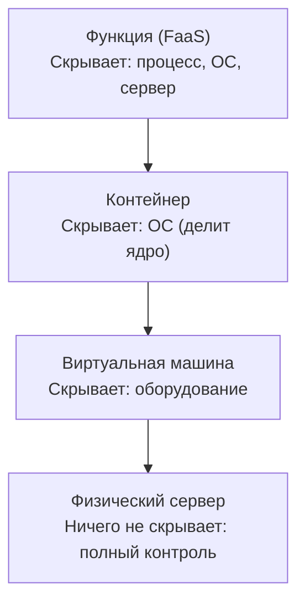

Снизу вверх: скорость и переносимость растут, контроль над нижними слоями падает.

<!--
Смотрим на лестницу снизу вверх. Физический сервер — полный контроль, но и полная ответственность: железо, ОС, патчи, сеть — всё ваше. Виртуальная машина скрывает физическое оборудование через гипервизор — вы получаете иллюзию выделенной машины, но по-прежнему управляете гостевой ОС. Контейнер идёт дальше: он виртуализирует уже ОС, разделяя ядро с хостом. Функция скрывает даже сам процесс — вы отдаёте только код обработчика, платформа решает всё остальное. Это не хорошо и не плохо само по себе: это выбор, который нужно делать осознанно.
-->

---
layout: two-cols
---

# Физический сервер и ВМ

Нижние два уровня лестницы:

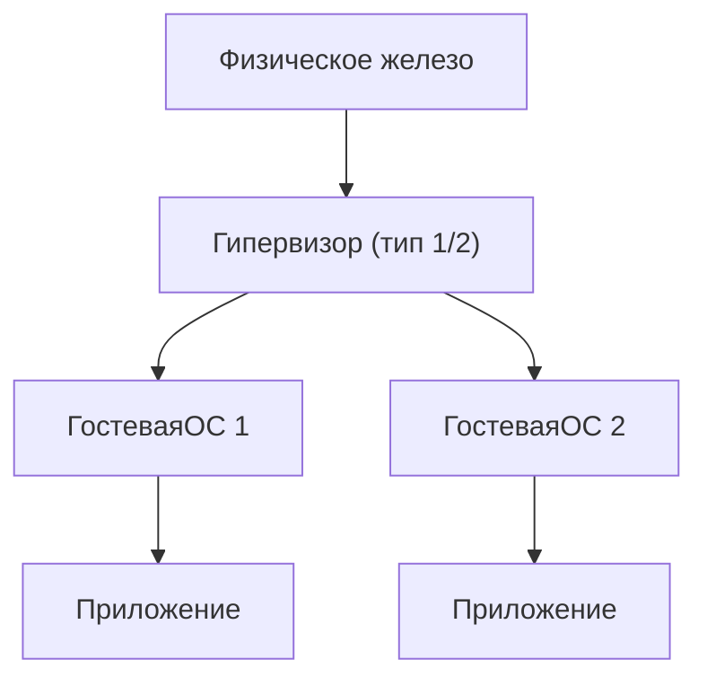

::right::

## Физический сервер

- Полный контроль над железом
- Предсказуемая производительность
- Долгий цикл поставки (дни/недели)
- Низкая плотность использования ресурсов

## Виртуальная машина

- Единица поставки: образ машины (AMI, VMDK)
- Изоляция через гипервизор — аппаратная граница
- Старт: минуты; размер образа: гигабайты
- Гостевая ОС — часть зоны ответственности команды

<!--
Физический сервер и виртуальная машина — это уровни, которые вы подробно изучали в курсе «Технологии виртуализации». Здесь мы берём их как данность и фиксируем главное для нашего курса: единица поставки на уровне ВМ — это образ машины. Он тяжёлый, запускается медленно, несёт в себе полную ОС. Изоляция надёжная — аппаратная граница гипервизора. Это важно запомнить для следующего сравнения: у контейнера изоляция принципиально иная.
-->

---
layout: two-cols
---

# Контейнер и функция

Верхние два уровня лестницы:

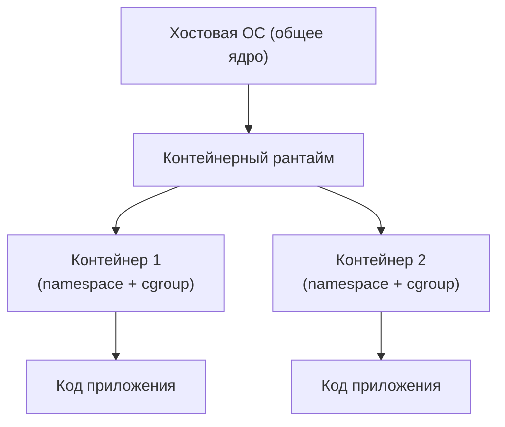

::right::

## Контейнер

- Виртуализирует ОС, не оборудование
- Делит ядро с хостом — изоляция через namespace/cgroup
- Старт: секунды; размер образа: мегабайты
- Единица поставки: контейнер-образ (OCI)

## Функция (FaaS)

- Платформа управляет процессом и ОС
- Триггер: событие (HTTP, очередь, таймер)
- Масштабируется до нуля автоматически
- Единица поставки: код + описание триггера

<!--
Контейнер — это не лёгкая виртуальная машина. Это принципиально другой механизм изоляции: namespace ограничивает видимость (процессы, сеть, файловую систему), cgroup ограничивает потребление ресурсов. Ядро — общее с хостом. Это даёт огромную плотность и скорость запуска, но меняет модель изоляции — к этому мы вернёмся в лекции 3. Функция идёт ещё дальше: от команды требуется только код обработчика, всё остальное — ответственность платформы. Граница поставки сжимается до минимума, но зависимость от платформы максимальная.
-->

---
layout: section
---

<div class="section-no">03</div>

# Модели облачных услуг

IaaS, PaaS, SaaS и разделение ответственности

<!--
Теперь отобразим лестницу абстракций на то, как устроен облачный рынок. Модели IaaS, PaaS и SaaS — это не просто маркетинговые термины. Это формализация того, кто отвечает за каждый слой стека.
-->

---

# Разделение ответственности (shared responsibility)

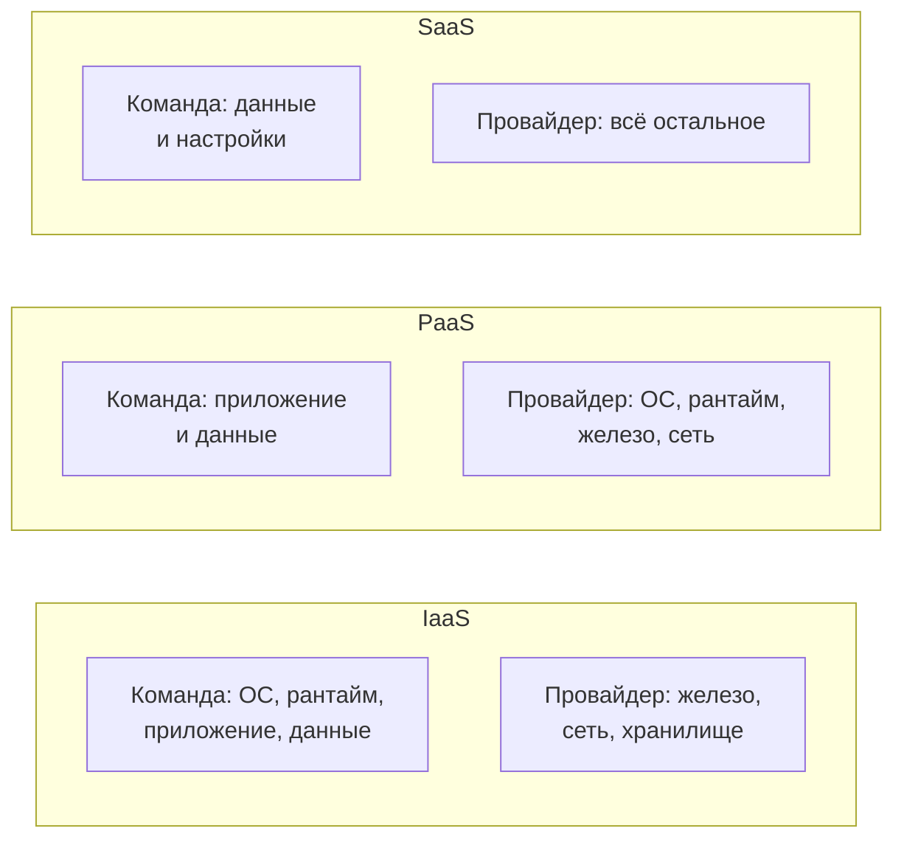

Чем выше уровень — тем больше берёт провайдер, тем меньше контроля у команды.

<!--
Shared responsibility model — это контракт. Он явно фиксирует, кто отвечает за каждый слой стека. В IaaS провайдер даёт вычисления, сеть и хранилище, а ОС, рантайм, патчи безопасности, приложение и данные — зона команды. В PaaS граница смещается: провайдер берёт на себя ОС и рантайм, команда отвечает только за приложение и данные. В SaaS от команды остаются только данные и конфигурация. Запомните: подняться по лестнице легко, спуститься — дорого. Поэтому выбор делается осознанно, с пониманием, что вы отдаёте.
-->

---

# Мост из виртуализации

<div class="grid grid-cols-2 gap-4">
<div class="itmo-card">

**Что уже пройдено в курсе «Технологии виртуализации»**

- Гипервизоры типов 1 и 2 (bare-metal vs hosted)
- Форматы виртуальных дисков (VMDK, qcow2, VHD)
- Live migration, снапшоты, шаблоны ВМ
- Паравиртуализация и аппаратная виртуализация (VT-x)

</div>
<div class="itmo-card-accent">

**Что берём как данность в этом курсе**

ВМ — это рабочий инструмент. Мы знаем, как она устроена. Теперь нас интересует, как поверх этого инструмента строится контейнерная модель и почему она победила в большинстве сценариев поставки приложений.

</div>
</div>

<!--
Это слайд-мост. Мы не будем пересказывать устройство гипервизоров — вы это знаете. Но важно зафиксировать отправную точку: виртуальная машина даёт нам изолированную вычислительную среду с аппаратной границей. Это надёжно и медленно. Дальше мы будем смотреть, что произошло, когда разработчики решили, что стартовать за минуты — слишком долго, а образы на гигабайты — слишком тяжело. Именно из этой неудовлетворённости вырос контейнер.
-->

---
layout: section
---

<div class="section-no">04</div>

# Единицы поставки

Что именно передаётся на каждом уровне абстракции

<!--
Абстракция без артефакта — это просто разговор. Давайте зафиксируем конкретные единицы поставки на каждом уровне. Это практически важно: когда аналитик описывает систему, он должен точно называть, что именно перемещается по конвейеру.
-->

---

# Артефакт на каждом уровне

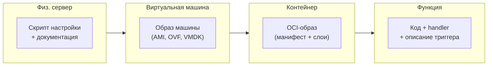

<div class="itmo-card-note mt-4">
Чем выше уровень — тем меньше единица поставки и тем строже её контракт с платформой.
</div>

<!--
Посмотрим на то, что реально передаётся между командой и платформой. На уровне физического сервера это, как правило, набор скриптов и документация — воспроизводимость минимальна. На уровне ВМ — образ машины: тяжёлый, но самодостаточный. На уровне контейнера — OCI-образ: манифест плюс слои файловой системы, десятки мегабайт. На уровне функции — только код обработчика и описание триггера. Каждый следующий уровень требует от платформы больше, а от команды — меньше, но при этом жёстче формализует контракт взаимодействия.
-->

---
layout: section
---

<div class="section-no">05</div>

# Методология 12-factor

Контракт приложения с платформой

<!--
Мы разобрали уровни абстракции. Теперь — что должно делать само приложение, чтобы работать на любом из этих уровней без переделки. В 2012 году Адам Виггинс сформулировал методологию 12-factor — набор правил, которые описывают «платформо-совместимое» приложение. Это стандарт де-факто для облачных и контейнерных приложений.
-->

---
layout: two-cols
---

# 12-factor: факторы I–VI

Основание: кодовая база, зависимости, конфигурация

| # | Фактор | Суть |
|---|--------|------|
| I | Кодовая база | Одна кодовая база — много развёртываний |
| II | Зависимости | Явное объявление и изоляция |
| III | Конфигурация | Хранится в окружении, не в коде |
| IV | Сторонние сервисы | Подключаемые ресурсы через URL |
| V | Сборка/Релиз/Выполнение | Строгое разделение стадий |
| VI | Процессы | Приложение = один или несколько процессов без состояния |

::right::

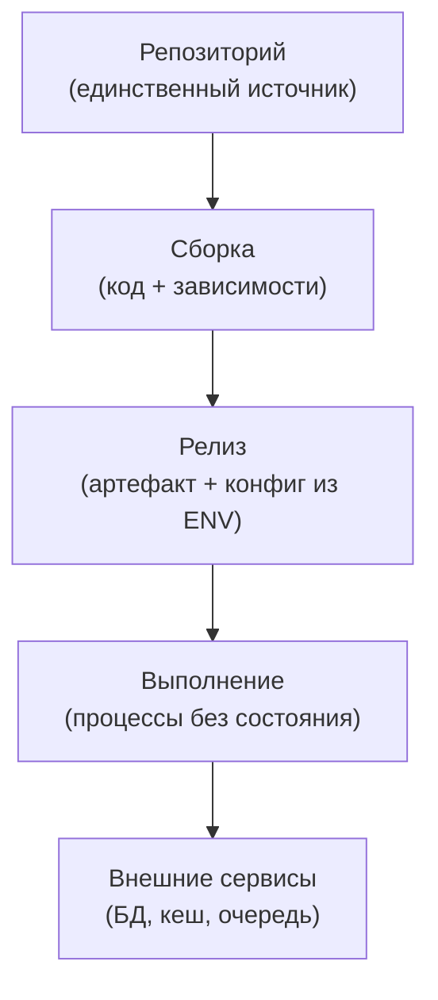

<!--
Первые шесть факторов закладывают фундамент. Фактор I: одна кодовая база в системе контроля версий, из которой делается много развёртываний в разные среды. Фактор II: зависимости явно объявлены — нет тайной опоры на системные библиотеки. Фактор III: конфигурация в переменных окружения, не захардкожена в коде. Фактор IV: внешние сервисы — это ресурсы, подключаемые через URL; их можно поменять, не меняя код. Фактор V: стадии сборки, релиза и выполнения строго разделены — релиз нельзя изменить в рантайме. Фактор VI: приложение — это процессы без разделяемого состояния, что делает его горизонтально масштабируемым.
-->

---
layout: two-cols
---

# 12-factor: факторы VII–XII

Масштабирование, эксплуатация и логи

| # | Фактор | Суть |
|---|--------|------|
| VII | Привязка портов | Сервис экспортирует себя через порт |
| VIII | Параллелизм | Масштабирование через добавление процессов |
| IX | Одноразовость | Быстрый старт и корректное завершение |
| X | Паритет сред | Dev и prod максимально похожи |
| XI | Логи | Поток событий в stdout, не в файл |
| XII | Admin-процессы | Разовые задачи как отдельные процессы |

::right::

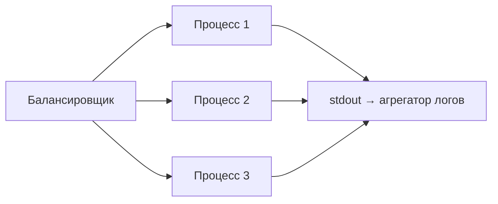

<!--
Вторая половина факторов описывает поведение приложения в продакшене. Фактор VII: приложение само объявляет, на каком порту оно слушает — это делает его самодостаточным сервисом. Фактор VIII: масштабируемость достигается добавлением процессов, а не увеличением одного процесса. Фактор IX: процессы должны запускаться быстро и корректно завершаться по SIGTERM — это критично для оркестраторов. Фактор X: разрыв между dev и prod — источник большинства «работает у меня». Фактор XI: логи в stdout, не в файл — агрегатор решает, что с ними делать. Фактор XII: административные задачи (миграции БД) — отдельные процессы, не часть основного приложения.
-->

---

# Конфигурация в окружении: зачем и как

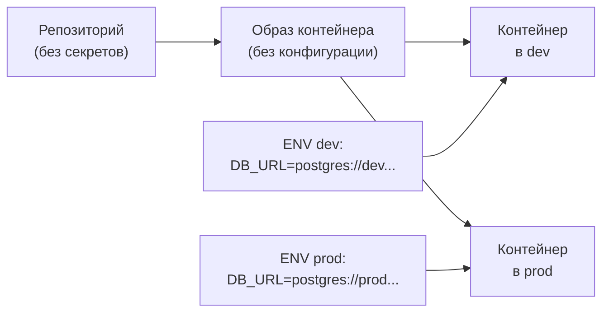

Один образ — много сред. Конфигурация не попадает в образ и не в репозиторий.

<!--
Разберём фактор III подробнее — он чаще всего нарушается на практике. Идея: один и тот же образ контейнера разворачивается в dev, staging и prod, а разница между средами задаётся только переменными окружения. Это означает, что в образе нет строк подключения к базе данных, нет API-ключей, нет адресов сервисов. Всё это приходит извне в момент запуска. Следствие: образ можно тестировать как артефакт, не перебирать его. В Kubernetes эту роль берут ConfigMap и Secret. Это прямой мост к теме управления конфигурацией, которую мы разберём в лекции 12.
-->

---

# Где живёт состояние

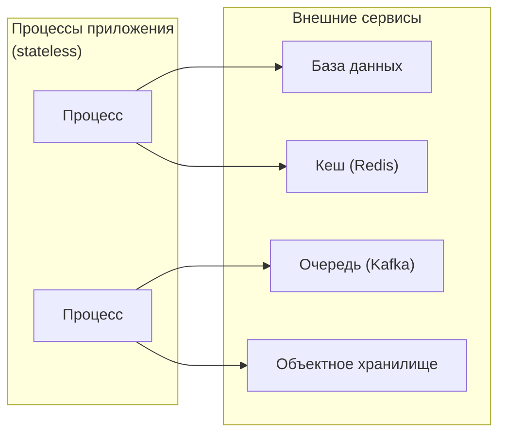

Приложение без состояния можно перезапустить на любом узле без потери данных.

<!--
Один из самых важных принципов 12-factor — приложение само по себе не хранит состояние. Данные о пользовательской сессии, очередь задач, результаты вычислений — всё это живёт во внешних сервисах. Процессы приложения stateless: их можно убить, переместить на другой узел, запустить десять копий одновременно — и ничего не потеряется. Именно это делает горизонтальное масштабирование простым: нет состояния — нет проблемы согласованности между экземплярами. Мы вернёмся к теме хранения данных в лекции 5, когда будем говорить о томах Docker и персистентных хранилищах Kubernetes.
-->

---
layout: section
---

<div class="section-no">06</div>

# Serverless и FaaS

Модель исполнения по событию и её границы

<!--
Мы добрались до вершины лестницы. Serverless — это не отсутствие серверов, это максимальное делегирование платформе. Разберём модель исполнения и честно назовём её ограничения.
-->

---
layout: two-cols
---

# Serverless: модель исполнения

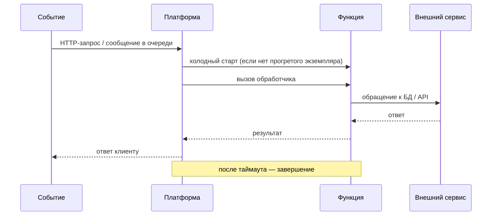

::right::

## Преимущества FaaS

- Нет управления серверами и ОС
- Автомасштабирование — в том числе до нуля
- Оплата за фактические вызовы

## Ограничения

- Холодный старт: задержка при первом вызове
- Ограничение времени выполнения (обычно 15 мин)
- Vendor lock-in: API платформы в коде функции
- Нет состояния между вызовами

<!--
Посмотрим на FaaS в динамике. Когда приходит событие — HTTP-запрос или сообщение из очереди — платформа находит или создаёт экземпляр функции и вызывает обработчик. Если экземпляра нет, происходит холодный старт: платформа загружает рантайм, инициализирует среду. Это может занять сотни миллисекунд или даже секунды. После выполнения функция завершается, состояние теряется. Следующий вызов может попасть на другой экземпляр. Это значит: функция должна быть stateless по 12-factor. Serverless идеален для обработки событий, преобразований данных, webhook-обработчиков. Плохо подходит для долгих вычислений и задач с жёсткими требованиями к задержке.
-->

---
layout: section
---

<div class="section-no">07</div>

# Критерии выбора уровня

Контроль, скорость, стоимость, переносимость

<!--
Мы описали все уровни. Теперь главный вопрос аналитика: как выбрать? Это не вопрос вкуса, это вопрос компромиссов. Сейчас мы систематизируем эти компромиссы.
-->

---

# Таблица решений: выбор уровня абстракции

| Критерий | Физ. сервер | ВМ | Контейнер | FaaS |
|---|---|---|---|---|
| Контроль над стеком | Полный | Высокий | Средний | Минимальный |
| Скорость поставки | Дни | Минуты | Секунды | Секунды |
| Плотность на хосте | Низкая | Средняя | Высокая | Максимальная |
| Переносимость | Низкая | Средняя | Высокая | Зависит от платформы |
| Vendor lock-in | Нет | Низкий | Низкий | Высокий |
| Эксплуатационная нагрузка | Максимальная | Высокая | Средняя | Минимальная |

<!--
Разберём таблицу по критериям. Контроль над стеком максимален на физическом сервере — вы отвечаете за всё, но и управляете всем. Скорость поставки растёт по мере подъёма: от дней на физических серверах до секунд у контейнеров и FaaS. Плотность — сколько изолированных рабочих нагрузок можно запустить на одном железе — у контейнеров принципиально выше, чем у ВМ. Переносимость у контейнеров высокая за счёт OCI-стандарта, у FaaS — зависит от того, насколько вы используете специфическое API платформы. Vendor lock-in у FaaS — реальный риск, если функции ссылаются на проприетарные сервисы платформы. Эксплуатационная нагрузка — обратна контролю: чем меньше вы управляете, тем больше берёт платформа.
-->

---

# Переносимость и vendor lock-in

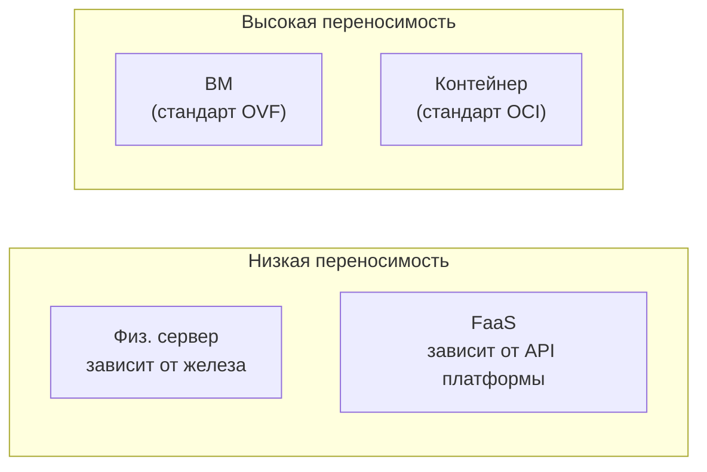

<div class="itmo-card-note mt-4">
Vendor lock-in и переносимость — нефункциональные требования, а не второстепенные детали. Они влияют на TCO и возможность смены провайдера через 3–5 лет.
</div>

<!--
Отдельно остановимся на переносимости, потому что её часто недооценивают. Физический сервер привязан к железу — переезд дорог. FaaS при активном использовании специфических сервисов платформы (очереди, базы данных провайдера, SDK) создаёт сильную зависимость, которая проявится при желании сменить облако. Контейнер с OCI-совместимым образом и конфигурацией в переменных окружения по 12-factor — самый переносимый вариант. ВМ в формате OVF также относительно переносима, но тяжелее контейнера. В «Руководстве по DevOps» Джина Кима и соавторов vendor lock-in называется одним из скрытых источников технического долга — его нужно учитывать при выборе платформы.
-->

---
layout: section
---

<div class="section-no">08</div>

# Режимы отказа абстракций

Протекающие абстракции и скрытые ограничения платформы

<!--
Любая абстракция «протекает» — это закон Лиса Атвуда: все нетривиальные абстракции в той или иной степени нарушаются. Это не повод отказываться от абстракций, но повод понимать нижний слой достаточно, чтобы диагностировать сбои.
-->

---

# Протекающие абстракции

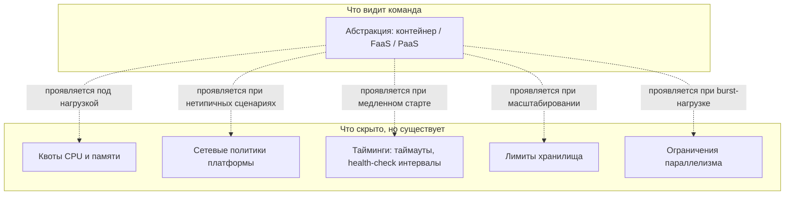

<!--
Протекающая абстракция проявляется тогда, когда вы встречаетесь с ограничением нижнего слоя, который абстракция должна была скрыть. Контейнер скрывает ОС — но не скрывает kernel panic, OOM killer или нехватку файловых дескрипторов. PaaS скрывает серверы — но не скрывает таймаут HTTP-соединения на балансировщике или квоту на количество одновременных подключений к базе данных. FaaS скрывает процессы — но не скрывает холодный старт. Именно поэтому нужно понимать нижний уровень: не для того, чтобы управлять им каждый день, а для того, чтобы правильно диагностировать аномалии.
-->

---

# Карточки режимов отказа

<div class="grid grid-cols-2 gap-3">
<div class="itmo-card-warn">

**OOM на уровне контейнера**
Приложение превышает лимит памяти — ядро убивает процесс (OOM kill). Симптом: внезапный рестарт без stacktrace. Диагностика: `docker stats`, `dmesg | grep oom`.

</div>
<div class="itmo-card-warn">

**Холодный старт FaaS под нагрузкой**
Burst-нагрузка создаёт много новых экземпляров функции одновременно. Каждый холодный старт добавляет задержку. Симптом: p99 latency резко растёт при первом трафике.

</div>
<div class="itmo-card-warn">

**Квоты IaaS платформы**
Провайдер ограничивает количество ВМ, IP-адресов, балансировщиков. Ошибка появляется при автоскейлинге. Симптом: новые инстансы не создаются без явного сообщения об ошибке в приложении.

</div>
<div class="itmo-card-warn">

**Конфигурационный дрейф**
На физических серверах или ВМ без IaC конфигурации расходятся. Одна нода работает, другая падает. Воспроизвести и диагностировать крайне сложно.

</div>
</div>

<!--
Разберём четыре типичных режима отказа, по одному на уровень абстракции. OOM kill — это контейнерная реальность: лимит памяти жёсткий, ядро не предупреждает. Холодный старт FaaS становится проблемой, когда нагрузка непредсказуема: десятки одновременных холодных стартов создают шип задержки. Квоты IaaS — скрытое ограничение, которое не проявляется до тех пор, пока автоскейлинг не упирается в лимит. Конфигурационный дрейф — болезнь ручного управления серверами: серверы начинают жить своей жизнью и расходятся друг от друга. Следующие лекции курса разбирают инструменты борьбы с каждым из этих режимов.
-->

---

# Свидетельства: как проверить руками

<div class="grid grid-cols-2 gap-3">
<div class="itmo-card-note">

**Контейнер**
```bash
docker inspect <container>
docker stats --no-stream
docker logs --tail=100
```
Проверить: лимиты CPU/памяти, сетевые настройки, переменные окружения.

</div>
<div class="itmo-card-note">

**Образ и зависимости**
```bash
docker image inspect <image>
docker image history <image>
```
Проверить: базовый образ, слои, метаданные сборки.

</div>
</div>

<div class="itmo-card-accent mt-3">
На следующей лабораторной работе мы будем исследовать контейнеры voting-app именно этими командами.
</div>

<!--
Принцип курса: каждый теоретический тезис должен быть проверяем руками. Команда `docker inspect` возвращает полную конфигурацию контейнера в JSON: лимиты ресурсов, переменные окружения, сетевые настройки, точки монтирования. Это главный инструмент аналитика при разборе инцидента. `docker stats` показывает текущее потребление ресурсов в реальном времени. `docker image history` раскрывает слои образа и позволяет понять, что именно добавлено на каждом шаге Dockerfile. В лабораторной работе мы будем применять эти команды к компонентам voting-app и строить карту зависимостей приложения.
-->

---
layout: section
---

<div class="section-no">09</div>

# Итоги

Почему контейнер стал доминирующей единицей поставки

<!--
Мы прошли весь маршрут. Подведём итоги и перекинем мост к следующей лекции.
-->

---
layout: center
---

# Итоги лекции

- **Лестница абстракций** — каждый уровень фиксирует среду по-своему и перераспределяет ответственность
- **Shared responsibility** — контракт между командой и провайдером: знай, где заканчивается твоя зона
- **12-factor** — это контракт приложения с платформой, без него приложение не переносимо
- **Контейнер победил**, потому что сочетает переносимость (OCI), скорость (секунды) и достаточный контроль
- **Serverless** — мощный инструмент, но с реальными ограничениями: холодный старт и vendor lock-in
- **Любая абстракция протекает** — понимай нижний слой достаточно для диагностики

**Дальше:** Лекция 3 — модель изоляции контейнера: namespaces, cgroups и то, что контейнер на самом деле не изолирует

Опорная литература: методология The Twelve-Factor App (12factor.net), Дж. Ким и соавт. «Руководство по DevOps» (МИФ, 2018).

<!--
Зафиксируем главное. Мы ввели лестницу абстракций и показали, что каждый уровень — это компромисс контроля и скорости. Модель shared responsibility формализует этот компромисс как контракт с провайдером. Методология 12-factor описывает, каким должно быть приложение, чтобы этот контракт работал. Контейнер занял доминирующую позицию, потому что попал в точку баланса: достаточно лёгкий, достаточно изолированный, стандартизированный через OCI. На следующей лекции мы вскроем этот контейнер и посмотрим, что внутри: namespaces, cgroups, capabilities — механизмы ядра, на которых стоит вся контейнерная модель.
-->
