<div class="cover-kicker">Лекция 3</div>

# Модель изоляции контейнера

Что контейнер гарантирует, а что нет

<!--
Контейнер — это процесс с иллюзией собственного мира. Три механизма ядра: namespaces (что видит), cgroups (сколько потребляет), capabilities (что разрешено делать). Граница изоляции — не граница безопасности. Это разные вещи. CAP_SYS_ADMIN в контейнере — почти полный доступ к ядру хоста.
-->

---

# Маршрут лекции

- **01** — Две модели изоляции: гипервизор против ядра
- **02** — Архитектура Docker: цепочка от CLI до процесса
- **03** — Namespaces: что видит контейнер
- **04** — Cgroups: что контейнер потребляет
- **05** — Привилегии: capabilities, seccomp, LSM
- **06** — Файловая система и спецификации OCI
- **07** — Границы, выбор, режимы отказа, свидетельства

<!--
ВМ vs контейнер — сравниваем не оценочно, а по конкретным свойствам. Затем механизмы ядра по отдельности: namespaces, cgroups, capabilities, overlay2. В конце — где граница заканчивается и что с этим делать. Лабораторная работа 1 верифицирует каждый механизм командами на живом контейнере.
-->

---
layout: section
---

<div class="section-no">01</div>

# Две модели изоляции

Гипервизор против ядра: компромисс между весом и плотностью

<!--
ВМ: гипервизор даёт аппаратную границу — гость не может выйти без уязвимости в гипервизоре. Контейнер: граница программная — ядро общее. Это не дефект, а осознанный компромисс: за изоляцию платят весом (ВМ = секунды старта, гигабайты); за скорость — глубиной гарантий.
-->

---

# Проблема: лёгкая изоляция без веса ВМ

<div class="grid grid-cols-2 gap-4 mt-4">
<div class="itmo-card">

**Скорость**
Старт за миллисекунды—секунды, а не минуты

</div>
<div class="itmo-card">

**Плотность**
Сотни экземпляров на одном хосте

</div>
<div class="itmo-card-accent">

**Изоляция**
Приложение не видит соседей и не влияет на них

</div>
<div class="itmo-card-note">

**Повторяемость**
Одна среда от ноутбука до продакшена

</div>
</div>

<!--
Вот задача, которую решает контейнерная модель. Виртуальная машина даёт сильную изоляцию, но несёт полное ядро, загрузчик и оверхед гипервизора. Контейнер — другой компромисс: мы жертвуем частью изоляции и получаем взамен скорость старта и плотность размещения. Ключевое слово — «компромисс». Одно торгуется на другое. Задача аналитика — понять, что именно мы отдаём и что получаем, прежде чем принимать архитектурное решение.
-->

---

# Гипервизор против ядра

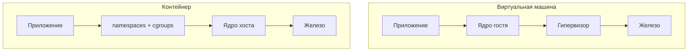

| Свойство | ВМ | Контейнер |
|---|---|---|
| Граница | аппаратная | ядро ОС |
| Старт | минуты | секунды |
| Плотность | десятки | сотни |
| Ядро | своё | общее |
| Изоляция ядра | полная | частичная |

<!--
На схеме — суть компромисса. Виртуальная машина прячет приложение за гипервизором: у каждой ВМ своё ядро, и уязвимость гостевого ядра не затрагивает хост и соседей. Контейнер не несёт своего ядра: приложение напрямую делает системные вызовы в ядро хоста. Ядро применяет namespaces и cgroups, чтобы процесс видел ограниченное окружение и не вышел за отведённые ресурсы. Но это ограничение видимости, а не аппаратная стена.
-->

---

# Общее ядро — главный компромисс

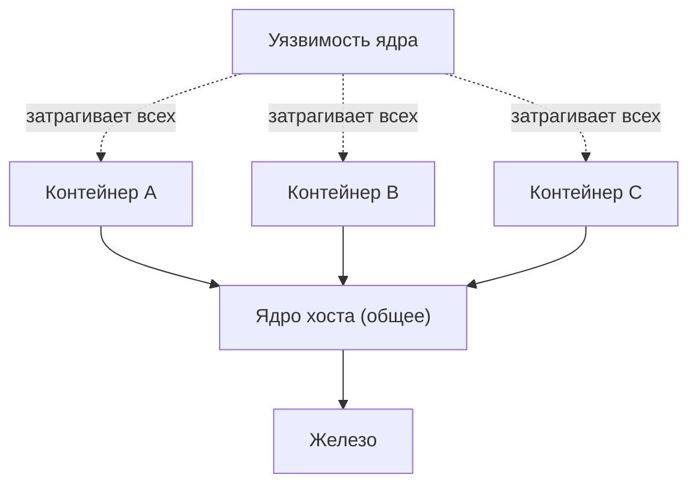

<div class="itmo-card-warn mt-3">
Уязвимость ядра хоста — общая для всех контейнеров этого хоста одновременно.
</div>

<!--
Уязвимость ядра Linux — общая для всех контейнеров на хосте одновременно. Это прямое следствие общего ядра. Граница изоляции совпадает с границей доверия: контейнерная изоляция надёжна ровно настолько, насколько актуально ядро хоста и насколько доверяете запускаемому коду.
-->

---
layout: section
---

<div class="section-no">02</div>

# Архитектура Docker

Путь команды от CLI до процесса

<!--
Docker — не монолит. dockerd (демон) → containerd (управление жизненным циклом) → runc (OCI runtime, создаёт namespaces и cgroups) → процесс в контейнере. Разделение позволяет перезапустить dockerd, не убив работающие контейнеры. containerd — часть CNCF, используется в Kubernetes напрямую без Docker.
-->

---

# Docker: цепочка компонентов

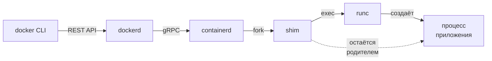

| Компонент | Роль |
|---|---|
| dockerd | приём команд, управление образами, сетями, томами |
| containerd | жизненный цикл контейнера, снапшоты образов |
| shim | родитель процесса, отвязка от containerd |
| runc | создаёт namespaces и cgroups, запускает процесс |

<!--
Проследим путь команды `docker run`. CLI отправляет запрос демону dockerd по REST API. Dockerd делегирует запуск containerd — отдельному демону жизненного цикла контейнеров. Containerd разворачивает образ в rootfs и запускает shim. Shim вызывает runc — эталонную реализацию спецификации OCI Runtime. Именно runc создаёт namespaces и cgroups, запускает процесс приложения и завершается. Shim остаётся живым как родительский процесс — это и есть ключ к «горячему» перезапуску демона без потери контейнеров.
-->

---

# Жизненный цикл запуска контейнера

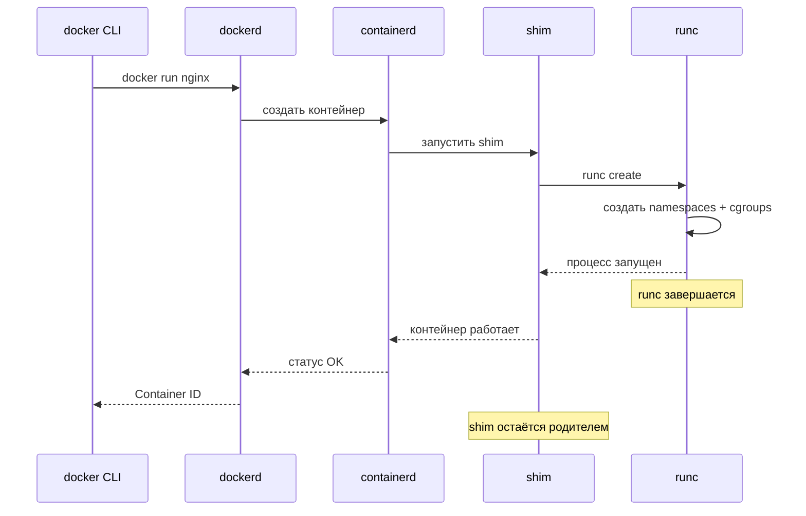

<!--
Sequence-диаграмма показывает порядок взаимодействий. Обратите внимание: runc создаёт namespaces, запускает процесс и завершается. Это намеренное архитектурное решение — runc не должен оставаться резидентным. Shim перехватывает управление и становится «хранителем» контейнера. Благодаря этому можно обновлять containerd и dockerd без остановки работающих контейнеров. Это хороший пример принципа единственной ответственности на уровне системных компонентов.
-->

---
layout: section
---

<div class="section-no">03</div>

# Namespaces

Что именно контейнер считает своим окружением

<!--
Linux namespaces — механизм ядра, добавленный с версии 3.8. Шесть типов: PID (свои PID 1..N), Network (свой сетевой стек), Mount (своя файловая система), UTS (своё hostname), IPC (свои очереди сообщений), User (свой UID). `unshare -p bash` создаёт новый PID namespace без Docker.
-->

---

# Семь пространств имён

<div class="grid grid-cols-2 gap-3 mt-3">
<div class="itmo-card"><strong>pid</strong> — дерево процессов</div>
<div class="itmo-card"><strong>net</strong> — сетевой стек</div>
<div class="itmo-card"><strong>mnt</strong> — точки монтирования</div>
<div class="itmo-card"><strong>uts</strong> — имя хоста</div>
<div class="itmo-card"><strong>ipc</strong> — межпроцессное взаимодействие</div>
<div class="itmo-card"><strong>user</strong> — UID и GID</div>
</div>

<div class="itmo-card-note mt-3">
<strong>cgroup</strong> namespace — иерархия cgroups. Каждый namespace — отдельный «взгляд» процесса на один аспект системы.
</div>

<!--
Linux поддерживает семь типов namespaces. Каждый изолирует отдельный аспект представления системы для процесса. pid — дерево процессов: внутри контейнера есть свой PID 1, хотя на хосте этот же процесс имеет другой номер. net — сетевой стек: у контейнера свои интерфейсы и таблицы маршрутов. mnt — файловая система: контейнер видит только свой rootfs. uts — имя хоста. ipc — механизмы межпроцессного взаимодействия. user — отображение пользователей. cgroup — иерархия контрольных групп. Вместе они создают иллюзию отдельной системы.
-->

---
layout: two-cols
---

# pid namespace

Изоляция дерева процессов:

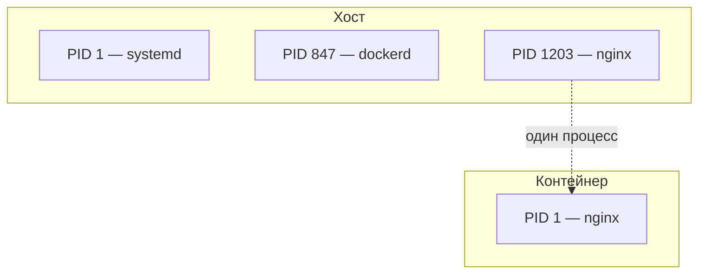

Процесс виден снаружи как 1203, изнутри — как PID 1.

::right::

# net namespace

Свой сетевой стек:

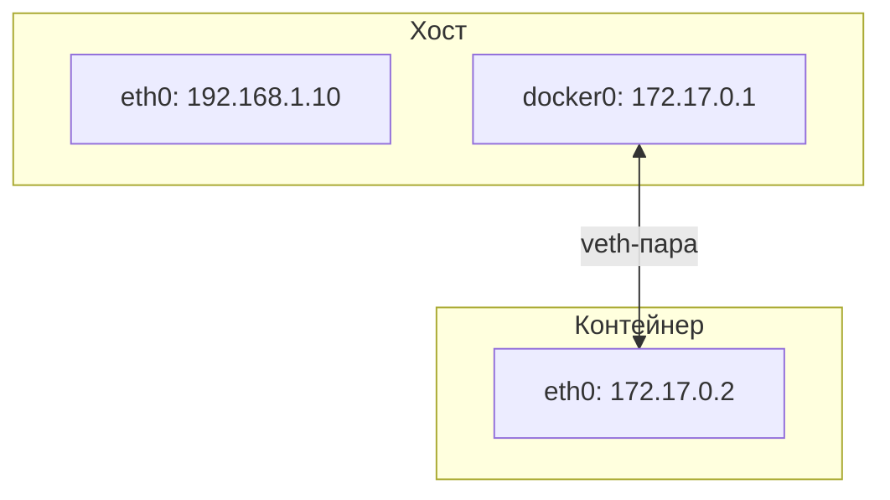

Контейнер видит только свой eth0, не видит eth0 хоста.

<!--
Два наиболее важных namespace для практики. Слева: процесс nginx с PID 1203 на хосте внутри контейнера становится PID 1. У процесса два номера одновременно — просто в разных пространствах имён. Это может удивить, когда впервые видишь. Справа: net namespace даёт контейнеру свой сетевой интерфейс eth0, соединённый с хостом через виртуальную пару veth. На хосте работает мост docker0. Трафик между контейнером и внешней сетью проходит через NAT — подробнее разберём в Лекции 6 про сети.
-->

---
layout: section
---

<div class="section-no">04</div>

# Cgroups

Что контейнер потребляет — и как это ограничить

<!--
Namespaces отвечают на вопрос «что видит процесс». Cgroups — на вопрос «сколько ресурсов он может взять». Это второй из двух главных механизмов изоляции. Без cgroups один контейнер мог бы съесть всю память или процессор хоста, уронив соседей. Именно cgroups делают ресурсы управляемой границей.
-->

---

# Cgroups: подсистемы и ограничения

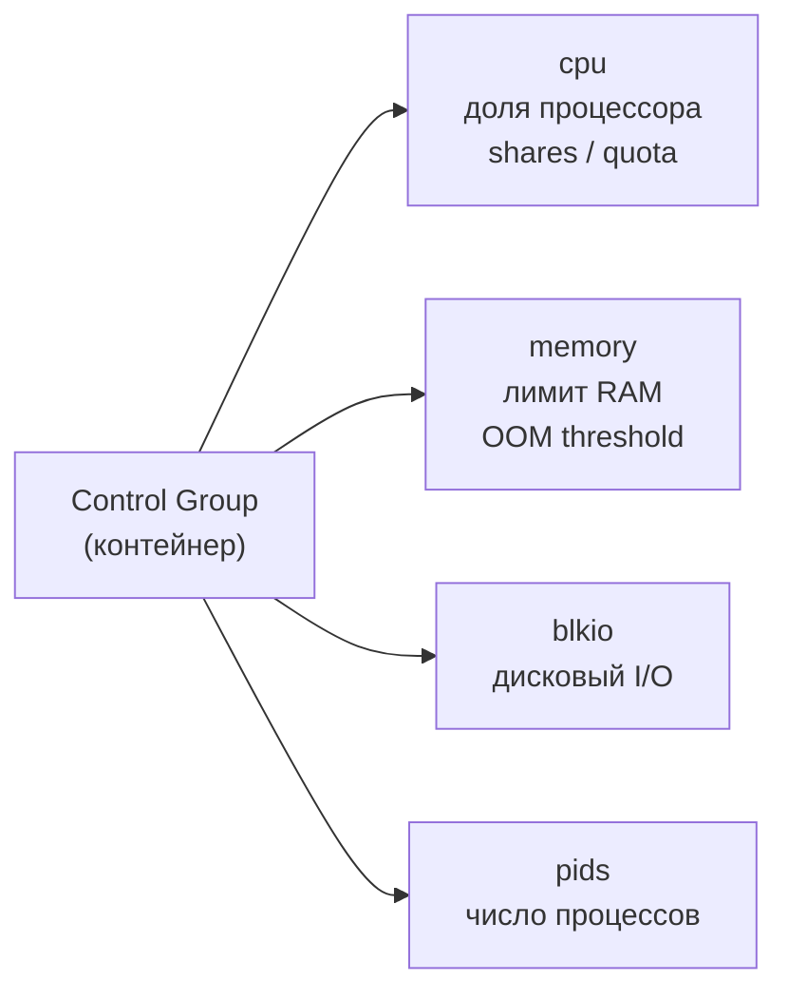

<div class="grid grid-cols-2 gap-3 mt-3">
<div class="itmo-card">

**Учёт** — cgroups фиксируют, сколько ресурсов потребил контейнер

</div>
<div class="itmo-card-warn">

**Ограничение** — при превышении лимита memory срабатывает OOM-killer

</div>
</div>

<!--
Control groups выполняют две функции: учёт и ограничение. Учёт — статистика: сколько CPU-времени использовал контейнер, сколько памяти занято, сколько байт прочитано с диска. Ограничение — барьер: если контейнер превысил лимит памяти, ядро запустит OOM-killer и уничтожит процесс внутри контейнера. Подсистема pids ограничивает число одновременных процессов — это защита от fork-бомб. Cgroups превращают физические ресурсы хоста в управляемые, квотируемые границы контейнера.
-->

---

# Cgroups v1 и v2

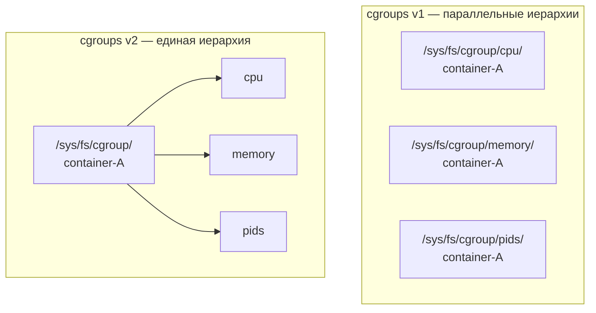

| | v1 | v2 |
|---|---|---|
| Иерархия | отдельная на подсистему | единая |
| Делегирование | ограничено | встроено |
| По умолчанию | до Ubuntu 20.04 | с Ubuntu 22.04, Fedora 31+ |

<!--
Существуют два поколения cgroups. В v1 каждая подсистема имела собственную независимую иерархию. Один контейнер мог быть в разных местах разных иерархий, и они не были согласованы между собой — это создавало путаницу при конфигурации и диагностике. Версия v2 объединила все подсистемы в единую иерархию: один путь — один контейнер. Docker и containerd поддерживают обе версии, определяя их автоматически по тому, что примонтировано в системе.
-->

---
layout: section
---

<div class="section-no">05</div>

# Привилегии

Capabilities, seccomp и политики доступа

<!--
Namespaces и cgroups — изоляция видимости и ресурсов. Третий слой — привилегии. Даже внутри контейнера процесс делает системные вызовы в общее ядро. Задача этого блока — разобраться, как ограничить, что именно процессу разрешено делать, независимо от namespace и cgroup.
-->

---

# Linux capabilities: дробление привилегий root

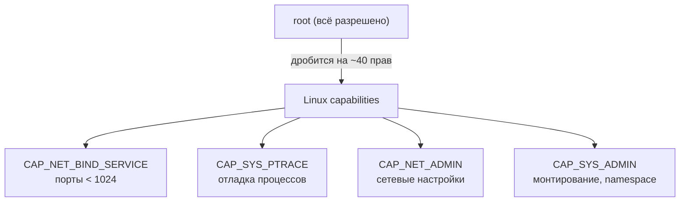

<div class="itmo-card-accent mt-3">
Docker по умолчанию даёт контейнеру ограниченный набор capabilities — и не включает CAP_SYS_ADMIN.
</div>

<!--
Capabilities разбивают root-права на ~40 флагов. Дефолтный набор контейнера: NET_BIND_SERVICE, CHOWN, SETUID, SETGID — достаточно для большинства приложений. CAP_SYS_ADMIN открывает namespace-ы и монтирование — почти полный root. AppArmor и seccomp сужают attack surface дополнительно: seccomp блокирует системные вызовы, которые не нужны приложению.
-->

---
layout: two-cols
---

# Seccomp: фильтрация системных вызовов

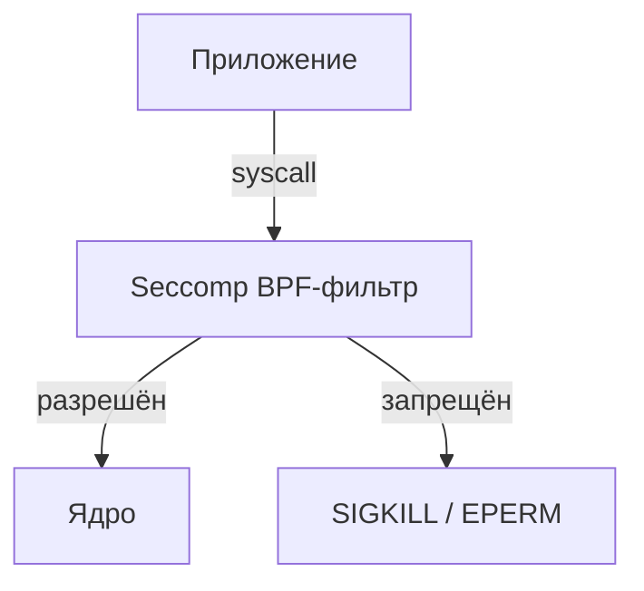

Docker по умолчанию блокирует ~44 из ~350+ syscall.

Профиль — JSON-файл с белым списком вызовов.

::right::

# LSM: AppArmor и SELinux

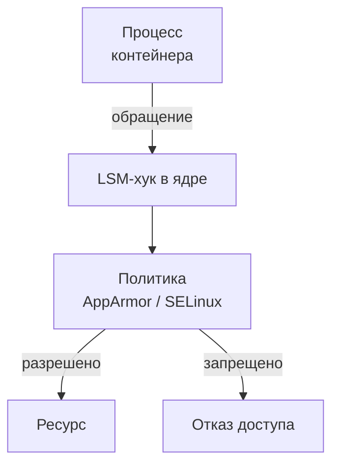

AppArmor — политика по пути программы.
SELinux — политика по меткам объектов.

<!--
Seccomp и LSM — два дополнительных слоя поверх capabilities. Seccomp использует BPF-фильтр: для каждого системного вызова фильтр проверяет, входит ли он в белый список. Запрещённый вызов завершается сигналом, не достигая ядра. Docker применяет дефолтный seccomp-профиль. LSM работает на уровне хуков ядра: перед каждым обращением к ресурсу проверяется политика. AppArmor привязывает политику к пути программы, SELinux — к меткам объектов. Вместе три слоя — capabilities, seccomp, LSM — образуют эшелонированную защиту.
-->

---
layout: section
---

<div class="section-no">06</div>

# Файловая система и OCI

Что видит контейнер под ногами

<!--
overlay2: lowerdir (слои образа, read-only) + upperdir (слой контейнера, write) + merged (видит процесс). При записи в read-only файл — copy-on-write в upperdir. При удалении контейнера upperdir исчезает. OCI Image Spec стандартизирует формат слоёв: один и тот же образ запускается в Docker, containerd, podman.
-->

---

# Корневая ФС: слои и copy-on-write

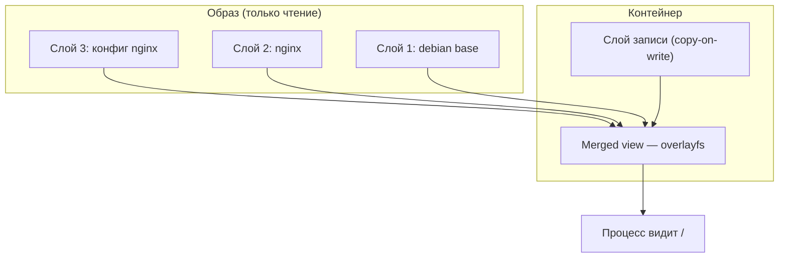

<!--
Файловая система контейнера собирается из нескольких слоёв образа, смонтированных только для чтения, и одного слоя записи сверху. Драйвер overlay2 создаёт объединённое представление через overlayfs — процесс видит единую директорию /. Когда процесс пишет файл, который существует в слое чтения, ядро сначала копирует его в слой записи (copy-on-write), а затем изменяет копию. Оригинальный слой не трогается. Слой записи существует ровно столько, сколько живёт контейнер — при его удалении все изменения теряются.
-->

---

# pivot_root: переключение корня ФС

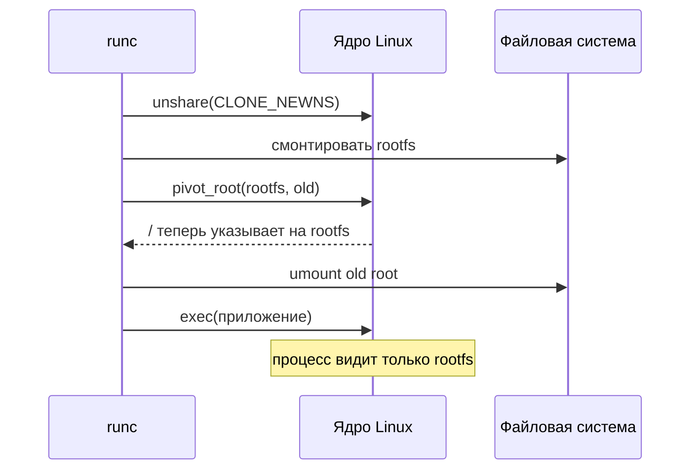

<!--
Смена корня файловой системы происходит через системный вызов pivot_root — более безопасная альтернатива chroot. Сначала runc создаёт новый mount namespace, чтобы изменения монтирования были видны только внутри контейнера. Затем монтирует rootfs контейнера. Вызов pivot_root переключает / процесса на новый корень, старый корень монтируется в поддиректорию. После отмонтирования старого корня процесс больше не имеет доступа к файловой системе хоста — если только у него нет соответствующей capability для повторного монтирования.
-->

---

# Спецификации OCI

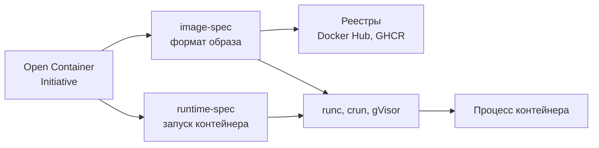

| Спецификация | Что описывает | Эталонная реализация |
|---|---|---|
| image-spec | слои, манифест, конфигурация | containerd |
| runtime-spec | config.json, хуки, namespaces | runc |

<!--
Open Container Initiative — консорциум, стандартизировавший два ключевых интерфейса. image-spec описывает формат образа: как хранятся слои, как выглядит манифест, какие поля обязательны. runtime-spec описывает, как запускать контейнер: структуру config.json, порядок создания namespaces, хуки жизненного цикла. Благодаря этим спецификациям образ, собранный одним инструментом, можно запустить другим: Podman запустит образ, собранный Docker, а gVisor — образ, предназначенный для runc. Стандартизация — основа экосистемной совместимости.
-->

---
layout: section
---

<div class="section-no">07</div>

# Границы, выбор, отказы, свидетельства

Где изоляция заканчивается и что с этим делать

<!--
Граница изоляции совпадает с границей доверия. Доверенный код от своей команды — контейнер достаточен. Недоверенный код пользователей — нужна аппаратная граница. Режимы отказа: привилегированный контейнер обходит namespace-ы. Смонтированный docker.sock даёт root на хосте. `--pid=host` разрушает PID namespace.
-->

---

# Что контейнер не изолирует

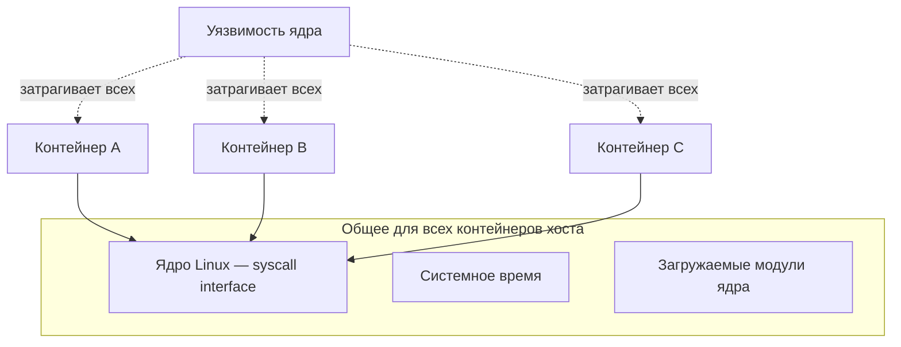

<div class="itmo-card-warn mt-2">
--privileged практически снимает все ограничения. В продакшене требует явного обоснования.
</div>

<!--
Три вещи не изолированы в контейнерной модели. Первое — ядро: все контейнеры делают системные вызовы в одно ядро, и уязвимость затрагивает всех одновременно. Второе — системное время: контейнер не может иметь своё время в отрыве от хоста без специальных инструментов. Третье — загружаемые модули: если процесс может загрузить модуль ядра, это касается всего хоста. Флаг --privileged отключает практически все защиты: даёт все capabilities, отключает seccomp и AppArmor. Это антипаттерн — для него должно быть явное документированное обоснование.
-->

---

# Доверие к образу — часть границы безопасности

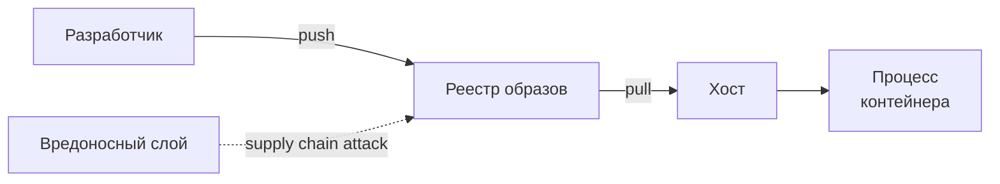

<div class="grid grid-cols-2 gap-3 mt-3">
<div class="itmo-card-warn">

Непроверенный образ может содержать уязвимый пакет или бэкдор

</div>
<div class="itmo-card-note">

Практика: сканировать образ (Trivy/Grype) до деплоя, использовать digest вместо тега

</div>
</div>

<!--
Граница изоляции начинается не при запуске, а при сборке образа. Если в базовом слое есть уязвимая библиотека — она попадёт в рантайм. Если реестр скомпрометирован и образ подменён — контейнер запустит вредоносный код с теми же правами, что и легитимный. Это называется атакой на цепочку поставки. Доверие к контейнерной изоляции включает доверие к образу: от базового слоя до конкретного коммита. Инструменты сканирования Trivy и Grype, а также подпись образов через Cosign закрывают эту часть границы. Подробнее — в Лекции 4.
-->

---

# Критерии выбора: контейнер или ВМ

| Критерий | Контейнер | Микро-ВМ (gVisor, Kata) |
|---|---|---|
| Доверие к коду | высокое — свой код | низкое — сторонний код |
| Изоляция ядра | общее ядро | отдельное ядро |
| Плотность | высокая | ниже |
| Старт | секунды | секунды—десятки секунд |
| Совместимость syscall | полная | частичная у gVisor |
| Применение | большинство сервисов | FaaS, multi-tenant, CI |

<!--
Контейнер — для доверенного кода своей команды. FaaS с пользовательскими функциями, CI с произвольными скриптами, PCI DSS/SOC2 с требованиями аппаратной изоляции — нужна граница жёстче. gVisor (Google): свой userspace-ядро перехватывает syscall'ы. Kata Containers: лёгкая ВМ с KVM. Оба платят снижением плотности и производительности.
-->

---

# Режимы отказа

<div class="grid grid-cols-2 gap-3">
<div class="itmo-card-warn">

**OOM-kill**
Превышен лимит memory — ядро убивает процесс. Симптом: статус Exited 137.

</div>
<div class="itmo-card-warn">

**CPU throttling**
Квота cpu.quota исчерпана — процесс «подвисает» на доли секунды. Симптом: высокие задержки без роста нагрузки.

</div>
<div class="itmo-card-warn">

**Privileged-контейнер**
--privileged снимает все ограничения. Симптом: нет симптомов до инцидента.

</div>
<div class="itmo-card-warn">

**Эксплойт ядра**
Уязвимость в общем ядре затрагивает все контейнеры. Радиус поражения — весь хост.

</div>
</div>

<!--
Разберём четыре типичных режима отказа. OOM-kill — самый частый: лимит памяти это не мягкая рекомендация, а жёсткий барьер. При превышении ядро немедленно завершает процесс с кодом 137. CPU throttling менее заметен: процесс не умирает, но периодически «замораживается» на сотни миллисекунд, пока не откроется следующий период квоты. Privileged-режим — самая коварная из перечисленных ловушек: отказ бесшумный, проявляется только при инциденте. Эксплойт ядра — наименее частый, но самый разрушительный по радиусу поражения.
-->

---

# Свидетельства: проверяем изоляцию руками

```bash
# Конфигурация изоляции контейнера
docker inspect <id> | jq '.[0].HostConfig |
  {CpuQuota, Memory, Privileged, CapAdd, CapDrop}'

# Namespaces процесса на хосте
ls -la /proc/<pid>/ns/

# Cgroups v2: текущий лимит памяти
cat /sys/fs/cgroup/system.slice/memory.max

# PID хоста vs PID внутри контейнера
ps aux | grep nginx
docker exec <id> ps aux
```

<div class="itmo-card-note mt-3">
Навык закрепляется в Лаб 1: запустить контейнер, измерить границы, верифицировать каждый механизм.
</div>

<!--
Наблюдаемость — главный инструмент аналитика. Три команды дают полную картину. docker inspect показывает декларативную конфигурацию: лимиты, capabilities, флаги. /proc/pid/ns/ содержит симлинки на namespaces — по ним видно, разделяет ли контейнер ns с хостом или имеет собственный. Файлы в /sys/fs/cgroup/ показывают актуальные лимиты и текущее потребление. Сравнение вывода ps на хосте и внутри контейнера демонстрирует pid namespace в действии: снаружи видим большой PID, внутри — маленький. В Лаб 1 мы пройдём все эти шаги последовательно.
-->

---
layout: center
---

# Итоги

- Контейнер — обычный процесс с ограничениями ядра: namespaces, cgroups, capabilities
- Граница изоляции совпадает с границей доверия — общее ядро уязвимо для всех контейнеров хоста
- Архитектура Docker: CLI → dockerd → containerd → shim → runc; каждый компонент — своя зона
- OCI стандартизирует образ и рантайм, обеспечивая совместимость экосистемы
- Контейнера достаточно для доверенного кода; недоверенный требует аппаратной границы
- Свидетельства: `docker inspect`, `/proc`, cgroups, `ps aux` — всё проверяется руками

**Дальше:** Лекция 4 — образы контейнеров как аудируемые артефакты цепочки поставки

Опорная литература: С. Гош «Docker без секретов». БХВ Петербург, 2023.

<!--
Подведём итоги. Контейнер — не магия и не полная виртуальная машина. Это набор механизмов ядра: namespaces ограничивают видимость, cgroups ограничивают потребление ресурсов, capabilities и seccomp ограничивают привилегии, overlayfs даёт изолированную файловую систему. Граница изоляции — это граница доверия, и общее ядро является фундаментальным ограничением модели. На следующей лекции мы поднимемся на уровень выше: разберём образ контейнера как артефакт — как он собирается, как хранится и как гарантировать его целостность в цепочке поставки.
-->
