<div class="cover-kicker">Лекция 4</div>

# Образы контейнеров и цепочка поставок программного обеспечения

Образ как аудируемый артефакт: от слоёв до подписи

<!--
Образ — центральный артефакт контейнерной системы: хранит код, зависимости и конфигурацию запуска. Как он устроен, как собирается, как гарантировать неизменность от сборки до деплоя — это вопросы, от которых зависит безопасность конвейера поставки. Лекция 11 строится на этих основах.
-->

---

# Маршрут лекции

<div class="grid grid-cols-2 gap-3 mt-4">
<div class="itmo-card">
<strong>01 Устройство образа</strong><br>
Слои, дельты, манифест, overlay2
</div>
<div class="itmo-card">
<strong>02 Dockerfile и сборка</strong><br>
Инструкции, кэш, порядок, multi-stage
</div>
<div class="itmo-card">
<strong>03 Базовые образы</strong><br>
full / slim / alpine / distroless
</div>
<div class="itmo-card">
<strong>04 Реестры и распространение</strong><br>
Манифест, digest, тег, воспроизводимость
</div>
<div class="itmo-card">
<strong>05 Цепочка поставок</strong><br>
Провенанс, подпись, SBOM, сканирование
</div>
<div class="itmo-card">
<strong>06 Критерии и свидетельства</strong><br>
Decision-таблица, docker history/inspect
</div>
</div>

<!--
Лекция разбита на шесть блоков. Сначала мы смотрим внутрь образа — понимаем, что такое слой и как overlay2 складывает слои в единую файловую систему. Затем разбираем Dockerfile и механику кэша сборки. Дальше — выбор базового образа. После этого — как образ распространяется через реестр и почему digest важнее тега. В пятом блоке — цепочка поставок и безопасность. Заканчиваем критериями выбора и тем, как проверить всё это руками.
-->

---

# Проблема: среда исполнения должна быть воспроизводимой

<div class="grid grid-cols-2 gap-3 mt-4">
<div class="itmo-card-warn">
<strong>«Работает у меня»</strong><br>
Разные версии Python, библиотек, системных пакетов — на CI и на проде разные результаты
</div>
<div class="itmo-card-warn">
<strong>Дрейф конфигурации</strong><br>
Сервер настраивался вручную полгода назад — точные шаги не задокументированы
</div>
<div class="itmo-card">
<strong>Ответ: образ контейнера</strong><br>
Упаковывает файловую систему, зависимости и метаданные запуска в единый артефакт
</div>
<div class="itmo-card-accent">
<strong>Образ = единица поставки</strong><br>
Собирается один раз, запускается везде, идентифицируется однозначно
</div>
</div>

<!--
Прежде чем погружаться в устройство образа, зафиксируем проблему. В лекции 2 мы видели, что 12-factor методология требует паритета сред — dev, stage и prod должны быть устроены одинаково. Без образа это требование невыполнимо: серверы расходятся, зависимости обновляются, воспроизведение среды занимает часы. Образ решает эту задачу: он упаковывает файловую систему вместе с зависимостями и метаданными запуска. Один артефакт — один результат, независимо от хоста.
-->

---
layout: section
---

<div class="section-no">01</div>

# Устройство образа

Слои, дельты, манифест и overlay2

<!--
Образ — стек неизменяемых слоёв; каждый слой — дельта к предыдущему. Overlay2 сшивает их в единую файловую систему: ядро видит merged view, записи уходят в upperdir. Без этой механики непонятно, почему порядок инструкций Dockerfile влияет на размер образа.
-->

---
layout: two-cols
---

# Образ — стек слоёв

Каждый слой — дельта файловой системы относительно предыдущего:

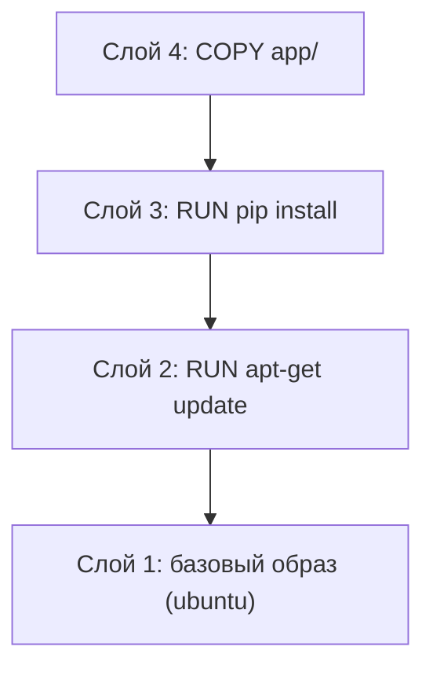

::right::

## Свойства слоёв

- Слой идентифицируется sha256-хешем содержимого
- Одинаковые слои переиспользуются между образами
- При pull/push передаются только отсутствующие слои
- Слои только для чтения — запись идёт в отдельный слой

<div class="itmo-card-note mt-4">
Экономия трафика: если python:3.12-slim уже есть локально, общие слои не скачиваются повторно при сборке нового образа на той же базе.
</div>

<!--
Образ — это стек слоёв, каждый из которых хранит дельту файловой системы: добавленные, изменённые и удалённые файлы. Нижний слой — базовый образ, например ubuntu или python:slim. Каждая последующая инструкция Dockerfile, изменяющая файловую систему, добавляет слой поверх. Слои иммутабельны и идентифицируются хешем содержимого. Если два образа разделяют одинаковый нижний слой, он хранится на диске в одном экземпляре и не дублируется. Реестр при push и pull передаёт только те слои, которых нет у получателя.
-->

---

# Манифест образа

Манифест — JSON-документ, описывающий полный состав образа:

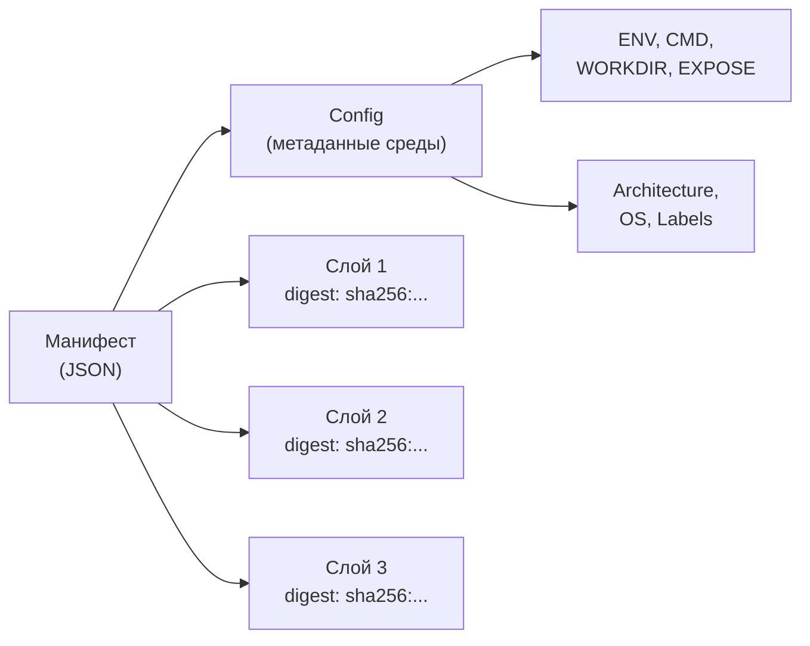

Digest манифеста — sha256 от его содержимого — это и есть неизменяемый идентификатор образа.

<!--
Когда вы делаете docker pull, реестр сначала отдаёт манифест — JSON-документ, в котором перечислены все слои и конфигурация образа. Манифест содержит digest каждого слоя и digest конфигурационного блока, где хранятся переменные окружения, рабочий каталог, команда запуска и другие метаданные. Digest самого манифеста — это и есть образ в смысле идентификатора. Тег, например latest, — это просто ссылка на манифест, которую можно переназначить. А вот digest неизменен: он вычисляется из содержимого и зафиксирован навсегда.
-->

---
layout: two-cols
---

# Драйвер overlay2

Ядро Linux собирает единую файловую систему из слоёв:

<div class="grid grid-cols-1 gap-2 mt-3">
<div class="itmo-card-accent text-center py-1"><strong>merged</strong> — результирующий вид (виден контейнеру)</div>
<div class="itmo-card py-1"><strong>upperdir</strong> — слой записи (изменения контейнера)</div>
<div class="itmo-card py-1">lowerdir: слой 3 — только чтение</div>
<div class="itmo-card py-1">lowerdir: слой 2 — только чтение</div>
<div class="itmo-card py-1">lowerdir: слой 1 — только чтение</div>
</div>

::right::

## Принцип copy-on-write

1. Контейнер читает файл — берёт из lowerdir
2. Контейнер пишет файл — файл копируется в upperdir
3. Файл в lowerdir не изменяется

<div class="itmo-card-note mt-3">
workdir — временный каталог ядра для атомарных операций overlay. Процессам контейнера он не виден.
</div>

<div class="itmo-card-warn mt-3">
Частая запись крупных файлов через overlay2 медленнее, чем через том Docker: copy-on-write даёт накладные расходы.
</div>

<!--
Overlay2 — это драйвер файловой системы Linux, который объединяет слои образа в единый вид. Нижние слои — lowerdir — доступны только для чтения, это слои образа. Верхний слой — upperdir — слой записи конкретного контейнера. Когда контейнер читает файл, overlay ищет его сверху вниз по стеку. Когда контейнер изменяет файл из lowerdir, ядро сначала копирует его в upperdir — это и называется copy-on-write. Lowerdir при этом не затрагивается. Workdir — служебный каталог ядра для атомарных операций. Именно эта механика объясняет, почему запись крупных файлов внутрь контейнера менее эффективна, чем использование томов.
-->

---
layout: section
---

<div class="section-no">02</div>

# Dockerfile и сборка

Инструкции, слои, кэш и multi-stage

<!--
Каждая инструкция Dockerfile создаёт слой. Docker кэширует слои по содержимому: если слой не изменился, повторная сборка пропускает его. Порядок инструкций важен: `COPY requirements.txt` + `pip install` перед `COPY . .` гарантирует, что зависимости кэшируются отдельно от кода приложения.
-->

---
layout: two-cols
---

# Инструкции Dockerfile

```dockerfile
FROM python:3.12-slim        # базовый образ
WORKDIR /app                 # рабочий каталог
ENV PYTHONDONTWRITEBYTECODE=1

COPY requirements.txt .      # только манифест зависимостей
RUN pip install -r requirements.txt

COPY . .                     # исходники — последними
EXPOSE 8000
CMD ["python", "main.py"]
```

::right::

## Что создаёт слой

| Инструкция | Слой | Назначение |
| --- | --- | --- |
| FROM | нет | базовый образ |
| RUN | да | выполнить команду |
| COPY/ADD | да | добавить файлы |
| ENV/WORKDIR | нет | метаданные |
| EXPOSE | нет | документация порта |
| CMD/ENTRYPOINT | нет | команда запуска |

<!--
Dockerfile — декларация сборки образа. FROM задаёт отправную точку. WORKDIR создаёт рабочий каталог и фиксирует его в метаданных — все последующие команды выполняются в нём. ENV устанавливает переменные окружения, которые наследуются всеми слоями ниже. COPY переносит файлы из контекста сборки в образ и создаёт новый слой. RUN выполняет команду внутри образа и фиксирует результат как слой. EXPOSE только документирует порт — реального открытия не происходит, это метаданные для оркестратора. CMD определяет команду по умолчанию при запуске контейнера.
-->

---

# Кэш сборки и порядок инструкций

Изменение инструкции инвалидирует её слой и все последующие:

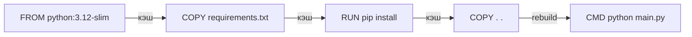

<div class="grid grid-cols-2 gap-3 mt-4">
<div class="itmo-card-accent">
<strong>Правильно:</strong> зависимости устанавливаем до копирования исходников — pip install попадает в кэш и не пересобирается при изменении кода
</div>
<div class="itmo-card-warn">
<strong>Ошибка:</strong> COPY . . перед pip install — любое изменение кода ломает кэш зависимостей и сборка занимает минуты вместо секунд
</div>
</div>

<!--
Кэш сборки — механизм, который делает повторные сборки быстрыми. Docker кэширует результат каждой инструкции. Если инструкция не изменилась и её входные данные те же — слой берётся из кэша. Но если инструкция изменилась, все последующие слои тоже пересобираются. Это главный закон порядка в Dockerfile: редко меняющиеся операции — установка системных пакетов и зависимостей — нужно ставить выше, а часто меняющиеся — копирование исходников — ниже. Так изменение одного файла кода не ломает кэш pip install, и разработчик получает результат за секунды, а не минуты.
-->

---
layout: two-cols
---

# Multi-stage build

Сборочная среда и финальный образ разделяются:

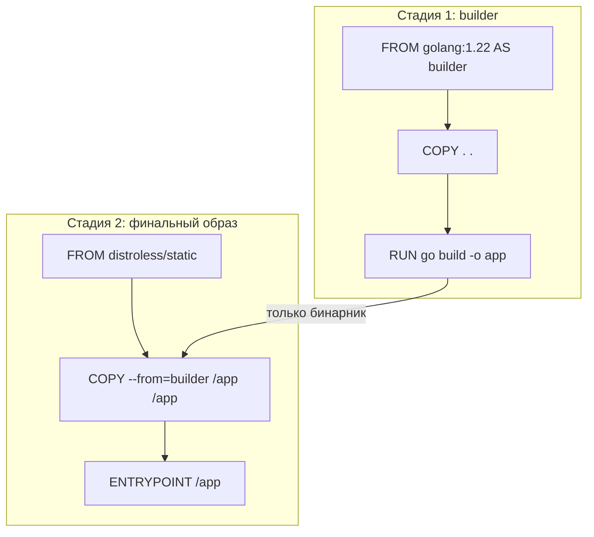

::right::

## Что остаётся в финальном образе

- Только скомпилированный бинарник
- Нет компиляторов, нет исходников
- Нет пакетного менеджера
- Поверхность атаки минимальна

<div class="itmo-card-accent mt-4">
Типичный результат для Go-сервиса: образ со средой сборки &gt; 800 МБ → distroless &lt; 15 МБ
</div>

<div class="itmo-card-note mt-3">
В voting-app компоненты на Go используют именно этот паттерн.
</div>

<!--
Multi-stage build — паттерн Dockerfile с несколькими блоками FROM. Первая стадия — builder — содержит все инструменты: компилятор, линтер, тест-фреймворк. На ней собирается артефакт. Вторая стадия начинается с чистого базового образа — например distroless или alpine. Команда COPY с флагом from=builder берёт только нужный файл из первой стадии. Всё остальное — компиляторы, исходники, промежуточные файлы — в финальный образ не попадает. Для Go-сервиса разница поразительная: образ со средой сборки весит больше 800 мегабайт, distroless с бинарником — около 15. Это сокращает и время pull, и поверхность атаки.
-->

---
layout: section
---

<div class="section-no">03</div>

# Базовые образы

Компромиссы между размером, совместимостью и безопасностью

<!--
Базовый образ определяет пакеты ОС, shell, размер и площадь атаки. `ubuntu:22.04` — ~70 МБ, сотни пакетов. `alpine:3.19` — ~5 МБ, минимум пакетов. `scratch` — пусто, только бинарник. Выбор зависит от стека: Go-бинарник запускается в scratch, Python-приложению нужен libc.
-->

---

# Семейство базовых образов

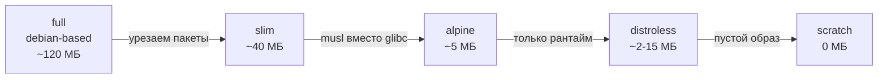

| Вариант | Размер | Shell | Совместимость | Атака |
| --- | --- | --- | --- | --- |
| full | большой | bash | максимальная | высокая |
| slim | средний | sh | высокая | средняя |
| alpine | малый | sh | musl — осторожно | низкая |
| distroless | минимальный | нет | только рантайм | минимальная |
| scratch | нулевой | нет | статика only | минимальная |

<!--
Выбор базового образа — компромисс между пятью критериями: размером, наличием инструментов, совместимостью, удобством отладки и поверхностью атаки. Полный debian-based образ удобен в разработке — есть все инструменты и apt. Slim урезан, но совместим. Alpine очень мал, но использует musl libc вместо glibc — это иногда ломает бинарники, скомпилированные под glibc, особенно нативные расширения Python или C-биндинги. Distroless содержит только рантайм — нет shell и нет пакетного менеджера, что радикально сокращает поверхность атаки. Scratch — пустой образ, только для статически скомпилированных бинарников.
-->

---

# Alpine и musl: скрытая ловушка совместимости

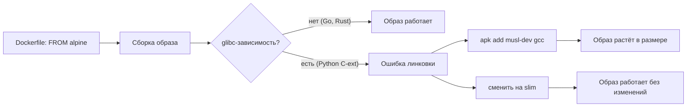

<div class="itmo-card-warn mt-3">
pip install psycopg2-binary на alpine тянет компилятор и dev-заголовки или падает с ошибкой линковки. Решение: перейти на python:slim.
</div>

<!--
Самая распространённая ловушка при переходе на alpine — несовместимость libc. Большинство Python-пакетов с нативными расширениями поставляются в виде wheels, собранных под glibc. На alpine pip попытается собрать пакет из исходников — и для этого потребует компилятор и заголовки, что нивелирует всю экономию на размере. Или pip падает с ошибкой линковки. В таких случаях лучший выбор — python:slim, которая основана на debian и совместима с glibc. Alpine оправдан для Go и Rust, где статическая компиляция устраняет зависимость от libc. Это нужно проверять в CI, а не обнаруживать в продакшене.
-->

---
layout: section
---

<div class="section-no">04</div>

# Реестры и распространение

Манифест, digest, тег и воспроизводимость

<!--
Тег (`latest`, `v1.2`) — указатель, изменяемый. Digest (`sha256:abc123...`) — контрольная сумма манифеста, неизменяемая. `docker pull nginx:latest` сегодня и завтра — разные образы. `docker pull nginx@sha256:abc123` — всегда один и тот же. CI должен пушить с digest, не с тегом.
-->

---

# Жизнь образа: от сборки до реестра

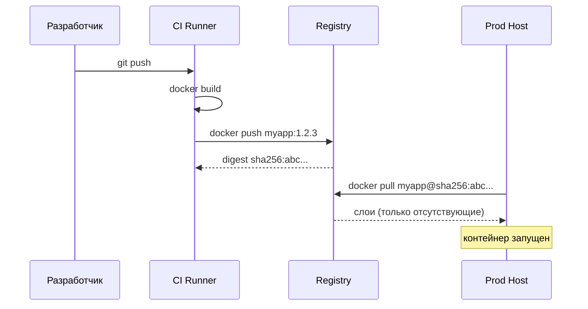

<!--
Посмотрим на жизненный цикл образа целиком. Разработчик пушит код, CI runner собирает образ командой docker build. После успешной сборки образ пушится в реестр с тегом, содержащим версию или хеш коммита. Реестр возвращает digest — sha256-хеш манифеста. Это неизменяемый идентификатор образа. На продакшен-хосте docker pull обращается к реестру: если некоторые слои уже есть локально — они не скачиваются повторно. Это и есть экономия трафика через разделение слоёв. Digest при этом позволяет однозначно сказать: именно этот образ, а не другой с тем же тегом.
-->

---
layout: two-cols
---

# Тег vs Digest

Тег — подвижная ссылка, digest — неизменяемый идентификатор:

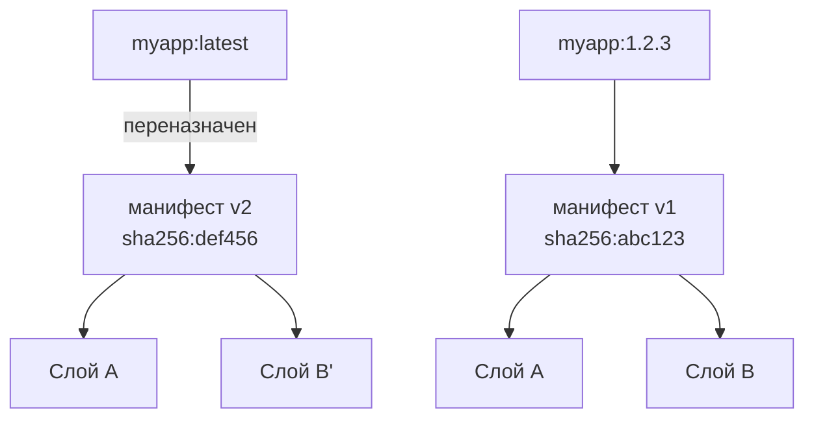

::right::

## Что выбрать для прослеживаемости

<div class="itmo-card-warn mt-2">
<strong>Тег latest — антипаттерн в CD</strong><br>
Сегодня это одна версия образа, завтра — другая. Воспроизведение среды невозможно.
</div>

<div class="itmo-card-accent mt-3">
<strong>Digest — единственный надёжный идентификатор</strong><br>
FROM python:3.12-slim@sha256:abc... гарантирует тот же самый образ при любой пересборке.
</div>

<div class="itmo-card-note mt-3">
Команда для получения digest:<br><code v-pre>docker image inspect --format '{{index .RepoDigests 0}}' img:tag</code>
</div>

<!--
Тег в реестре — это просто ссылка на манифест. Ничто не мешает переназначить тег latest на новый манифест. Это значит, что docker pull myapp:latest сегодня и завтра может вернуть разные образы. Для воспроизводимой среды это катастрофа: один и тот же Dockerfile даёт разные образы в разное время. Правильный подход в Continuous Delivery — фиксировать digest. В Dockerfile это выглядит как FROM python:3.12-slim@sha256:... Тег при этом можно оставить для удобства чтения, но digest гарантирует, что образ не изменится. Kubernetes и большинство CI-систем поддерживают такой синтаксис.
-->

---

# Артефакты в Continuous Delivery

Один образ проходит все среды без пересборки:

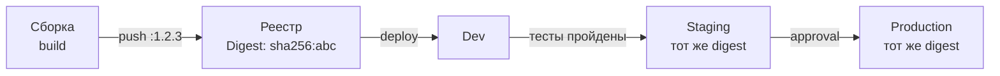

<div class="grid grid-cols-2 gap-3 mt-3">
<div class="itmo-card-accent">
<strong>Один артефакт — весь путь</strong><br>
Образ не пересобирается между средами. То, что прошло тесты, попадает в продакшен без изменений.
</div>
<div class="itmo-card-note">
В «Грокаем Continuous Delivery» Кейт Уилсон называет это «единственным надёжным основанием прослеживаемости»: артефакт собирается один раз и продвигается по средам.
</div>
</div>

<!--
В книге Кейт Уилсон «Грокаем Continuous Delivery» этот принцип сформулирован как один из ключевых: артефакт собирается один раз и продвигается по средам без пересборки. Это означает: то, что прошло тесты на staging, — это буквально тот же самый образ с тем же digest, что и на продакшене. Никаких «пересобрали для продакшена» — это немедленно ломает прослеживаемость. Если в продакшен попала проблема, аналитик может по digest найти конкретную сборку, коммит, который её инициировал, и все результаты тестов по этому образу. Это и есть аудируемый артефакт.
-->

---
layout: section
---

<div class="section-no">05</div>

# Цепочка поставок программного обеспечения

Провенанс, подпись, SBOM и сканирование уязвимостей

<!--
SolarWinds 2020, Log4Shell 2021: атаки на цепочку поставки позволяют подменить артефакт до деплоя. Провенанс, подпись и SBOM отвечают на вопрос: этот образ собран из того кода, который прошёл проверку, и не изменился по дороге в кластер?
-->

---

# Угрозы цепочки поставок

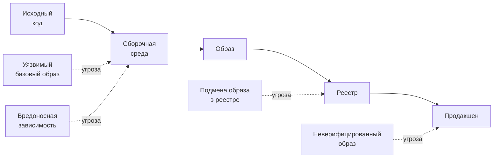

<div class="itmo-card-warn mt-3">
Инцидент SolarWinds 2020: компрометация сборочного сервера позволила встроить вредоносный код в подписанные обновления, которые получили тысячи клиентов.
</div>

<!--
Supply chain attack — атака на цепочку поставок — стала одним из самых распространённых векторов в последние годы. Злоумышленник не атакует ваш код напрямую — он атакует звено, которое вы используете: зависимость в PyPI или npm, базовый образ в реестре, компромитацию сборочного раннера. Инцидент SolarWinds показал, что достаточно скомпрометировать один элемент конвейера — и вредоносный код попадёт к тысячам организаций. Поэтому каждое звено цепочки нужно верифицировать, документировать и подписывать. Это и есть управление supply chain.
-->

---

# Провенанс и подпись образов

Провенанс — машиночитаемое доказательство происхождения артефакта:

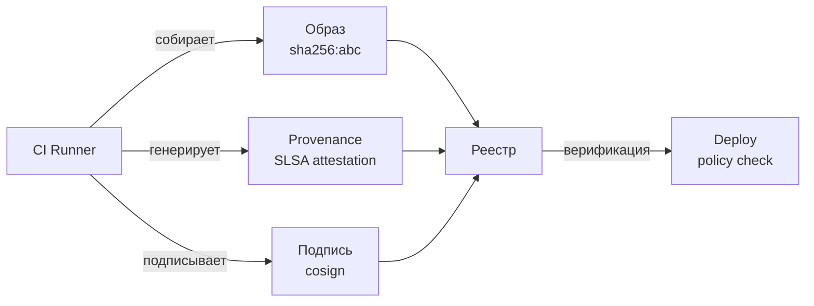

<div class="grid grid-cols-2 gap-3 mt-3">
<div class="itmo-card-note">
<strong>cosign</strong> — инструмент подписи образов от Sigstore. Подпись хранится рядом с образом в реестре, не требуя отдельного хранилища.
</div>
<div class="itmo-card-accent">
<strong>SLSA</strong> — фреймворк уровней доверия к артефакту (0–4). На уровне 3 сборка изолирована и каждый шаг аттестирован.
</div>
</div>

<!--
Провенанс — это аттестация: машиночитаемая запись о том, где и как был собран артефакт. SLSA — Supply-chain Levels for Software Artifacts — фреймворк, который определяет уровни доверия: на уровне SLSA 1 есть хотя бы задокументированный процесс сборки, на уровне 3 сборка идёт в изолированной среде и каждый шаг аттестирован. Cosign от Sigstore позволяет подписать образ и сохранить подпись в том же реестре рядом с образом. При деплое политика admission controller проверяет: этот образ подписан? откуда он? кем собран? Если нет — отклоняет запуск. Это замыкает контур доверия от кода до продакшена.
-->

---

# SBOM и сканирование уязвимостей

SBOM — Software Bill of Materials — инвентарь всех компонентов образа:

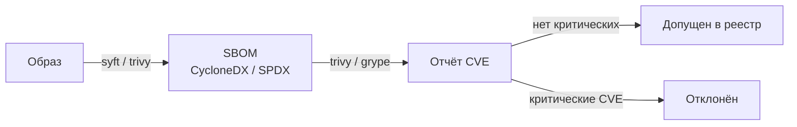

<div class="grid grid-cols-2 gap-3 mt-3">
<div class="itmo-card">
<strong>Trivy</strong><br>
Сканер образов, файловой системы и IaC. Проверяет OS-пакеты, language-рантаймы и конфигурации.
</div>
<div class="itmo-card">
<strong>Grype</strong><br>
Сканер уязвимостей с упором на точность. Работает по SBOM и напрямую по образу.
</div>
</div>

<!--
SBOM — это перечень всех компонентов образа: OS-пакеты, библиотеки языков программирования, их версии и лицензии. Два популярных формата: CycloneDX и SPDX. Инструменты вроде syft генерируют SBOM из образа, а trivy или grype сопоставляют его с базами данных уязвимостей — CVE. В зрелом CI-конвейере сканирование образа — обязательный гейт: образ с критическими уязвимостями не пропускается в реестр. SBOM при этом хранится как артефакт вместе с образом — чтобы при появлении новой уязвимости можно было быстро найти все затронутые образы в реестре. Это связь с лекцией 11, где мы разберём DevSecOps подробнее.
-->

---
layout: section
---

<div class="section-no">06</div>

# Критерии, режимы отказа и свидетельства

Как выбрать — и как проверить

<!--
Три диагностических команды: `docker history <image>` — слои и их размеры. `docker inspect <image>` — метаданные, ENV, CMD, точки монтирования. `dive <image>` — интерактивный просмотр содержимого каждого слоя. Типичные ошибки: секрет в ENV-переменной, wget/curl не удалён, запуск от root.
-->

---

# Критерии выбора базового образа и стратегии сборки

| Критерий | full/slim | alpine | distroless | scratch |
| --- | --- | --- | --- | --- |
| Размер образа | большой/средний | малый | минимальный | нулевой |
| Отладка в рантайме | удобно (shell) | ограниченно | затруднена | невозможна |
| Совместимость libc | glibc | musl — осторожно | glibc | нет |
| Поверхность атаки | высокая | средняя | минимальная | минимальная |
| Компилируемые языки | multi-stage | multi-stage | оптимально | оптимально |
| Интерпретируемые | легко | проблемно | возможно | нет |

<div class="itmo-card-note mt-3">
Рекомендация: Go/Rust — distroless или scratch с multi-stage. Python/Node с нативными расширениями — slim с multi-stage.
</div>

<!--
Сведём критерии выбора в таблицу. Если приложение на Go или Rust, которое компилируется в статический бинарник — distroless или scratch с multi-stage дают минимальный размер и минимальную поверхность атаки. Если Python или Node с нативными расширениями — slim-варианты обеспечивают совместимость и при этом убирают лишнее по сравнению с full. Alpine соблазнителен размером, но musl может сломать нативные расширения — решение нужно проверять в CI, а не обнаруживать в продакшене. Для задач отладки в рантайме full-образы оправданы в dev-среде, но не в продакшене.
-->

---

# Режимы отказа

<div class="grid grid-cols-2 gap-3 mt-2">
<div class="itmo-card-warn">
<strong>Тег latest в продакшене</strong><br>
Образ обновился без явного deploy — поведение системы изменилось. Воспроизведение среды невозможно.
</div>
<div class="itmo-card-warn">
<strong>Неправильный порядок в Dockerfile</strong><br>
COPY исходников перед pip install — каждый коммит пересобирает зависимости. Сборка замедляется в 10-50 раз.
</div>
<div class="itmo-card-warn">
<strong>Удаление в отдельном RUN</strong><br>
apt-get install в одном RUN и apt-get clean в следующем — удаление не уменьшает образ: каждая инструкция это отдельный слой.
</div>
<div class="itmo-card-warn">
<strong>Секреты в слоях образа</strong><br>
ARG или ENV с паролями фиксируются в слоях и видны через docker history. Нужны BuildKit secrets.
</div>
</div>

<!--
Разберём четыре самых частых режима отказа. Первый — тег latest в продакшене: это потеря прослеживаемости. Второй — неправильный порядок в Dockerfile: это потеря скорости сборки, что на активной команде превращается в часы ожидания за неделю. Третий — попытка урезать образ, разбив apt-get install и apt-get clean на два RUN: это не работает, потому что каждая инструкция фиксирует свой слой. Правильно объединять их в один RUN через &&. Четвёртый — секреты в образе: ENV DATABASE_PASSWORD=secret зафиксируется в слое и будет видна через docker history даже если следующий слой попытается её удалить.
-->

---
layout: two-cols
---

# Свидетельства: читаем образ руками

```bash
# Слои и их размер
docker image history myapp:1.2.3

# Метаданные образа
docker image inspect myapp:1.2.3

# Digest образа
docker image inspect \
  --format '{{index .RepoDigests 0}}' \
  myapp:1.2.3

# Сканирование уязвимостей
trivy image myapp:1.2.3

# SBOM
syft myapp:1.2.3 -o cyclonedx-json
```

::right::

## Что искать

<div class="itmo-card-note mt-2">
<strong>docker history:</strong> выявляет тяжёлые слои. Если один слой &gt; 100 МБ — скорее всего, нарушен порядок инструкций или apt-cache не очищен в том же RUN.
</div>

<div class="itmo-card-note mt-3">
<strong>docker inspect:</strong> проверяет CMD/ENTRYPOINT, переменные окружения, метки сборки — содержит ли артефакт нужные метаданные CI.
</div>

<div class="itmo-card-accent mt-3">
<strong>Мост к Лаб 1:</strong> в лабораторной работе вы применяете именно эти команды для анализа образов компонентов voting-app.
</div>

<!--
Разберём, как читать образ без запуска контейнера. Команда docker image history показывает слои в обратном порядке с их размерами — это позволяет найти тяжёлые слои и понять, какая инструкция их породила. Docker image inspect возвращает полный JSON с метаданными: переменные окружения, команду запуска, метки, которые CI проставляет при сборке. По этим меткам можно найти коммит и ветку, из которых собран образ. Trivy запускается одной командой и выдаёт отчёт с уязвимостями по severity. В первой лабораторной вы будете применять все эти команды к компонентам voting-app и отвечать на вопрос: что именно внутри этого образа.
-->

---
layout: center
---

# Итоги

- Образ — стек иммутабельных слоёв; overlay2 собирает их в единую ФС через copy-on-write
- Порядок инструкций в Dockerfile напрямую определяет скорость повторных сборок
- Multi-stage build отделяет сборочную среду от финального образа — размер и атака минимальны
- Digest — единственный воспроизводимый идентификатор; тег latest — антипаттерн в CD
- Цепочка поставок: провенанс + подпись + SBOM + сканирование защищают каждое звено

**Дальше:** Лекция 5 — где хранить состояние, которое переживает контейнер: тома, bind mounts и классы хранилищ

Опорная литература: С. Гош «Docker без секретов». БХВ Петербург, 2023; К. Уилсон «Грокаем Continuous Delivery». Питер, 2024.

<!--
Подведём итоги четвёртой лекции. Мы разобрали образ как стек иммутабельных слоёв и увидели, как overlay2 реализует это на уровне ядра через copy-on-write. Порядок инструкций в Dockerfile — это не стиль, а инженерное решение, которое определяет скорость сборки. Multi-stage build — стандартный паттерн для компилируемых языков. Digest, а не тег — единственный надёжный идентификатор образа в CD-конвейере. Наконец, цепочка поставок — это ответ на вопрос: можем ли мы доказать, что в продакшен попало именно то, что мы проверили. На следующей лекции мы переходим к теме состояния: контейнер эфемерен, а данные должны жить дольше.
-->
