
Лекция 5

# Данные и состояние в контейнеризованных системах

Где живёт состояние, там сосредоточен риск

<!--
Добрый день. Четыре предыдущие лекции рассмотрели изоляцию контейнера, устройство образа и цепочку поставок программного обеспечения. Сегодня мы переходим ко второму разделу курса и к вопросу, который определяет надёжность всей системы: где хранятся данные и как они переживают жизненный цикл контейнера. Это не абстрактный вопрос — именно здесь происходит большинство реальных инцидентов с потерей данных. Наша аналитическая рамка как всегда: проблема, модель, границы, критерии выбора, режимы отказа, свидетельства.
-->

---

# Маршрут лекции

<strong>01 Слой записи контейнера</strong> 
Copy-on-write и антипаттерн хранения

<strong>02 Тома Docker</strong> 
Типы, жизненный цикл, права доступа

<strong>03 Stateless и Stateful</strong> 
Два способа масштабироваться

<strong>04 Классы хранилищ</strong> 
Блочное, файловое, объектное, CAP

<strong>05 Надёжность данных</strong> 
RPO, RTO, бэкапы, data gravity

<strong>06 Критерии и риски</strong> 
Decision-таблица, отказы, свидетельства

<!--
Лекция построена по нашей стандартной рамке. Начинаем с корня проблемы — почему данные нельзя держать внутри контейнера. Дальше изучаем инструменты: тома, типы хранилищ, стратегии резервирования. Третий большой вопрос — как выбрать правильное решение под конкретные требования. В конце — как проверить свои решения руками. Все шесть блоков складываются в единую картину: состояние — это источник риска, которым нужно управлять явно и осознанно.
-->

---

# Проблема: данные не переживают контейнер

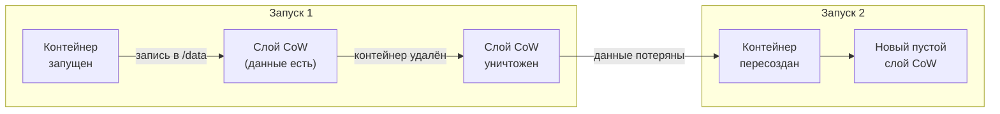

Данные в файловой системе контейнера исчезают при каждом <code>docker rm</code> или обновлении образа.

<!--
Рассмотрим, как возникает проблема. Когда контейнер запускается, Docker создаёт поверх слоёв образа тонкий слой записи — copy-on-write. Все изменения: файлы, базы данных, загруженные пользователями данные — идут именно туда. Но когда контейнер удаляется, этот слой уничтожается вместе с ним. При следующем запуске контейнер стартует с чистого листа — образ не изменился, но все накопленные данные исчезли. Это и есть природа эфемерности контейнера.
-->

---

# Voting-app: где живёт состояние

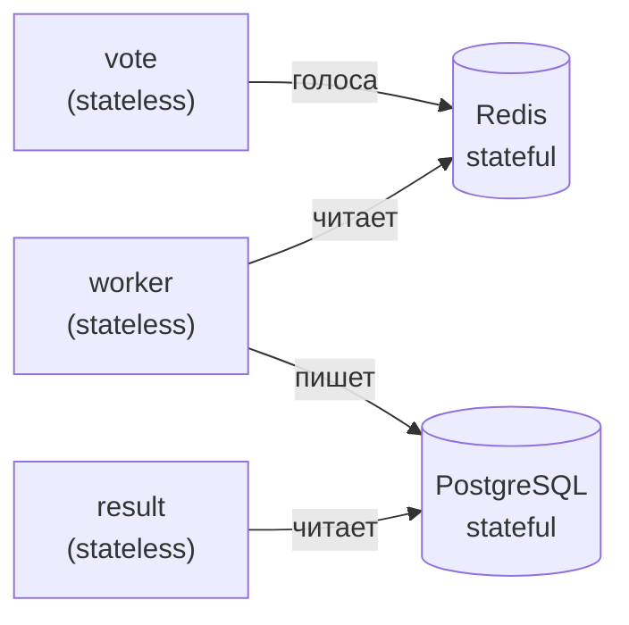

- **vote, worker, result** — не хранят состояния, масштабируются свободно
- **Redis, PostgreSQL** — хранят состояние; их данные нужно явно переживать перезапуски
- Именно Redis и PostgreSQL требуют внешнего хранилища — и определяют надёжность всей системы

<!--
Обратимся к нашему сквозному примеру — voting-app. Здесь отчётливо видно разделение: три сервиса, vote, worker и result — stateless: они получают запрос, обрабатывают его и не хранят ничего между вызовами. Redis и PostgreSQL — stateful: Redis хранит текущие голоса в памяти, PostgreSQL — итоговые результаты на диске. Именно для них мы обязаны организовать внешнее хранилище. Это иллюстрирует ключевой принцип: состояние концентрируется в нескольких компонентах, и именно они определяют надёжность всей системы.
-->

---
layout: section
---

01

# Слой записи контейнера

Copy-on-write: почему запись «внутрь» — антипаттерн

<!--
Первый блок — глубже погружаемся в механику слоя записи. Мы уже видели проблему в общих чертах. Теперь разберём, как именно устроен copy-on-write, что конкретно теряется и почему хранение данных внутри контейнера — это не просто плохая идея, а системный антипаттерн, который проявляется при обновлении образа и масштабировании.
-->

---

# Архитектура copy-on-write

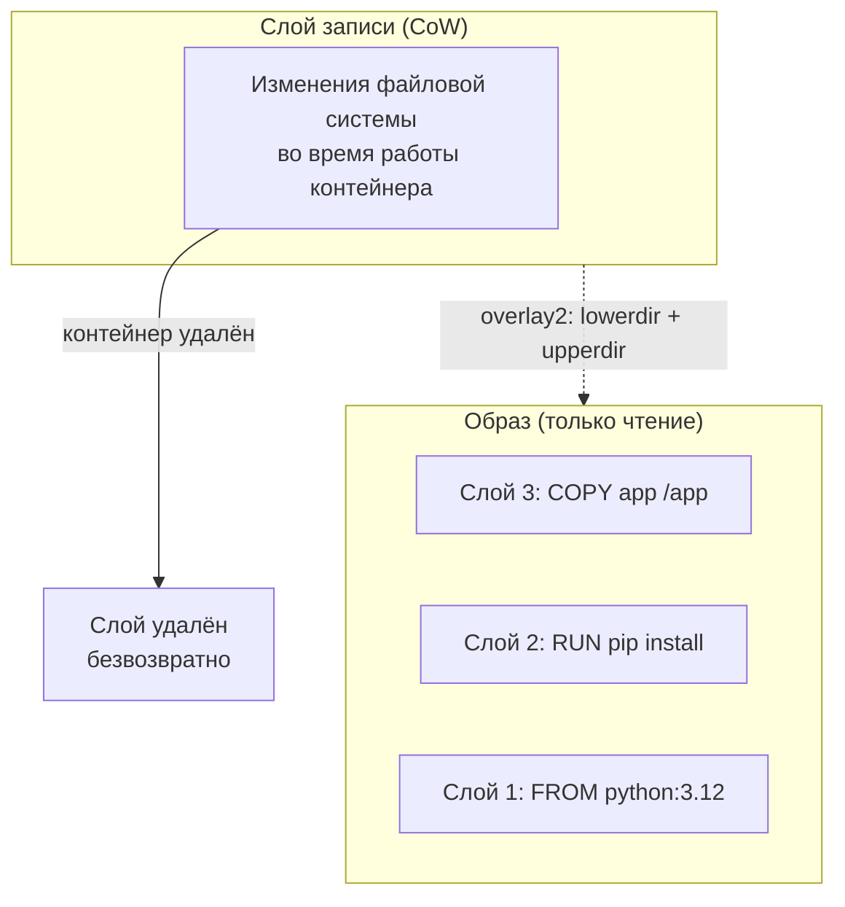

- Все слои образа — **только для чтения**, совместно используются контейнерами
- Слой записи — **уникален** для каждого контейнера и живёт ровно столько, сколько контейнер

<!--
Вспомним архитектуру overlay2 из лекции 4. Образ состоит из неизменяемых слоёв — каждая инструкция Dockerfile создала один слой. Когда контейнер запускается, поверх этих слоёв монтируется слой записи — upperdir в терминах overlay2. Приложение видит слитую файловую систему: merged. Но все записи идут только в upperdir. Ключевое свойство: как только контейнер удаляется, его upperdir уничтожается. Образ остаётся нетронутым, а вместе с контейнером исчезают все накопленные данные. Это не баг — это архитектурное решение.
-->

---

# Антипаттерн: данные внутри контейнера

<strong>Потеря при обновлении образа</strong> 
Деплой новой версии = пересоздание контейнера = исчезновение данных из слоя CoW

<strong>Нет разделения между репликами</strong> 
Каждая реплика имеет свой изолированный слой — реплики не видят данные друг друга

<strong>Нет управляемого бэкапа</strong> 
Слой CoW не вписан в механизм резервного копирования

<strong>Допустимые исключения</strong> 
Кэш, временные файлы, сессионные данные — если потеря при перезапуске приемлема

<!--
Антипаттерн — хранить в слое CoW всё, что должно пережить контейнер. Три главных последствия. Первое: при деплое новой версии образа контейнер пересоздаётся и данные исчезают. Второе: при масштабировании каждая реплика имеет свой изолированный слой записи — запросы от одного пользователя, попавшие на разные реплики, увидят разные данные. Третье: слой CoW не является объектом управляемого резервного копирования. Единственное исключение: данные, потеря которых при перезапуске заложена в дизайн системы — кэш, временные файлы.
-->

---
layout: section
---

02

# Тома Docker

Volumes, bind mounts и tmpfs: три способа вынести данные за пределы контейнера

<!--
Второй блок — инструменты решения. Docker предлагает три механизма для хранения данных вне слоя CoW. У каждого своя семантика, свои сценарии применения и свои риски. Разберём их по порядку, затем посмотрим на жизненный цикл тома и типичные проблемы с правами доступа.
-->

---

# Три способа хранения данных

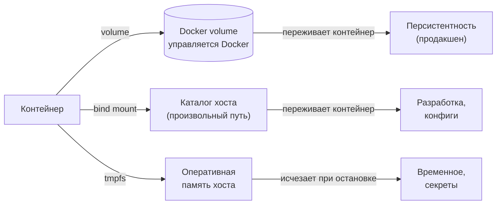

<!--
Docker предоставляет три механизма. Volume — управляемый Docker именованный том: Docker сам выбирает путь на хосте, создаёт том и удаляет только по явной команде. Данные переживают контейнер — это основной инструмент продакшена. Bind mount — монтирование произвольного каталога хоста внутрь контейнера: удобен в разработке, когда нужно видеть изменения кода без пересборки образа. Tmpfs — монтирование раздела оперативной памяти: данные не попадают на диск и исчезают при остановке контейнера. Подходит для секретов и временных данных, которые нельзя писать на диск.
-->

---

# Жизненный цикл тома

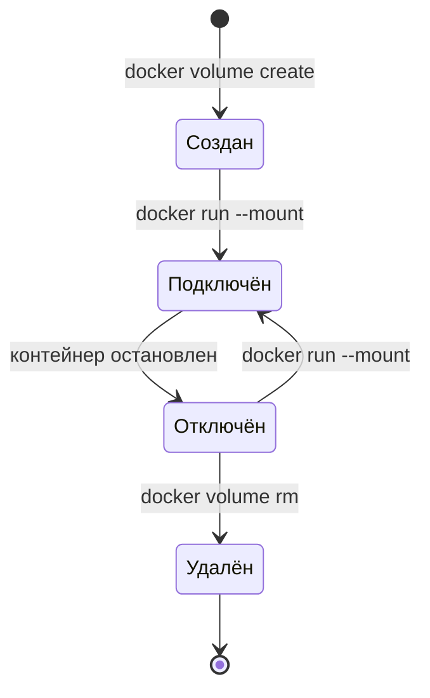

Том переживает любое количество перезапусков контейнера. Данные удаляются только явной командой.

<!--
Том существует независимо от контейнера. Он создаётся явно командой docker volume create или автоматически при первом монтировании через флаг --mount. Том можно подключить к нескольким контейнерам одновременно — один пишет, другой читает. После остановки контейнера том переходит в состояние «Отключён», но данные сохраняются. Удалить том можно только явной командой docker volume rm. Это защита от случайной потери данных. Ключевое: том живёт дольше любого конкретного контейнера — это и есть решение проблемы эфемерности.
-->

---

# Права доступа и владение данными

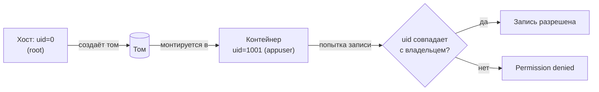

**Типичная причина ошибок:** том создан от root, контейнер работает под непривилегированным пользователем

**Решение:** `chown` в Dockerfile или явный `--user` при запуске

<!--
Права доступа к томам — частый источник ошибок в продакшене. По умолчанию Docker создаёт том с правами root. Если контейнер запускается под непривилегированным пользователем — а это рекомендуемая практика безопасности — процесс не сможет писать в точку монтирования. Типичная картина в логах: Permission denied при попытке записи в /data или /var/lib/postgresql. Решение — явно задать владельца в Dockerfile командой chown, или инициализировать права в entrypoint-скрипте. При использовании bind mount права контролируются на уровне хоста.
-->

---

# Драйверы томов: расширение хранилища

| Драйвер | Что даёт | Пример применения |
| --- | --- | --- |
| `local` | Диск хоста (по умолчанию) | Разработка, одиночный хост |
| `nfs` | Сетевая файловая система | Общий доступ между хостами |
| `s3fs` / `goofys` | Объектное хранилище S3 | Медиа, архивы |
| `rexray` / `longhorn` | Блочное хранилище кластера | БД в Swarm / K8s |

В Kubernetes роль драйверов томов выполняет CSI (Container Storage Interface) — единый стандарт подключения хранилищ к кластеру. Это важный мост к лекции об оркестрации.

<!--
Механизм драйверов позволяет подключить к контейнеру практически любое хранилище. Встроенный драйвер local хранит данные на диске хоста — подходит для разработки и одиночного сервера. Для кластерных сценариев нужны сетевые драйверы: nfs монтирует сетевую папку, s3fs подключает объектное хранилище AWS S3 как файловую систему, rexray и longhorn работают с блочными томами в кластерных средах. В Kubernetes эта абстракция стандартизована интерфейсом CSI — Container Storage Interface: любое хранилище, реализующее CSI-плагин, доступно из кластера одинаковым образом.
-->

---
layout: section
---

03

# Stateless и Stateful

Два класса сервисов — два способа масштабироваться и эксплуатироваться

<!--
Третий блок — ключевое архитектурное разделение. Прежде чем говорить о том, где и как хранить данные, нужно понять, к какому классу относится сервис: stateless или stateful. Это разделение определяет не только архитектуру хранения, но и стратегию масштабирования, обновления и восстановления после отказа.
-->

---

# Stateless: горизонтальное масштабирование

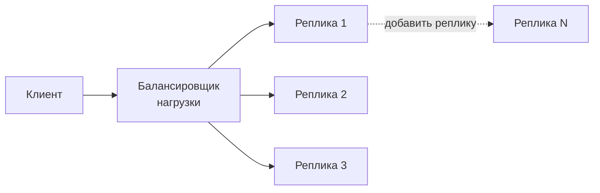

- Любая реплика обрабатывает любой запрос — нет «памяти» между запросами
- Масштабирование = добавление реплик без изменения логики
- Обновление = замена реплик по одной без простоя

<!--
Stateless-сервис не хранит состояния между запросами. Каждый запрос самодостаточен, и любая реплика может его обработать. Это делает масштабирование тривиальным: добавь реплику — и балансировщик начнёт распределять нагрузку. Обновление тоже простое: заменяй реплики по одной, пока все не станут новыми. В voting-app сервисы vote, worker и result — stateless. Именно поэтому в Kubernetes они представлены Deployment, а не StatefulSet. В «Руководстве по DevOps» это называется одним из главных преимуществ контейнерной архитектуры — возможность масштабировать без координации.
-->

---

# Stateful: привязка к хранилищу

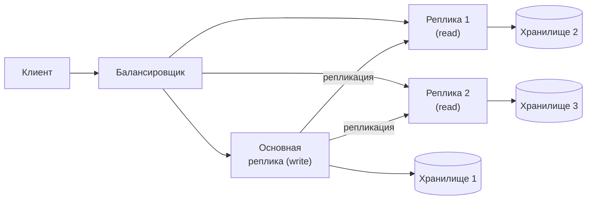

- Запись только через основную реплику — порядок обновления важен
- Масштабирование требует репликации данных, а не только добавления процессов

<!--
Stateful-сервис хранит данные, которые должны пережить перезапуск. Это усложняет всё: масштабирование — нельзя просто добавить реплику, нужно реплицировать данные. Обновление — нельзя одновременно заменить все экземпляры, порядок замены важен для сохранения кворума. Отказ — при падении реплики нужно убедиться, что данные не потеряны, а клиент перенаправлен на живую реплику. В Kubernetes stateful-сервисы управляются StatefulSet: каждый Pod получает стабильное имя и выделенный том. Redis и PostgreSQL в voting-app — именно такие сервисы.
-->

---

# Stateless vs Stateful: сравнение

| Свойство | Stateless | Stateful |
| --- | --- | --- |
| Масштабирование | Добавить реплику | Реплицировать данные |
| Обновление | Замена в любом порядке | Порядок важен (кворум) |
| Восстановление | Замена реплики | Failover + проверка данных |
| В Kubernetes | Deployment | StatefulSet |
| Пример | vote, worker, result | Redis, PostgreSQL |

Цель архитектора — вынести состояние в выделенные stateful-сервисы и сделать максимум остальных компонентов stateless.

<!--
Таблица фиксирует ключевые различия. Обратите внимание на строку «В Kubernetes»: для stateless используется Deployment, для stateful — StatefulSet. Это не просто разные ресурсы — это разная семантика управления. Deployment считает, что все реплики взаимозаменяемы. StatefulSet присваивает каждой реплике стабильный порядковый номер и гарантирует, что реплика 0 перезапускается первой. Это необходимо для корректной работы кластерных баз данных, где существуют понятия «primary» и «replica». Архитектурная цель — минимизировать количество stateful-компонентов и изолировать их.
-->

---
layout: section
---

04

# Классы хранилищ и CAP-теорема

Блочное, файловое, объектное: что выбрать под задачу

<!--
Четвёртый блок — классификация хранилищ и фундаментальный компромисс распределённых систем. Не всякое хранилище подходит для любой задачи: базе данных нужен один тип доступа, общему файловому хранилищу — другой, медиа-контенту — третий. Кроме того, нужно понимать, какие гарантии согласованности данные хранилища вообще могут дать в условиях распределённой системы.
-->

---

# Три класса хранилищ

<strong>Блочное (Block)</strong> 
iSCSI, SAN, AWS EBS  
Подключается к одному узлу. Управляется файловой системой ОС.  
<em>Применение: базы данных, файловые системы</em>

<strong>Файловое (File / NFS)</strong> 
NFS, CIFS, AWS EFS  
Общий доступ нескольким узлам одновременно (ReadWriteMany).  
<em>Применение: общие папки, CMS, CI-кэш</em>

<strong>Объектное (Object)</strong> 
S3, GCS, MinIO  
Хранит неизменяемые объекты по ключу. Доступ через HTTP API.  
<em>Применение: медиа, бэкапы, артефакты</em>

<!--
Три класса хранилищ решают разные задачи. Блочное хранилище — это виртуальный диск: подключается к одному узлу и управляется файловой системой этого узла. Идеально для баз данных, которым нужна низкая задержка и полный контроль над структурой данных. Файловое хранилище — общий сетевой ресурс: несколько контейнеров или узлов монтируют одну папку одновременно. Подходит для приложений с режимом ReadWriteMany. Объектное хранилище — хранит неизменяемые объекты по ключу через HTTP API: нет понятия «файловая система», но есть масштабируемость до петабайт и дешёвое хранение.
-->

---

# Модели доступа: критерии выбора класса

| Критерий | Блочное | Файловое | Объектное |
| --- | --- | --- | --- |
| Задержка | &lt;1 мс | 1–10 мс | 10–100 мс |
| Параллельная запись | Один узел | Несколько узлов | Неизменяемые объекты |
| Стоимость (1 ТБ/мес) | Высокая | Средняя | Низкая |
| Пример применения | PostgreSQL, etcd | CMS, CI-кэш | Медиа, артефакты |

Выбор класса хранилища определяется моделью доступа приложения, а не объёмом данных.

<!--
Таблица помогает выбрать класс хранилища под задачу. Смотрим сначала на модель доступа: нужна ли одновременная запись из нескольких мест? Если да — только файловое или объектное; блочное не поддерживает параллельную запись с нескольких узлов. Затем смотрим на требования к задержке: PostgreSQL требует миллисекунды, хранилище медиа — может подождать сотни миллисекунд. Наконец, стоимость: объектное хранение дешевле блочного в 10–50 раз. Распространённая ошибка — хранить терабайты медиа в дорогом блочном томе там, где достаточно объектного хранилища.
-->

---

# CAP-теорема: компромисс распределённых хранилищ

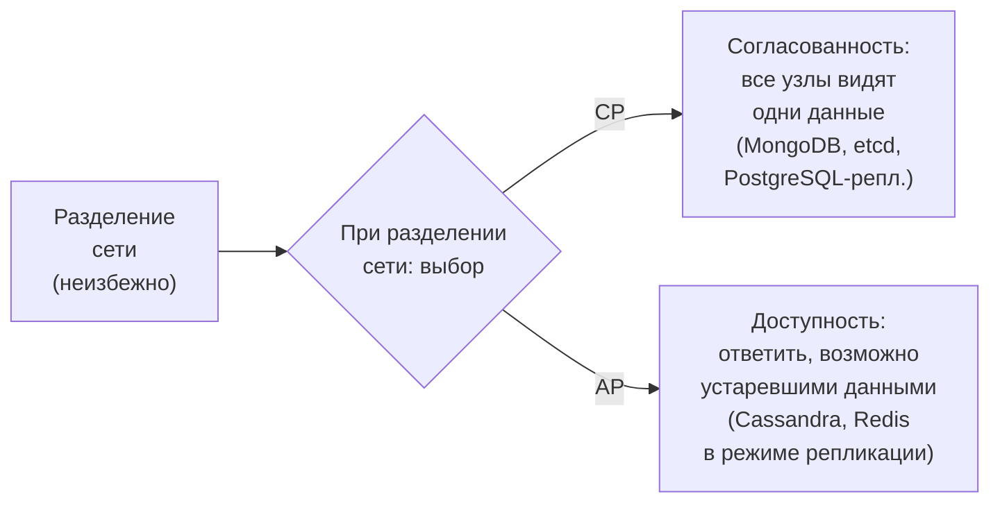

<!--
CAP-теорема формулирует фундаментальный компромисс. В распределённой системе нельзя одновременно гарантировать согласованность, доступность и устойчивость к разделению сети. Поскольку разделение сети в реальных облачных системах неизбежно, вопрос в том, что мы жертвуем при его возникновении. CP-системы — например, etcd или реплицируемый PostgreSQL — при разделении откажут обслуживать запрос, но данные будут согласованными. AP-системы — например, Cassandra или Redis с репликацией — продолжат отвечать, но могут вернуть устаревшие данные. Аналитик должен знать, какую гарантию обещает выбранное хранилище, чтобы не строить ложных ожиданий.
-->

---
layout: section
---

05

# Надёжность данных

RPO, RTO, стратегии резервирования и data gravity

<!--
Пятый блок — надёжность. Даже если мы правильно выбрали хранилище и вынесли данные в том, этого недостаточно. Нужно обеспечить восстановление после отказа. Здесь два ключевых понятия: сколько данных мы можем потерять и за какое время должны восстановиться. Плюс концепция data gravity, которая определяет, где вообще может жить наша система.
-->

---

# RPO и RTO: два параметра стратегии бэкапа

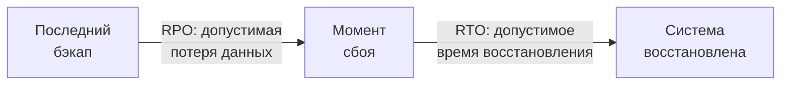

| Параметр | Определение | Пример требования |
| --- | --- | --- |
| **RPO** | Сколько данных можно потерять | Не более 1 часа транзакций |
| **RTO** | За сколько восстановить работу | Не более 4 часов |

<!--
RPO и RTO — два параметра, которые задают требования к системе резервного копирования. RPO — Recovery Point Objective — допустимый объём потерянных данных, измеренный во времени. Если RPO равен одному часу, то бэкап должен делаться не реже чем раз в час. RTO — Recovery Time Objective — допустимое время восстановления после аварии. Эти параметры задаёт бизнес, а инженер-инфраструктурщик проектирует систему резервирования под них. Чем строже RPO и RTO — тем дороже решение. Ключевая ошибка: не иметь этих параметров вообще — тогда бэкап делается «когда-нибудь» и никогда не проверяется.
-->

---

# Стратегии резервного копирования

<strong>Полный бэкап</strong> 
Копия всех данных. Простота восстановления, высокий объём и время выполнения

<strong>Инкрементальный бэкап</strong> 
Только изменения с прошлого бэкапа. Меньший объём, сложнее восстановление

<strong>Снапшот тома</strong> 
Мгновенная копия состояния блочного тома. Быстро, но требует поддержки хранилища

<strong>Проверка восстановления</strong> 
Бэкап без тестового восстановления — не бэкап. Регулярный drill обязателен

<!--
Три основные стратегии. Полный бэкап — просто и надёжно в восстановлении, но требует много места и времени: для базы в несколько терабайт может занять часы. Инкрементальный бэкап экономит место, но восстановление требует применить цепочку инкрементов — это медленнее и сложнее. Снапшот — мгновенная копия состояния тома на уровне хранилища: быстро делается и восстанавливается, но не переносимо между типами хранилищ. Самый важный пункт, который часто игнорируют: в «Руководстве по DevOps» это называется disaster recovery drill — плановая проверка способности восстановиться до того, как произошла авария.
-->

---

# Data gravity: почему данные притягивают вычисления

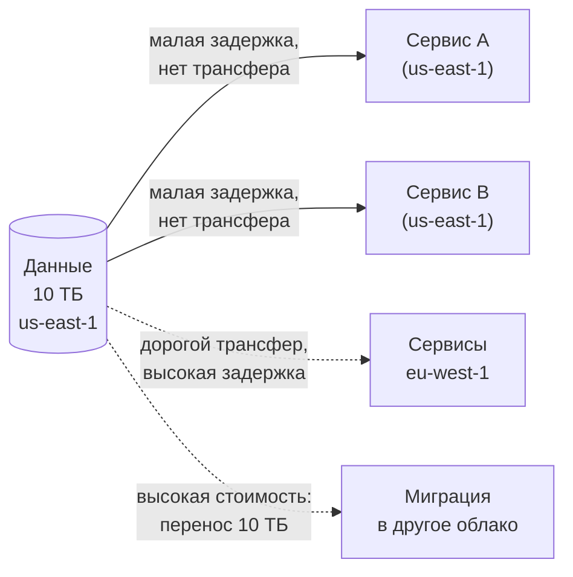

<!--
Data gravity — концепция из облачных вычислений: данные обладают «гравитацией», которая притягивает вычисления. Чем больше объём данных в конкретном регионе или облаке, тем сильнее экономические и технические стимулы держать сервисы рядом. Трансфер данных между регионами облачного провайдера стоит денег — как правило, несколько центов за гигабайт на исходящий трафик. Перенос десяти терабайт обойдётся в сотни долларов, а время такого переноса — в часы или дни. Это создаёт стратегическую зависимость и ограничивает переносимость системы. Аналитик должен учитывать data gravity уже на этапе проектирования архитектуры.
-->

---
layout: section
---

06

# Критерии выбора, режимы отказа, свидетельства

Как принять обоснованное решение и как его проверить

<!--
Финальный блок — аналитическая работа. Мы изучили инструменты: тома, классы хранилищ, стратегии бэкапа. Теперь главный вопрос: как принять решение о хранении в конкретном проекте? Разберём таблицу решений, каталогизируем режимы отказа и договоримся, как проверить принятые решения руками.
-->

---

# Критерии: управляемый сервис vs самостоятельное хранение

| Критерий | Управляемый сервис | Самостоятельное хранение |
| --- | --- | --- |
| Репликация и бэкапы | Предоставляет провайдер | Реализуем сами |
| Операционная нагрузка | Низкая | Высокая |
| Стоимость | Выше (платим за сервис) | Ниже (только ресурсы) |
| Контроль конфигурации | Ограничен | Полный |
| Привязка к провайдеру | Высокая | Низкая |
| Подходит для | Стартапов, MVP, малых команд | Зрелых команд, особых требований |

<!--
Это классическая таблица решений курса. Управляемый сервис — например, Amazon RDS, Google Cloud SQL или managed Redis — снимает с команды заботу о репликации, бэкапах, мониторинге и обновлениях. Это стоит денег, но позволяет небольшой команде без выделенного администратора баз данных эксплуатировать продакшен. Самостоятельное хранение — разворачиваем PostgreSQL или Redis сами, в контейнерах — даёт полный контроль, но требует компетенций и операционных ресурсов. Рекомендуемая практика: начинать с управляемого сервиса и переходить к самостоятельному только при явном обосновании.
-->

---

# Режимы отказа

<strong>Потеря тома</strong> 
Том удалён или диск хоста вышел из строя. Данные потеряны без бэкапа. Частая причина: <code>docker-compose down -v</code>

<strong>Повреждение данных</strong> 
Некорректная запись при сбое питания или баге приложения. Бэкап из повреждённых данных бесполезен

<strong>Расхождение реплик</strong> 
Split-brain: обе реплики считают себя primary и принимают противоречивые записи

<strong>Невосстановимый бэкап</strong> 
Бэкап есть, но не проверялся. Restore завершается ошибкой в момент аварии

<!--
Каталогизируем режимы отказа. Первый и самый частый: случайное удаление тома. Команда docker-compose down с флагом -v удаляет все тома — эта опция уничтожала продакшен-данные не раз. Второй: повреждение данных — оно коварно тем, что проявляется не сразу, и к моменту обнаружения все бэкапы уже могут содержать повреждённые данные. Третий: split-brain при репликации, когда обе реплики считают себя primary и принимают противоречивые записи. Четвёртый режим отказа — самый болезненный: бэкап, который не восстанавливается, обнаруживается в самый неподходящий момент.
-->

---
layout: two-cols
---

# Свидетельства: инвентаризация и проверка

**Инвентаризация томов**

- `docker volume ls` — список всех томов на хосте
- `docker volume inspect <name>` — путь, драйвер, точка монтирования
- `docker inspect <container>` — раздел Mounts: источник, назначение, режим

::right::

**Проверка персистентности**

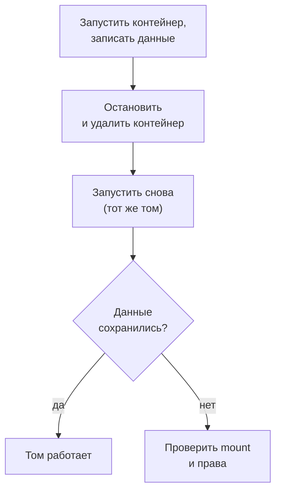

<!--
Как проверить, что решение работает. Первый шаг — инвентаризация: docker volume ls покажет все тома на хосте, docker volume inspect — детали конкретного тома: где физически хранятся данные, какой драйвер используется. Команда docker inspect для контейнера покажет раздел Mounts — это подтвердит, что контейнер действительно использует том, а не слой CoW. Второй шаг — проверка персистентности: создаём контейнер, записываем данные, удаляем контейнер, создаём снова и проверяем, что данные сохранились. Это ключевое упражнение лабораторной работы.
-->

---

# Аудит бэкапов: чек-лист

<strong>Регулярность</strong> 
Бэкап делается автоматически по расписанию, не вручную

<strong>Изоляция хранения</strong> 
Бэкап хранится отдельно от основных данных — другой регион или другое хранилище

<strong>Проверка восстановления</strong> 
Последнее тестовое восстановление выполнено не более N недель назад

<strong>Соответствие RPO</strong> 
Интервал бэкапа не превышает заявленный RPO — зафиксировать и проверить

<!--
Аудит бэкапов — это регулярная проверка по чек-листу, а не разовое действие. Четыре пункта. Первый: бэкап должен быть автоматическим — ручные бэкапы не делаются тогда, когда нужно. Второй: хранить бэкап рядом с данными бессмысленно — при отказе диска теряется и то и другое; нужен другой физический объект или другой регион. Третий: без регулярного тестового восстановления неизвестно, работает ли бэкап на самом деле. Четвёртый: интервал между бэкапами должен соответствовать заявленному RPO — это нужно явно зафиксировать и убедиться, что инфраструктура обеспечивает это требование.
-->

---

# Мост к лабораторной работе

<strong>Лабораторная работа 1 — модуль по томам</strong>

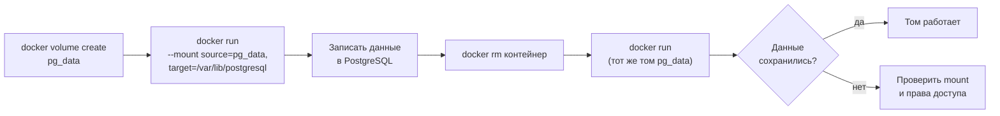

<!--
В лабораторной работе мы воспроизводим именно этот сценарий. Создаём именованный том pg_data, запускаем контейнер с PostgreSQL, монтируя том, записываем данные, удаляем контейнер и создаём новый — с тем же томом. Если данные сохранились — том сконфигурирован правильно. Если нет — нужно проверить: подключён ли том вообще, правильный ли путь монтирования, не возникли ли ошибки прав доступа. Эта проверка, от команды до данных, — ключевой навык, который потребуется при работе с оркестрацией Kubernetes в лабораторной работе 2.
-->

---
layout: center
---

# Итоги

- **Контейнер эфемерен:** слой CoW исчезает вместе с контейнером — данные внутри не персистентны
- **Тома** выносят состояние за пределы контейнера; named volume — основной инструмент продакшена
- **Stateless** масштабируется добавлением реплик; **stateful** требует репликации данных и управления порядком
- **Класс хранилища** выбирается по модели доступа: блочное → базы данных, файловое → общий доступ, объектное → медиа и артефакты
- **RPO и RTO** задают требования к бэкапу; бэкап без проверки восстановления — не бэкап
- Где живёт состояние — там сосредоточен операционный риск системы

**Дальше:** Лекция 6 — «Сети распределённых приложений»: как сервисы находят и вызывают друг друга при динамически меняющихся адресах.

Опорная литература: С. Гош «Docker без секретов». БХВ Петербург, 2023.

<!--
Подведём итоги лекции. Главный вывод: контейнер эфемерен по природе, и это не проблема, которую надо «починить» — это архитектурное свойство, под которое нужно проектировать систему. Тома решают задачу персистентности. Разделение на stateless и stateful определяет стратегию масштабирования. Класс хранилища определяется моделью доступа. RPO и RTO переводят требования бизнеса в технические параметры резервирования. Data gravity ограничивает переносимость. Следующая лекция переходит к вопросу, как сервисы взаимодействуют друг с другом в распределённой системе.
-->
