
Лекция 5

# Данные и состояние в контейнеризованных системах

Где живёт состояние, там сосредоточен риск

<!--
Контейнер умирает — его слой записи исчезает. Это не баг, а фундаментальное свойство модели. Большинство инцидентов с потерей данных в контейнерных средах — из-за того, что данные хранились там, где не должны. Проблему решают тома. Выбор типа тома — архитектурное решение с последствиями для масштабирования и восстановления.
-->

---

# Маршрут лекции

<strong>01 Слой записи контейнера</strong> 
Copy-on-write и антипаттерн хранения

<strong>02 Тома Docker</strong> 
Типы, жизненный цикл, права доступа

<strong>03 Stateless и Stateful</strong> 
Два способа масштабироваться

<strong>04 Классы хранилищ</strong> 
Блочное, файловое, объектное, CAP

<strong>05 Надёжность данных</strong> 
RPO, RTO, бэкапы, data gravity

<strong>06 Критерии и риски</strong> 
Decision-таблица, отказы, свидетельства

<!--
Stateless сервис масштабируется горизонтально легко. Stateful — требует явного решения: где данные живут и как переживают рестарт, обновление, отказ. Volume (Docker), PersistentVolume (Kubernetes), S3 — три разных модели с разными гарантиями.
-->

---

# Проблема: данные не переживают контейнер

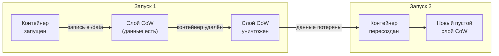

Данные в файловой системе контейнера исчезают при каждом <code>docker rm</code> или обновлении образа.

<!--
Docker запускает контейнер с тонким слоем записи поверх слоёв образа (overlay2 upperdir). Файлы базы данных, загруженный контент, логи — всё пишется туда. Контейнер удалён — upperdir исчезает. Образ не изменился, данные потеряны. Следующий запуск стартует с чистого образа. Это не баг: контейнер намеренно проектировался как эфемерный вычислительный юнит.
-->

---

# Voting-app: где живёт состояние

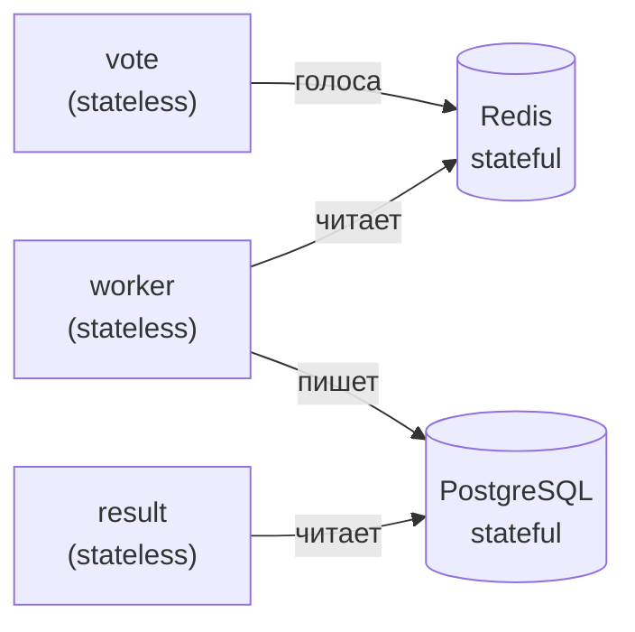

- **vote, worker, result** — не хранят состояния, масштабируются свободно
- **Redis, PostgreSQL** — хранят состояние; их данные нужно явно переживать перезапуски
- Именно Redis и PostgreSQL требуют внешнего хранилища — и определяют надёжность всей системы

<!--
В voting-app три сервиса — vote, worker, result — stateless: получают запрос, обрабатывают, ничего не хранят между вызовами. Redis и PostgreSQL — stateful: Redis держит текущие голоса в памяти, PostgreSQL — итоговые результаты на диске. Состояние концентрируется в этих двух компонентах; они же определяют надёжность всей системы — если Redis упадёт без внешнего тома, голоса потеряются.
-->

---
layout: section
---

01

# Слой записи контейнера

Copy-on-write: почему запись «внутрь» — антипаттерн

<!--
overlay2 upperdir — слой записи контейнера. При удалении контейнера upperdir уничтожается. При `docker run` из того же образа — новый пустой upperdir. Масштабирование на два контейнера — два изолированных upperdir без общего состояния. Данные в upperdir обречены на потерю при любом перезапуске.
-->

---

# Архитектура copy-on-write

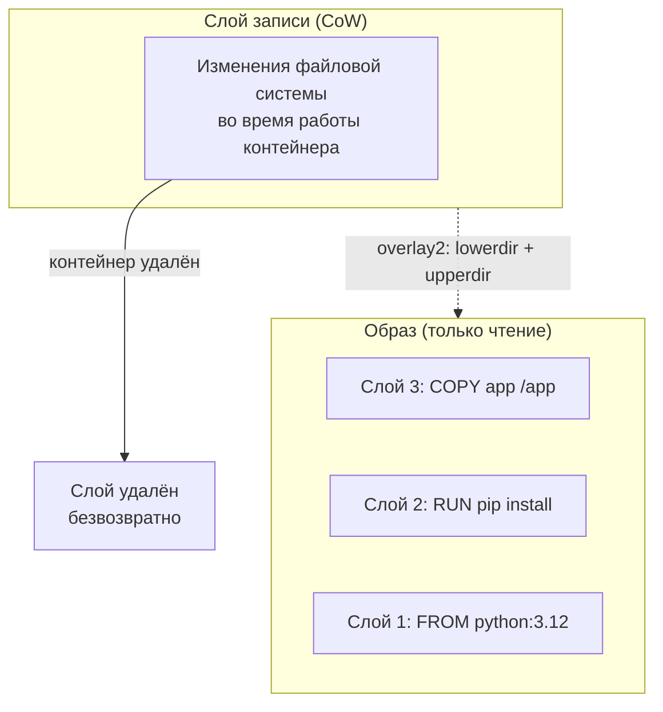

- Все слои образа — **только для чтения**, совместно используются контейнерами
- Слой записи — **уникален** для каждого контейнера и живёт ровно столько, сколько контейнер

<!--
Overlay2 (лекция 4): образ — стек неизменяемых слоёв (lowerdir), каждая инструкция Dockerfile создала один. При запуске поверх монтируется upperdir — слой записи. Приложение видит merged. Все записи уходят в upperdir. Удалили контейнер — Docker удалил его upperdir. Образ цел, данные утеряны. Решение одно: вынести данные за пределы upperdir в Docker Volume или bind mount.
-->

---

# Антипаттерн: данные внутри контейнера

<strong>Потеря при обновлении образа</strong> 
Деплой новой версии = пересоздание контейнера = исчезновение данных из слоя CoW

<strong>Нет разделения между репликами</strong> 
Каждая реплика имеет свой изолированный слой — реплики не видят данные друг друга

<strong>Нет управляемого бэкапа</strong> 
Слой CoW не вписан в механизм резервного копирования

<strong>Допустимые исключения</strong> 
Кэш, временные файлы, сессионные данные — если потеря при перезапуске приемлема

<!--
Антипаттерн — хранить в слое CoW всё, что должно пережить контейнер. Три главных последствия. Первое: при деплое новой версии образа контейнер пересоздаётся и данные исчезают. Второе: при масштабировании каждая реплика имеет свой изолированный слой записи — запросы от одного пользователя, попавшие на разные реплики, увидят разные данные. Третье: слой CoW не является объектом управляемого резервного копирования. Единственное исключение: данные, потеря которых при перезапуске заложена в дизайн системы — кэш, временные файлы.
-->

---
layout: section
---

02

# Тома Docker

Volumes, bind mounts и tmpfs: три способа вынести данные за пределы контейнера

<!--
Три механизма Docker для хранения вне слоя записи. Volume: управляется Docker, хранится в /var/lib/docker/volumes, переживает удаление контейнера. Bind mount: путь на хосте монтируется в контейнер, удобно для разработки. tmpfs: RAM, только для секретов или кэша — не переживает рестарт вообще.
-->

---

# Три способа хранения данных

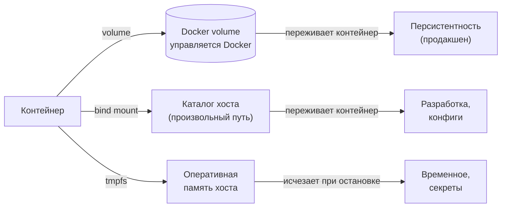

<!--
Docker предоставляет три механизма. Volume — управляемый Docker именованный том: Docker сам выбирает путь на хосте, создаёт том и удаляет только по явной команде. Данные переживают контейнер — это основной инструмент продакшена. Bind mount — монтирование произвольного каталога хоста внутрь контейнера: удобен в разработке, когда нужно видеть изменения кода без пересборки образа. Tmpfs — монтирование раздела оперативной памяти: данные не попадают на диск и исчезают при остановке контейнера. Подходит для секретов и временных данных, которые нельзя писать на диск.
-->

---

# Жизненный цикл тома

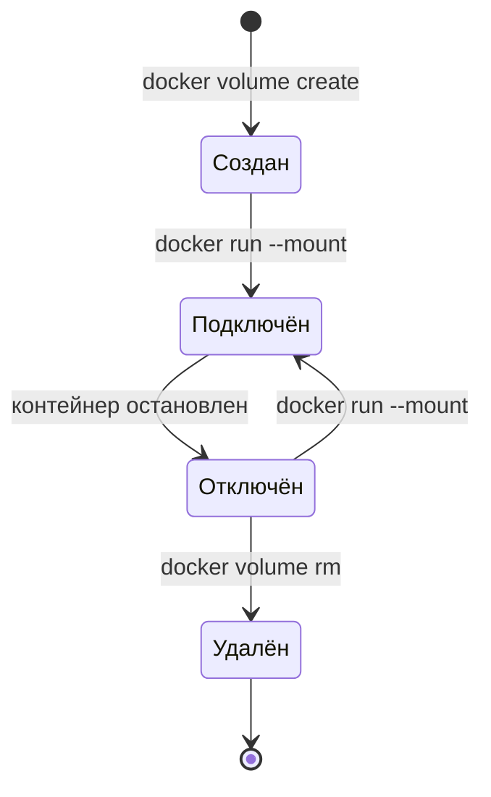

Том переживает любое количество перезапусков контейнера. Данные удаляются только явной командой.

<!--
Volume создаётся через `docker volume create` или автоматически при первом `--mount`. Docker управляет путём на хосте (обычно `/var/lib/docker/volumes/`). Несколько контейнеров монтируют один том — один пишет, другой читает. Удалить том можно только `docker volume rm` — случайная потеря данных при `docker rm` исключена. Том переживает любое число рестартов контейнера.
-->

---

# Права доступа и владение данными

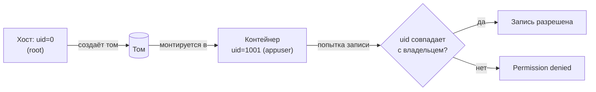

**Типичная причина ошибок:** том создан от root, контейнер работает под непривилегированным пользователем

**Решение:** `chown` в Dockerfile или явный `--user` при запуске

<!--
Права доступа к томам — частый источник ошибок в продакшене. По умолчанию Docker создаёт том с правами root. Если контейнер запускается под непривилегированным пользователем — а это рекомендуемая практика безопасности — процесс не сможет писать в точку монтирования. Типичная картина в логах: Permission denied при попытке записи в /data или /var/lib/postgresql. Решение — явно задать владельца в Dockerfile командой chown, или инициализировать права в entrypoint-скрипте. При использовании bind mount права контролируются на уровне хоста.
-->

---

# Драйверы томов: расширение хранилища

| Драйвер | Что даёт | Пример применения |
| --- | --- | --- |
| `local` | Диск хоста (по умолчанию) | Разработка, одиночный хост |
| `nfs` | Сетевая файловая система | Общий доступ между хостами |
| `s3fs` / `goofys` | Объектное хранилище S3 | Медиа, архивы |
| `rexray` / `longhorn` | Блочное хранилище кластера | БД в Swarm / K8s |

В Kubernetes роль драйверов томов выполняет CSI (Container Storage Interface) — единый стандарт подключения хранилищ к кластеру. Это важный мост к лекции об оркестрации.

<!--
Механизм драйверов позволяет подключить к контейнеру практически любое хранилище. Встроенный драйвер local хранит данные на диске хоста — подходит для разработки и одиночного сервера. Для кластерных сценариев нужны сетевые драйверы: nfs монтирует сетевую папку, s3fs подключает объектное хранилище AWS S3 как файловую систему, rexray и longhorn работают с блочными томами в кластерных средах. В Kubernetes эта абстракция стандартизована интерфейсом CSI — Container Storage Interface: любое хранилище, реализующее CSI-плагин, доступно из кластера одинаковым образом.
-->

---
layout: section
---

03

# Stateless и Stateful

Два класса сервисов — два способа масштабироваться и эксплуатироваться

<!--
Stateless сервис: горизонтальное масштабирование через `kubectl scale`, любой Pod заменяем. StatefulSet для stateful: стабильные имена (pod-0, pod-1), стабильный сетевой идентификатор, порядок обновления (n-1 перед n). PostgreSQL, Redis, Kafka требуют StatefulSet.
-->

---

# Stateless: горизонтальное масштабирование

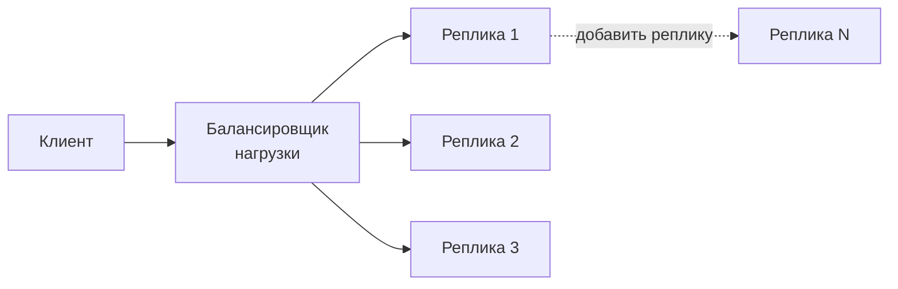

- Любая реплика обрабатывает любой запрос — нет «памяти» между запросами
- Масштабирование = добавление реплик без изменения логики
- Обновление = замена реплик по одной без простоя

<!--
Stateless-сервис не хранит состояния между запросами — каждый запрос самодостаточен, любая реплика обрабатывает его одинаково. Масштабирование: добавь реплику, балансировщик распределит нагрузку. Обновление: заменяй реплики по одной. В voting-app vote, worker и result — stateless, поэтому в Kubernetes они представлены Deployment. Deployment считает все реплики взаимозаменяемыми и не даёт им стабильных имён — это и есть смысл stateless-контракта.
-->

---

# Stateful: привязка к хранилищу

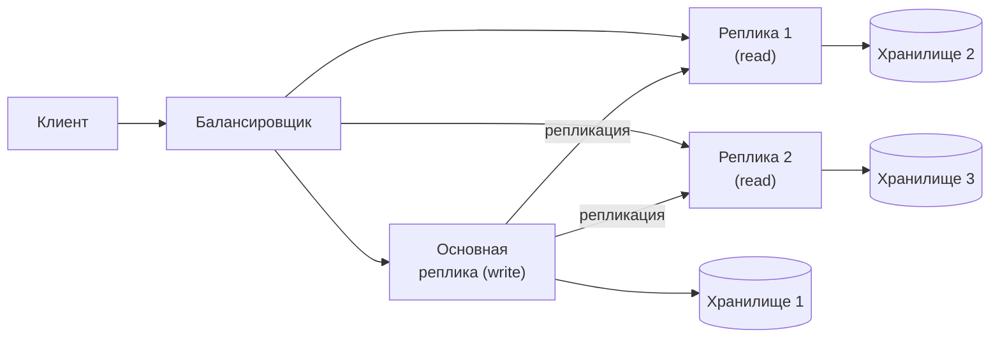

- Запись только через основную реплику — порядок обновления важен
- Масштабирование требует репликации данных, а не только добавления процессов

<!--
Stateful-сервис хранит данные, которые должны пережить перезапуск. Это усложняет всё: масштабирование — нельзя просто добавить реплику, нужно реплицировать данные. Обновление — нельзя одновременно заменить все экземпляры, порядок замены важен для сохранения кворума. Отказ — при падении реплики нужно убедиться, что данные не потеряны, а клиент перенаправлен на живую реплику. В Kubernetes stateful-сервисы управляются StatefulSet: каждый Pod получает стабильное имя и выделенный том. Redis и PostgreSQL в voting-app — именно такие сервисы.
-->

---

# Stateless vs Stateful: сравнение

| Свойство | Stateless | Stateful |
| --- | --- | --- |
| Масштабирование | Добавить реплику | Реплицировать данные |
| Обновление | Замена в любом порядке | Порядок важен (кворум) |
| Восстановление | Замена реплики | Failover + проверка данных |
| В Kubernetes | Deployment | StatefulSet |
| Пример | vote, worker, result | Redis, PostgreSQL |

Цель архитектора — вынести состояние в выделенные stateful-сервисы и сделать максимум остальных компонентов stateless.

<!--
Строка «В Kubernetes» — разница в семантике, не только в названии ресурса. Deployment считает все реплики взаимозаменяемыми и пересоздаёт их в произвольном порядке. StatefulSet присваивает каждой реплике стабильный порядковый номер (postgres-0, postgres-1) и гарантирует, что при обновлении реплика 0 стартует раньше реплики 1 — это необходимо для корректного выбора primary в кластере. Архитектурная цель — минимизировать количество stateful-компонентов.
-->

---
layout: section
---

04

# Классы хранилищ и CAP-теорема

Блочное, файловое, объектное: что выбрать под задачу

<!--
Block storage (EBS, PVC с ReadWriteOnce): один узел, низкая задержка, для баз данных. File storage (EFS, NFS, ReadWriteMany): несколько узлов одновременно, медленнее. Object storage (S3): HTTP API, масштабируется бесконечно, eventual consistency, для медиа и бэкапов. CAP: выбор типа хранилища определяет гарантии при сетевом разделении.
-->

---

# Три класса хранилищ

<strong>Блочное (Block)</strong> 
iSCSI, SAN, AWS EBS  
Подключается к одному узлу. Управляется файловой системой ОС.  
<em>Применение: базы данных, файловые системы</em>

<strong>Файловое (File / NFS)</strong> 
NFS, CIFS, AWS EFS  
Общий доступ нескольким узлам одновременно (ReadWriteMany).  
<em>Применение: общие папки, CMS, CI-кэш</em>

<strong>Объектное (Object)</strong> 
S3, GCS, MinIO  
Хранит неизменяемые объекты по ключу. Доступ через HTTP API.  
<em>Применение: медиа, бэкапы, артефакты</em>

<!--
Три класса хранилищ решают разные задачи. Блочное хранилище — это виртуальный диск: подключается к одному узлу и управляется файловой системой этого узла. Идеально для баз данных, которым нужна низкая задержка и полный контроль над структурой данных. Файловое хранилище — общий сетевой ресурс: несколько контейнеров или узлов монтируют одну папку одновременно. Подходит для приложений с режимом ReadWriteMany. Объектное хранилище — хранит неизменяемые объекты по ключу через HTTP API: нет понятия «файловая система», но есть масштабируемость до петабайт и дешёвое хранение.
-->

---

# Модели доступа: критерии выбора класса

| Критерий | Блочное | Файловое | Объектное |
| --- | --- | --- | --- |
| Задержка | &lt;1 мс | 1–10 мс | 10–100 мс |
| Параллельная запись | Один узел | Несколько узлов | Неизменяемые объекты |
| Стоимость (1 ТБ/мес) | Высокая | Средняя | Низкая |
| Пример применения | PostgreSQL, etcd | CMS, CI-кэш | Медиа, артефакты |

Выбор класса хранилища определяется моделью доступа приложения, а не объёмом данных.

<!--
Первый фильтр — модель доступа: нужна ли конкурентная запись из нескольких узлов? Блочное хранилище (EBS, iSCSI) не поддерживает multi-writer; файловое (NFS, EFS) и объектное (S3) поддерживают. Второй — задержка: PostgreSQL требует <10 мс, S3 объект возвращается за 50–200 мс. Третий — стоимость: AWS EBS ~$0.10/ГБ·мес, S3 ~$0.023/ГБ·мес, разница в 4–5 раз. Частая ошибка: хранить статику и артефакты в EBS.
-->

---

# CAP-теорема: что происходит при разделении сети

| Система | Тип | При потере кворума | Почему |
|---|---|---|---|
| **etcd** | CP | Отклоняет запись, возвращает ошибку | Raft требует кворума; Kubernetes не запишет объект |
| **PostgreSQL** (streaming repl.) | CP | Только primary принимает запись | Standby не может стать primary без внешнего арбитра |
| **Cassandra** | AP | Принимает запись на доступные узлы | Eventual consistency: «починим» при восстановлении |
| **Redis Sentinel** | CP | Фейловер занимает 10–30 сек, запись блокируется | Sentinel ждёт кворума перед продвижением реплики |
| **Redis Cluster** | CP по части | Слоты без мастера недоступны | Каждый шард независим; остальные шарды работают |

<!--
CAP говорит: при разделении сети (P неизбежно) система жертвует либо согласованностью (C), либо доступностью (A). etcd — хрестоматийный CP: потерял кворум Raft, перестал принимать записи, Kubernetes не может обновить state. Cassandra — AP: при потере узла оставшиеся принимают запись с кворумом записи W=1; при восстановлении узла данные синхронизируются по антиэнтропии. Выбор между CP и AP — это бизнес-решение: банковский баланс нельзя читать устаревшим, корзина покупок — можно. Аналитик должен знать гарантии хранилища перед тем, как строить на нём архитектуру.
-->

---

# Как проектируют распределённое хранилище: GFS

Google File System (2003) — первая публичная система в этом классе:

| Решение | Зачем |
|---|---|
| Чанк **64 МБ** | Метаданные мастера для 1000 чанков — ~100 байт; всё в памяти |
| Мастер хранит только метаданные | Данные идут напрямую к чанксерверам; мастер не в data path |
| **3 реплики** по умолчанию | Переносит 2 одновременных отказа |
| Atomic append, не перезапись | Конкурентные клиенты дописывают в конец; семантика at-least-once |
| Мастер **не персистирует** расположение чанков | Спрашивает чанксерверы при старте — всегда актуально |

<!--
GFS проектировался под конкретную задачу Google: терабайтные файлы, много параллельных читателей, редкие произвольные записи. Чанк 64 МБ — у мастера умещается пространство имён и маппинг файл → чанки в ОЗУ. Расположение реплик мастер не записывает на диск: чанксерверы при старте сами сообщают "у меня чанк X". Нет рассинхрона между записью мастера и фактом. Atomic append имеет семантику at-least-once: при падении реплики операция повторяется и часть реплик может получить дубликат. Bigtable, построенный поверх GFS, сам дедуплицировал. Мастер был единственной точкой отказа — Google намеренно принял этот компромисс ради простоты: переключение занимало минуты, для батчевых задач это приемлемо.
-->

---
layout: section
---

05

# Надёжность данных

RPO, RTO, стратегии резервирования и data gravity

<!--
RPO (Recovery Point Objective) — сколько данных теряем. RTO (Recovery Time Objective) — за сколько восстанавливаемся. Бэкап раз в сутки → RPO = 24 часа. Streaming replication → RPO = секунды. Data gravity: переместить 10 ТБ данных из региона дороже и медленнее, чем переместить вычисления туда, где данные.
-->

---

# RPO и RTO: два параметра стратегии бэкапа

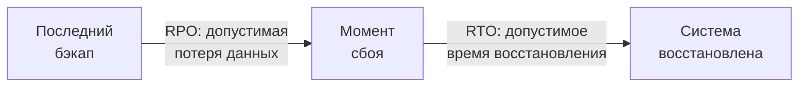

| Параметр | Определение | Пример требования |
| --- | --- | --- |
| **RPO** | Сколько данных можно потерять | Не более 1 часа транзакций |
| **RTO** | За сколько восстановить работу | Не более 4 часов |

<!--
RPO — Recovery Point Objective — допустимый объём потерянных данных, измеренный во времени. RPO = 1 час означает, что бэкап должен делаться не реже раза в час. RTO — Recovery Time Objective — максимально допустимое время восстановления после аварии. Эти параметры задаёт бизнес; инженер проектирует резервирование под них. Чем строже RPO и RTO — тем дороже решение. Отсутствие этих параметров — не нейтральное состояние: бэкап делается «когда-нибудь», тестовое восстановление не проводится, и об этом узнают только в момент аварии.
-->

---

# Стратегии резервного копирования

<strong>Полный бэкап</strong> 
Копия всех данных. Простота восстановления, высокий объём и время выполнения

<strong>Инкрементальный бэкап</strong> 
Только изменения с прошлого бэкапа. Меньший объём, сложнее восстановление

<strong>Снапшот тома</strong> 
Мгновенная копия состояния блочного тома. Быстро, но требует поддержки хранилища

<strong>Проверка восстановления</strong> 
Бэкап без тестового восстановления — не бэкап. Регулярный drill обязателен

<!--
Три основные стратегии. Полный бэкап — просто и надёжно в восстановлении, но требует много места и времени: для базы в несколько терабайт может занять часы. Инкрементальный бэкап экономит место, но восстановление требует применить цепочку инкрементов — это медленнее и сложнее. Снапшот — мгновенная копия состояния тома на уровне хранилища: быстро делается и восстанавливается, но не переносимо между типами хранилищ. Самый важный пункт, который часто игнорируют: в «Руководстве по DevOps» это называется disaster recovery drill — плановая проверка способности восстановиться до того, как произошла авария.
-->

---

# Data gravity: почему данные притягивают вычисления

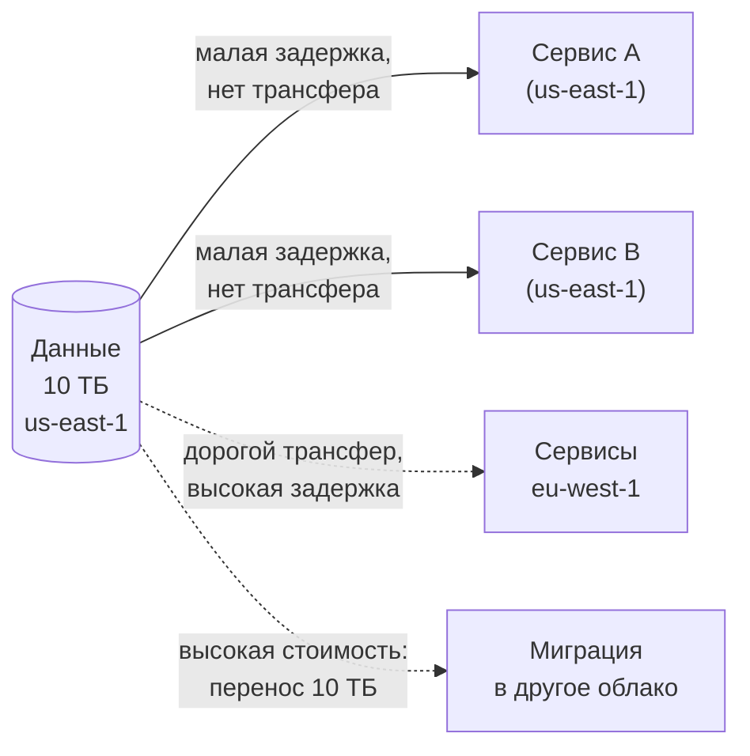

<!--
Data gravity — концепция из облачных вычислений: данные обладают «гравитацией», которая притягивает вычисления. Чем больше объём данных в конкретном регионе или облаке, тем сильнее экономические и технические стимулы держать сервисы рядом. Трансфер данных между регионами облачного провайдера стоит денег — как правило, несколько центов за гигабайт на исходящий трафик. Перенос десяти терабайт обойдётся в сотни долларов, а время такого переноса — в часы или дни. Это создаёт стратегическую зависимость и ограничивает переносимость системы. Аналитик должен учитывать data gravity уже на этапе проектирования архитектуры.
-->

---
layout: section
---

06

# Критерии выбора, режимы отказа, свидетельства

Как принять обоснованное решение и как его проверить

<!--
Критерии выбора хранилища: доступ (один/много узлов), задержка (база vs архив), размер данных, цена ($0.10/GB EBS vs $0.023/GB S3). Режимы отказа: данные в upperdir (потеря при перезапуске), PVC в ReadWriteMany при конкурентной записи (corrupted FS), бэкап без проверки восстановления (не бэкап).
-->

---

# Критерии: управляемый сервис vs самостоятельное хранение

| Критерий | Управляемый сервис | Самостоятельное хранение |
| --- | --- | --- |
| Репликация и бэкапы | Предоставляет провайдер | Реализуем сами |
| Операционная нагрузка | Низкая | Высокая |
| Стоимость | Выше (платим за сервис) | Ниже (только ресурсы) |
| Контроль конфигурации | Ограничен | Полный |
| Привязка к провайдеру | Высокая | Низкая |
| Подходит для | Стартапов, MVP, малых команд | Зрелых команд, особых требований |

<!--
Это классическая таблица решений курса. Управляемый сервис — например, Amazon RDS, Google Cloud SQL или managed Redis — снимает с команды заботу о репликации, бэкапах, мониторинге и обновлениях. Это стоит денег, но позволяет небольшой команде без выделенного администратора баз данных эксплуатировать продакшен. Самостоятельное хранение — разворачиваем PostgreSQL или Redis сами, в контейнерах — даёт полный контроль, но требует компетенций и операционных ресурсов. Рекомендуемая практика: начинать с управляемого сервиса и переходить к самостоятельному только при явном обосновании.
-->

---

# Режимы отказа

<strong>Потеря тома</strong> 
Том удалён или диск хоста вышел из строя. Данные потеряны без бэкапа. Частая причина: <code>docker-compose down -v</code>

<strong>Повреждение данных</strong> 
Некорректная запись при сбое питания или баге приложения. Бэкап из повреждённых данных бесполезен

<strong>Расхождение реплик</strong> 
Split-brain: обе реплики считают себя primary и принимают противоречивые записи

<strong>Невосстановимый бэкап</strong> 
Бэкап есть, но не проверялся. Restore завершается ошибкой в момент аварии

<!--
Каталогизируем режимы отказа. Первый и самый частый: случайное удаление тома. Команда docker-compose down с флагом -v удаляет все тома — эта опция уничтожала продакшен-данные не раз. Второй: повреждение данных — оно коварно тем, что проявляется не сразу, и к моменту обнаружения все бэкапы уже могут содержать повреждённые данные. Третий: split-brain при репликации, когда обе реплики считают себя primary и принимают противоречивые записи. Четвёртый режим отказа — самый болезненный: бэкап, который не восстанавливается, обнаруживается в самый неподходящий момент.
-->

---
layout: two-cols
---

# Свидетельства: инвентаризация и проверка

**Инвентаризация томов**

- `docker volume ls` — список всех томов на хосте
- `docker volume inspect <name>` — путь, драйвер, точка монтирования
- `docker inspect <container>` — раздел Mounts: источник, назначение, режим

::right::

**Проверка персистентности**

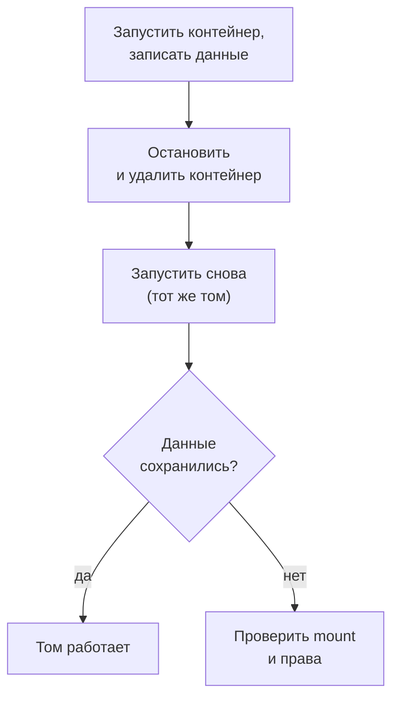

<!--
Как проверить, что решение работает. `docker volume ls` покажет все тома на хосте; `docker volume inspect` — где физически хранятся данные. `docker inspect` для контейнера показывает раздел Mounts: он подтверждает, что контейнер использует том, а не слой CoW. Проверка персистентности: создаём контейнер, записываем данные, удаляем контейнер, создаём снова с тем же томом, читаем данные — это прямое подтверждение, что том работает.
-->

---

# Аудит бэкапов: чек-лист

<strong>Регулярность</strong> 
Бэкап делается автоматически по расписанию, не вручную

<strong>Изоляция хранения</strong> 
Бэкап хранится отдельно от основных данных — другой регион или другое хранилище

<strong>Проверка восстановления</strong> 
Последнее тестовое восстановление выполнено не более N недель назад

<strong>Соответствие RPO</strong> 
Интервал бэкапа не превышает заявленный RPO — зафиксировать и проверить

<!--
Аудит бэкапов — это регулярная проверка по чек-листу, а не разовое действие. Четыре пункта. Первый: бэкап должен быть автоматическим — ручные бэкапы не делаются тогда, когда нужно. Второй: хранить бэкап рядом с данными бессмысленно — при отказе диска теряется и то и другое; нужен другой физический объект или другой регион. Третий: без регулярного тестового восстановления неизвестно, работает ли бэкап на самом деле. Четвёртый: интервал между бэкапами должен соответствовать заявленному RPO — это нужно явно зафиксировать и убедиться, что инфраструктура обеспечивает это требование.
-->

---

# Мост к лабораторной работе

<strong>Лабораторная работа 1 — модуль по томам</strong>

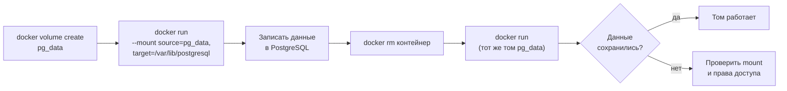

<!--
В лабораторной работе воспроизводим этот сценарий: создаём именованный том pg_data, запускаем PostgreSQL, монтируя том, записываем данные, удаляем контейнер, создаём новый с тем же томом. Если данные сохранились — том работает. Если нет — проверяем: подключён ли том, верен ли путь монтирования, нет ли ошибок прав доступа. Та же механика переносится в Kubernetes в лабораторной работе 2: PersistentVolume вместо именованного тома, но логика проверки идентична.
-->

---
layout: center
---

# Итоги

- **Контейнер эфемерен:** слой CoW исчезает вместе с контейнером — данные внутри не персистентны
- **Тома** выносят состояние за пределы контейнера; named volume — основной инструмент продакшена
- **Stateless** масштабируется добавлением реплик; **stateful** требует репликации данных и управления порядком
- **Класс хранилища** выбирается по модели доступа: блочное → базы данных, файловое → общий доступ, объектное → медиа и артефакты
- **RPO и RTO** задают требования к бэкапу; бэкап без проверки восстановления — не бэкап
- Где живёт состояние — там сосредоточен операционный риск системы

**Дальше:** Лекция 6 — «Сети распределённых приложений»: как сервисы находят и вызывают друг друга при динамически меняющихся адресах.

Опорная литература: С. Гош «Docker без секретов». БХВ Петербург, 2023.

<!--
Подведём итоги лекции. Главный вывод: контейнер эфемерен по природе, и это не проблема, которую надо «починить» — это архитектурное свойство, под которое нужно проектировать систему. Тома решают задачу персистентности. Разделение на stateless и stateful определяет стратегию масштабирования. Класс хранилища определяется моделью доступа. RPO и RTO переводят требования бизнеса в технические параметры резервирования. Data gravity ограничивает переносимость. Следующая лекция переходит к вопросу, как сервисы взаимодействуют друг с другом в распределённой системе.
-->
