<div class="cover-kicker">Лекция 6</div>

# Сети распределённых приложений

Как сервисы находят и вызывают друг друга, когда адреса непостоянны

<!--
В распределённой системе сервисы не знают адреса друг друга заранее: контейнеры пересоздаются, IP меняются. Лекция о том, как контейнеры получают сетевые интерфейсы, как Docker и Kubernetes управляют маршрутизацией и как сетевая логика уходит из кода приложения в инфраструктуру. Сквозной пример — voting-app.
-->

---

# Маршрут лекции

- **01 Примитивы сети Linux** — network namespace, veth-пара, Linux bridge, netfilter
- **02 Docker-сети** — драйверы, публикация портов, трансляция адресов
- **03 Обнаружение сервисов** — DNS, docker-compose как оркестратор одного хоста
- **04 Балансировка нагрузки** — L4 vs L7, стратегии, health-based маршрутизация
- **05 Ingress, Egress, Service mesh** — управляемые границы, sidecar-прокси
- **06 Критерии, отказы, свидетельства** — таблица выбора, режимы отказа, диагностика

<!--
Сетевой стек контейнеров строится снизу вверх: network namespace (изоляция) → veth pair (соединение с хостом) → Linux bridge (коммутация между контейнерами) → iptables/ebpf (маршрутизация и Service VIP) → Ingress/service mesh (L7). Каждый слой понятен, если знаешь предыдущий.
-->

---

# Проблема: адрес сервиса непостоянен

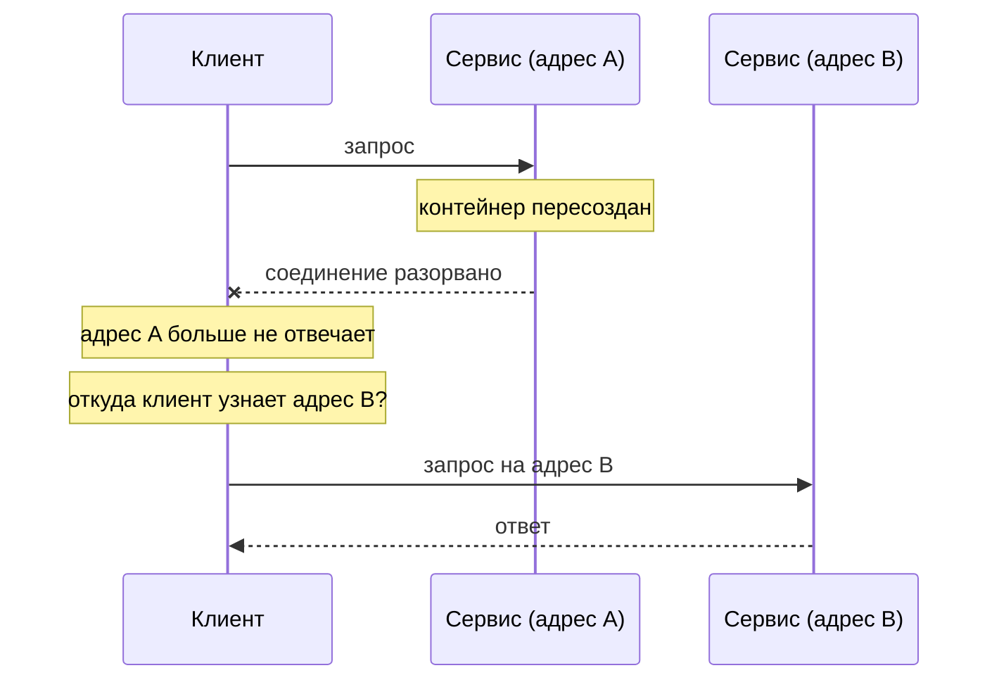

В контейнерной среде IP контейнера меняется при пересоздании. Нужен уровень косвенности между именем и адресом.

<!--
Начнём с боли. В традиционной сети мы настраиваем IP один раз и он не меняется. Контейнер создаётся заново при каждом деплое, рестарте или сбое. Его IP меняется. Если клиент зафиксировал адрес, он потеряет связь. Задача всего этого блока курса — понять, какие механизмы решают эту проблему, начиная с примитивов ядра и заканчивая высокоуровневыми абстракциями.
-->

---
layout: section
---

<div class="section-no">01</div>

# Примитивы сети Linux

Из чего собирается сеть контейнера на уровне ядра

<!--
Сеть контейнера строится из трёх ядерных примитивов: network namespace (изолирует стек), veth pair (провод между namespace и хостом), Linux bridge (коммутатор между veth'ами). Docker не изобрёл новых сетевых механизмов — он автоматизирует создание этих структур.
-->

---

# Три кирпича сети контейнера

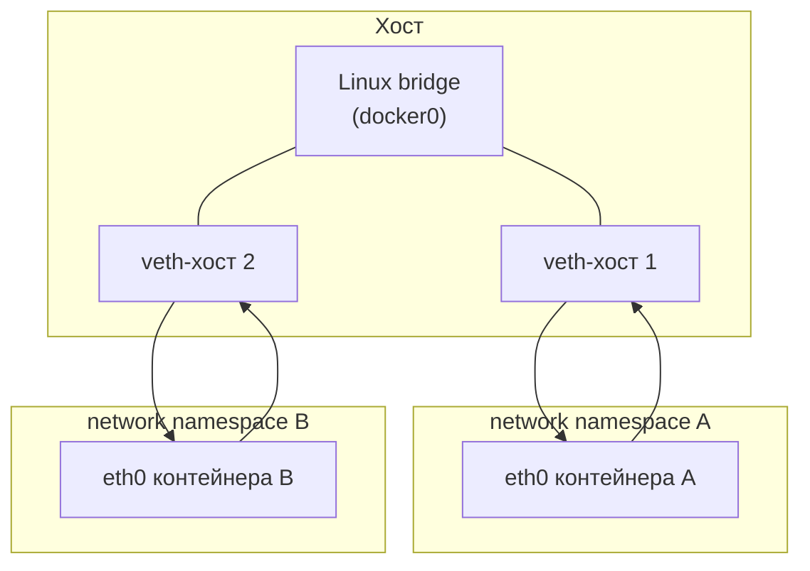

- **network namespace** — изолированный сетевой стек: свои интерфейсы, таблица маршрутизации, firewall
- **veth-пара** — виртуальный кабель: пакет входит с одной стороны, выходит с другой
- **Linux bridge** — программный коммутатор, объединяет несколько veth в один сегмент

<!--
Три элемента, из которых собирается сеть любого контейнера. Network namespace даёт контейнеру собственный изолированный стек: свой lo, свой eth0, свою таблицу маршрутизации. Veth-пара — это виртуальный кабель: два конца, пакет входит с одного, появляется на другом. Один конец живёт в namespace контейнера, другой — в namespace хоста. Linux bridge — программный коммутатор: он объединяет несколько хостовых концов veth-пар, позволяя контейнерам общаться между собой, как в одном сегменте физической сети.
-->

---

# netfilter и iptables

Ядро перехватывает трафик в пяти хуках netfilter. Docker строит на них все правила NAT:


| Операция | Где применяется |
|---|---|
| **DNAT** | Проброс порта хоста в контейнер (`-p 8080:80`) |
| **SNAT / MASQUERADE** | Выход контейнера наружу с IP хоста |

<div class="itmo-card-note mt-3">
Docker автоматически создаёт правила iptables. Вручную их менять не следует, но читать — полезный навык диагностики.
</div>

<!--
Netfilter — подсистема ядра, которая перехватывает пакеты в пяти точках: PREROUTING, INPUT, FORWARD, OUTPUT, POSTROUTING. Именно здесь работает iptables. DNAT — трансляция адреса назначения: входящий пакет на порт хоста переадресуется внутрь контейнера. SNAT — трансляция адреса источника: контейнер выходит наружу с IP хоста, а не с внутренним адресом. Docker создаёт и поддерживает эти правила автоматически. Диагностировать их можно командой iptables -t nat -L -n -v.
-->

---
layout: section
---

<div class="section-no">02</div>

# Docker-сети

Пять драйверов — пять моделей изоляции и связности

<!--
Пять драйверов: bridge, host, overlay, macvlan, none. Bridge — дефолт: контейнер в изолированной сети, доступен через `-p`. Host — контейнер разделяет netns хоста, порты занимает напрямую. None — сеть отключена. Overlay — L2 поверх L3 для Swarm. Macvlan — прямой доступ к физической сети.
-->

---

# Сетевые драйверы Docker

| Драйвер | Изоляция | Когда применять |
|---|---|---|
| **bridge** | namespace + bridge | Default; разработка на одном хосте |
| **host** | нет | Максимальная производительность, нет изоляции |
| **none** | полная | Специализированные сценарии без сети |
| **overlay** | namespace + VXLAN-туннель | Несколько хостов, Docker Swarm |
| **macvlan** | отдельный MAC | Прямое подключение к физической сети |

<div class="itmo-card-accent mt-4">
Для большинства задач разработки — <strong>bridge</strong>. Для мульти-хостовых сред — <strong>overlay</strong>. Host используется только когда latency важнее безопасности.
</div>

<!--
Пять режимов отвечают на разные потребности. Bridge — режим по умолчанию: контейнеры изолированы в namespace, но общаются через программный коммутатор. Host — контейнер получает сеть хоста напрямую: наивысшая производительность, но изоляции нет. None — контейнер полностью без сети, используется редко. Overlay строит VXLAN-туннели поверх физической сети, позволяя контейнерам на разных хостах общаться как в одной сети. Macvlan даёт контейнеру отдельный MAC-адрес в физическом сегменте — полезно для интеграции с legacy-инфраструктурой.
-->

---

# Bridge-сеть: архитектура

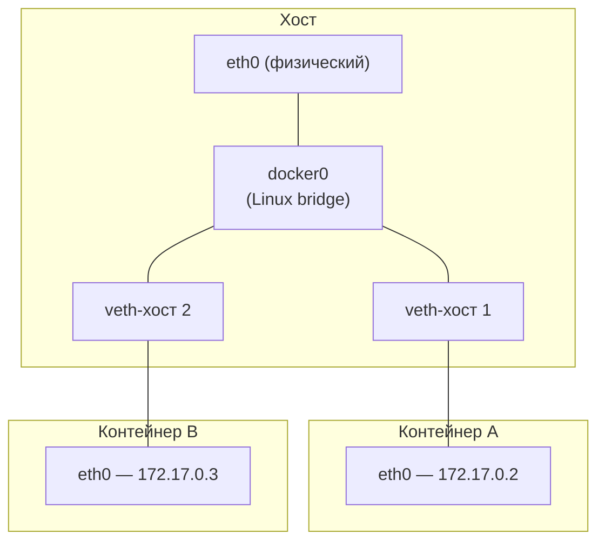

Контейнеры в одной bridge-сети общаются по IP напрямую. Выход наружу — через NAT на eth0 хоста.

<!--
Разберём дефолтную bridge-сеть детально. Docker создаёт интерфейс docker0 — это Linux bridge. Для каждого контейнера создаётся veth-пара: один конец в namespace контейнера становится eth0, другой конец подключается к docker0. Контейнеры в одной bridge-сети видят друг друга напрямую по внутренним IP — без NAT. Выход наружу проходит через MASQUERADE: пакет уходит с IP физического интерфейса хоста.
-->

---
layout: two-cols
---

# Публикация портов и NAT

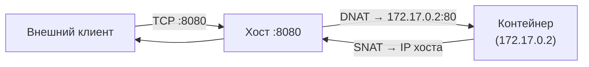

::right::

## Флаг `-p` создаёт правило iptables

```bash
docker run -p 8080:80 nginx
```

Что происходит:
1. Docker добавляет правило DNAT в PREROUTING
2. Пакет на порт 8080 хоста → 172.17.0.2:80
3. Ответ возвращается через SNAT

<div class="itmo-card-note mt-3">
Контейнеры одной пользовательской сети общаются напрямую по именам — без NAT и без публикации портов.
</div>

<!--
Публикация порта командой docker run с флагом -p — это не «открытие порта» в традиционном смысле. Docker добавляет правило DNAT в таблицу nat iptables: каждый пакет, приходящий на порт 8080 хоста, перенаправляется на порт 80 контейнера с IP 172.17.0.2. Обратный путь — через SNAT, чтобы ответ ушёл с IP хоста, а не с внутреннего адреса. Контейнеры в одной пользовательской сети общаются без NAT — напрямую по именам через встроенный DNS Docker.
-->

---
layout: section
---

<div class="section-no">03</div>

# Обнаружение сервисов

Имя вместо адреса — уровень косвенности в распределённой системе

<!--
IP контейнера изменяется при каждом пересоздании. Фиксировать IP в конфигурации — антипаттерн. DNS даёт уровень косвенности: клиент вызывает `db`, встроенный resolver Docker возвращает текущий IP. При пересоздании контейнера DNS обновляется автоматически.
-->

---

# DNS как уровень косвенности

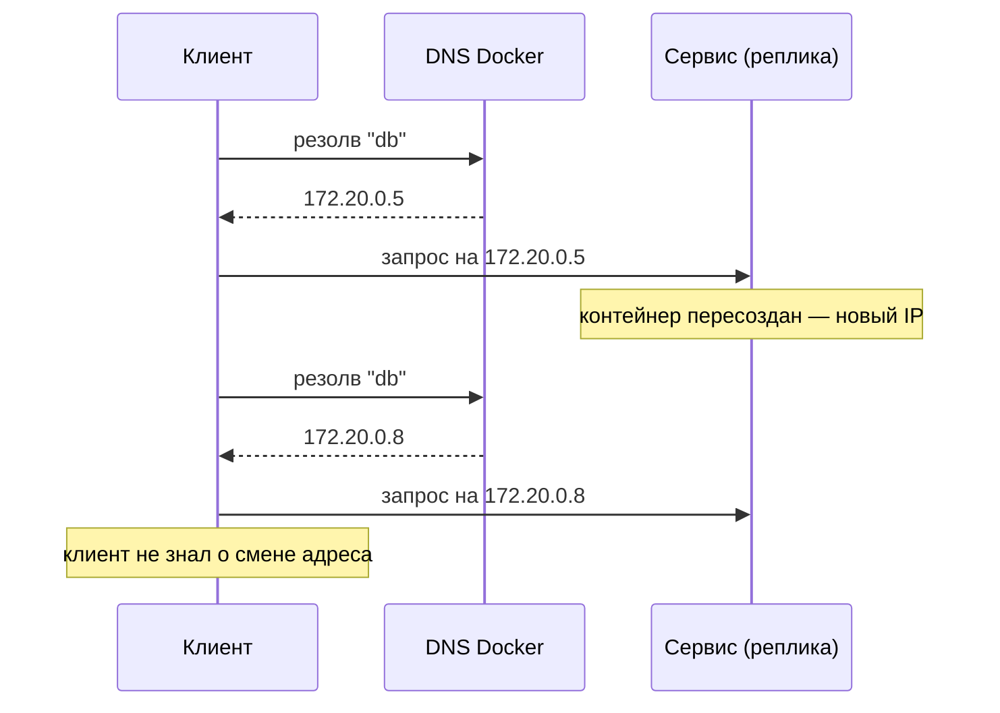

Docker встраивает DNS-сервер в каждую пользовательскую сеть. Имя сервиса — DNS-запись в этом сервере.

<!--
В пользовательских Docker-сетях (не default bridge) каждый контейнер получает DNS-резолвер, который понимает имена других контейнеров. Клиент обращается к «db» — DNS возвращает актуальный IP. При пересоздании контейнера DNS обновляется; клиент при следующем вызове получит новый IP. Это и есть service discovery: уровень косвенности, отвязывающий клиента от конкретного адреса. docker-compose создаёт пользовательские сети именно для этой причины — default bridge не даёт встроенного DNS.
-->

---
layout: two-cols
---

# docker-compose: оркестрация одного хоста

```yaml
services:
  vote:
    image: voting-app/vote
    ports: ["5000:80"]
  redis:
    image: redis:alpine
  worker:
    image: voting-app/worker
    depends_on: [redis, db]
  db:
    image: postgres:15
    volumes: ["pgdata:/var/lib/postgresql/data"]
  result:
    image: voting-app/result
    ports: ["5001:80"]
volumes:
  pgdata:
```

::right::

## Что создаёт compose

- Общую пользовательскую сеть `project_default`
- Имена сервисов как DNS-записи
- Порядок запуска через `depends_on`
- Тома и переменные окружения

<div class="itmo-card-accent mt-3">
Worker обращается к Redis просто по имени «redis» — не по IP. Это третий фактор методологии 12-factor: сторонние сервисы как прикреплённые ресурсы с именем.
</div>

<!--
docker-compose — оркестратор одного хоста. Он читает YAML-файл, создаёт пользовательскую сеть для всех сервисов проекта, запускает контейнеры в нужном порядке через depends_on, монтирует тома. Главное: каждый сервис получает DNS-имя, равное имени в файле. Worker обращается к Redis просто по имени «redis». Postgres доступен как «db». Это воплощение третьего фактора методологии 12-factor: сторонние сервисы как прикреплённые ресурсы, адресуемые через имя из переменных окружения или service discovery.
-->

---

# voting-app в docker-compose

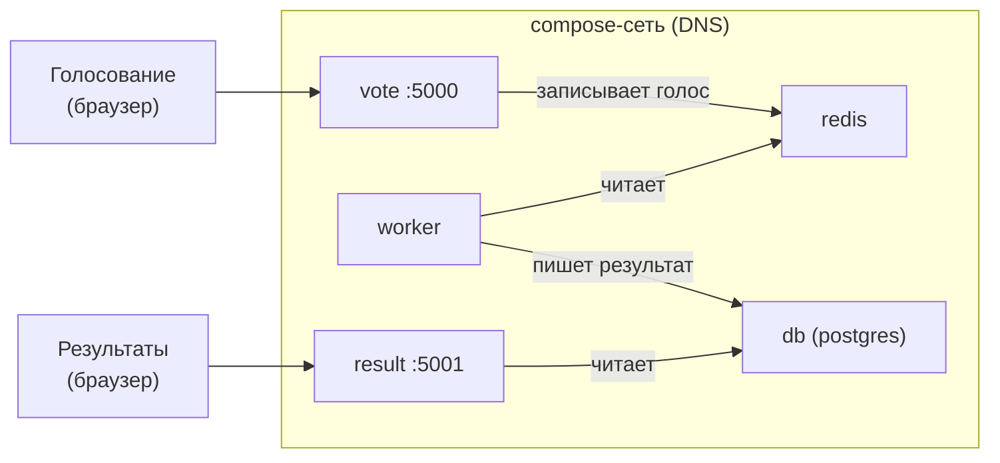

Сервисы связаны только именами — конкретные адреса скрыты за DNS-слоем.

<!--
Посмотрим на voting-app целиком. Пользователь голосует через сервис vote, который пишет в Redis. Worker забирает голоса из Redis и записывает итоги в Postgres. Сервис result читает из Postgres и показывает результаты. Все пять контейнеров работают в одной compose-сети. Worker не знает IP Redis — он обращается по имени «redis», DNS разрешает его в актуальный адрес. Наружу опубликованы только vote (порт 5000) и result (порт 5001) — остальные сервисы доступны только внутри compose-сети.
-->

---
layout: section
---

<div class="section-no">04</div>

# Балансировка нагрузки

Как распределить трафик по репликам и исключить нездоровые экземпляры

<!--
L4 балансировщик видит TCP/UDP соединения и распределяет их по репликам. L7 видит HTTP-запросы: может маршрутизировать по заголовкам, пути, куки. Nginx в режиме upstream — L4/L7 гибрид. Envoy — L7 с full observability: метрики на каждый маршрут, трассировки запросов.
-->

---
layout: two-cols
---

# L4 vs L7 балансировка

## L4 — транспортный уровень

- Работает с TCP/UDP пакетами
- Не видит HTTP-заголовков, путей, тел запросов
- Быстро и просто
- Примеры: iptables DNAT, HAProxy TCP, kube-proxy

<div class="itmo-card mt-3">
L4 балансирует <strong>соединения</strong>.
</div>

::right::

## L7 — прикладной уровень

- Понимает HTTP, gRPC, WebSocket
- Маршрутизация по пути `/api/`, заголовку `Host`, куки
- Может завершать TLS (TLS termination)
- Примеры: nginx, Traefik, Envoy, AWS ALB

<div class="itmo-card-accent mt-3">
L7 балансирует <strong>запросы</strong> — и принимает решения по содержимому.
</div>

<!--
Два уровня балансировки — два разных инструмента. L4 работает на уровне TCP: он не знает, что за данные внутри пакетов. Это быстро и универсально. L7 раскрывает пакеты до HTTP и принимает решения на основе содержимого: запрос на /api — вон туда, запрос на /admin — сюда. Только L7 может сделать канареечный деплой по заголовку, sticky sessions по куки или завершить TLS с передачей чистого HTTP приложению. В Kubernetes kube-proxy — это L4, а Ingress-контроллер — L7.
-->

---

# Стратегии распределения запросов

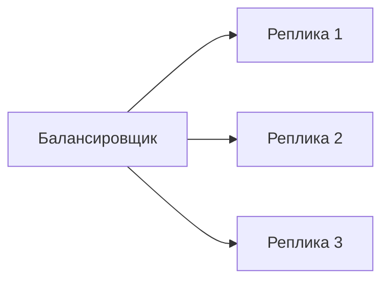

| Стратегия | Принцип | Когда применять |
|---|---|---|
| Round-robin | По очереди | Однородные запросы, одинаковые реплики |
| Least connections | К наименее нагруженной | Запросы разной длительности |
| IP hash | По IP клиента | Sticky sessions без состояния балансировщика |
| Weighted | По весу реплики | Canary: 10% трафика на новую версию |

<!--
Стратегия балансировки определяет, как выбирается реплика для следующего запроса. Round-robin просто ходит по кругу — работает хорошо, когда запросы похожи. Least connections отправляет к той реплике, у которой меньше активных соединений — полезно при долгих запросах. IP hash обеспечивает попадание одного клиента всегда на одну реплику — простой вариант sticky sessions. Weighted позволяет постепенно переключить трафик на новую версию: 10% к canary, 90% к старой. В реальных системах стратегию выбирают исходя из характеристик трафика и требований приложения.
-->

---

# Health-based маршрутизация

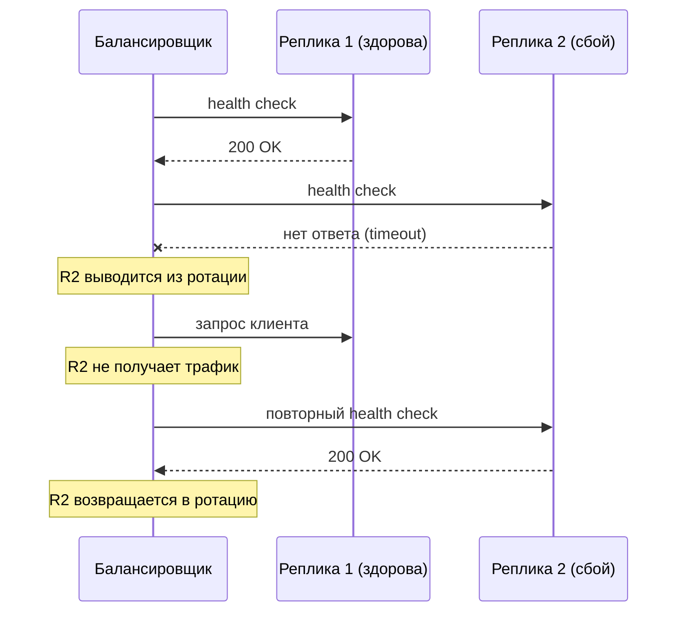

<!--
Health-based маршрутизация: балансировщик периодически проверяет каждую реплику. Реплика не отвечает или возвращает ошибку — выводится из ротации, новые запросы к ней не идут. Восстанавливается — возвращается. Клиент не замечает ничего. Без health-проверок часть запросов уходит в отказавшую реплику и пользователь получает ошибки — это базовый механизм устойчивости балансировщика.
-->

---
layout: section
---

<div class="section-no">05</div>

# Ingress, Egress и Service mesh

Управляемые границы системы и перенос сетевой логики в прокси

<!--
Ingress — единственная управляемая точка входа в кластер: TLS терминация, маршрутизация по хосту и пути, rate limiting. Service mesh (Istio, Linkerd) добавляет sidecar-прокси к каждому Pod: TLS между сервисами (mTLS), политики доступа, метрики на каждый запрос — без изменений в коде приложения.
-->

---

# Ingress: управляемый вход

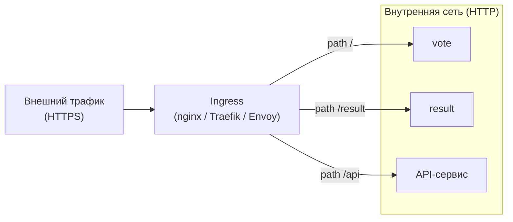

Ingress — единая точка входа:
- Терминирует TLS (снаружи HTTPS, внутри HTTP)
- Маршрутизирует по хосту и пути запроса
- Ограничивает то, что доступно снаружи

<!--
Ingress — это обратный прокси на входе в систему. Внешний трафик приходит по HTTPS, ingress расшифровывает TLS и отправляет запросы к нужным внутренним сервисам по HTTP. Маршрутизация основана на path или Host-заголовке: запрос на /result уходит к сервису result, на /api — к API-сервису. Так мы не публикуем каждый сервис наружу отдельным портом — всё проходит через единую управляемую точку входа. В Kubernetes это реализуется ресурсом Ingress и Ingress-контроллером.
-->

---
layout: two-cols
---

# Egress: контролируемый выход

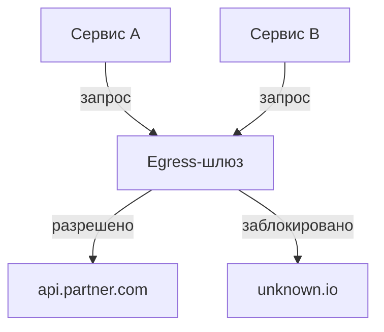

::right::

## Зачем контролировать выход

- Ограничить, к каким внешним ресурсам имеют доступ сервисы
- Аудит и логирование исходящих соединений
- Предотвращение утечки данных через скомпрометированный контейнер

<div class="itmo-card-warn mt-4">
Без egress-политики скомпрометированный контейнер может свободно обращаться к любому адресу в интернете.
</div>

<!--
Egress — зеркало ingress, но для исходящего трафика. По умолчанию контейнер может обратиться к любому адресу в интернете. Это проблема безопасности: скомпрометированный сервис может отправлять данные наружу. Контроль egress позволяет задать белый список разрешённых внешних адресов и блокировать всё остальное. В Kubernetes это NetworkPolicy с ограничениями Egress. В более сложных сценариях используется egress-шлюз в рамках service mesh с полным логированием исходящих соединений.
-->

---

# Service mesh: архитектура sidecar

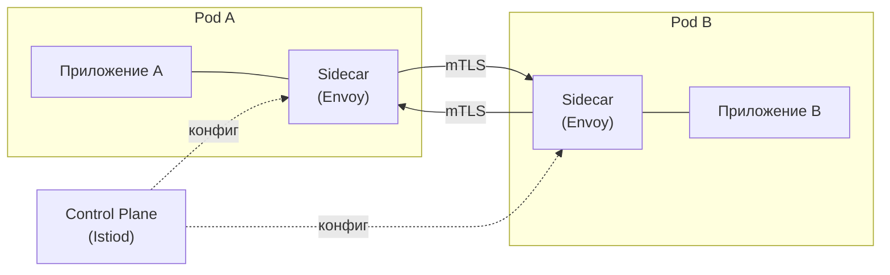

Приложение обращается к локальному sidecar. Sidecar — к удалённому sidecar. Сетевая логика вынесена из кода.

<!--
Service mesh — архитектурный паттерн, в котором сетевая логика вынесена из кода приложения в специализированные прокси. Рядом с каждым контейнером приложения запускается sidecar-прокси, обычно Envoy. Всё сетевое взаимодействие идёт через эти прокси. Центральный control plane — в Istio это Istiod — рассылает конфигурации всем sidecar. Приложение не знает ни о mTLS, ни о повторных попытках, ни о трассировке: всё это делает sidecar прозрачно.
-->

---

# Что service mesh выносит из кода

<div class="grid grid-cols-2 gap-3">

<div class="itmo-card">

**Повторные попытки (retry)**

Sidecar автоматически повторяет запрос при сбое. Приложение пишет запрос один раз.

</div>

<div class="itmo-card">

**Взаимный TLS (mTLS)**

Каждый sidecar проверяет сертификат собеседника. Шифрование без изменений кода приложения.

</div>

<div class="itmo-card">

**Распределённая трассировка**

Sidecar пробрасывает trace-заголовки и отправляет спаны в Jaeger или Zipkin.

</div>

<div class="itmo-card">

**Прерыватель цепи (circuit breaker)**

Sidecar прекращает запросы к нездоровому сервису и восстанавливает после паузы.

</div>

</div>

<!--
Вот что service mesh даёт на практике. Первое — retry: вместо того чтобы писать логику повторных запросов в каждом сервисе, sidecar делает это по конфигурации. Второе — mTLS: каждый sidecar аутентифицирует соседа по сертификату, шифрование между сервисами без единой строки кода в приложении. Третье — трассировка: sidecar инжектирует trace-ID в заголовки и отправляет данные в систему трассировки. Четвёртое — circuit breaker: если сервис начинает отвечать медленно или с ошибками, sidecar прекращает к нему обращаться и возвращает ошибку быстро, предотвращая каскадные сбои.
-->

---
layout: section
---

<div class="section-no">06</div>

# Критерии, отказы, свидетельства

Когда что применять, что может сломаться и как это проверить

<!--
Диагностика сети начинается со слоя, на котором обрыв. `docker network inspect` — bridge-уровень. `ip netns exec` — namespace-уровень. `iptables -L -t nat` — Service/DNAT правила. `curl -v` внутри Pod — L7. Режимы отказа: MAC-таблица переполнена на bridge, iptables rule не добавился после перезапуска, mTLS не настроен между сервисами.
-->

---

# Критерии выбора сетевого решения

| Критерий | docker-compose | overlay / Swarm | Service mesh |
|---|---|---|---|
| Число хостов | 1 | 2–10 | любое |
| Число сервисов | до 10 | до 50 | 50+ |
| mTLS между сервисами | нет | нет | да |
| Распределённая трассировка | вручную | вручную | автоматически |
| Retry / circuit breaker | в коде | в коде | в sidecar |
| Операционная сложность | минимальная | средняя | высокая |

<div class="itmo-card-note mt-3">
Service mesh оправдан, когда сложность управления сетью превышает сложность его сопровождения. Гош в «Docker без секретов» советует начинать с простейшего решения.
</div>

<!--
Таблица критериев — фирменный приём курса. На одном хосте с небольшим числом сервисов docker-compose более чем достаточен: DNS-обнаружение, изоляция, публикация портов — всё есть. При росте числа хостов появляется overlay. Service mesh — это решение для масштаба и строгих требований к безопасности: mTLS между всеми сервисами, автоматическая трассировка, centralised retry-политики. Но он несёт операционную нагрузку: control plane, sidecar-инъекция, конфигурация политик. Авторы «Kubernetes и сети» Джеймс и Валлери описывают этот переход как границу, где точка сложности меняется с сетевой на операционную.
-->

---

# Режимы отказа: четыре класса

<div class="grid grid-cols-2 gap-3">

<div class="itmo-card-warn">

**DNS-сбой**

Контейнер пересоздан, кэш DNS устарел. Старые соединения разрываются. Лечение: короткий TTL, retry на клиенте.

</div>

<div class="itmo-card-warn">

**Таймаут соединения**

Сервис перегружен. Клиент ждёт без явного таймаута — бесконечно. Лечение: задавать deadline на каждом вызове.

</div>

<div class="itmo-card-warn">

**Retry-шторм**

Все клиенты повторяют запросы одновременно — нагрузка удваивается. Лечение: exponential backoff + jitter.

</div>

<div class="itmo-card-warn">

**Разбиение сети (partition)**

Части системы теряют связь. Часть запросов проходит, часть нет. Диагностировать сложнее всего.

</div>

</div>

<!--
Четыре классических режима отказа в распределённых сетях. DNS-сбой: клиент закэшировал старый IP, контейнер пересоздан, соединения рвутся. Таймаут: сервис жив, но перегружен или сеть деградировала — без явного таймаута клиент заблокируется навсегда. Retry-шторм — особенно коварная ситуация, о ней следующий слайд. Разбиение сети: два сегмента системы теряют связь, система входит в несогласованное состояние, и диагностировать это труднее всего — симптомы зависят от того, на какой стороне находится наблюдатель.
-->

---

# Retry-шторм: механизм лавины

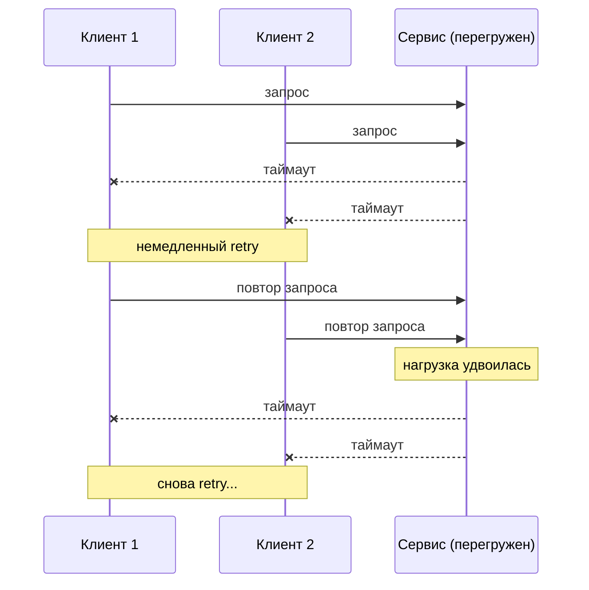

Защита: exponential backoff с jitter — каждый клиент ждёт случайное время перед повтором.

<!--
Retry-шторм — контринтуитивная ситуация. Разработчик добавляет retry с лучшими намерениями: сервис иногда падает, надо повторять. Но если все клиенты повторяют синхронно, они усиливают нагрузку именно тогда, когда сервис уже не справляется. Решение — exponential backoff: после первого сбоя ждём одну секунду, после второго — две, после третьего — четыре. Плюс jitter: каждый клиент добавляет случайную задержку, чтобы клиенты не бомбардировали сервис одновременно. Service mesh реализует это поведение централизованно — и это одна из причин, почему он полезен.
-->

---

# Свидетельства: как проверить сеть

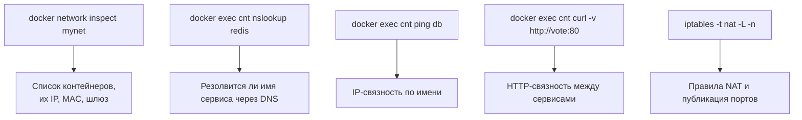

Мост к Лабораторной 1: трассировка пути запроса в voting-app этим набором команд.

<!--
Переходим к практике. Первый инструмент — docker network inspect: показывает полную картину сети, какие контейнеры подключены, их IP и MAC, настройки шлюза. Второй — nslookup внутри контейнера: проверяем, что DNS резолвит имя сервиса. Третий — ping: проверяем IP-связность по имени. Четвёртый — curl между контейнерами: проверяем HTTP-связность. Пятый — iptables -t nat -L: смотрим, какие правила публикации портов создал Docker. В первой лабораторной вы используете именно этот набор для трассировки пути запроса через voting-app.
-->

---
layout: center
---

# Итоги

- **Сеть контейнера** собирается из примитивов ядра: namespace, veth-пара, Linux bridge
- **Docker управляет сетью** через драйверы и автоматически создаёт правила iptables
- **DNS** — уровень косвенности: клиент обращается по имени, не по непостоянному адресу
- **docker-compose** реализует service discovery и изоляцию на одном хосте
- **L4 vs L7**: разные уровни балансировки — разные инструменты для разных задач
- **Service mesh** выносит retry, mTLS и трассировку из кода в sidecar-прокси

**Дальше: Лекция 7** — Kubernetes как оркестратор нескольких хостов, сетевая модель кластера, CNI-плагины и kube-proxy.

Опорная литература: С. Джеймс, Л. Валлери «Kubernetes и сети. Многоуровневый подход». С. Гош «Docker без секретов».

<!--
Подведём итоги. Мы прошли путь от примитивов ядра до service mesh. Три вещи принципиально важны. Первое — DNS как уровень косвенности: это основа всего service discovery в контейнерных системах. Второе — разница L4 и L7 балансировки: это не академическая классификация, а выбор инструмента под задачу. Третье — service mesh снимает сетевую сложность с разработчика, но перекладывает её на инфраструктурную команду. Следующая лекция переходит к Kubernetes: там те же принципы, но реализованные на несколько хостов, с CNI-плагинами и kube-proxy.
-->
