<div class="cover-kicker">Лекция 7</div>

# Оркестрация и Kubernetes: управление по декларативному состоянию

Когда контейнеров много — нужна система, которая управляет ими сама

<!--
Добрый день. Седьмая лекция посвящена оркестрации — системе управления множеством контейнеров на многих узлах. В шестой лекции мы разобрали, как контейнеры общаются в пределах одного хоста через Docker-сети. Сегодня переходим на уровень выше: несколько хостов, сотни контейнеров, постоянные изменения состояния. Kubernetes — сквозная тема от архитектуры до сетевой модели и базовых объектов. В конце лекции — критерии выбора, режимы отказа и первые команды диагностики, которые понадобятся в лабораторной работе 2.
-->

---

# Маршрут лекции

- **01 Декларативная модель** — желаемое состояние, цикл сверки, контроллеры
- **02 Архитектура кластера** — control plane, etcd, рабочие узлы и их компоненты
- **03 Сетевая модель** — четыре задачи, IP на Pod, CNI, kube-proxy
- **04 Базовые объекты** — Pod, ReplicaSet, Deployment, Service, Namespace, CoreDNS
- **05 Критерии, отказы, свидетельства** — таблица выбора, режимы отказа, диагностика

<!--
Маршрут лекции выстроен по аналитической рамке курса: сначала модель — почему Kubernetes работает именно так, затем архитектура, сетевой уровень и объекты, с которыми работает инженер каждый день. В конце — критерии выбора: когда Kubernetes оправдан, а когда достаточно compose или PaaS. Такой порядок позволяет понять каждый компонент не как отдельный термин, а как часть согласованной системы управления состоянием.
-->

---

# Проблема: ручное управление не масштабируется

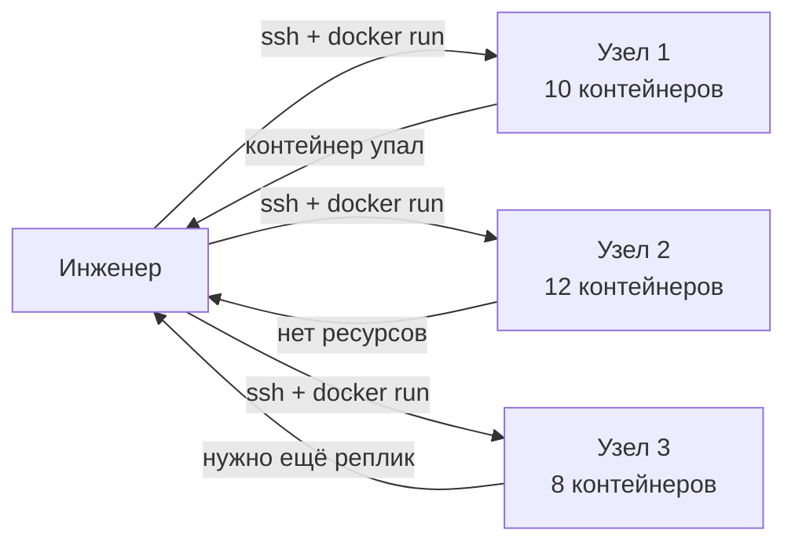

Три класса задач, которые не решить вручную при десятках узлов:

- **Планирование** — куда разместить контейнер с учётом ресурсов
- **Восстановление** — перезапуск при сбое без участия человека
- **Масштабирование** — добавить или убрать реплики по правилу

<!--
Представим картину: тридцать узлов, сотни контейнеров. При падении контейнера инженер получает алерт, подключается по SSH, разбирается, перезапускает. При росте нагрузки вручную добавляет реплики. При нехватке ресурсов на одном узле переносит контейнеры на другой. Это операционный ад. Kubernetes возник как ответ именно на этот класс задач: планирование, восстановление и масштабирование должны быть автоматическими, а инженер — описывать желаемое состояние, а не последовательность действий.
-->

---
layout: section
---

<div class="section-no">01</div>

# Декларативная модель

Желаемое состояние, цикл сверки и роль контроллеров

<!--
Первый блок — философия Kubernetes. Прежде чем разбирать компоненты, важно понять модель: почему Kubernetes управляет системой именно через декларативные манифесты, а не через императивные команды. Это фундамент — без него архитектура будет набором несвязанных слов.
-->

---
layout: two-cols
---

# Императив против декларатива

## Императивная модель

Пользователь описывает **шаги**:

```bash
docker run --name web nginx
docker scale web=3
docker restart web
```

Надо знать текущее состояние, чтобы следующий шаг был верным.

::right::

## Декларативная модель

Пользователь описывает **желаемое состояние**:

```yaml
kind: Deployment
spec:
  replicas: 3
  template:
    spec:
      containers:
      - name: web
        image: nginx
```

Система сама решает, **как** перейти к желаемому.

<div class="itmo-card-accent mt-4">
Декларатив — это «что должно быть», а не «что сделать». Система идемпотентна.
</div>

<!--
Ключевое различие между двумя подходами. Императивный подход требует от пользователя знания текущего состояния системы: если контейнер уже запущен, команда запуска завершится ошибкой. Декларативный подход переворачивает ответственность: пользователь описывает конечную цель в манифесте YAML, а система сама определяет, какие шаги нужно предпринять. Если три реплики уже запущены, Kubernetes ничего не делает. Если запущена только одна, запускает ещё две. Если их пять, удаляет лишние. Это делает систему идемпотентной.
-->

---

# Цикл сверки (reconciliation loop)

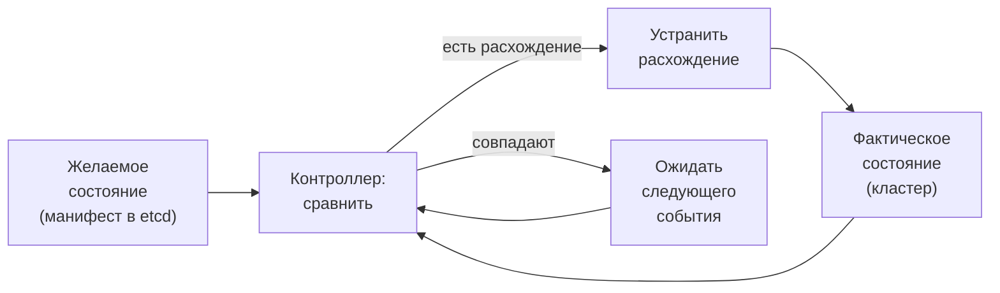

Цикл выполняется непрерывно. Контроллер не позволяет системе отклониться от манифеста.

<!--
Reconciliation loop — сердце Kubernetes. Контроллер постоянно сравнивает два состояния: желаемое, которое хранится в etcd в виде манифестов, и фактическое — то, что реально запущено в кластере. Если есть расхождение, контроллер совершает действие: создаёт Pod, удаляет лишний, перезапускает упавший. Затем снова сравнивает. Цикл бесконечен. Это и есть «самовосстановление» (self-healing): не человек следит за состоянием системы, а контроллер. Понимание этого цикла объясняет поведение Kubernetes в любых нештатных ситуациях.
-->

---

# Контроллер в действии

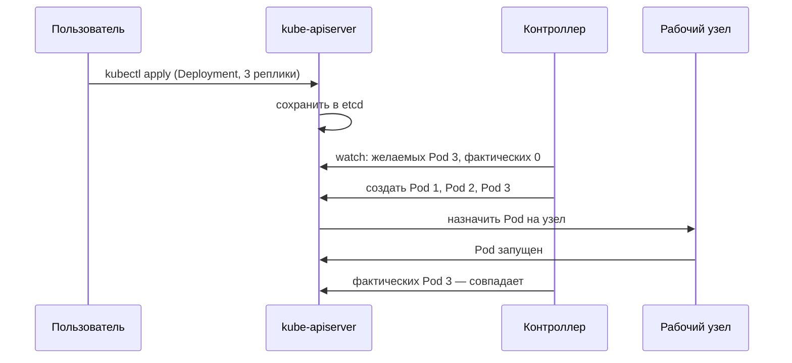

<!--
Посмотрим на цикл сверки на конкретном примере. Пользователь подаёт манифест через kubectl. Kube-apiserver сохраняет его в etcd. Контроллер Deployment наблюдает за изменениями через механизм watch и обнаруживает расхождение: желаемых Pod три, фактических ноль. Контроллер просит apiserver создать три объекта Pod. Scheduler назначает их на узлы. Kubelet на каждом узле запускает контейнеры и сообщает о готовности обратно через apiserver. Контроллер снова проверяет — состояния совпадают, цикл переходит в режим ожидания следующего события.
-->

---
layout: section
---

<div class="section-no">02</div>

# Архитектура кластера

Control plane и рабочие узлы — кто за что отвечает

<!--
Второй блок — архитектура. Теперь, когда модель ясна, разберём, какие компоненты её реализуют. Кластер Kubernetes делится на две зоны ответственности: управляющий слой и рабочие узлы. Каждый компонент выполняет строго ограниченную роль и взаимодействует с остальными только через единую точку входа.
-->

---

# Кластер: управляющий слой и узлы

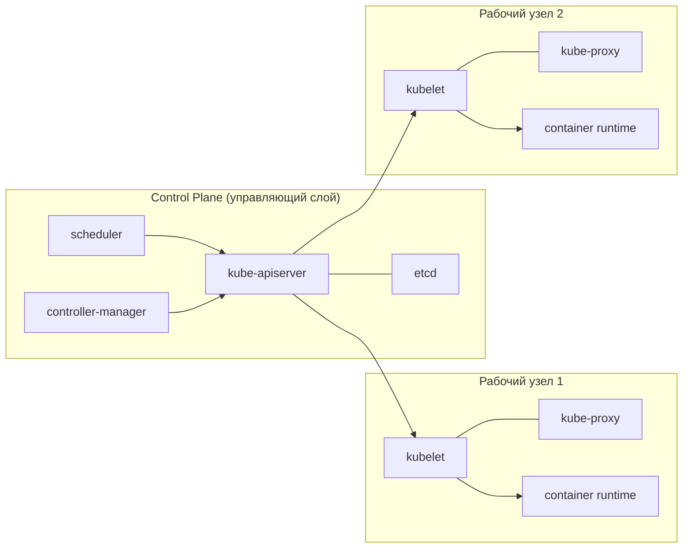

Все компоненты взаимодействуют **только через kube-apiserver**. Прямых вызовов между ними нет.

<!--
Архитектура кластера делится на два слоя. Управляющий слой — control plane — принимает решения. Рабочие узлы исполняют эти решения. Принципиальный момент: каждый компонент общается только с kube-apiserver. Scheduler не вызывает kubelet напрямую — он обновляет поле nodeName в объекте Pod через apiserver. Kubelet не знает о scheduler — он видит только объекты Pod, назначенные ему, через watch на apiserver. Это делает архитектуру модульной: компонент можно заменить или масштабировать, не меняя остальных.
-->

---

# Control plane: компоненты управляющего слоя

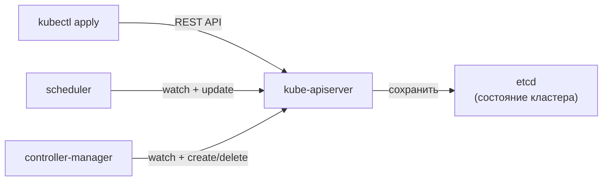

| Компонент | Роль |
|---|---|
| **kube-apiserver** | Единственная точка входа; хранитель API и авторизации |
| **etcd** | Распределённое KV-хранилище всего состояния кластера |
| **scheduler** | Назначает Pod на узел с учётом ресурсов и правил |
| **controller-manager** | Запускает все встроенные контроллеры сверки |

<!--
Четыре компонента control plane. Kube-apiserver — единственная точка входа для всего: и для пользователей через kubectl, и для внутренних компонентов. Etcd — распределённая база данных типа ключ-значение, в которой хранится всё состояние кластера. Потеря etcd — потеря памяти кластера. Scheduler наблюдает через apiserver за Podами без назначенного узла и выбирает подходящий с учётом доступных ресурсов и affinity-правил. Controller-manager — набор контроллеров в одном процессе: Deployment, ReplicaSet, Node и другие.
-->

---

# etcd: хранилище состояния кластера

<div class="grid grid-cols-2 gap-3">

<div class="itmo-card">

**Что хранит etcd**

Все объекты кластера: Pod, Deployment, Service, ConfigMap, Secret, RBAC, Namespace и их статусы.

</div>

<div class="itmo-card">

**Алгоритм консенсуса Raft**

etcd — распределённая система. Для отказоустойчивости нужно нечётное число узлов: 3 или 5. При потере большинства узлов кластер переходит в режим только для чтения.

</div>

<div class="itmo-card-warn">

**Потеря etcd**

Без кворума API-сервер не принимает изменения. Работающие Pod продолжают работать, но управление кластером недоступно.

</div>

<div class="itmo-card-note">

**Резервное копирование**

etcd бэкапируют отдельно от узлов. Команда `etcdctl snapshot save` создаёт снапшот, по которому кластер восстанавливается.

</div>

</div>

<!--
etcd заслуживает отдельного внимания, потому что именно здесь хранится «память» кластера. Всё, что Kubernetes знает о себе — каждый Pod, каждый Service, каждый секрет — лежит в etcd. Алгоритм Raft гарантирует согласованность при распределённом хранении: записи принимаются только если большинство узлов etcd подтвердило запись. Для трёх узлов etcd кластер переживает потерю одного. Именно поэтому etcd разворачивают в нечётном числе и бэкапируют регулярно и отдельно от всего остального.
-->

---

# Рабочий узел: kubelet, kube-proxy, container runtime

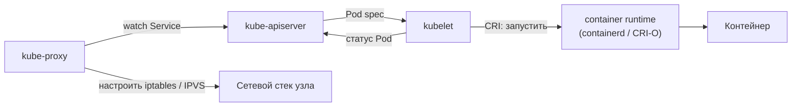

- **kubelet** — агент узла: запускает Pod, следит за контейнерами, сообщает состояние
- **kube-proxy** — сетевой агент: реализует Service через правила ядра
- **container runtime** — исполняет контейнеры через интерфейс CRI

<!--
На каждом рабочем узле работают три компонента. Kubelet — главный агент: он наблюдает за Podами, назначенными на его узел, и управляет их жизненным циклом через container runtime. Kube-proxy реализует абстракцию Service: когда создаётся Service, kube-proxy на всех узлах настраивает правила iptables или IPVS так, чтобы трафик к виртуальному IP сервиса перенаправлялся к фактическим Pod. Container runtime исполняет контейнеры согласно спецификации CRI — это может быть containerd или CRI-O. Docker как runtime в новых кластерах уже не используется напрямую.
-->

---
layout: section
---

<div class="section-no">03</div>

# Сетевая модель Kubernetes

Четыре задачи, плоская сеть, CNI и kube-proxy

<!--
Третий блок — сеть. Kubernetes решает четыре класса сетевых задач, и у каждого свой механизм. Понимание сетевой модели критично: большинство проблем в кластере в конечном счёте оказываются сетевыми. Начнём с базового принципа — плоской сети без NAT.
-->

---

# Четыре сетевые задачи Kubernetes

<div class="grid grid-cols-2 gap-3">

<div class="itmo-card">

**1. Контейнер ↔ Контейнер (внутри Pod)**

Контейнеры одного Pod делят сетевой namespace. Общаются через `localhost`.

</div>

<div class="itmo-card">

**2. Pod ↔ Pod**

Прямая адресация: каждый Pod имеет уникальный IP. Маршрутизация без NAT через CNI.

</div>

<div class="itmo-card">

**3. Pod ↔ Service**

Service даёт стабильный виртуальный IP. kube-proxy перенаправляет трафик к Pod-бэкендам.

</div>

<div class="itmo-card">

**4. Снаружи ↔ Service**

NodePort, LoadBalancer или Ingress открывают Service для внешних клиентов.

</div>

</div>

<!--
Kubernetes решает четыре уровня сетевых задач, и для каждого свой механизм. Первый — контейнеры внутри одного Pod: они изолированы на уровне процессов, но делят сетевой namespace, поэтому общаются через localhost на разных портах. Второй — связь между Pod: каждый Pod получает собственный IP, маршрутизация прямая без NAT — это «плоская сеть». Третий — Pod обращается к Service: Service скрывает за виртуальным IP множество Pod-бэкендов. Четвёртый — доступ снаружи: NodePort, LoadBalancer или Ingress открывают Service для внешнего мира. Джеймс и Валлери в «Kubernetes и сети» называют эту четырёхуровневую модель основой для понимания всего сетевого стека кластера.
-->

---

# IP на Pod: плоская сеть без NAT

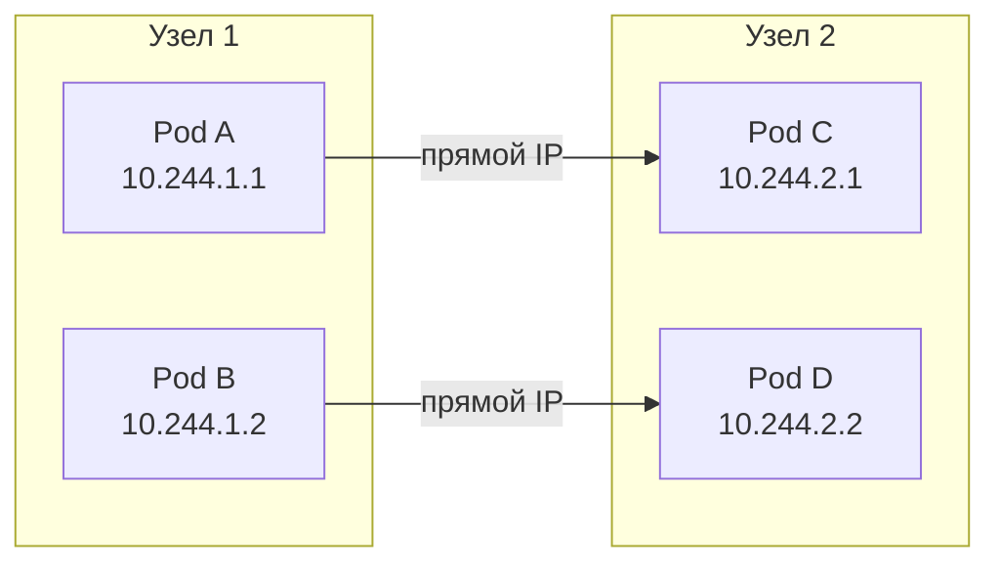

Базовые правила модели:

- Каждый Pod имеет уникальный IP в адресном пространстве кластера
- Pod на разных узлах видят друг друга напрямую — без трансляции адресов
- Конфликтов портов нет: каждый Pod — отдельный адрес

<!--
Плоская сеть без NAT — фундаментальный принцип Kubernetes, который существенно упрощает модель связи. В Docker при публикации портов приходилось настраивать DNAT и следить за коллизиями портов: два контейнера не могут слушать один и тот же порт хоста. Kubernetes обходит эту проблему: каждый Pod получает свой IP из пула адресов кластера. Pod A на узле 1 обращается к Pod C на узле 2 напрямую, по IP 10.244.2.1, без трансляции. Это делает сетевую модель предсказуемой и упрощает диагностику: путь пакета виден напрямую.
-->

---

# CNI: сетевой плагин подключает Pod к кластеру

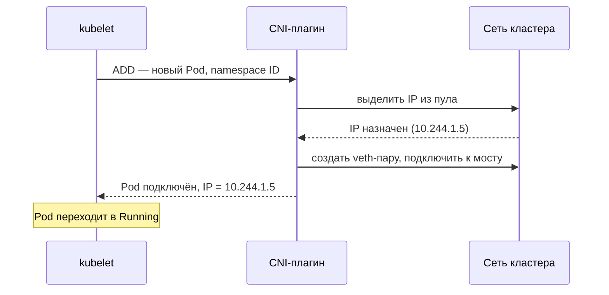

Популярные плагины: **Calico**, **Flannel**, **Cilium**, **Weave**. Все соблюдают контракт CNI, но реализуют маршрутизацию по-разному.

<!--
CNI — Container Network Interface — стандартный контракт между kubelet и сетевым плагином. При создании Pod kubelet вызывает CNI-плагин с командой ADD, передавая идентификатор сетевого namespace нового Pod. Плагин выделяет IP из своего пула, создаёт veth-пару: один конец в namespace Pod, другой на хосте, — и подключает Pod к overlay-сети или физической сети кластера. Разные плагины реализуют маршрутизацию по-разному: Flannel использует VXLAN-туннели, Calico — BGP-маршрутизацию, Cilium — eBPF. Но для kubelet они все выглядят одинаково — это и есть ценность стандартизированного интерфейса.
-->

---

# kube-proxy: реализация Service на узле

| Режим | Механизм | Характеристики |
|---|---|---|
| **userspace** (устарел) | прокси в пространстве пользователя | медленный, не используется |
| **iptables** | правила NAT в ядре | надёжный; линейный поиск при большом числе правил |
| **IPVS** | встроенный балансировщик ядра | хеш-таблицы, лучше масштабируется при тысячах Service |

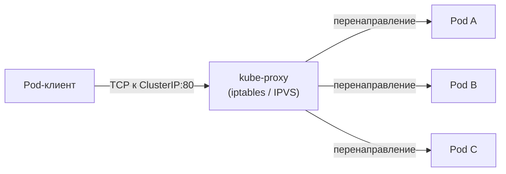

<!--
kube-proxy работает на каждом узле и реализует абстракцию Service. Когда Pod обращается к виртуальному IP сервиса (ClusterIP), kube-proxy перехватывает этот трафик и перенаправляет к одному из Pod-бэкендов. Режим iptables — текущий дефолт: для каждого Service и каждого Pod-бэкенда создаётся цепочка правил NAT в ядре. Это хорошо работает при умеренном числе сервисов, но при нескольких тысячах правила проверяются последовательно и замедляются. IPVS использует специализированный модуль ядра с хеш-таблицами и линейно масштабируется при большом числе Service.
-->

---
layout: section
---

<div class="section-no">04</div>

# Базовые объекты Kubernetes

Pod, ReplicaSet, Deployment, Service, Namespace, CoreDNS

<!--
Четвёртый блок — объекты, с которыми инженер работает каждый день. Kubernetes предоставляет иерархию абстракций: от Pod как минимальной единицы планирования до Deployment, который управляет жизненным циклом набора Pod через ReplicaSet. Разберём каждый объект и связь между ними.
-->

---

# Pod — минимальная единица планирования

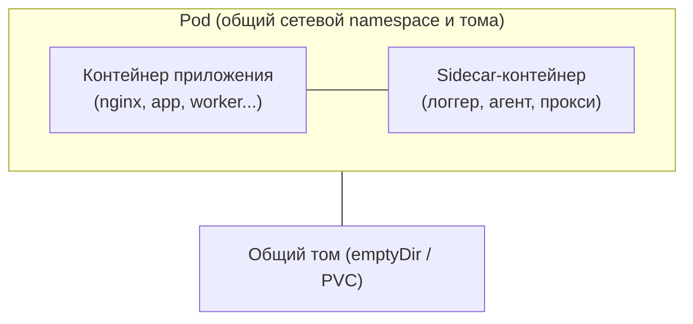

- Pod — атомарная единица: планируется, запускается и останавливается целиком
- Все контейнеры Pod разделяют IP-адрес и могут использовать общие тома
- Pod не перемещается между узлами — при сбое контроллер создаёт новый

<!--
Pod — это не просто контейнер. Это обёртка из одного или нескольких контейнеров, которые всегда запускаются вместе на одном узле, разделяют сетевой namespace и могут использовать общие тома. Главное свойство Pod — атомарность: планировщик размещает Pod на узел целиком, не по отдельным контейнерам. Если Pod упал, контроллер не перемещает его — он создаёт новый Pod на другом или том же узле. Именно поэтому Pod является единицей планирования, а не контейнер: это ключевое отличие от того, как мы работали с docker run.
-->

---

# Жизненный цикл Pod

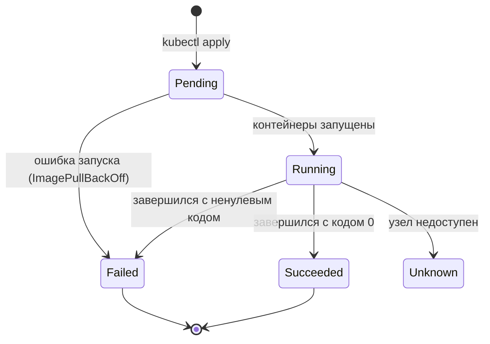

<div class="itmo-card-note mt-3">
Pod сам по себе не перезапускается при сбое. Перезапуск — ответственность контроллера (ReplicaSet): он создаёт новый Pod взамен упавшего.
</div>

<!--
Жизненный цикл Pod определён статусами. Pending — Pod создан в etcd, но контейнеры ещё не запущены: планировщик ищет узел или скачивается образ. Running — все контейнеры запущены. Succeeded — все контейнеры завершились с кодом 0, типично для Job. Failed — хотя бы один контейнер завершился с ненулевым кодом. Unknown — kubelet на узле не отвечает. Важный нюанс: Pod сам по себе не перезапускается при сбое. Перезапуск — ответственность контроллера, например ReplicaSet: он создаёт новый Pod взамен упавшего, обеспечивая нужное число реплик.
-->

---

# Sidecar в Pod

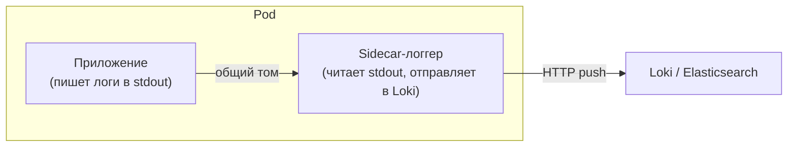

Паттерн sidecar — инфраструктурная нагрузка рядом с приложением:

- **Логгер** — сбор и отправка логов без изменений в коде приложения
- **Прокси** — в service mesh каждый Pod получает sidecar Envoy
- **Агент наблюдаемости** — метрики и трассировки без инфраструктурного кода

<!--
Sidecar — один из ключевых паттернов Kubernetes. В одном Pod с приложением запускается вспомогательный контейнер, который решает инфраструктурную задачу. Приложение пишет логи в stdout — sidecar-логгер их читает и отправляет в централизованное хранилище. В service mesh каждый Pod получает sidecar Envoy, который перехватывает весь входящий и исходящий трафик. Ключевое преимущество: приложение не знает о существовании sidecar и не содержит инфраструктурного кода. Разделение ответственности — сервис делает бизнес-логику, sidecar — инфраструктурную задачу.
-->

---

# ReplicaSet и Deployment

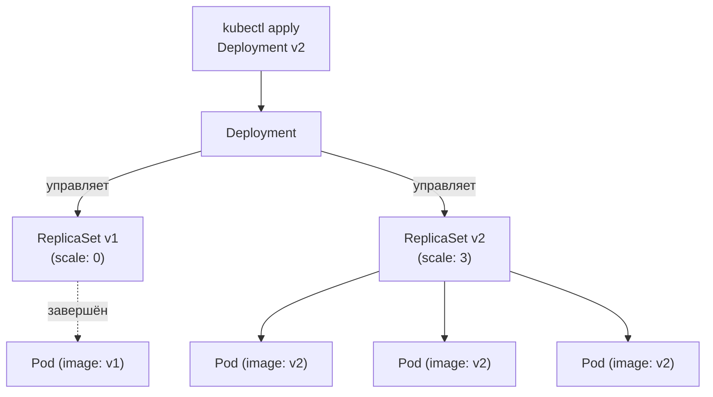

- **ReplicaSet** — гарантирует заданное число реплик Pod; редко используется напрямую
- **Deployment** — управляет историей ReplicaSet, декларирует стратегию обновления
- При обновлении образа Deployment создаёт новый ReplicaSet и постепенно его масштабирует

<!--
ReplicaSet решает одну задачу: поддерживать заданное число запущенных Pod. Если Pod упал, ReplicaSet создаёт новый. Если их больше нужного — удаляет лишние. Deployment — более высокая абстракция: он управляет ReplicaSet и декларирует стратегию обновления. При смене образа Deployment создаёт новый ReplicaSet с новым образом и постепенно переключает трафик, уменьшая старый ReplicaSet и увеличивая новый. Это rolling update. Откат к предыдущей версии — просто переключение Deployment на старый ReplicaSet. На практике инженер работает только с Deployment, а ReplicaSet создаётся автоматически.
-->

---

# Service: стабильный адрес для набора Pod

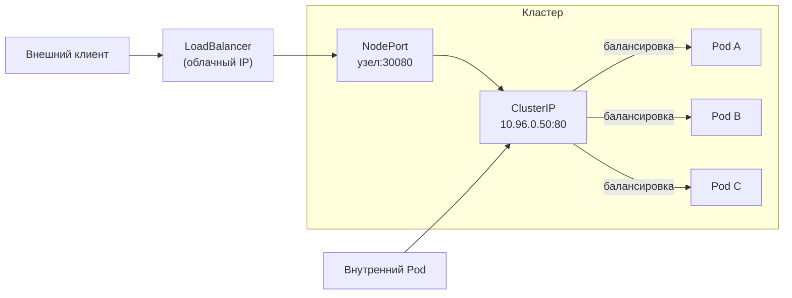

<!--
Service — абстракция, которая даёт стабильный виртуальный IP поверх динамического набора Pod. Pod могут пересоздаваться и менять адреса, а ClusterIP сервиса остаётся постоянным. ClusterIP доступен только внутри кластера — для сервисов, которые не нужны снаружи. NodePort публикует сервис на статичном порту каждого узла кластера — через него можно обратиться снаружи. LoadBalancer запрашивает у облачного провайдера внешний балансировщик с публичным IP. Service выбирает Pod-бэкенды по label selector, что позволяет обновлять Pod независимо от Service.
-->

---

# Namespace: логическое разделение кластера

<div class="grid grid-cols-2 gap-3">

<div class="itmo-card">

**Что изолирует Namespace**

Объекты разных Namespace не пересекаются по именам. Pod в `dev` и Pod в `prod` могут называться одинаково.

</div>

<div class="itmo-card">

**Что не изолирует**

Сетевая связность по умолчанию не ограничена: Pod из `dev` может обратиться к Pod в `prod`. Изоляцию даёт NetworkPolicy.

</div>

<div class="itmo-card-accent">

**Типичное деление**

`default`, `kube-system` (системные компоненты), `kube-public`, а также пользовательские: `dev`, `staging`, `prod`.

</div>

<div class="itmo-card-note">

**Квоты ресурсов**

ResourceQuota ограничивает суммарные CPU и память для Namespace — инструмент разделения ресурсов между командами.

</div>

</div>

<!--
Namespace — механизм логического разделения кластера. Внутри одного физического кластера можно разместить несколько окружений: dev, staging, prod. Объекты с одинаковыми именами в разных Namespace не конфликтуют. Важное ограничение: Namespace не даёт сетевой изоляции по умолчанию. Два Pod в разных Namespace могут свободно общаться. Для сетевой изоляции нужна NetworkPolicy — её разберём в следующей лекции. Namespace плюс ResourceQuota — стандартный инструмент организации многокомандного кластера: каждая команда работает в своём Namespace с выделенным бюджетом ресурсов.
-->

---

# CoreDNS: обнаружение сервисов по имени

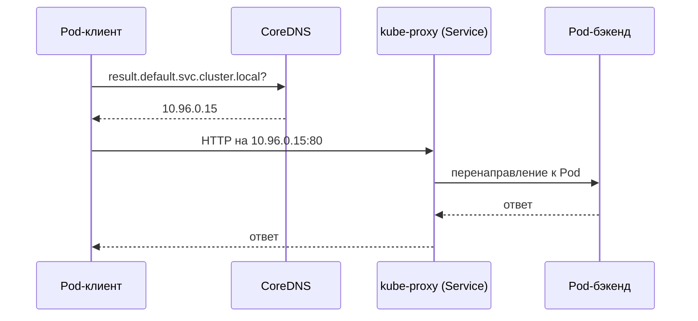

Шаблон DNS-имени: `<сервис>.<namespace>.svc.<cluster-domain>`

<!--
CoreDNS — DNS-сервер кластера. Каждый Pod настроен на использование CoreDNS как резолвера. Когда сервис vote хочет обратиться к сервису result, он делает DNS-запрос по имени. CoreDNS возвращает ClusterIP сервиса result — виртуальный IP. Далее трафик обрабатывает kube-proxy: он перенаправляет пакет к одному из фактических Pod. Клиент не знает IP Pod и не знает, сколько Pod-бэкендов. Полное DNS-имя включает namespace и суффикс cluster.local, но в пределах одного namespace достаточно просто имени сервиса. Это прямое воплощение service discovery: клиент обращается по имени, система сама разрешает его в актуальный адрес.
-->

---
layout: section
---

<div class="section-no">05</div>

# Критерии, отказы, свидетельства

Когда выбрать Kubernetes, что может сломаться и как это найти

<!--
Финальный блок лекции. Мы разобрали архитектуру и объекты Kubernetes. Теперь — аналитическая часть: критерии выбора, режимы отказа и команды диагностики. Это то, чем системный аналитик пользуется при оценке инфраструктурных решений и при расследовании инцидентов.
-->

---

# Критерии выбора оркестратора

| Критерий | docker-compose | Docker Swarm | PaaS | Kubernetes |
|---|---|---|---|---|
| Число хостов | 1 | 2–20 | облако | любое |
| Авто-восстановление | нет | частично | да | да |
| Авто-масштабирование | нет | частично | ограничено | да (HPA) |
| Сетевые политики | нет | нет | нет | да |
| Зрелость команды | любая | средняя | любая | высокая |
| Операционная нагрузка | минимальная | низкая | минимальная | высокая |

<div class="itmo-card-note mt-3">
Kubernetes оправдан при многих сервисах, потребности в автоматическом управлении и наличии инфраструктурной экспертизы. Для простого приложения compose или PaaS — правильный выбор.
</div>

<!--
Таблица критериев — главный инструмент системного аналитика при выборе оркестратора. Kubernetes не является правильным ответом на все вопросы. Для одного хоста и небольшого числа сервисов docker-compose предпочтителен: он проще в настройке и эксплуатации. Docker Swarm занимает промежуточное положение: поддерживает несколько хостов, но существенно беднее Kubernetes по возможностям. PaaS скрывает операционную сложность за счёт ограничения гибкости. Kubernetes оправдан, когда нужны сетевые политики, авто-масштабирование, сложные стратегии деплоя и когда команда готова нести операционную нагрузку управления кластером.
-->

---

# Режимы отказа

<div class="grid grid-cols-2 gap-3">

<div class="itmo-card-warn">

**Недоступность узла**

kubelet перестаёт отвечать. Node-контроллер через `node-monitor-grace-period` переводит узел в NotReady. Pod eviction запускается через `pod-eviction-timeout` (по умолчанию 5 мин).

</div>

<div class="itmo-card-warn">

**Потеря или деградация etcd**

Большинство узлов etcd недоступно. API-сервер переходит в режим только для чтения. Запущенные Pod продолжают работу, но управление кластером недоступно.

</div>

<div class="itmo-card-warn">

**Застрявший цикл сверки**

Контроллер не может привести систему к желаемому состоянию: нет ресурсов, ошибка образа или конфликт политик. Pod зависает в Pending или CrashLoopBackOff.

</div>

<div class="itmo-card-warn">

**Нехватка ресурсов**

Scheduler не находит узел с достаточными CPU/памятью. Pod остаётся в Pending с событием `0/N nodes are available`. Причина — неправильные requests или нехватка ёмкости.

</div>

</div>

<!--
Четыре типичных режима отказа в Kubernetes. Недоступность узла — контроллер узлов обнаруживает пропадание heartbeat и через несколько минут начинает переносить Pod на здоровые узлы. Потеря etcd опасна: без кворума Raft кластер не может принимать изменения, работающие Pod продолжают работу, но никакого управления нет. Застрявший reconciliation обычно проявляется через события: `kubectl describe` покажет причину. Нехватка ресурсов — Pod зависает в Pending, и событие точно описывает, чего не хватает. Эти режимы разберём на практике в лабораторной 2.
-->

---

# Свидетельства: инструменты диагностики

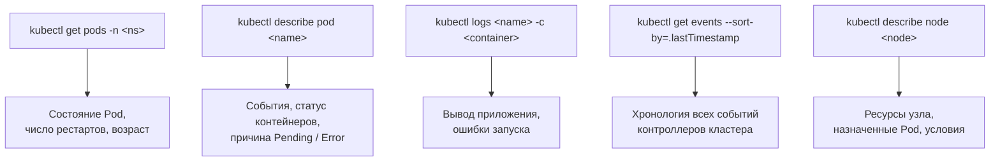

<!--
Диагностика в Kubernetes следует одной логике: наблюдать симптом в статусе Pod, затем углубляться через describe и события. Команда `kubectl get pods` даёт первый сигнал: статус, число рестартов. Подозрительный Pod — шаг к `kubectl describe`: здесь видны события контроллеров, причины Pending или ошибок. Логи — следующий уровень: что пишет приложение при запуске. Команда `kubectl get events` показывает хронологию всего, что происходило в namespace. `kubectl describe node` — когда проблема на уровне ресурсов узла. Мост к лабораторной 2: весь этот арсенал применяется для диагностики развёрнутого voting-app.
-->

---

# Расшифровка событий контроллеров

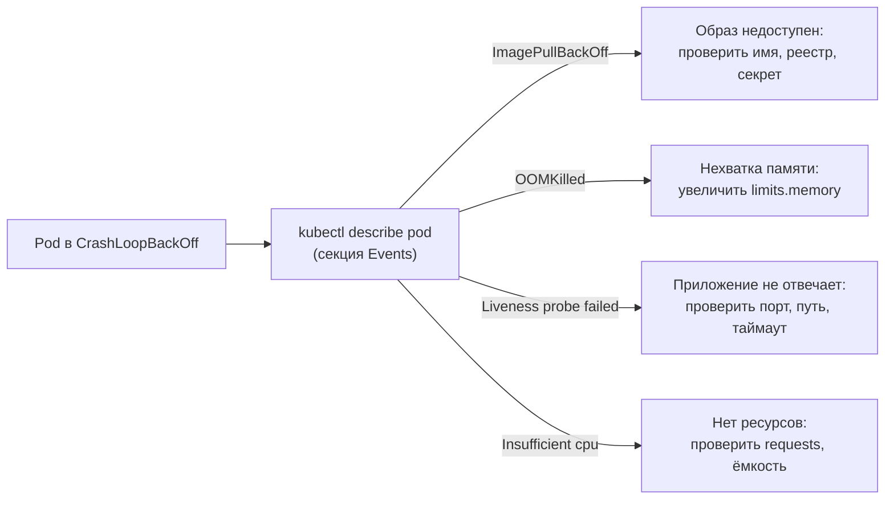

<div class="itmo-card-note mt-3">
События хранятся по умолчанию 1 час. Для исторического анализа используют централизованные логи и системы наблюдаемости.
</div>

<!--
CrashLoopBackOff — один из самых частых статусов при отладке. Kubernetes пытается запустить контейнер, тот падает, и система ждёт экспоненциально растущий интервал перед следующей попыткой. Команда `kubectl describe pod` в секции Events покажет причину. ImagePullBackOff означает, что образ не удалось скачать: неверное имя, недоступный реестр или отсутствующий imagePullSecret. OOMKilled — ядро убило процесс из-за превышения лимита памяти. Liveness probe failed — приложение запустилось, но не отвечает на health-check. Insufficient cpu — планировщик не нашёл подходящий узел. Каждый случай указывает на конкретное действие по устранению.
-->

---
layout: center
---

# Итоги

- **Декларативная модель** — описываем желаемое состояние, система устраняет расхождения через цикл сверки
- **etcd — память кластера**: потеря большинства узлов etcd лишает управления; бэкап обязателен
- **Сетевая модель**: каждый Pod — отдельный IP, плоская сеть без NAT, CNI реализует маршрутизацию
- **Объекты**: Pod → ReplicaSet → Deployment — иерархия управления репликами; Service и CoreDNS — стабильный адрес и имя
- **Kubernetes оправдан** при многих сервисах, зрелой команде и потребности в авто-управлении

**Дальше: Лекция 8** — управление приложением в кластере: стратегии обновления, health probes, авто-масштабирование и Helm.

Опорная литература: С. Джеймс, Л. Валлери «Kubernetes и сети. Многоуровневый подход». БХВ Петербург, 2024.

<!--
Подведём итоги. Центральная идея лекции — декларативное управление по состоянию. Пользователь описывает желаемый результат в манифесте, система непрерывно сверяет его с реальностью и исправляет расхождения. Это делает Kubernetes самовосстанавливающейся системой. Архитектура кластера разделена на управляющий слой и рабочие узлы; все компоненты взаимодействуют через единую точку. Сетевая модель с плоской адресацией и CNI упрощает маршрутизацию. Базовые объекты — Pod, Deployment, Service, CoreDNS — образуют строительные блоки для любого приложения. В следующей лекции перейдём к управлению приложением в работающем кластере.
-->
