
Лекция 8

# Управление приложением в кластере Kubernetes

Выкат, здоровье, масштаб: управление риском релиза

<!--
Добрый день. Сегодняшняя лекция закрывает ключевой практический вопрос: как работать с приложением, которое уже запущено в кластере Kubernetes. Предыдущая лекция объяснила, как устроен сам кластер — control plane, kubelet, reconciliation loop. Теперь мы смотрим на следующий уровень: как выкатить новую версию без простоя, как убедиться, что сервис жив, как масштабировать его под нагрузку и как управлять конфигурацией. Центральная идея лекции — управление приложением это управление риском релиза, и каждый инструмент, который мы рассмотрим, является рычагом снижения этого риска.
-->

---

# Маршрут лекции

  

    <strong>01 Стратегии выката</strong> RollingUpdate, Blue/Green, Canary
  

  

    <strong>02 Проверки здоровья</strong> liveness, readiness, startup
  

  

    <strong>03 Автомасштабирование</strong> HPA, вертикальное масштабирование
  

  

    <strong>04 Конфигурация</strong> ConfigMap, Secret, Helm
  

  

    <strong>05 Маршрутизация</strong> Service, Ingress, NetworkPolicy
  

  

    <strong>06 Ресурсы и QoS</strong> requests/limits, классы качества
  

<!--
Лекция разбита на шесть смысловых блоков. Мы начнём с самого острого вопроса — как выкатывать без простоя, затем разберём механизмы, которые поддерживают это: пробы здоровья, масштабирование, конфигурация, маршрутизация и ресурсные гарантии. Каждый блок завершается критериями выбора или карточками с режимами отказа. В конце лекции вы должны уметь оценить стратегию выката для конкретного сервиса и объяснить, какие механизмы кластера её реализуют.
-->

---

# Проблема: обновление без простоя

Сервис нужно обновлять регулярно, но пользователи требуют непрерывности.

  

    <strong>Наивный подход</strong> 
    Остановить v1 → Запустить v2 
    Итог: простой (~минуты)
  

  

    <strong>Нужный результат</strong> 
    v1 работает → v1+v2 одновременно → только v2 
    Итог: нулевой простой
  

<strong>Конфликт требований:</strong> быстрый выкат требует параллельной работы двух версий — это усложняет схему, но делает нулевой простой возможным.

<!--
Поставим задачу чётко. Наивный подход — остановить старую версию и запустить новую — гарантирует простой, который недопустим для производственных сервисов. Нужный результат выглядит иначе: в какой-то момент одновременно работают обе версии, трафик постепенно переходит к новой, старая уходит. Именно этот overlap и является источником сложности: нужно управлять совместимостью схем данных, маршрутизацией трафика и готовностью Pod'ов. Kubernetes предлагает несколько стратегий решения этой задачи с разными компромиссами.
-->

---
layout: section
---

01

# Стратегии выката

Выбор стратегии — это выбор между стоимостью ресурсов и точностью контроля риска

<!--
Первый блок посвящён стратегиям выката. Kubernetes предоставляет встроенную стратегию RollingUpdate, а паттерны Blue/Green и Canary реализуются поверх неё через управление Service и Ingress. Разберём каждую.
-->

---

# RollingUpdate: постепенная замена реплик

Стратегия по умолчанию: Deployment заменяет Pod'ы порциями.

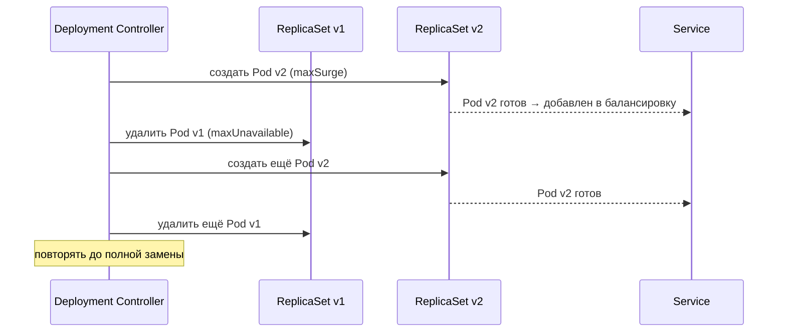

<strong>Параметры:</strong> <code>maxSurge</code> — сколько лишних Pod можно поднять сверх нормы; <code>maxUnavailable</code> — сколько Pod можно временно вывести из балансировки.

<!--
RollingUpdate работает так: Deployment Controller создаёт новый ReplicaSet для версии два и начинает постепенно переключать Pod'ы. Параметр maxSurge определяет, сколько лишних Pod'ов можно создать поверх желаемого числа реплик — это ускоряет выкат, но требует дополнительных ресурсов. Параметр maxUnavailable задаёт, сколько Pod'ов можно убрать из балансировки одновременно — при нуле ни один запрос не теряется. По умолчанию оба параметра равны 25 процентам. Ключевой момент: Service добавляет новый Pod в балансировку только после того, как readiness probe вернёт успех.
-->

---
layout: two-cols
---

# Blue/Green: мгновенный откат

Держим две полноценные среды; переключаем трафик целиком.

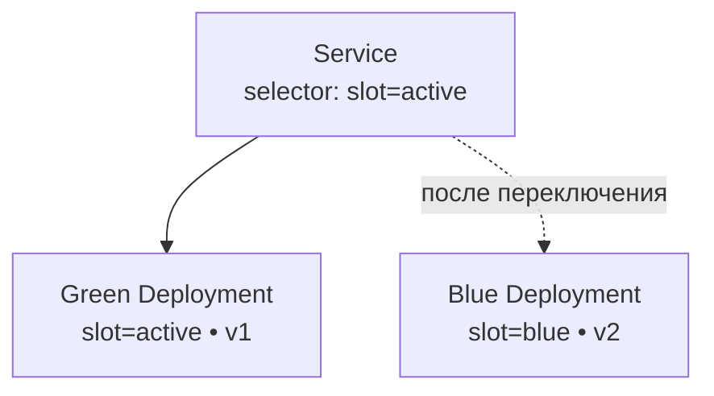

::right::

## Компромисс

Откат — одна команда: изменить selector обратно

<strong>Цена:</strong> двойные ресурсы в момент переключения

<strong>Применение:</strong> критичные сервисы, где простой дороже затрат на инфраструктуру

<!--
Blue/Green — паттерн с двумя одновременно живыми средами. Имена «синий» и «зелёный» условны: один Deployment работает и принимает трафик, второй разворачивается параллельно с новой версией. Переключение трафика делается изменением selector'а в Service — операция атомарна с точки зрения пользователя. Откат столь же прост: возвращаем selector назад. Главный недостаток — мы держим двойные ресурсы. Зато у нас всегда есть горячий резерв проверенной версии. В «Kubernetes и сетях» этот паттерн описывается как управление label-selector'ами Service.
-->

---

# Canary: контролируемый риск

Новая версия получает малую долю трафика; метрики решают, расширять ли выкат.

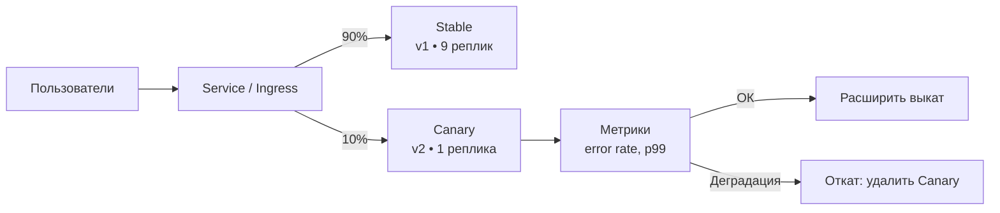

<!--
Canary — самая точная стратегия контроля риска. Мы выпускаем новую версию на малую долю реального трафика, наблюдаем ключевые метрики — частоту ошибок, задержку — и только при успехе расширяем выкат. В простейшем случае Canary реализуется числом реплик: одна реплика из десяти означает примерно десять процентов трафика. В продвинутых сценариях используется Ingress с весами или сервисная сетка. Ключевое отличие от Blue/Green: мы получаем сигнал с реального трафика до полного переключения, что позволяет поймать деградацию на ранней стадии.
-->

---

# Выбор стратегии выката

| Критерий | RollingUpdate | Blue/Green | Canary |
| --- | --- | --- | --- |
| Дополнительные ресурсы | минимум | ×2 | +1 реплика |
| Скорость отката | минуты | секунды | секунды |
| Контроль риска | низкий | средний | высокий |
| Сложность реализации | низкая | средняя | высокая |
| Сигнал с продакшена | нет | нет | да |

<strong>Правило выбора:</strong> для критичного сервиса с наблюдаемостью — Canary; для быстрого отката без наблюдаемости — Blue/Green; для простых сервисов — RollingUpdate.

<!--
Сведём стратегии в таблицу решений — это фирменный приём курса. Строки — критерии, которые реально влияют на выбор. RollingUpdate экономит ресурсы, но откат медленный, а риска почти нет — Kubernetes просто создаёт новые Pod'ы постепенно. Blue/Green даёт мгновенный откат ценой двойных ресурсов. Canary единственная стратегия, где мы получаем обратную связь с реального продакшен-трафика до полного переключения — и именно поэтому она рекомендуется в «Грокаем Continuous Delivery» Уилсона как основная для значимых изменений.
-->

---
layout: section
---

02

# Проверки здоровья

Пробы — единственный способ кластера понять, что происходит внутри контейнера

<!--
Стратегия выката работает правильно только тогда, когда кластер знает, что новый Pod действительно готов принимать трафик. Именно для этого существуют health probes — механизм опроса состояния контейнера. Разберём три типа проб и их семантику.
-->

---

# Три типа проб

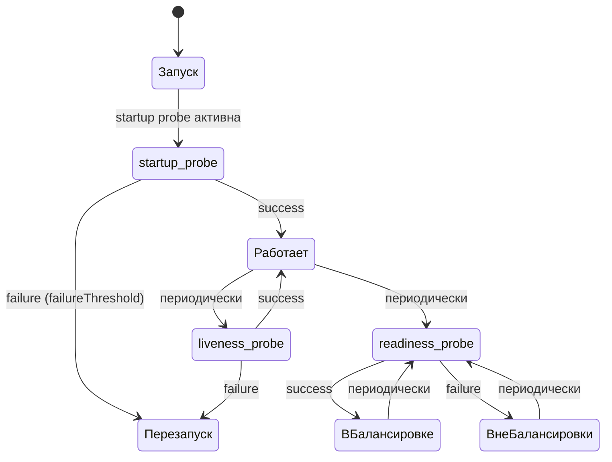

<!--
Диаграмма показывает жизненный цикл Pod'а с точки зрения проб. Startup probe работает только при запуске: она даёт приложению время на инициализацию, не позволяя liveness probe убить Pod раньше времени. После того как startup probe успешно прошла, начинают работать liveness и readiness. Liveness определяет, жив ли процесс, — при провале кластер перезапускает контейнер. Readiness определяет, готов ли Pod принимать трафик, — при провале Pod убирается из балансировки Service, но не перезапускается. Разница принципиальна: liveness управляет жизнью контейнера, readiness — его присутствием в балансировке.
-->

---
layout: two-cols
---

# Liveness и Readiness: семантика

**Liveness probe** — «жив ли процесс?»

- Провал → перезапуск контейнера
- Примеры: deadlock, зависший поток
- Слишком строгая → бесконечный CrashLoopBackOff

::right::

**Readiness probe** — «готов ли принимать трафик?»

- Провал → вывод из балансировки, Pod остаётся
- Примеры: прогрев кэша, зависимость недоступна
- Слишком строгая → постоянная неготовность

Правило: liveness проверяет процесс, readiness — зависимости

<!--
Разберём семантику точнее. Liveness probe отвечает на вопрос: нужно ли убить и перезапустить контейнер? Если приложение зависло в deadlock — нет смысла ждать, нужен перезапуск. Readiness probe отвечает на другой вопрос: стоит ли направлять трафик на этот Pod прямо сейчас? Если зависимость временно недоступна — Pod не перезапускают, но трафик переключают на другие реплики. Ключевая ошибка при настройке — проверять в liveness то, что стоит проверять в readiness: например, доступность базы данных. База недоступна — Pod начинает бесконечно перезапускаться вместо того, чтобы просто выйти из балансировки.
-->

---

# Startup Probe: долгий запуск

Для приложений с длительной инициализацией.

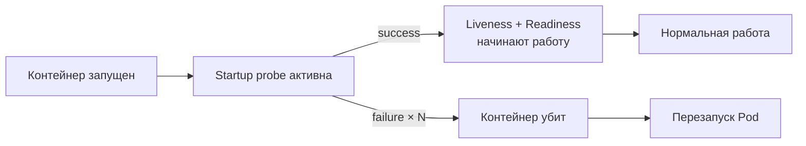

<strong>Пример расчёта:</strong> initialDelaySeconds + failureThreshold × periodSeconds. При failureThreshold=30 и periodSeconds=10 приложению даётся до 5 минут на запуск, не мешая остальным пробам.

<!--
Startup probe решает специфическую проблему: приложения на JVM или с большой инициализацией могут запускаться несколько минут. Если задать большой initialDelaySeconds в liveness probe — мы откладываем обнаружение реальных сбоев после запуска. Startup probe изолирует фазу инициализации: пока она не прошла, liveness и readiness молчат. Это позволяет задать жёсткие параметры liveness для рабочей фазы и мягкие для старта. Kubernetes добавил startup probe в версии 1.16, и её появление решило частую проблему с Java-приложениями в кластере.
-->

---
layout: section
---

03

# Автомасштабирование

Кластер сам меняет число реплик под нагрузку

<!--
Проверки здоровья говорят кластеру, работает ли сервис. Следующий вопрос — сколько реплик нужно в данный момент? Ручное масштабирование не успевает за пиками нагрузки. Kubernetes предлагает автоматическое — горизонтальное и вертикальное.
-->

---

# HPA: горизонтальное автомасштабирование

Horizontal Pod Autoscaler меняет число реплик по метрике.

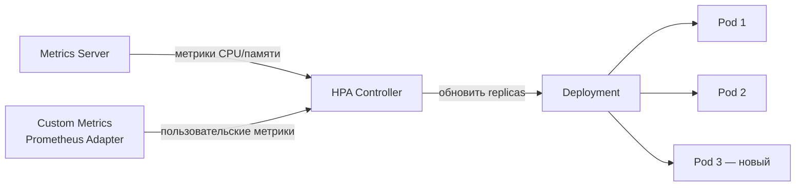

  

    <strong>Стандартные метрики:</strong> CPU utilization, Memory utilization (через Metrics Server)
  

  

    <strong>Пользовательские:</strong> RPS, длина очереди, latency (через Prometheus Adapter)
  

<!--
HPA — это контроллер, который периодически опрашивает Metrics Server или адаптер кастомных метрик и сравнивает текущее значение с целевым. Если CPU всех Pod'ов превышает семьдесят процентов от запрошенного, HPA увеличивает число реплик. Важный момент: HPA масштабирует только по соотношению текущего потребления к requests — поэтому requests обязательно должны быть выставлены корректно. Пользовательские метрики через Prometheus Adapter позволяют масштабировать по бизнес-метрикам: количеству запросов в секунду или длине очереди задач. Это значительно точнее, чем CPU, для большинства веб-сервисов.
-->

---

# Горизонтальное и вертикальное масштабирование

| Критерий | Горизонтальное (HPA) | Вертикальное (VPA) |
| --- | --- | --- |
| Что меняется | Число реплик | CPU/память Pod'а |
| Применимость | Stateless сервисы | Stateful, сложно реплицировать |
| Скорость реакции | секунды | требует перезапуска Pod |
| Ограничение | нужна репликация | ограничен размером узла |
| Совместимость | с HPA вместе не используются | нельзя с HPA по одной метрике |

Правило: горизонтальное масштабирование — основное для stateless сервисов; вертикальное — для baselining requests/limits

<!--
Сравним два подхода. Горизонтальное масштабирование добавляет реплики — это работает только для stateless сервисов, где любой Pod обрабатывает любой запрос. Вертикальное изменяет ресурсы самого Pod'а: увеличивает CPU и память. Это нужно для сервисов, которые трудно реплицировать, например баз данных. Важное ограничение: HPA и VPA нельзя использовать одновременно на одной и той же метрике, это создаёт конфликт контроллеров. На практике VPA часто используют не для автоматического масштабирования в продакшене, а для определения правильных значений requests/limits на основе наблюдаемого потребления.
-->

---
layout: section
---

04

# Конфигурация приложения

ConfigMap и Secret отделяют конфигурацию от образа

<!--
Следующий блок — как передавать приложению настройки, не зашивая их в образ контейнера. Двенадцатый фактор методологии twelve-factor говорит: конфигурация должна быть отделена от кода. В Kubernetes это реализуется через ConfigMap и Secret.
-->

---

# ConfigMap и Secret

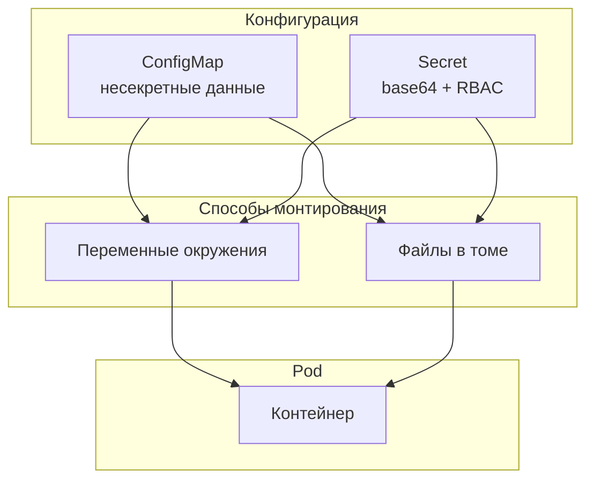

<!--
ConfigMap хранит несекретную конфигурацию: URL сервисов, параметры приложения, файлы конфигурации. Secret хранит чувствительные данные — пароли, токены, сертификаты. Оба объекта подключаются к Pod'у одинаково: как переменные окружения или как файлы в монтируемом томе. Ключевое преимущество: один образ контейнера работает в dev, stage и production с разными ConfigMap. Важное предупреждение про Secret: в Kubernetes они по умолчанию хранятся в etcd в base64, а не зашифрованными. Реальная безопасность требует encryption at rest для etcd или внешнего хранилища секретов — Vault или cloud KMS.
-->

---

# Helm: шаблонизация и пакетирование манифестов

Helm упаковывает набор манифестов в версионируемый чарт.

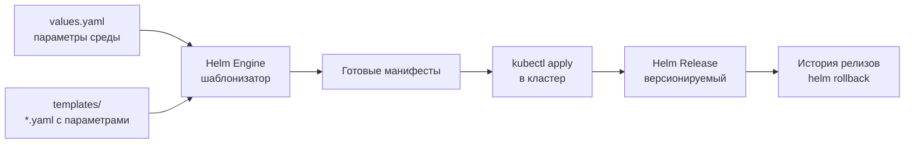

<strong>Один чарт — много сред:</strong> values-dev.yaml / values-prod.yaml передают разные параметры в один шаблон

<!--
Helm решает задачу, которая возникает сразу, как только манифестов становится больше трёх: как управлять ими как единым целым, как параметризовать под разные среды и как откатываться. Чарт — это директория с шаблонами манифестов и файлом values.yaml. При установке Helm подставляет значения из values в шаблоны и применяет результат в кластер. Созданный релиз версионируется: helm rollback вернёт предыдущую версию манифестов. Для voting-app это означает, что один чарт описывает весь стек, а dev и prod отличаются только файлом values — числом реплик, именами образов, ресурсными лимитами.
-->

---
layout: section
---

05

# Маршрутизация трафика

Service и Ingress — два уровня входа в приложение

<!--
Мы разобрались, как выкатывать, проверять здоровье, масштабировать и конфигурировать приложение. Теперь — как трафик попадает к нужным Pod'ам и как организована сегментация сети.
-->

---

# Service: стабильный вход к репликам

Service даёт постоянный виртуальный IP и DNS-имя для набора Pod'ов.

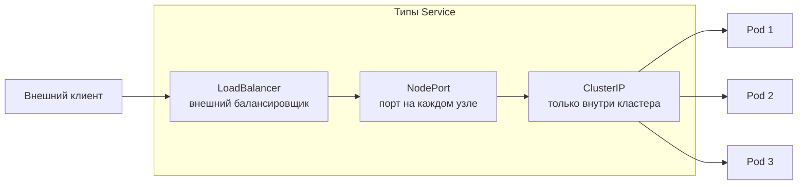

<!--
Service в Kubernetes — это не процесс, а абстракция: виртуальный IP-адрес с постоянным DNS-именем, за которым стоит динамический набор Pod'ов. kube-proxy реализует эту абстракцию через iptables или IPVS, направляя запросы к реальным Pod'ам. ClusterIP доступен только внутри кластера — для взаимодействия между сервисами. NodePort открывает порт на каждом узле кластера для внешнего доступа. LoadBalancer запрашивает внешний балансировщик у облачного провайдера. Ключевое свойство: Service использует label selector для выбора Pod'ов — именно этот механизм используется в Blue/Green для переключения трафика.
-->

---

# Ingress: маршрутизация уровня HTTP

Ingress добавляет L7-маршрутизацию: по хосту, по пути, TLS-терминацию.

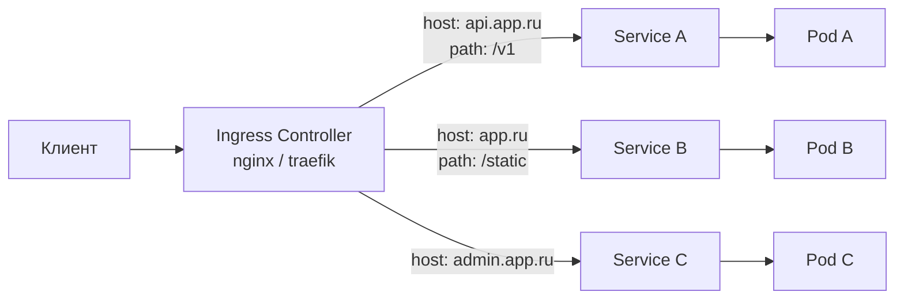

<strong>Ingress-контроллер</strong> — это Pod, который читает объекты Ingress и настраивает реальный прокси. Kubernetes не включает контроллер по умолчанию — его нужно установить отдельно.

<!--
Service работает на уровне L4 — TCP/UDP. Ingress добавляет уровень L7 — HTTP. Один Ingress-контроллер, например nginx или traefik, читает объекты Ingress из API-сервера и настраивает маршрутизацию: этот хост идёт в этот Service, этот путь — в тот. Также Ingress берёт на себя TLS-терминацию: сертификат хранится в Secret, контроллер расшифровывает HTTPS и передаёт трафик дальше по HTTP внутри кластера. Важный момент для архитектора: объект Ingress — это декларация маршрутов, но реальную работу делает контроллер. Нет контроллера — объекты Ingress существуют, но не работают.
-->

---

# NetworkPolicy: сегментация трафика

По умолчанию все Pod'ы в кластере могут общаться друг с другом.

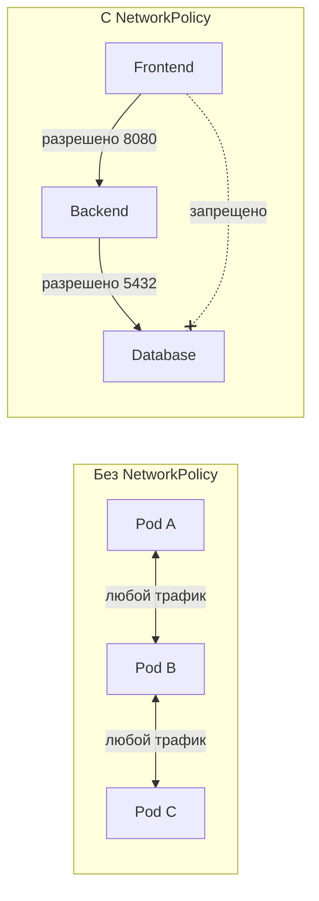

<!--
NetworkPolicy — это декларативные правила файервола для Pod'ов. По умолчанию в Kubernetes сеть плоская: любой Pod может обратиться к любому другому. NetworkPolicy вводит сегментацию: мы явно разрешаем только нужные пути. Пример на диаграмме: Frontend может обращаться к Backend, Backend к Database, но Frontend к Database — нет. Это ограничивает радиус поражения при компрометации: даже если Frontend взломан, атакующий не получает прямого доступа к базе данных. Важно: NetworkPolicy работает только если CNI-плагин её поддерживает. Flannel, например, не поддерживает — нужен Calico или Cilium.
-->

---
layout: section
---

06

# Ресурсы и QoS

Requests и limits определяют, как планировщик размещает Pod'ы и что происходит при нехватке ресурсов

<!--
Последний технический блок — управление ресурсами. Kubernetes позволяет точно задать, сколько CPU и памяти нужно каждому Pod'у. Это влияет на планирование, на плотность размещения и на поведение при перегрузке узла.
-->

---

# Requests и Limits

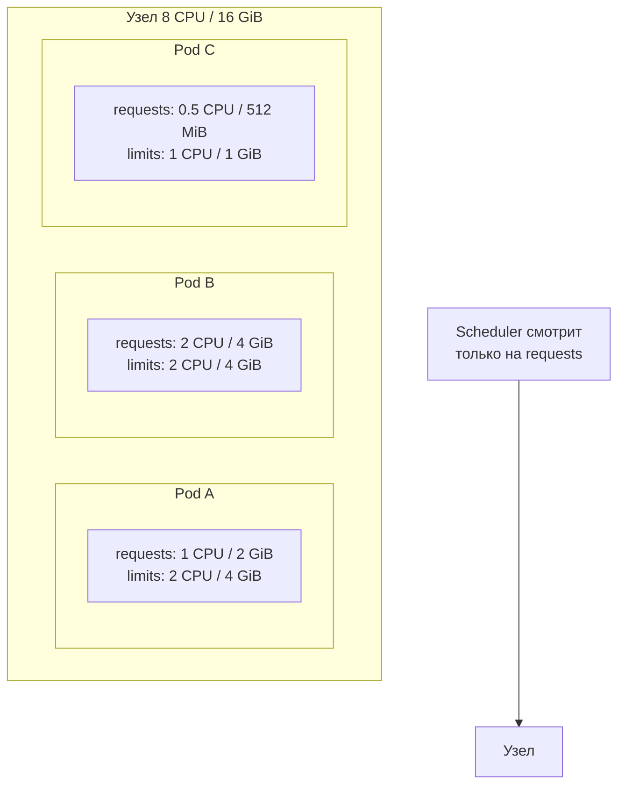

<!--
Requests — это гарантированный минимум: scheduler размещает Pod на узле, если на нём достаточно свободных requests. Limits — это потолок потребления. Если Pod превысит лимит CPU — он будет ограничен throttling'ом. Если превысит лимит памяти — получит OOM kill и перезапустится. Ключевой момент: scheduler смотрит только на requests при размещении, но не на фактическое потребление. Это позволяет делать overcommit — размещать Pod'ов с суммарными requests больше, чем физических ресурсов, при условии, что они не используют максимум одновременно. Это тема, которую мы подробно разберём в Лекции 15.
-->

---

# QoS-классы: приоритет при нехватке ресурсов

| Класс | Условие | Приоритет вытеснения |
| --- | --- | --- |
| Guaranteed | requests == limits для CPU и памяти | последний |
| Burstable | requests &lt; limits хотя бы для одного ресурса | средний |
| BestEffort | requests и limits не заданы | первый |

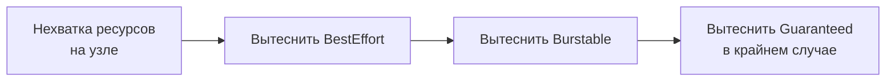

<!--
На основе соотношения requests и limits Kubernetes автоматически присваивает Pod'у класс QoS. Guaranteed — когда requests равны limits для CPU и памяти: планировщик гарантирует ресурсы, Pod вытесняется последним. BestEffort — когда ничего не задано: Pod получает ресурсы, только если они свободны, и вытесняется первым. Burstable — промежуточный вариант. При нехватке ресурсов на узле kubelet последовательно вытесняет Pod'ы от менее к более приоритетным. Для производственных сервисов рекомендуется класс Guaranteed или Burstable с явно заданными requests. Подробный анализ — в Лекции 15 про проектирование надёжности.
-->

---
layout: section
---

07

# Критерии, режимы отказа, свидетельства

Аналитическая рамка: выбор стратегии и диагностика

<!--
Завершающий блок лекции следует аналитической рамке курса: критерии выбора, режимы отказа и свидетельства — то, как проверить происходящее в реальной системе.
-->

---

# Выбор стратегии под требования

| Требование | RollingUpdate | Blue/Green | Canary |
| --- | --- | --- | --- |
| Нулевой простой | да | да | да |
| Мгновенный откат | нет | да | да |
| Экономия ресурсов | да | нет | частично |
| Контроль на реальном трафике | нет | нет | да |
| Простота поддержки | высокая | средняя | низкая |

Для критичного сервиса с метриками — Canary с автоматическим анализом. Для простого stateless сервиса — RollingUpdate с readiness probe.

<!--
Резюмируем критерии выбора в таблицу. Нулевой простой обеспечивают все три стратегии при правильной настройке readiness probe. Мгновенный откат — только Blue/Green и Canary. Экономия ресурсов — RollingUpdate. Контроль на реальном продакшен-трафике — только Canary. Для системного аналитика важно не выбрать «лучшую» стратегию абстрактно, а сопоставить требования конкретного сервиса с компромиссами каждой стратегии. Простой CRUD-сервис не нуждается в Canary. Платёжный сервис не может позволить себе неконтролируемый RollingUpdate.
-->

---

# Режимы отказа

  

    <strong>CrashLoopBackOff</strong> 
    Pod падает сразу после запуска. Kubernetes перезапускает с экспоненциальной задержкой. Причины: ошибка конфигурации, недоступна зависимость, ошибка в приложении.
  

  

    <strong>Постоянная неготовность</strong> 
    Pod работает, но readiness probe всегда возвращает ошибку. Трафик не идёт. Причины: слишком строгие пороги, внешняя зависимость недоступна.
  

  

    <strong>Зависший выкат</strong> 
    Deployment не прогрессирует: новые Pod'ы не проходят readiness. Старые держатся. Выкат остановлен — ни вперёд, ни назад без вмешательства.
  

  

    <strong>OOM Kill при выкате</strong> 
    Новая версия потребляет больше памяти. Limits превышены — Pod убит. Без Guaranteed QoS могут вытесняться соседние Pod'ы на узле.
  

<!--
Четыре наиболее частых режима отказа, связанных с управлением приложением. CrashLoopBackOff — первое, что видит инженер при неудачном выкате: Pod стартует, падает, Kubernetes ждёт, снова стартует. Экспоненциальная задержка нарастает до пяти минут между попытками. Постоянная неготовность — коварный режим: приложение работает, Pod существует, но трафик не идёт, и это не всегда сразу заметно. Зависший выкат блокирует и старую, и новую версию в промежуточном состоянии. OOM Kill при выкате особенно опасен в Burstable-конфигурации: новая версия может вытеснить соседей по узлу.
-->

---

# Свидетельства: диагностика в кластере

Как читать состояние выката и находить причину проблемы.

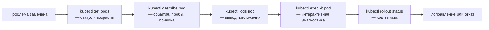

<!--
Цепочка диагностики начинается с широкого взгляда: kubectl get pods показывает статусы и сразу выдаёт CrashLoopBackOff или Pending. kubectl describe pod раскрывает события: что происходило с Pod'ом, какие пробы запускались и что вернули, какие сообщения оставил планировщик. kubectl logs показывает, что написало само приложение. kubectl exec позволяет зайти внутрь живого контейнера и проверить сетевую доступность зависимостей или содержимое конфигурационных файлов. kubectl rollout status отслеживает прогресс Deployment в реальном времени. Эти команды вы будете использовать в Лабораторной работе 2.
-->

---
layout: center
---

# Итоги

- Стратегия выката — это выбор компромисса между стоимостью ресурсов и точностью контроля риска
- Readiness probe — единственный сигнал кластеру, что Pod готов принимать трафик
- HPA масштабирует по метрикам; QoS-класс определяет приоритет при нехватке ресурсов
- ConfigMap и Secret отделяют конфигурацию от образа — один артефакт для всех сред
- NetworkPolicy вводит сегментацию; без неё кластер открыт «плоско»

**Дальше:** Лекция 9 — Git в контуре доставки: от стратегии ветвления к стратегии релиза

Опорная литература: С. Джеймс, Л. Валлери «Kubernetes и сети. Многоуровневый подход»; К. Уилсон «Грокаем Continuous Delivery»

<!--
Подведём итог. Управление приложением в кластере — это не набор команд, а система механизмов управления риском. Стратегия выката задаёт, как мы переходим от одной версии к другой. Readiness probe — ворота, через которые Pod попадает в трафик. HPA и QoS обеспечивают стабильность при изменениях нагрузки. ConfigMap и Secret отвязывают конфигурацию от кода. NetworkPolicy ограничивает радиус поражения при инцидентах. Следующая лекция поднимется на уровень выше: как стратегия ветвления в Git определяет возможности стратегии релиза — и почему это неразрывно связанные решения.
-->
