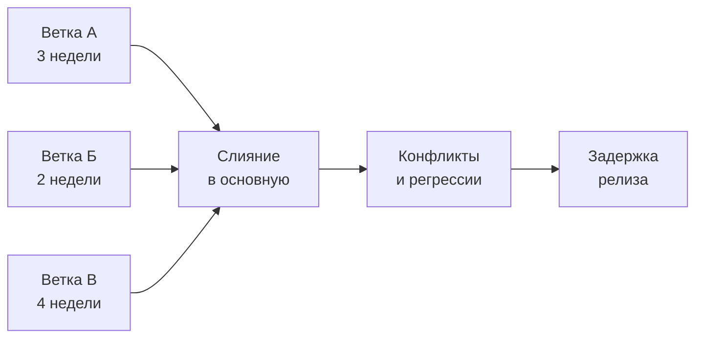
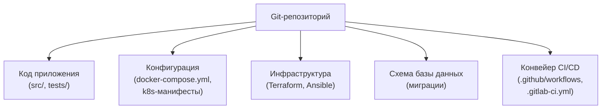
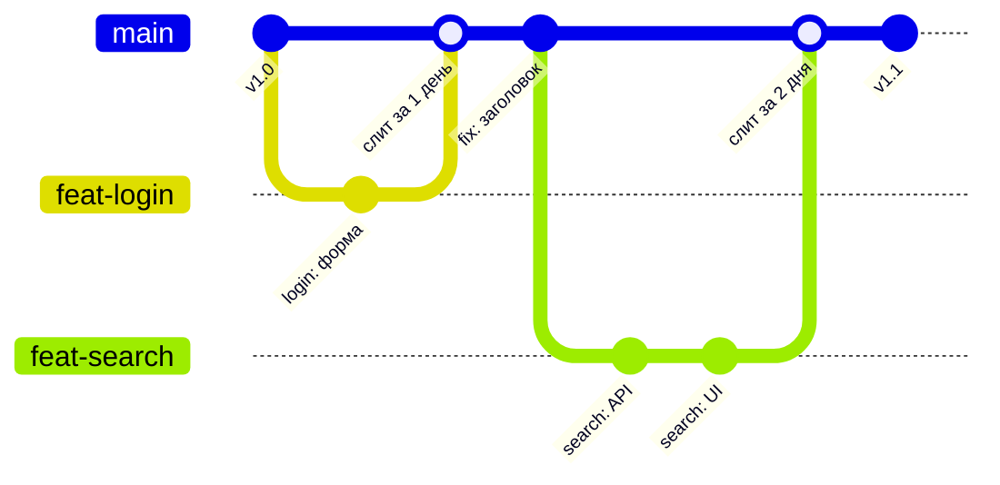
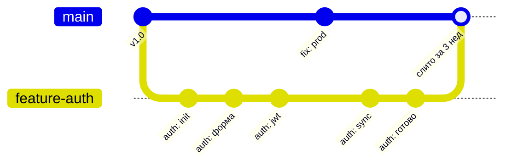
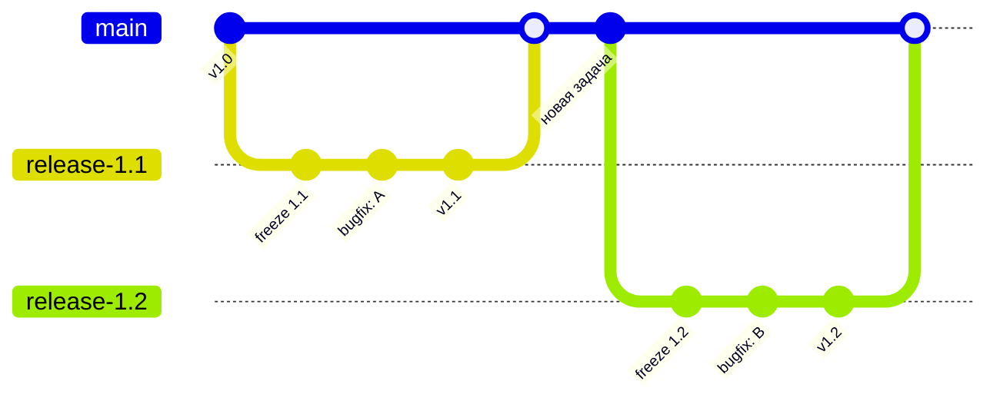
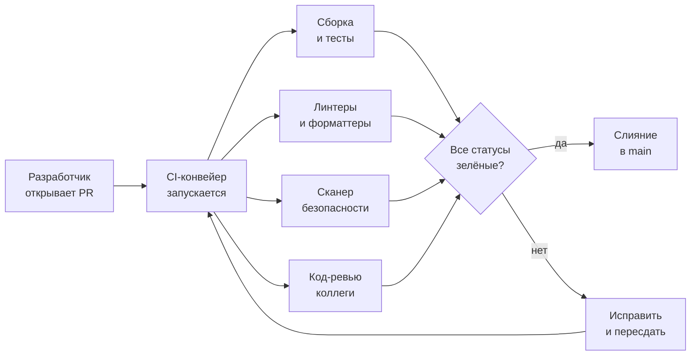
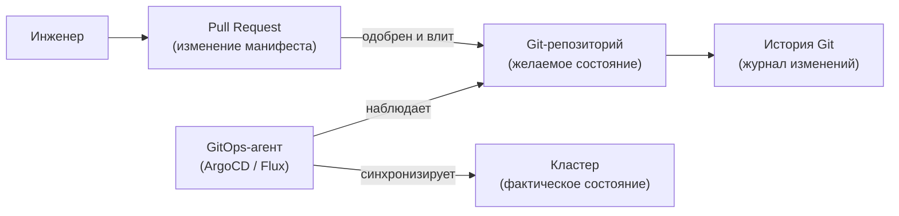
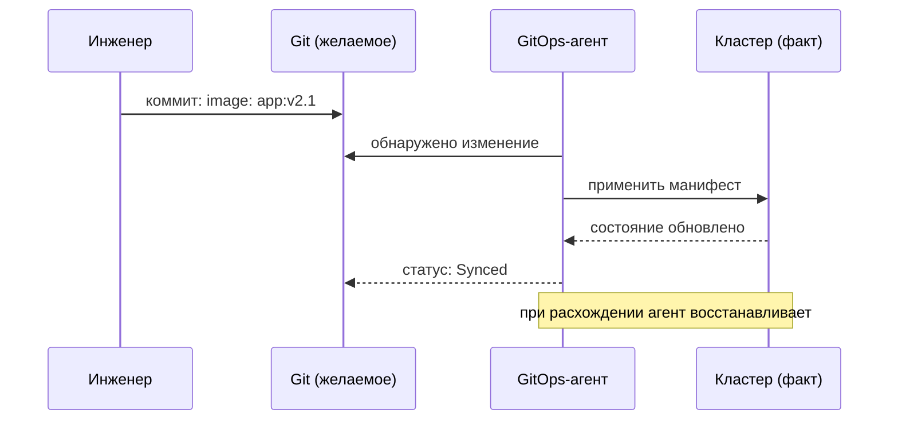
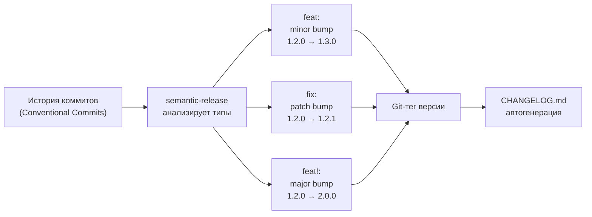
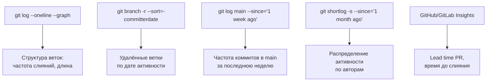

<div class="cover-kicker">Лекция 9</div>

# Git в контуре доставки

Стратегия ветвления — это стратегия релиза

<!--
В курсе ОПИ изучили внутреннее устройство Git: объектную модель, коммиты, ветки, слияния. Сегодня другой вопрос: как стратегия работы с Git влияет на скорость и предсказуемость доставки. Стратегия ветвления определяет стратегию релиза — от неё зависит, как часто команда выпускает изменения и каким риском сопровождается каждый релиз.
-->

---

# Маршрут лекции

- **01 Всё под контролем версий** — что кладём в репозиторий и почему это меняет воспроизводимость
- **02 Стратегии ветвления** — малые партии, trunk-based, feature branching, release trains
- **03 Pull Request** — точка встроенного контроля качества и автоматизации
- **04 Monorepo и polyrepo** — модели организации репозиториев
- **05 GitOps и конвенции** — Git как источник истины, Conventional Commits, semver
- **06 Критерии, режимы отказа, свидетельства** — аналитическая рамка и мост к Лаб 1

<!--
Trunk-based development: все разработчики коммитят в main, ветки живут часами, не неделями. Git Flow: долгоживущие ветки develop/release/hotfix. Компромисс: скорость (trunk) vs предсказуемость выпуска (git flow). DORA-данные поддерживают trunk: 208× более частые деплои у elite-команд.
-->

---

# Проблема: Git без стратегии



Три симптома «ада слияний»:

- долгие изолированные ветки расходятся с основной
- при слиянии — лавина конфликтов в общих модулях
- нестабильная основная ветка блокирует всю команду

<!--
Представим типичную картину: три разработчика работают в отдельных ветках по две-четыре недели. За это время основная ветка ушла вперёд — в общих модулях накопились изменения. При попытке слияния команда получает шквал конфликтов. После их разрешения обнаруживаются регрессии: каждая ветка работала отдельно, но вместе что-то сломалось. Это «ад слияний» — merge hell. Релиз откладывается. Это не ошибка отдельного разработчика — это системная проблема отсутствия явной стратегии ветвления, которую мы будем решать на протяжении всей лекции.
-->

---
layout: section
---

<div class="section-no">01</div>

# Всё под контролем версий

Код, конфигурация, инфраструктура, схема базы данных

<!--
Воспроизводимость системы — только когда всё, что влияет на поведение, лежит в VCS. Код приложения — необходимо; конфигурация, манифесты, миграции, CI/CD — тоже. Без них репозиторий описывает код, а не систему.
-->

---

# Мост из ОПИ

<div class="grid grid-cols-2 gap-3">

<div class="itmo-card">

**Пройдено в курсе ОПИ**

Объектная модель Git: blob, tree, commit. Ветки как указатели на коммит. Слияние и перебазирование. Разрешение конфликтов. Удалённые репозитории.

</div>

<div class="itmo-card">

**Входные данные этой лекции**

Git как инструмент совместной работы мы знаем. Сегодня изучаем, как выбор стратегии работы с Git влияет на скорость и безопасность доставки.

</div>

<div class="itmo-card-accent">

**Новый угол зрения**

VCS перестаёт быть просто «историей кода» — она становится моделью управления потоком изменений от разработчика до продакшена.

</div>

<div class="itmo-card-note">

**Системный вопрос лекции**

Как выбранная стратегия ветвления влияет на частоту релизов, риск слияний и стабильность основной ветки?

</div>

</div>

<!--
В курсе ОПИ Git изучался с точки зрения разработчика: как хранить историю изменений, как работать с ветками, как разрешать конфликты. Это необходимые знания, которые мы берём как входные. Сегодня меняем угол зрения: смотрим на Git глазами системного аналитика инфраструктуры. Вопрос не «как работает Git», а «как решения о ветвлении влияют на поток доставки». В «Руководстве по DevOps» Ким и соавторы описывают Git-репозиторий как первый шаг к воспроизводимому и прослеживаемому потоку поставки.
-->

---

# Что живёт в репозитории



Правило: если артефакт влияет на поведение системы — он под контролем версий.

<!--
Держать в репозитории только код приложения — неполная практика. Воспроизводимость среды достигается только тогда, когда под контролем версий находится всё, что определяет состояние системы. Конфигурация окружения, манифесты Kubernetes, Terraform-описания инфраструктуры, миграции базы данных, описания конвейеров CI/CD — всё должно быть в репозитории. Тогда любое состояние системы можно воспроизвести по коммиту: переключить ветку и развернуть точную копию среды. Уилсон в «Грокаем Continuous Delivery» называет это принципом «всё как код».
-->

---
layout: section
---

<div class="section-no">02</div>

# Стратегии ветвления

Малые партии, trunk-based development, feature branching, release trains

<!--
Стратегия ветвления определяет, как команда управляет потоком изменений. Начнём с малых партий — модели, объясняющей, почему размер изменения влияет на риск. Три стратегии: trunk-based, feature branching, release trains. В конце — таблица критериев выбора.
-->

---

# Малые партии: размер изменения и риск

<div class="grid grid-cols-2 gap-3">

<div class="itmo-card">

**Малое изменение**

Одна задача, 50—200 строк, 1—2 файла. Быстрое ревью — 1—2 часа. Понятная причина сбоя. Простой откат одним коммитом.

</div>

<div class="itmo-card">

**Крупное изменение**

Несколько задач, 500+ строк, 10+ файлов. Долгое ревью — дни. Сложно найти причину регрессии. Откат затрагивает неродственные изменения.

</div>

<div class="itmo-card-accent">

**Главный принцип**

Чем меньше изменение, тем ниже риск и быстрее обратная связь. Малые частые изменения интегрируются проще, чем редкие крупные.

</div>

<div class="itmo-card-note">

**Мост к метрикам DORA**

Lead time — время от коммита до продакшена — первая DORA-метрика скорости. Малые партии сокращают lead time и ускоряют обратную связь.

</div>

</div>

<!--
Размер изменения определяет когнитивную нагрузку ревьюера, время поиска причины регрессии и болезненность отката. 50-200 строк — ревьюер удерживает контекст в голове. 500+ строк — контекст теряется, ревью формальное. DORA 2023: команды с малыми частыми изменениями имеют change failure rate 0–5% против 16–30% у команд с редкими крупными релизами. Малые партии — не об осторожности; об управляемости.
-->

---

# Trunk-based development



- ветки короткие — от нескольких часов до одного-двух дней
- основная ветка всегда готова к релизу
- незавершённые функции скрыты за feature flags

<!--
Trunk-based: ветки живут часы, сливаются в main не реже раза в день. Незавершённый код закрывается feature flag — в ветке его нет. Интеграционные конфликты минимальны: ветка расходится от main максимум на день. По данным Accelerate (Forsgren, Humble, Kim 2018): команды, интегрирующие код ≥ раза в день, деплоят в 208 раз чаще и восстанавливаются после инцидентов в 2604 раза быстрее, чем низкопроизводительные команды с долгоживущими ветками.
-->

---

# Feature flags в trunk-based разработке


Feature flags отделяют **выкат** (deploy) от **включения** (release).

<!--
Feature flags — механизм разделения deploy и release в trunk-based разработке. Разработчик вливает в основную ветку незавершённый код, обёрнутый флагом. Флаг выключен — функция недоступна пользователям, хотя код уже в продакшене. Когда функция готова — флаг включается отдельно от выката. При проблеме: выключить флаг, без отката кода и повторного деплоя. Подробнее — лекция 12 об управлении конфигурацией.
-->

---

# Feature branching



- ветки живут дни и недели, команда работает изолированно
- интеграция откладывается — накапливается технический долг слияния
- при слиянии — ручное разрешение накопленных конфликтов

<!--
Feature branching — стратегия, при которой каждая функциональность разрабатывается в отдельной ветке до полной готовности. Ветки живут дни и недели, разработчики работают изолированно. На диаграмме видно: пока ветка feature-auth жила три недели, в main успел появиться fix: prod. Разработчику пришлось синхронизироваться с main вручную. При слиянии накопленные конфликты разрешались одним большим усилием. Уилсон в «Грокаем Continuous Delivery» называет долгоживущие ветки одним из главных препятствий для непрерывной интеграции.
-->

---

# Release trains



Фиксированный цикл: в назначенный момент «поезд отправляется» — кто не успел, ждёт следующего.

<!--
Release trains — стратегия с фиксированным циклом релизов: раз в неделю, в две недели, в месяц. В назначенный момент создаётся релизная ветка — «поезд отправляется». Что попало в ветку до отправления — идёт в релиз. Что не успело — ждёт следующего. На релизной ветке разрешены только баг-фиксы. Эта модель оправдана при строгих регуляторных требованиях или когда каждый релиз требует ручного тестирования и приёмки. Цена — отложенная интеграция новой функциональности и накопление незамёрженных изменений между циклами.
-->

---

# Сравнение стратегий ветвления

| Критерий | Trunk-based | Feature branching | Release trains |
|---|---|---|---|
| Жизнь ветки | часы — 1 день | дни — недели | недели — месяц |
| Частота интеграции | несколько раз в день | при готовности | по циклу |
| CI/CD зрелость | высокий уровень | средний | средний |
| Feature flags | обязательны | не нужны | не нужны |
| Конфликты слияния | минимальны | часты | накапливаются |

<div class="itmo-card-note mt-3">
Выбор стратегии — это выбор модели релиза. Trunk-based ускоряет поток и требует зрелой автоматизации. Ветвление даёт изоляцию ценой скорости интеграции.
</div>

<!--
Таблица сравнения стратегий — главный аналитический инструмент этого блока. Trunk-based development ускоряет поток изменений и снижает интеграционный риск, но требует зрелой автоматизации и умения работать с feature flags. Feature branching даёт изоляцию незавершённой работы ценой накопленных конфликтов при слиянии. Release trains оправданы при регуляторных циклах или фиксированных окнах релиза, но существенно снижают частоту доставки. Выбор стратегии — это не технический вопрос, а проектное решение о модели релиза, которое определяет операционную культуру всей команды.
-->

---
layout: section
---

<div class="section-no">03</div>

# Pull Request как точка автоматизации

Встроенный контроль качества и обязательные гейты

<!--
Pull Request — точка, в которой запускается автоматизация: сборка, тесты, линтеры, сканеры безопасности. Required status checks блокируют слияние до прохождения всех гейтов. Код-ревью тут же — человеческий контроль с машинным.
-->

---

# Pull Request: встроенный контроль



<!--
Pull Request — точка, где несколько параллельных проверок сходятся в одно решение. Как только разработчик открывает PR, CI-конвейер автоматически запускает сборку, тесты, линтеры и сканеры безопасности. Параллельно коллеги проводят код-ревью. Каждая проверка возвращает статус: пройдено или нет. Обязательный статус блокирует слияние, пока проверка не зелёная. Это делает контроль качества встроенным в процесс, а не добровольным или ручным. Нельзя случайно или намеренно влить изменение в обход автоматизации — это архитектурная защита от человеческой ошибки.
-->

---

# Обязательные статусы и гейты

<div class="grid grid-cols-2 gap-3">

<div class="itmo-card">

**Обязательные проверки**

Сборка, юнит-тесты, интеграционные тесты, линтер, форматирование. Блокируют слияние при любом сбое.

</div>

<div class="itmo-card">

**Обязательные ревьюеры**

Минимум один или два подтверждения от коллег. CODEOWNERS задаёт, кто отвечает за какую часть кода.

</div>

<div class="itmo-card-accent">

**Branch protection rules**

Правила защиты ветки в GitHub/GitLab делают обязательные статусы неотключаемыми. Даже администратор репозитория не может влить в обход.

</div>

<div class="itmo-card-note">

**Мост к Лаб 1**

В лабораторной работе 1 мы настраиваем CI-конвейер для voting-app: каждый PR проходит автоматическую сборку и тесты перед слиянием.

</div>

</div>

<!--
Обязательные статусы — это настройки платформы, а не договорённость команды. GitHub и GitLab позволяют задать список проверок, без прохождения которых слияние невозможно технически. Это принципиальное отличие от «нам надо договориться всегда запускать тесты» — гейты работают, даже когда человек спешит или забыл. Файл CODEOWNERS определяет, кто из команды должен одобрить изменения в конкретном модуле. Такая система создаёт доверие к основной ветке: если коммит попал в main — он прошёл все установленные проверки. Это фундамент для перехода к trunk-based разработке.
-->

---
layout: section
---

<div class="section-no">04</div>

# Monorepo и polyrepo

Модели организации репозиториев: границы владения, сборки, зависимостей

<!--
Monorepo или polyrepo — архитектурное решение с последствиями для сборки, сквозных изменений и границ владения. Google хранит весь код в одном репозитории (Piper) и решает проблемы масштаба специализированными инструментами. Netflix использует polyrepo с независимыми сервисами. Оба решения работают — у каждого своя цена.
-->

---

# Monorepo и polyrepo

<div class="grid grid-cols-2 gap-3">

<div class="itmo-card">

**Monorepo**

Весь код в одном репозитории. Единые зависимости и инструменты. Сквозные изменения атомарны — один PR меняет несколько сервисов. Масштаб сборки растёт с размером команды.

</div>

<div class="itmo-card">

**Polyrepo**

Каждый сервис в отдельном репозитории. Чёткие границы владения и автономия команд. Сквозные изменения требуют координации между репозиториями. Сборка каждого репо независима.

</div>

<div class="itmo-card-warn">

**Monorepo: риск**

Без специализированных инструментов (Bazel, Nx, Turborepo) сборка всего при каждом коммите становится узким местом.

</div>

<div class="itmo-card-warn">

**Polyrepo: риск**

Сквозные изменения (обновление общей библиотеки) требуют координированных PR в N репозиториях — «dependency hell» между командами.

</div>

</div>

<!--
Выбор между monorepo и polyrepo — это выбор между атомарностью и автономией. Monorepo упрощает сквозные рефакторинги: один PR меняет интерфейс сервиса и всех его клиентов одновременно. Однако при большом числе сервисов нужен инструментарий инкрементальных сборок — иначе каждый коммит пересобирает весь репозиторий. Polyrepo даёт командам полную автономию: у каждого сервиса свой цикл релизов, свои зависимости. Но координация сквозных изменений становится организационной задачей. Voting-app, с которым мы работаем в курсе, живёт в одном репозитории — классический monorepo небольшого масштаба.
-->

---

# Monorepo vs polyrepo: критерии выбора

| Критерий | Monorepo | Polyrepo |
|---|---|---|
| Сквозные рефакторинги | атомарный PR | координация между репо |
| Автономия команд | ограничена | высокая |
| Единые зависимости | просто | diamond dependency |
| Масштаб сборки | требует инструментов | естественный |
| Границы владения | явные (CODEOWNERS) | репозиторий = граница |
| Поиск кода | единое место | навигация между репо |

<!--
Таблица помогает сделать выбор осознанным. Monorepo предпочтителен, когда команды часто делают сквозные изменения и хотят единых инструментов разработки — линтер, форматтер, общие зависимости на всю организацию. Polyrepo предпочтителен, когда сервисы принципиально независимы, команды работают в разном темпе и нужна полная автономия релизного цикла. Многие компании приходят к гибридной модели: несколько monorepo по доменам, а между доменами — polyrepo. Голых принципов «monorepo лучше» или «polyrepo правильнее» не существует — выбор зависит от организационной структуры и частоты сквозных изменений.
-->

---
layout: section
---

<div class="section-no">05</div>

# GitOps и конвенции

Git как источник истины о состоянии инфраструктуры

<!--
GitOps: не инженер применяет изменения к кластеру — агент (ArgoCD, Flux) непрерывно синхронизирует кластер с тем, что описано в репозитории. Репозиторий — единственный источник истины о состоянии системы. Любое ручное изменение кластера агент перезапишет при следующей синхронизации.
-->

---

# GitOps: Git как источник истины



В GitOps инфраструктура меняется только через коммит. Прямые изменения в кластере запрещены.

<!--
GitOps — операционная модель, в которой Git является единственным авторизованным источником истины о желаемом состоянии инфраструктуры. Инженер не применяет команды kubectl напрямую: он делает коммит в репозиторий с изменением манифеста, открывает Pull Request, получает одобрение и вливает изменение. Агент — ArgoCD или Flux — наблюдает за репозиторием и синхронизирует кластер с тем, что в нём описано. История Git становится полным журналом изменений инфраструктуры: кто, что, когда и зачем изменил. Откат инфраструктуры — это revert-коммит, видимый в истории.
-->

---

# GitOps: цикл синхронизации



GitOps автоматически исправляет «дрейф» — расхождение между Git и кластером.

<!--
Цикл синхронизации в GitOps работает непрерывно. Агент постоянно сравнивает желаемое состояние из репозитория с фактическим состоянием кластера. Как только инженер вливает коммит с новой версией образа, агент обнаруживает расхождение и применяет манифест. Это не разовое действие: агент следит за состоянием постоянно. Если кто-то изменит ресурс вручную через kubectl — агент обнаружит «дрейф» и вернёт состояние к тому, что в репозитории. Это делает репозиторий абсолютным источником истины. Лекция 12 подробнее разберёт ArgoCD как реализацию этого паттерна.
-->

---

# Conventional Commits

```
feat(api): добавить аутентификацию через OAuth
fix(db): исправить таймаут соединения
chore(deps): обновить зависимости
feat!: изменить формат ответа API (breaking change)
docs: обновить README
```

Формат: `<тип>(<область>): <описание>`

<div class="grid grid-cols-2 gap-3 mt-3">

<div class="itmo-card">

**Типы коммитов**

`feat` — новая функциональность. `fix` — исправление. `chore` — рутина. `docs` — документация. `refactor` — рефакторинг. `test` — тесты.

</div>

<div class="itmo-card-accent">

**Зачем это нужно**

Формализованный формат сообщения — вход для автоматизации. Инструменты читают историю и вычисляют следующую версию по semver без участия человека.

</div>

</div>

<!--
Conventional Commits — конвенция форматирования сообщений коммитов, поддержанная экосистемой инструментов. Формат прост: тип, необязательная область применения, двоеточие и описание. Этот формат создаёт машиночитаемую историю: инструмент semantic-release или conventional-changelog может автоматически определить тип изменения и вычислить следующую версию. Тип `feat` означает минорную версию, `fix` — патч, `feat!` с восклицательным знаком — мажорную версию при несовместимых изменениях. Команда договаривается о конвенции один раз — и автоматизация работает без ручного вмешательства при каждом релизе.
-->

---

# Semver и автоматизация версий



<!--
Семантическое версионирование определяет правила: мажорная версия при несовместимых изменениях API, минорная при новой функциональности, патч при исправлениях. Conventional Commits делают тип изменения машиночитаемым: инструмент semantic-release анализирует все коммиты с последнего тега, определяет максимальный тип изменения и вычисляет новую версию автоматически. Результат — Git-тег и сгенерированный CHANGELOG. Человек не принимает решение о версии вручную: версия — это функция от содержимого изменений. Это устраняет субъективность и ошибки при версионировании в проектах с несколькими командами.
-->

---
layout: section
---

<div class="section-no">06</div>

# Критерии, режимы отказа, свидетельства

Аналитическая рамка выбора стратегии и признаки здоровья процесса

<!--
Разобрали модели: trunk-based, feature branching, release trains, GitOps, конвенции. Теперь — как выбирать, что может пойти не так. История репозитория читается как диагностика: средний age веток, частота слияний, размер PR — всё это сигналы о здоровье процесса. Лабораторная работа 1 строится именно на этом анализе.
-->

---

# Критерии выбора стратегии ветвления

| Критерий | Trunk-based | Feature branching | Release trains |
|---|---|---|---|
| Готовность CI/CD | обязательна | желательна | не требуется |
| Регуляторные циклы | не оправдан | частично | да |
| Частота релизов | высокая | средняя | фиксированная |
| Незавершённые фичи | feature flags | ветка | ветка |
| Конфликты слияния | минимальны | часты | накапливаются |

<div class="itmo-card-note mt-3">
Не существует «правильной» стратегии вне контекста. Выбор определяют зрелость автоматизации, организационные требования и целевая частота релизов.
</div>

<!--
Таблица критериев — инструмент системного аналитика для обоснованного выбора стратегии ветвления. Trunk-based development требует зрелой инфраструктуры CI/CD: конвейер должен быть быстрым и надёжным, команда — умело работать с feature flags. Feature branching подходит командам с независимыми модулями и средней частотой релизов. Release trains оправданы при жёстких регуляторных циклах или ручном приёмочном тестировании. Важно понимать: смена стратегии ветвления — это изменение операционной модели, которое требует синхронизации с командой, инструментарием и организационными процессами.
-->

---

# Режимы отказа

<div class="grid grid-cols-2 gap-3">

<div class="itmo-card-warn">

**Расхождение долгих веток**

Ветки живут неделями. При слиянии конфликты в каждом файле. Команда тратит дни на разрешение конфликтов вместо поставки.

</div>

<div class="itmo-card-warn">

**Нестабильная основная ветка**

Сломанный коммит в main блокирует всю команду: никто не может собрать и протестировать своё изменение поверх рабочей базы.

</div>

<div class="itmo-card-warn">

**GitOps-дрейф**

Разработчик меняет ресурс кластера напрямую через kubectl, минуя Git. GitOps-агент перезаписывает изменение. Причина найдена не сразу.

</div>

<div class="itmo-card-warn">

**«Ад слияний» перед дедлайном**

При release train все команды пытаются слить в релизную ветку одновременно перед дедлайном — эффект «слияния в пятницу».

</div>

</div>

<!--
Четыре режима отказа, характерных для Git-процессов. Расхождение долгих веток — самый распространённый: чем длиннее ветка, тем больше накопленных конфликтов при слиянии. Нестабильная основная ветка блокирует всех: если trunk сломан, команда не может получить обратную связь от CI. GitOps-дрейф возникает при нарушении дисциплины: прямые изменения в кластере не отражены в Git и будут перезаписаны агентом при следующей синхронизации. «Ад слияний» в конце релизного цикла — следствие накопленных изменений, которые не интегрировались непрерывно. Каждый режим имеет измеримые признаки в истории репозитория.
-->

---

# Свидетельства: здоровье процесса доставки



Мост к Лаб 1: проанализировать историю voting-app, оценить частоту интеграции и время жизни веток.

<!--
Здоровье Git-процесса измеримо по истории репозитория. Команда `git log --oneline --graph` показывает структуру веток визуально: если граф напоминает пути с длинными параллельными ветками — это сигнал о редкой интеграции. Список веток по дате активности выявляет «заброшенные» ветки, которые расходятся с main. Частота коммитов в основной ветке за неделю показывает, насколько активно команда практикует интеграцию. Аналитические панели GitHub и GitLab показывают lead time PR — время от открытия до слияния. В лабораторной 1 мы применяем эти методы к репозиторию voting-app.
-->

---
layout: center
---

# Итоги

- **Стратегия ветвления = стратегия релиза**: выбор между trunk-based, feature branching и release trains — это выбор операционной модели доставки
- **Всё под контролем версий**: код, конфигурация, инфраструктура, схема БД, конвейеры — основа воспроизводимости
- **Малые партии снижают риск**: частые небольшие изменения быстрее проходят проверку и проще откатываются
- **Pull Request — встроенный гейт**: обязательные статусы делают контроль качества системным, а не договорным
- **GitOps переворачивает модель**: не человек применяет изменения, а агент синхронизирует кластер с Git

**Дальше: Лекция 10** — конвейер непрерывной интеграции и поставки: от коммита до продакшена.

Опорная литература: К. Уилсон «Грокаем Continuous Delivery». Питер, 2024. Дж. Ким, П. Дебуа, Дж. Уиллис, Дж. Хамбл «Руководство по DevOps». МИФ, 2018.

<!--
Подведём итоги. Центральная идея лекции: стратегия ветвления определяет стратегию релиза. Trunk-based development максимально ускоряет поток изменений за счёт непрерывной интеграции, но требует зрелой автоматизации и дисциплины. Feature branching даёт изоляцию ценой накопленных конфликтов. Release trains оправданы при фиксированных регуляторных циклах. Всё под контролем версий — основа воспроизводимости среды. GitOps выводит Git за пределы разработки и делает его источником истины об инфраструктуре. В следующей лекции перейдём к конвейеру CI/CD — механизму, который превращает коммит в работающий сервис в продакшене.
-->
