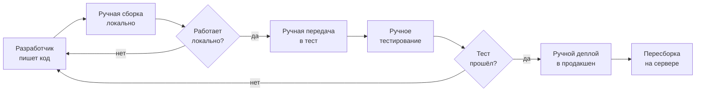
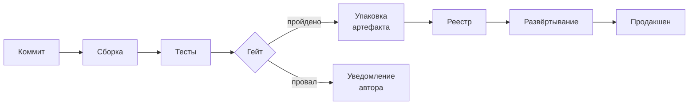
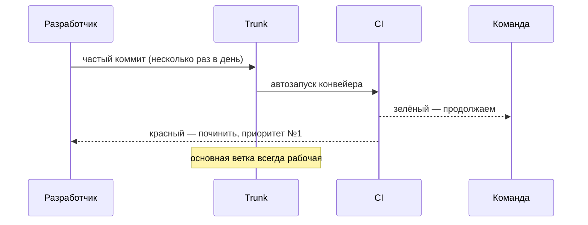
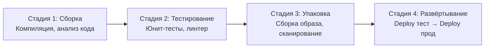
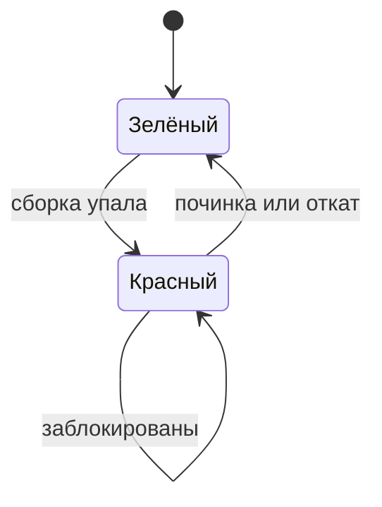
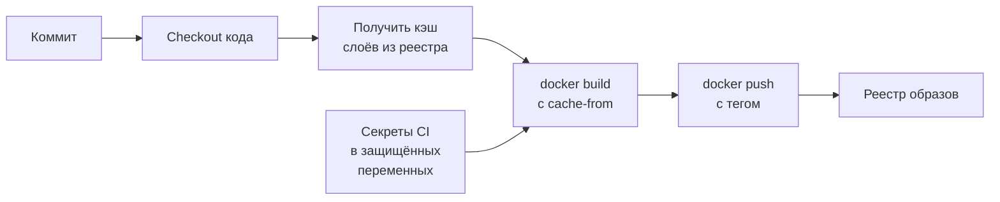
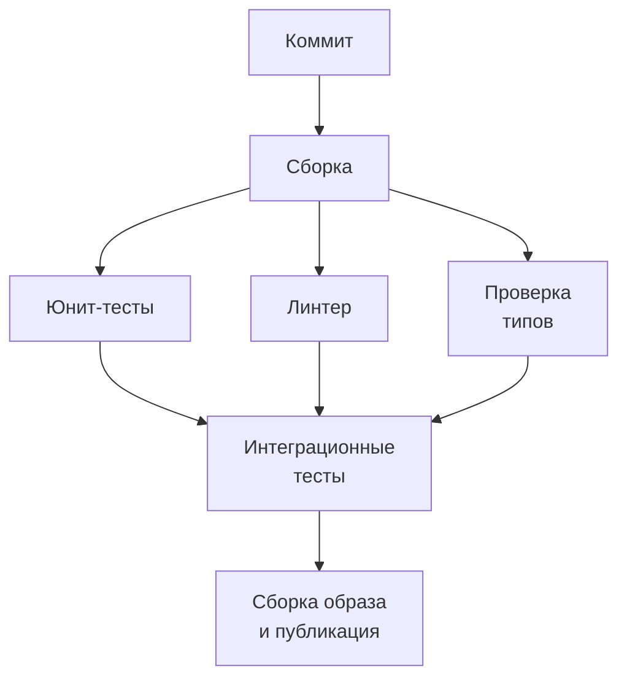
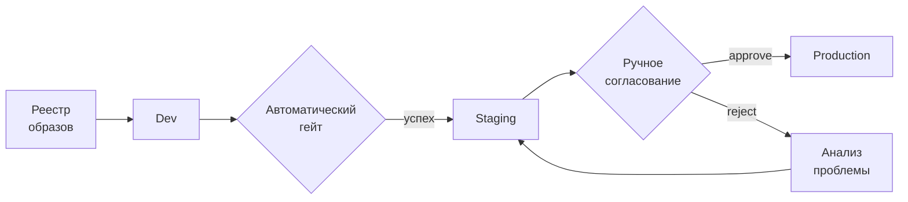
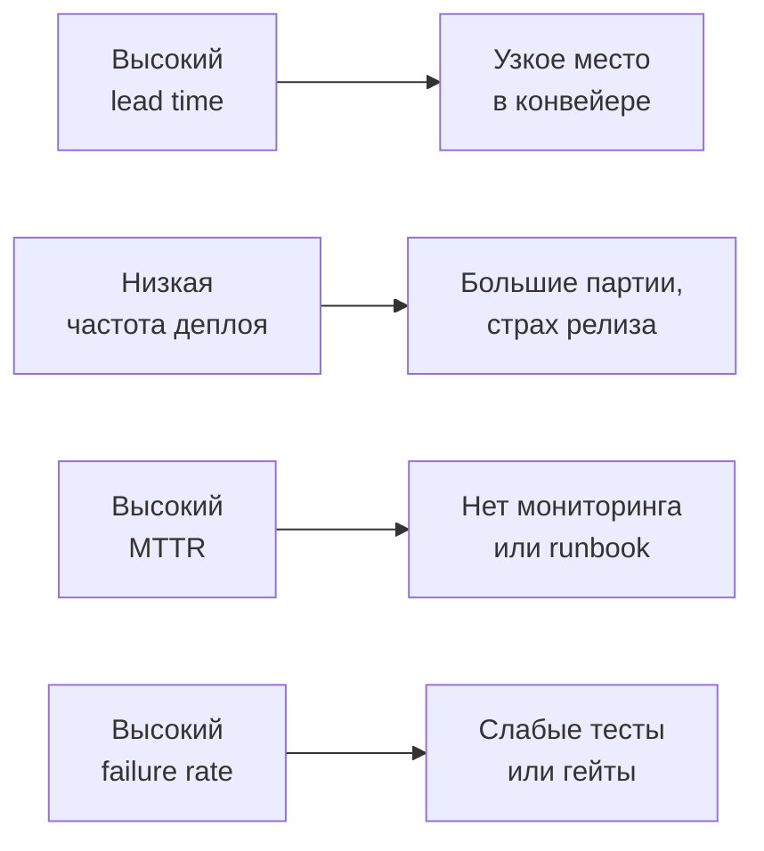
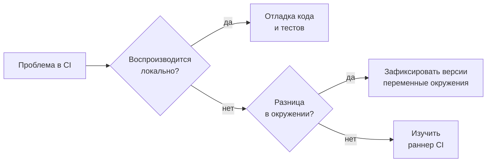

Лекция 10

# Конвейер непрерывной интеграции и поставки

От коммита до продакшена: быстро, повторяемо, наблюдаемо

<!--
Добрый день. Мы на десятой лекции курса. На предыдущей лекции мы разбирали Git в контуре доставки: trunk-based development, pull request как точка автоматизации, Conventional Commits. Сегодня движемся дальше — к самому конвейеру: что происходит после того, как изменение принято в основную ветку. Мы разберём анатомию конвейера поставки, артефакты и версионирование, метрики DORA, критерии выбора инструмента и типичные режимы отказа. Лекция опирается на книгу Уилсон «Грокаем Continuous Delivery» и «Руководство по DevOps» Джина и соавт.
-->

---

# Маршрут лекции

- **01 — Конвейер поставки:** понятие, назначение, роль в системе
- **02 — Непрерывная интеграция:** зелёный trunk, частота, анатомия конвейера
- **03 — Артефакты:** версии, реестры, сборка контейнеров, параллельность
- **04 — Среды и согласования:** environments, approvals, продвижение артефакта
- **05 — Метрики DORA:** четыре показателя потока поставки
- **06 — Выбор инструмента, режимы отказа, свидетельства**

<!--
Маршрут охватывает шесть смысловых блоков. Мы пройдём путь от понятия конвейера поставки до конкретных метрик и выбора инструмента. В конце разберём, какие свидетельства позволяют убедиться, что конвейер работает правильно, — это задел для третьей лабораторной работы. Каждый блок строится на аналитической рамке курса: проблема, модель, границы, критерии выбора.
-->

---

# Проблема: поставка без автоматизации

<!--
Картина без конвейера: каждый шаг — ручная операция, каждый шаг — источник ошибки. Разработчик собирает локально, передаёт файл тестировщику, тот запускает тесты вручную, затем кто-то делает деплой. Возникает вопрос: а тот ли артефакт попал в продакшен, который тестировали? Была ли пересборка на сервере с другими переменными окружения? Это «антипаттерн снежинки» — каждый деплой уникален, непредсказуем и боязненен. Именно эту боль решает конвейер поставки.
-->

---
layout: section
---

01

# Конвейер поставки

Единственный автоматизированный путь изменения в продакшен

<!--
Первый блок — само понятие конвейера поставки. Ключевое слово здесь — «единственный». Конвейер не один из способов доставить изменение; он должен быть единственным. Если существует обходной путь, наблюдаемость теряется и гарантии исчезают. Поговорим о том, что такое deployment pipeline и зачем это организационное решение, а не только техническое.
-->

---

# Deployment pipeline: определение

<!--
Deployment pipeline — понятие из книги Хамбла и Фарли «Continuous Delivery». Конвейер принимает коммит на входе и доставляет работающий сервис на выходе. Между ними — серия проверок: сборка, тесты, упаковка. Гейт — это точка, где конвейер останавливается, если проверки не прошли. Только при успешном прохождении всех гейтов артефакт попадает в реестр и далее в продакшен. При провале автор получает уведомление немедленно, а не через несколько часов.
-->

---

# Зачем единственный путь

**С конвейером**

- Каждый деплой — одинаковый процесс
- Артефакт в продакшене = артефакт, прошедший тесты
- История всех изменений зафиксирована
- Проблема обнаруживается до пользователя

**Обход конвейера**

- Ручной деплой создаёт «снежинки»
- Нет гарантии, что тестировалось то, что выкатилось
- История теряется, откат неочевиден
- Аудит невозможен

<!--
Почему «единственный путь» — не просто красивое слово? Если существует обходной путь мимо конвейера, мы теряем две вещи: воспроизводимость и наблюдаемость. Воспроизводимость означает, что тот же процесс, применённый к тому же коду, даёт тот же результат. Наблюдаемость означает, что у нас есть журнал всего: кто, когда, что выкатил. Конвейер как «единственный путь» — организационное решение, а не только техническое решение. Это договорённость команды.
-->

---
layout: section
---

02

# Непрерывная интеграция

Зелёный trunk — главный инвариант команды

<!--
Второй блок — непрерывная интеграция. CI часто путают с «у нас есть Jenkins», но это практика, а не инструмент. Ключевой инвариант CI: основная ветка всегда в рабочем состоянии. Это культурная норма, которую поддерживает автоматизация.
-->

---

# Непрерывная интеграция: суть

<!--
Непрерывная интеграция — практика, при которой каждый разработчик интегрирует своё изменение в основную ветку несколько раз в день. После каждого коммита запускается автоматическая проверка. Чем чаще интеграция, тем меньше расхождение между ветками, тем проще обнаружить конфликты. Ключевой инвариант: основная ветка всегда в рабочем состоянии. Если конвейер упал — починка становится приоритетом номер один. Обратите внимание: мы говорили об этом принципе в лекции 9 в контексте trunk-based development.
-->

---

# Анатомия конвейера

<!--
Конвейер организован иерархически: стадии, внутри стадий — задачи. Стадии выполняются последовательно — каждая следующая начинается только при успехе предыдущей. Задачи внутри стадии могут выполняться параллельно: юнит-тесты и линтер запускаются одновременно, экономя время. Между стадиями — неявные гейты: провал любой задачи останавливает прохождение дальше. На диаграмме видны четыре стадии: сборка, тестирование, упаковка, развёртывание.
-->

---

# Состояния конвейера

<!--
Два состояния конвейера: зелёный и красный. В зелёном состоянии команда работает нормально: пишет код, интегрирует, доставляет. Красный конвейер блокирует всю команду — никто не может безопасно выкатить новое изменение поверх сломанного. Поэтому правило простое: красный конвейер — это инцидент. Приоритет — немедленная починка или откат коммита. Нельзя «оставить на потом». Это дисциплина, которую надо выработать в команде.
-->

---

# Нестабильные тесты: флейки

**Что такое флейки-тест**

Тест, который при одинаковых условиях то проходит, то падает без изменений в коде.

**Эффект:** конвейеру перестают доверять. Красный результат игнорируют. Реальные сломы маскируются.

**Стратегия работы с флейками**

1. Изолировать: перенести в отдельный набор, не блокирующий CI
2. Анализировать причину: гонка данных, внешние зависимости, таймауты
3. Чинить планово — не запускать повторно «авось пройдёт»

<!--
Флейки-тесты — системная проблема конвейеров. Они хуже, чем стабильно падающий тест: стабильное падение сразу привлекает внимание, а флейки постепенно убивают доверие к конвейеру. Команда начинает перезапускать «на удачу», и конвейер превращается в ритуал, а не в защитный механизм. В книге Уилсон «Грокаем Continuous Delivery» этой теме посвящена отдельная глава. Правильная стратегия: изолировать, не пропускать в блокирующий набор, анализировать и чинить целенаправленно.
-->

---
layout: section
---

03

# Артефакты, реестры и сборка

Один артефакт собирается один раз и продвигается по средам

<!--
Третий блок: артефакты. Артефакт — это то, что путешествует по средам. Правило простое: собираем один раз, продвигаем везде. Не пересобираем под каждую среду — пересборка нарушает воспроизводимость и разрушает гарантию «тестировалось то, что выкатилось».
-->

---

# Артефакты и стратегии версионирования

| Стратегия тега | Пример | Когда применять |
| --- | --- | --- |
| Semver | `v1.4.2` | Публичные релизы, публичные API |
| Commit-hash | `abc12ef` | Трассируемость к коммиту |
| Branch + build | `main-123` | Внутренние сборки CI |
| `latest` | `latest` | Подвижная ссылка — осторожно |

<strong>Риск тега latest:</strong> тег latest перезаписывается при каждой сборке. Если среда тянет latest автоматически, вы теряете контроль над тем, что именно задеплоено в данный момент.

<!--
Каждый артефакт должен быть помечен версией — без этого невозможно трассировать, что именно работает в продакшене и какой коммит соответствует запущенному образу. Semver удобен для явных релизов, но требует дисциплины. Commit-hash даёт идеальную трассируемость: по хешу всегда можно найти точный коммит в истории. Тег latest — удобный ярлык, но опасный: он движется, и если среда использует latest без явной версии, воспроизводимость теряется. Неизменяемый артефакт с конкретным тегом — основа предсказуемого конвейера.
-->

---

# Сборка контейнеров в CI

<!--
Сборка контейнеров в CI имеет два ключевых аспекта. Первый — кэш слоёв: без кэша каждая сборка скачивает зависимости заново, что многократно увеличивает время. Правильно применять cache-from: CI забирает предыдущий образ из реестра и использует его слои как кэш. Второй аспект — безопасность учётных данных. Токен доступа к реестру никогда не хранится в коде или Dockerfile; он передаётся через защищённые переменные окружения CI. Это критичный элемент, выделенный отдельно на схеме.
-->

---

# Параллельные и зависимые задачи

<!--
Параллельность — главный рычаг ускорения конвейера. Юнит-тесты, линтер и проверка типов не зависят друг от друга и выполняются одновременно. Интеграционные тесты требуют, чтобы все предыдущие проверки прошли — они зависимые. Матрицы сборок расширяют параллельность: один и тот же код проверяется одновременно на нескольких версиях Python или Node. Правило: всё, что не имеет причинно-следственной зависимости, должно выполняться параллельно. Это прямо влияет на lead time.
-->

---
layout: section
---

04

# Среды и согласования

Один артефакт путешествует по средам и не пересобирается

<!--
Четвёртый блок: среды. Dev, staging, production. Ключевой принцип: один артефакт, собранный в CI, продвигается по всем средам без пересборки. Конфигурация меняется — артефакт нет. Это позволяет гарантировать, что в продакшен идёт именно то, что прошло проверку.
-->

---

# Environments и approvals

<!--
Environments — именованные целевые площадки для деплоя. К каждой среде можно привязать правила: кто может делать деплой, нужно ли согласование. Гейты бывают двух типов: автоматические — набор тестов и проверок — и ручные, approval. Ручное согласование перед продакшеном — типичная практика для регулируемых отраслей или критичных систем. На каждой стадии разворачивается тот же образ, что и на предыдущей. Не пересобираем — продвигаем.
-->

---

# Продвижение артефакта по средам

**Dev**

- Автоматический деплой при каждом коммите
- Все разработчики видят последнее состояние
- Нестабильная среда — это нормально

**Staging**

- Тот же образ, что развёрнут в Dev
- Конфигурация близка к продакшену
- Нагрузочные и интеграционные тесты

**Production**

- Тот же образ, что прошёл Staging
- Только после явного approve
- Аудит-журнал всех деплоев

<!--
Три среды — три уровня зрелости одного артефакта. В Dev разворачивается всё автоматически и часто: разработчики проверяют свои изменения быстро. В Staging среда максимально близка к продакшену — проверяем конфигурацию, производительность, интеграции со сторонними сервисами. В Production разворачивается только то, что прошло все этапы и получило явное согласование. Принципиально: конфигурация меняется между средами, артефакт — нет. Это позволяет гарантировать воспроизводимость.
-->

---
layout: section
---

05

# Метрики DORA

Четыре показателя скорости и стабильности потока

<!--
Пятый блок — метрики DORA. DORA — DevOps Research and Assessment, исследовательская группа, которая изучала тысячи команд и организаций. Их вывод: четыре метрики хорошо предсказывают как операционную эффективность, так и бизнес-результаты организации.
-->

---

# Четыре метрики DORA

**Lead Time for Changes**

Время от коммита до работы в продакшене. Показывает скорость потока и узкие места конвейера.

**Deployment Frequency**

Как часто команда деплоит в продакшен. Отражает размер партий изменений.

**Mean Time to Restore**

Среднее время восстановления после инцидента. Показывает зрелость эксплуатации.

**Change Failure Rate**

Доля деплоев, вызвавших инцидент или откат. Отражает качество конвейера и тестов.

<!--
Четыре метрики охватывают две стороны потока: скорость и стабильность. Lead time и deployment frequency говорят о скорости: как быстро изменение доходит до пользователя и как часто это происходит. MTTR и change failure rate говорят о стабильности: насколько устойчива система под нагрузкой изменений. Исследование DORA показало, что высокопроизводительные команды имеют одновременно высокую скорость и высокую стабильность — эти показатели не в противоречии друг с другом.
-->

---

# DORA: уровни производительности

| Метрика | Элита | Высокий | Средний | Низкий |
| --- | --- | --- | --- | --- |
| Lead time | &lt;1 часа | 1 д — 1 нед | 1 нед — 1 мес | &gt;6 мес |
| Частота деплоя | Несколько в день | 1р/день — 1р/нед | 1р/нед — 1р/мес | &lt;1р/6 мес |
| MTTR | &lt;1 часа | &lt;1 дня | &lt;1 нед | &gt;6 мес |
| Change failure rate | 0–5% | 0–15% | 0–15% | 16–30% |

<!--
Таблица уровней производительности по исследованию DORA 2023. Элитные команды — это не только стартапы; среди них крупные банки, ретейлеры, государственные организации. Ключевой контринтуитивный вывод: высокая частота деплоев коррелирует с низким change failure rate, а не наоборот. Маленькие частые изменения легче тестировать, проще откатить и легче отлаживать. Большие редкие релизы — источник сложных конфликтов и скрытых проблем. Это прямо связано с принципом «работать малыми партиями», который мы обсудили в лекции 9.
-->

---

# Что метрики DORA говорят аналитику

<!--
Метрики DORA — диагностический инструмент системного аналитика. Высокий lead time указывает на узкое место: стадию или задачу, которая тормозит весь конвейер. Низкая частота деплоев часто говорит о страхе перед релизом — команде, которая накапливает большие партии изменений, потому что каждый деплой болезнен. Высокий MTTR указывает на отсутствие эффективного мониторинга или runbook-а для быстрого реагирования. Высокий change failure rate — сигнал о слабом тестовом покрытии или неэффективных гейтах. По каждой метрике можно сформулировать конкретные гипотезы для улучшения.
-->

---
layout: section
---

06

# Выбор инструмента, режимы отказа, свидетельства

Jenkins, GitLab CI, GitHub Actions — критерии, а не предпочтения

<!--
Последний блок объединяет три темы: критерии выбора инструмента CI/CD, режимы отказа конвейера как системы и практические свидетельства. Начнём с выбора инструмента.
-->

---

# Критерии выбора инструмента CI/CD

| Критерий | Jenkins | GitLab CI | GitHub Actions |
| --- | --- | --- | --- |
| Размещение | Self-hosted | Self-hosted / SaaS | SaaS / Self-hosted |
| Интеграция с репо | Внешняя | Встроенная | Встроенная |
| Плагины и расширения | 2000+ плагинов | Встроенные фичи | Marketplace |
| Порог входа | Высокий | Средний | Низкий |
| Стоимость сопровождения | Высокая | Средняя | Низкая (SaaS) |
| Гибкость конфигурации | Максимальная | Высокая | Средняя |

<!--
Выбор инструмента CI/CD — типичная задача системного аналитика. Jenkins — самый гибкий, но требует выделенной команды для сопровождения: управление плагинами, обновления, безопасность мастера. GitLab CI тесно интегрирован с репозиторием: merge request, реестр образов, среды — всё в одном интерфейсе. GitHub Actions идеален для проектов, уже размещённых на GitHub: низкий порог входа, большой маркетплейс готовых action-ов. Главный критерий — экосистема: если команда уже работает в GitLab, нет смысла тянуть отдельный Jenkins. Стоимость сопровождения часто оказывается решающим фактором.
-->

---

# Режимы отказа конвейера

**Красный trunk**

Основная ветка сломана. Команда блокирована. Каскадный эффект: никто не может безопасно интегрировать.

**Действие:** немедленная починка или revert.

**Нестабильная сборка**

Тот же код даёт разные результаты: плавающие версии зависимостей, нет lock-файла.

**Действие:** фиксировать зависимости, мокировать внешние сервисы.

**Флейки-тесты**

Тест то проходит, то падает. Доверие к конвейеру падает. Реальные ошибки маскируются.

**Действие:** изолировать, не перезапускать «авось пройдёт».

<!--
Три режима отказа конвейера — каждый разрушает разные гарантии. Красный trunk нарушает поток всей команды. Нестабильная сборка означает недетерминизм: тот же коммит даёт разный образ в зависимости от момента запуска. Причина часто в незафиксированных зависимостях: pip install без requirements.txt, npm install без lock-файла. Флейки-тесты — самый коварный режим: они медленно убивают культуру конвейера, приучая игнорировать красный цвет. Помните: конвейер — это система, которая сама может отказать.
-->

---

# Свидетельства работы конвейера

**Что искать в логах**

- Время каждой стадии и задачи
- Сообщения об ошибках в контексте
- Какой образ собран и с каким тегом
- Шаги аутентификации в реестр

**Анализ узких мест**

- Какая стадия занимает больше всего времени?
- Есть ли повторная загрузка зависимостей?
- Параллельны ли независимые задачи?
- Где чаще всего падает конвейер?

<!--
Лог конвейера — первичный источник информации при расследовании. Каждая задача CI записывает подробный журнал выполнения. Для анализа эффективности смотрим время каждой стадии: если загрузка зависимостей занимает половину времени сборки — это кандидат на кэширование. Для анализа надёжности смотрим на паттерн падений: всегда одна и та же задача, или разные? Это разграничивает инфраструктурные проблемы от ошибок в коде. Системный аналитик умеет читать эти журналы и формулировать диагностические гипотезы.
-->

---

# Локальный прогон и диагностика

<!--
Ключевой диагностический вопрос при проблеме в CI: воспроизводится ли она локально? Если да — проблема в коде или тестах, локальная отладка решит её. Если нет — ищем различие между локальным окружением и раннером CI: версия Node, версия Python, переменные окружения, права доступа, сетевой доступ к внешним сервисам. Это «разрыв паритета сред» — тема, которую мы подробно разберём в лекции 12 об управлении конфигурацией. Сейчас важно запомнить: dry-run и локальная воспроизводимость — первые инструменты аналитика.
-->

---

# Мост к Лаб 3

**Лаб 3: CI/CD для voting-app**

- Настроить конвейер для сборки образов voting-app
- Стратегии тегирования: commit-hash и latest
- Стадии: lint, test, build, push в реестр
- Измерить время стадий и эффект кэша

**Критерии приёмки**

- Конвейер зелёный на основной ветке
- Образ в реестре имеет тег с commit-hash
- Лог показывает кэш слоёв при повторной сборке
- Время второй сборки меньше первой

<!--
Третья лабораторная закрепляет сегодняшнюю лекцию практикой. Мы берём voting-app — наш сквозной пример курса — и настраиваем для него конвейер CI/CD. Задача: собрать образы всех сервисов, пометить их двумя стратегиями тегирования, пройти базовые проверки и опубликовать в реестр. Важный показатель — эффект от кэша: при повторной сборке время должно сократиться за счёт переиспользования слоёв. Это прямое применение принципов, которые мы обсуждали сегодня.
-->

---
layout: center
---

# Итоги

- Конвейер поставки — единственный путь от коммита до продакшена: воспроизводимость и наблюдаемость
- CI — это практика, а не инструмент: зелёный trunk как главный инвариант команды
- Один артефакт собирается один раз и продвигается по средам без пересборки
- Метрики DORA описывают поток — скорость и стабильность поставки — а не отдельный инструмент
- Конвейер — это продукт: его проектируют, измеряют и сопровождают

**Дальше:** Лекция 11 — безопасность конвейера и цепочки поставки (DevSecOps): как встроить проверки безопасности в поток, не замедляя его

Опорная литература: К. Уилсон «Грокаем Continuous Delivery», Дж. Ким и соавт. «Руководство по DevOps»

<!--
Подведём итоги. Конвейер поставки — это не набор скриптов, а система, которую проектируют и сопровождают как продукт. Главный принцип: единственный путь, один артефакт, зелёный trunk. Метрики DORA дают нам язык для разговора о качестве потока поставки: мы можем измерить скорость и стабильность, поставить диагноз и сформулировать гипотезы улучшения. Следующая лекция — безопасность конвейера: DevSecOps, смещение проверок влево, управление секретами. Задание к третьей лабораторной у вас на руках.
-->
