
Лекция 11

# Безопасность конвейера и цепочки поставки (DevSecOps)

Когда угроза живёт не в коде, а в самом конвейере

<!--
Добрый день. Одиннадцатая лекция завершает раздел об автоматизации поставки. В десятой лекции мы построили конвейер от коммита до продакшена. Сегодня разберём, как встроить в этот конвейер защиту — на каждом этапе, автоматически, без превращения безопасности в поздний барьер. Разберём SAST, DAST, SCA и сканирование образов. Рассмотрим управление секретами, наименьшие привилегии и защиту цепочки поставки. В конце — критерии выбора проверок и инструменты аналитика для проверки состояния безопасности конвейера.
-->

---

# Маршрут лекции

- **01 Встраивание ИБ в поток** — shift-left, DevSecOps, модель угроз по этапам
- **02 Автоматические проверки** — SAST, DAST, SCA, сканирование образов
- **03 Секреты и привилегии** — Vault, KMS, ротация, наименьшие права раннеров
- **04 Цепочка поставки** — провенанс, SLSA, SBOM, подпись артефактов
- **05 Критерии, отказы, свидетельства** — таблица решений, режимы отказа, диагностика

<!--
Лекция разбита на пять блоков. Первый — философия: что такое shift-left и как безопасность встраивается в поток поставки. Второй — конкретные инструменты автоматической проверки: что каждый из них находит и чего не видит. Третий — управление секретами и принцип наименьших привилегий. Четвёртый — безопасность цепочки поставки как более широкая задача, связанная с четвёртой лекцией об образах. Пятый — критерии выбора, режимы отказа и команды проверки. Блоки выстроены от общего к частному.
-->

---

# Проблема: поверхность атаки сместилась

**Раньше: угроза в приложении**

Уязвимость находили в собственном коде. Пентест перед релизом был достаточен. Граница защиты — периметр продакшена.

**Сейчас: угроза в конвейере**

Компрометация зависимости (SolarWinds, Log4Shell). Подмена артефакта в реестре. Утечка секретов из CI-переменных. Атака на раннер сборки.

**Следствие для инфраструктуры**

Уязвимость в зависимости или подмена образа опаснее ошибки в собственном коде: затрагивает всех потребителей.

**Что изменилось**

Атака на конвейер даёт злоумышленнику доступ ко всем продуктам, которые через него проходят.

<!--
Поверхность атаки — совокупность точек, через которые злоумышленник может проникнуть в систему. Традиционно её представляли как периметр продакшена. Сегодня угроза смещается в сторону разработки и поставки. Инцидент SolarWinds в 2020 году показал: достаточно скомпрометировать систему сборки, чтобы заразить тысячи организаций через обновление ПО. Log4Shell — уязвимость в транзитивной зависимости, которую никто не отслеживал. Атаки на конвейер опасны масштабом: один взломанный реестр образов задевает все команды, которые его используют.
-->

---
layout: section
---

01

# Встраивание ИБ в поток

Shift-left, DevSecOps и модель угроз по этапам

<!--
Первый блок — философия DevSecOps. Прежде чем переходить к инструментам, важно понять принцип: безопасность должна быть частью потока поставки, а не отдельным этапом в конце. Это называется shift-left — сдвиг влево по временной шкале конвейера. Разберём, что это означает на практике.
-->

---

# Shift-left: безопасность в каждом этапе

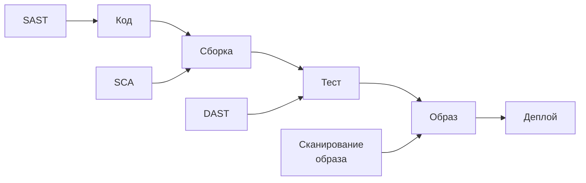

Сдвиг «влево» означает: проверка безопасности происходит раньше — там, где стоимость исправления ниже.

- Уязвимость, найденная при коммите — один фикс
- Та же уязвимость в продакшене — инцидент-менеджмент

<!--
Термин shift-left — «сдвиг влево» — описывает перенос проверок безопасности на более ранние этапы конвейера. На диаграмме видно: SAST запускается при каждом коммите, SCA — при сборке, DAST — в тестовой среде, сканирование образа — перед помещением в реестр. Чем раньше обнаружена уязвимость, тем дешевле её исправить. Это центральная идея DevSecOps: не «проверить безопасность перед релизом», а «встроить безопасность в каждый шаг». Ким и соавт. в «Руководстве по DevOps» говорят о встраивании качества в поток — безопасность здесь часть того же принципа.
-->

---

# DevSecOps: три изменения в культуре

**Ответственность разделена**

Безопасность — не только функция ИБ-команды. Разработчик отвечает за безопасность своего кода и зависимостей.

**Автоматизация обязательна**

Ручные проверки перед релизом не успевают за темпом CI/CD. Проверка должна запускаться автоматически при каждом изменении.

**Обратная связь быстрая**

Разработчик получает сигнал о найденной уязвимости так же быстро, как результат unit-теста: в рамках того же PR.

Безопасность как часть Definition of Done: задача не считается завершённой, пока проверки безопасности не прошли.

<!--
DevSecOps — не инструмент и не роль, это культурный сдвиг. Три изменения, которые он требует. Первое: разделение ответственности. Разработчик становится первой линией защиты — он отвечает за то, что кладёт в зависимости и как пишет код. Второе: автоматизация. При скорости современного CI/CD ручная проверка безопасности перед каждым релизом физически невозможна. Третье: скорость обратной связи. Если результат проверки безопасности приходит через три дня, разработчик уже переключился на другое. Если — в рамках того же PR, контекст свеж и исправление занимает минуты.
-->

---

# Модель угроз по этапам конвейера

| Этап | Угроза | Защита |
|---|---|---|
| Код | Уязвимый паттерн в собственном коде | SAST |
| Зависимости | CVE в библиотеке (транзитивная) | SCA |
| Сборка | Компрометация среды раннера | Изоляция, наименьшие привилегии |
| Артефакт | Подмена образа в реестре | Подпись, провенанс |
| Деплой | Утечка секрета из CI-переменных | Vault, KMS |
| Рантайм | Эксплуатация запущенного сервиса | Runtime security, мониторинг |

<!--
Таблица угроз по этапам — отправная точка при проектировании безопасности конвейера. Для каждого этапа характерен свой класс угроз и своя защита. Код — внедрённая уязвимость или небезопасный паттерн, защищает статический анализ. Зависимости — CVE в транзитивной библиотеке, которую никто не отслеживает, защищает SCA. Среда сборки — компрометация раннера, где злоумышленник может изменить собираемый артефакт. Артефакт в реестре — подмена образа между сборкой и деплоем. Переменные CI — частый источник утечки токенов и паролей. Рантайм — эксплуатация того, что всё-таки попало в продакшен. Каждый этап требует своего инструмента.
-->

---
layout: section
---

02

# Автоматические проверки

SAST, DAST, SCA и сканирование образов

<!--
Второй блок — конкретные инструменты. Мы знаем, на каком этапе какая угроза. Теперь разберём, как именно работает каждый вид проверки, что он обнаруживает и в чём его ограничения. Ни один инструмент не является полным — они дополняют друг друга.
-->

---
layout: two-cols
---

# SAST: статический анализ кода

Анализирует исходный код **без запуска** приложения.

**Что находит:**
- SQL-инъекции, XSS, Path Traversal
- Небезопасное использование криптографии
- Жёстко заданные секреты в коде
- Небезопасные паттерны (десериализация)

**Инструменты:** Semgrep, CodeQL, SonarQube, Bandit

::right::

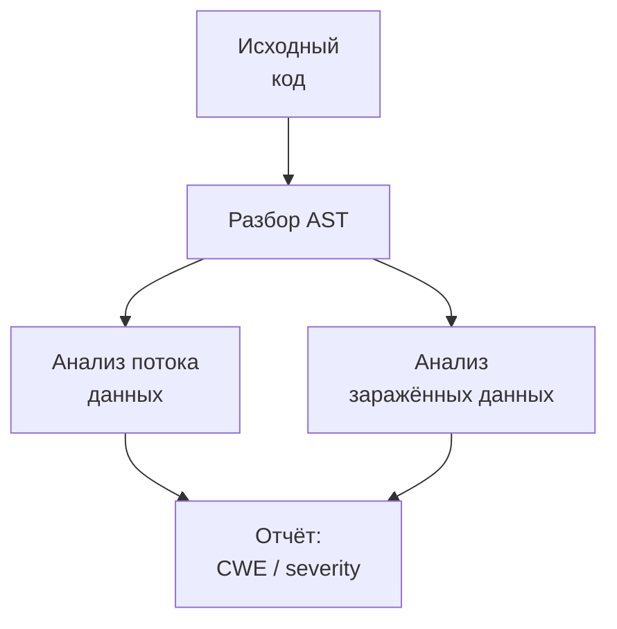

SAST не видит уязвимостей, проявляющихся только в рантайме: неверная логика авторизации, race condition, уязвимости конфигурации.

<!--
SAST — статический анализатор безопасности. Он работает с исходным кодом как с текстом и деревом синтаксиса, без запуска приложения. Инструмент строит граф потока данных и отслеживает «заражённые» данные — те, что пришли от пользователя и могут оказаться в опасном месте, например в SQL-запросе. Преимущества SAST: быстрый запуск, работает с любым кодом, даёт точную ссылку на строку. Ограничение — он не понимает поведение системы в рантайме. Ложные срабатывания при сложном потоке управления — известная проблема. SAST ставят первым гейтом: он запускается на каждый PR и блокирует слияние при находках критической серьёзности.
-->

---

# DAST: динамическое сканирование приложения

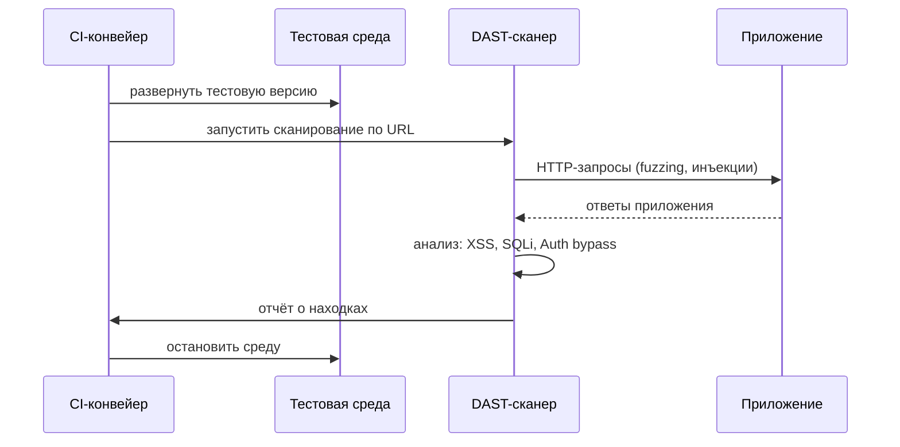

**Инструменты:** OWASP ZAP, Burp Suite Enterprise, Nuclei

<!--
DAST работает иначе: он атакует запущенное приложение как внешний злоумышленник, не имея доступа к исходному коду. Для работы DAST нужна развёрнутая тестовая версия — именно поэтому его запускают позже в конвейере, после развёртывания в staging. Сканер отправляет специально сформированные запросы: SQL-инъекции, XSS-пейлоады, некорректные входные данные, и анализирует ответы. DAST находит то, чего не видит SAST: уязвимости в конфигурации сервера, проблемы с авторизацией, открытые заголовки. Ограничение: требует рабочего приложения и занимает значительно больше времени, чем SAST. Уилсон в «Грокаем Continuous Delivery» рекомендует запускать DAST параллельно с деплоем в staging, а не блокировать им конвейер.
-->

---

# SCA: анализ состава зависимостей

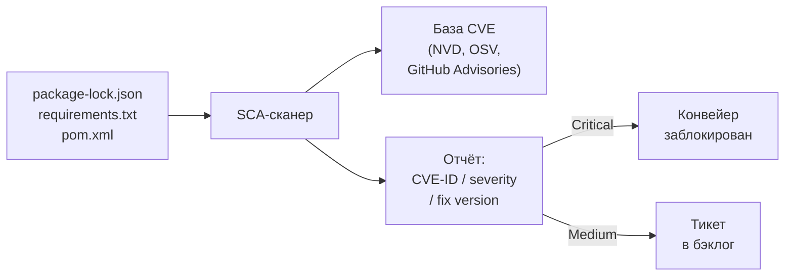

Транзитивные зависимости — зависимости зависимостей — составляют большинство уязвимостей.

<!--
SCA — Software Composition Analysis — анализирует не собственный код, а внешние зависимости. Инструмент читает lock-файл, строит граф всех зависимостей, включая транзитивные, и сверяет каждую с базами известных уязвимостей. CVE — Common Vulnerabilities and Exposures — стандартный идентификатор уязвимости. Ключевой момент: большинство современных приложений содержат сотни зависимостей, и большинство уязвимостей приходит из чужого кода. Log4Shell — наглядный пример: уязвимость была в транзитивной зависимости, которую многие организации не включали в свои списки компонентов. SCA запускают при каждой сборке — добавление новой зависимости немедленно проверяется. Инструменты: Trivy, Snyk, Dependabot, OWASP Dependency-Check.
-->

---

# Сканирование образов контейнеров

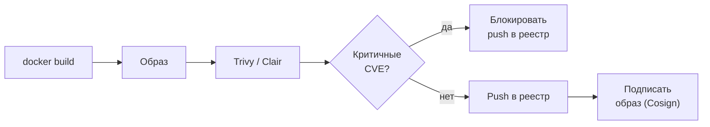

**Что сканируют:** пакеты ОС (apt/apk), языковые зависимости (pip, npm, gem), секреты (опционально)

**Главный источник:** устаревший базовый образ — `ubuntu:18.04` содержит сотни CVE в системных пакетах.

**Политика допуска:** Critical блокирует push в реестр, High — предупреждение. Порог задаётся в конвейере.

<!--
Сканирование образа — финальный рубеж перед помещением артефакта в реестр. Trivy и Clair анализируют образ послойно: сначала манифест со списком пакетов ОС, затем языковые зависимости, встроенные на стадии сборки. Каждый пакет сверяется с базами CVE. Политика допуска — конкретный порог: Critical блокирует конвейер, High создаёт тикет. После успешного сканирования образ подписывают инструментом Cosign — это создаёт криптографическую привязку между содержимым образа и его происхождением. Самый распространённый источник уязвимостей — устаревший базовый образ с необновлёнными системными пакетами. Связь с четвёртой лекцией: выбор образа distroless или alpine существенно сокращает поверхность атаки.
-->

---

# Все проверки в конвейере

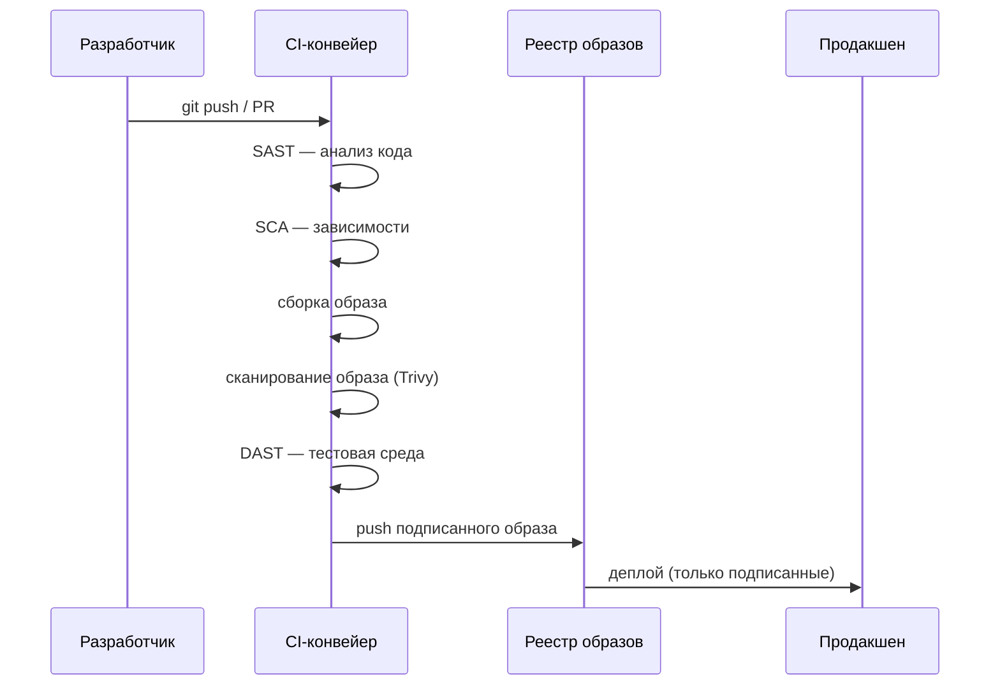

<!--
Соберём все проверки в единую картину. Разработчик отправляет изменение — конвейер последовательно запускает: SAST анализирует код на уязвимые паттерны, SCA проверяет зависимости, затем сборка образа. После сборки — сканирование образа Trivy. Если доступна тестовая среда — следом идёт DAST. Только после прохождения всех гейтов образ помещается в реестр с подписью. Политика admission-контроллера на стороне Kubernetes не позволяет задеплоить неподписанный образ или образ с критическими CVE. Это и есть «безопасность как гейт»: каждый этап — контрольная точка, а не поздний аудит.
-->

---
layout: section
---

03

# Секреты и привилегии

Vault, KMS, ротация и наименьшие права раннеров

<!--
Третий блок — управление секретами и принцип наименьших привилегий. Инструменты анализа кода не защищают от утечки секрета, случайно закоммиченного разработчиком. А компрометация раннера сборки открывает злоумышленнику доступ к реестру, кластеру и облачным ресурсам. Разберём, как правильно хранить секреты и почему минимизация привилегий — архитектурный принцип, а не административная формальность.
-->

---

# Управление секретами: антипаттерны

**Секрет в репозитории**

Пароль или токен в `.env`, `config.yaml` или в коде. Git хранит историю — даже удалённый секрет остаётся в старых коммитах.

**Секрет в переменной CI**

Токен в `CI_REGISTRY_PASSWORD`. При компрометации раннера все переменные доступны злоумышленнику.

**Секрет в образе**

`COPY credentials.json` в Dockerfile. Секрет виден в слоях образа через `docker history`.

**Секрет без ротации**

Долгоживущий API-токен без ограничений срока жизни. При утечке остаётся действующим неограниченное время.

<!--
Прежде чем разбирать правильные паттерны, зафиксируем антипаттерны — они встречаются повсеместно. Секрет в репозитории — самая распространённая утечка: Git commits хранятся навсегда, и даже если файл удалить и запушить, секрет виден в истории. Инструменты вроде truffleHog специально сканируют историю репозитория на паттерны секретов. Переменные CI кажутся безопасными, но при компрометации раннера злоумышленник получает доступ ко всем. Секрет в образе — частая ошибка: команда `COPY` добавляет файл в слой, и даже последующий `RUN rm` оставляет его в предыдущем слое. Секрет без ротации — множитель риска: любая утечка длится до ручной смены.
-->

---

# Vault: централизованное хранение секретов

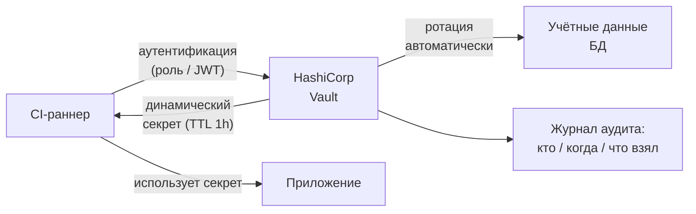

Динамические секреты создаются под каждый запрос и имеют ограниченный срок жизни (TTL).

<!--
HashiCorp Vault — стандарт хранилища секретов в контейнерных системах. Ключевое отличие от переменных CI: секрет не хранится в конвейере как константа — он запрашивается у Vault в момент запуска задачи. Vault аутентифицирует запросчика через роль или JWT-токен, выдаёт динамический секрет с ограниченным сроком жизни и записывает запрос в журнал аудита. Динамические секреты особенно мощны для учётных данных баз данных: Vault сам создаёт временного пользователя в PostgreSQL, выдаёт конвейеру пароль и через час отзывает доступ. Компрометация раннера при этом даёт злоумышленнику секрет, который уже устарел. Облачные KMS — AWS Secrets Manager, GCP Secret Manager — работают по тем же принципам.
-->

---

# Наименьшие привилегии: принцип и практика

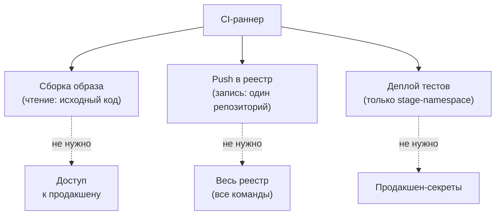

<!--
Принцип наименьших привилегий применительно к CI/CD означает: каждый раннер, каждая задача конвейера, каждый сервисный аккаунт получают только минимальный набор прав, необходимый для своей задачи. Раннер, собирающий образ, не должен иметь доступа к продакшен-секретам. Раннер, пушащий образ в реестр, должен иметь права только на запись в конкретный репозиторий, а не на весь реестр. Задача деплоя в staging не должна иметь доступа к кластеру продакшена. Это архитектурный принцип: компрометация одного шага конвейера не даёт злоумышленнику доступ ко всей системе. Blast radius — зона поражения — намеренно ограничена.
-->

---

# Изоляция раннеров сборки

**Раздельные раннеры по средам**

Отдельные раннеры для dev/stage/prod. Раннер для продакшена не участвует в сборке feature-веток.

**Эфемерные раннеры**

Раннер создаётся для одной задачи и уничтожается после. Компрометация не переходит между задачами.

**Изолированная сборка в контейнере**

Каждая сборка — в свежем контейнере без следов предыдущей. Нет общего файлового состояния между задачами.

**OIDC вместо долгих токенов**

GitHub Actions и GitLab CI поддерживают OpenID Connect: раннер получает короткоживущий токен без хранения статических ключей в переменных.

<!--
Изоляция раннеров — практическое воплощение принципа наименьших привилегий на уровне инфраструктуры. Первый паттерн: разные раннеры для разных сред. Раннер, деплоящий в продакшен, физически другая машина, чем раннер для feature-веток. Второй: эфемерные раннеры — контейнер или виртуальная машина создаётся под одну задачу и уничтожается. Нет персистентного состояния, которое злоумышленник мог бы использовать между задачами. Третий: OIDC-аутентификация заменяет статические ключи в переменных CI. Раннер получает короткоживущий JWT от провайдера идентификации и обменивает его на временный токен облака — секрет не хранится нигде в конвейере. Это особенно важно для доступа к облачным ресурсам.
-->

---
layout: section
---

04

# Цепочка поставки

Провенанс, SLSA, SBOM и подпись артефактов

<!--
Четвёртый блок — безопасность цепочки поставки как системная задача. До сих пор мы говорили о проверках внутри нашего конвейера. Но артефакт — образ контейнера — проходит несколько рук: разработчик, CI-система, реестр, кластер. Как убедиться, что образ, который деплоится, именно тот, который был собран? Разберём провенанс, подпись и стандарт SLSA. Эта тема связана с четвёртой лекцией, где мы говорили об образах как аудируемом артефакте.
-->

---

# Атаки на цепочку поставки

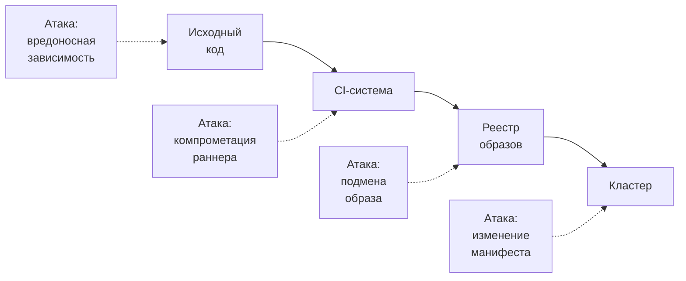

Злоумышленнику достаточно скомпрометировать одно звено — и под угрозой все, кто использует цепочку.

<!--
Цепочка поставки — все этапы, через которые проходит артефакт от исходного кода до работающего сервиса. Атаки на цепочку поставки нацелены на любое звено, а не на конечную систему. Атака на зависимость: злоумышленник публикует вредоносный пакет с именем, похожим на популярный (typosquatting), или компрометирует аккаунт мейнтейнера. Атака на CI: компрометация раннера позволяет изменить сборочный процесс и встроить бэкдор в образ. Подмена образа в реестре: образ с правильным тегом latest может быть перезаписан. Изменение манифеста деплоя: если GitOps-репозиторий доступен, атакующий может изменить то, что разворачивается. Защита должна перекрывать каждое звено.
-->

---

# SLSA: уровни доверия к процессу сборки

| Уровень SLSA | Требование | Что защищает |
|---|---|---|
| **0** | Нет гарантий | — |
| **1** | Задокументированный процесс сборки | От случайных изменений |
| **2** | Подписанные провенанс-аттестации | От модификации после сборки |
| **3** | Изолированная и проверяемая среда | От компрометации раннера |
| **4** | Воспроизводимые сборки, двойная проверка | От insider-угроз |

SLSA (Supply chain Levels for Software Artifacts) — стандарт Google, принятый индустрией. Большинство организаций начинают с уровня 2: подписанные провенанс-аттестации, хранящиеся в реестре рядом с образом.

<!--
SLSA — Supply chain Levels for Software Artifacts — фреймворк, разработанный Google и принятый как открытый стандарт. Он вводит четыре уровня доверия к процессу сборки. Уровень 0 — отправная точка: никаких гарантий. Уровень 1 требует задокументированного процесса: мы знаем, как собирается артефакт. Уровень 2 добавляет подписанную провенанс-аттестацию: машинно-проверяемый документ о том, кто, когда и из чего собрал данный образ. Уровень 3 требует, чтобы среда сборки была изолирована и её характеристики проверяемы. Уровень 4 — воспроизводимые сборки и независимая двойная проверка. SLSA дополняет четвёртую лекцию: образ как аудируемый артефакт обретает измеримый уровень доверия.
-->

---

# SBOM: перечень состава программного обеспечения

**Что такое SBOM**

Software Bill of Materials — машиночитаемый список всех компонентов артефакта: пакеты ОС, языковые зависимости, версии, лицензии.

**Форматы**

SPDX (ISO 5962) и CycloneDX — два открытых стандарта. Trivy и Syft умеют генерировать SBOM при сканировании.

**Применение при инциденте**

При появлении новой CVE аналитик запрашивает: какие наши образы содержат уязвимый компонент? SBOM даёт ответ за секунды.

**Регуляторный контекст**

США с 2021 года обязывают поставщиков ПО для госсектора предоставлять SBOM. Это становится стандартным требованием контрактов.

<!--
SBOM — Software Bill of Materials — это аналог листа ингредиентов для программного обеспечения. Машиночитаемый документ, перечисляющий каждый компонент образа: пакет curl версии 7.68, библиотека openssl версии 1.1.1, Python-пакет requests версии 2.27. Практическая ценность SBOM проявляется при появлении новой критической CVE. Без SBOM аналитик должен проверить каждый образ вручную. С SBOM — один запрос к базе показывает все образы, содержащие уязвимую версию пакета. Команда `trivy image --format cyclonedx` генерирует SBOM прямо при сканировании. Связь с четвёртой лекцией: SBOM — это атрибут образа как аудируемого артефакта, реализующий принцип прослеживаемости.
-->

---

# Подпись и провенанс артефакта

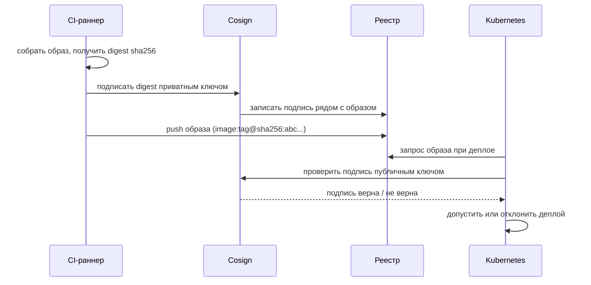

<!--
Подпись артефакта — криптографическая привязка содержимого образа к его происхождению. Инструмент Cosign реализует подпись через асимметричную криптографию: приватный ключ в CI подписывает SHA256-дайджест образа, публичный ключ настраивается как политика admission-контроллера в Kubernetes. При деплое кластер запрашивает подпись у реестра и проверяет её публичным ключом. Образ без валидной подписи не запускается — даже если он имеет правильный тег. Это защищает от подмены образа в реестре: злоумышленник не может создать валидную подпись без доступа к приватному ключу. Провенанс-аттестации SLSA подписываются тем же механизмом и хранятся в реестре рядом с образом.
-->

---
layout: section
---

05

# Критерии, режимы отказа, свидетельства

Таблица решений, типичные сбои и инструменты аналитика

<!--
Финальный блок. Мы разобрали все инструменты DevSecOps-конвейера. Теперь — аналитическая часть: как выбрать, какие проверки делать блокирующими, а какие информационными. Какие режимы отказа характерны для DevSecOps-конвейера. И как проверить состояние безопасности руками — набор конкретных команд и артефактов.
-->

---

# Критерии: блокирующие vs информационные проверки

| Проверка | Уровень находки | Режим | Обоснование |
|---|---|---|---|
| SAST | Critical / High | Блокировать | Высокая уверенность, низкий FP |
| SAST | Medium / Low | Информационная | Высокий FP, требует анализа |
| SCA | Critical (CVSS ≥ 9) | Блокировать | Известная активная уязвимость |
| SCA | High | Информационная | Оценить контекст применения |
| Образ | Critical CVE | Блокировать | Не пускать в реестр |
| DAST | Critical | Блокировать | Реальное поведение приложения |
| Секреты в коде | Любой | Блокировать | Нулевая терпимость |

Начинают с информационного режима, накапливают статистику ложных срабатываний, затем переводят в блокирующий.

<!--
Ключевой вопрос при внедрении DevSecOps: какие проверки останавливают конвейер, а какие только сообщают о находке. Если сделать все проверки блокирующими с первого дня, конвейер будет остановлен из-за технического долга и ложных срабатываний — команда найдёт способ их обойти. Рекомендуемый подход: начать в информационном режиме, собрать данные о частоте и характере находок, определить уровень ложных срабатываний для конкретного стека, затем переводить высококритичные находки в блокирующий режим. Секреты в коде — исключение: нулевая терпимость с первого дня. Таблица выше — отправная точка, адаптируемая под конкретный проект.
-->

---

# Режимы отказа DevSecOps-конвейера

**«Усталость от алертов»**

Слишком много блокирующих находок с высоким уровнем ложных срабатываний. Команда начинает игнорировать или обходить проверки.

**Устаревшие базы CVE**

Сканер не обновляет базу уязвимостей. Критические находки пропускаются. Ложное ощущение безопасности хуже отсутствия сканирования.

**Секрет в истории Git**

Токен закоммичен и удалён следующим коммитом — но остаётся в истории. Нужна ротация и инвалидация, а не просто удаление.

**Проверка только при сборке**

Образ проверен при сборке, но к моменту деплоя через неделю появились новые CVE. Нет повторного сканирования перед запуском.

<!--
Разберём типичные сбои в DevSecOps-конвейере. Первый — усталость от алертов. Если SAST блокирует конвейер по 50 раз в день из-за ложных срабатываний, команда добавит игнор-правила на всё подряд — это хуже отсутствия проверки. Второй — устаревшие базы CVE. Сканеры нужно регулярно обновлять; CVE появляются ежедневно. Trivy при каждом запуске скачивает обновлённую базу, но это нужно явно разрешить в политике сети. Третий — история Git хранит всё. Ротация секрета без инвалидации старого токена не защищает от злоумышленника, уже скопировавшего историю репозитория. Четвёртый — разрыв во времени между сборкой и деплоем. Образ, безопасный в пятницу, к вторнику может содержать активно эксплуатируемую CVE.
-->

---

# Свидетельства: как проверить состояние безопасности

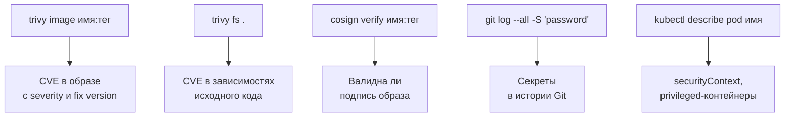

<!--
Набор конкретных команд для аналитика. Trivy image проверяет образ по имени и тегу — вывод включает список пакетов с CVE, уровень серьёзности и версию, в которой уязвимость закрыта. Trivy fs сканирует файловую систему текущего каталога — полезно для локальной проверки зависимостей до коммита. Cosign verify проверяет криптографическую подпись образа публичным ключом — если подпись не проходит, образ не должен быть в продакшене. Команда `git log` с ключом `-S` ищет строку в дельтах всех коммитов — способ найти секрет, когда-либо присутствовавший в репозитории. Kubectl describe pod показывает securityContext: запущен ли контейнер с повышенными привилегиями.
-->

---

# Прослеживаемость артефакта от коммита до Pod

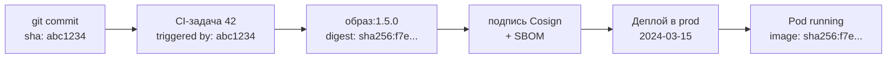

Digest образа (sha256:...) — неизменяемый идентификатор. Тег `latest` может указывать на разные образы; digest — всегда на конкретный.

<!--
Прослеживаемость — способность восстановить полную историю артефакта: какой коммит запустил какую сборку, какая сборка создала какой образ, какой образ задеплоен в каком Pod. Это критично при инциденте: получив сигнал о скомпрометированном образе, аналитик должен быстро определить, какие сервисы его используют. SBOM и провенанс-аттестации хранятся в реестре рядом с образом и доступны через `cosign download`. Команда `kubectl describe pod` в поле Image показывает digest: можно сопоставить с записью в журнале сборки. Это прямое воплощение принципа аудируемого артефакта из четвёртой лекции — теперь дополненного требованиями безопасности.
-->

---
layout: center
---

# Итоги

- **Shift-left**: проверки безопасности встроены в каждый этап конвейера, а не проводятся в конце
- **Четыре вида анализа**: SAST (код), SCA (зависимости), сканирование образа, DAST (поведение) — дополняют друг друга
- **Секреты в хранилище**: Vault или KMS, динамические токены, ротация; ничего в репозитории
- **SLSA и SBOM**: стандарты доверия к процессу и составу артефакта; мост к лекции 4
- **Прослеживаемость**: коммит → образ → деплой восстанавливается по артефактам и digest

**Дальше: Лекция 12** — управление конфигурацией и средами: как одно приложение работает в dev/stage/prod по-разному и предсказуемо.

Опорная литература: Дж. Ким, П. Дебуа, Дж. Уиллис, Дж. Хамбл «Руководство по DevOps». МИФ, 2018. К. Уилсон «Грокаем Continuous Delivery». Питер, 2024.

<!--
Подведём итоги. Центральная идея лекции: безопасность — это гейт, встроенный в конвейер, а не поздний этап перед релизом. Shift-left означает, что проверка безопасности происходит как можно раньше — там, где стоимость исправления минимальна. Четыре вида анализа закрывают разные классы угроз: SAST находит небезопасный код, SCA — уязвимые зависимости, сканирование образа — CVE в пакетах ОС, DAST — проблемы поведения. Управление секретами через Vault принципиально важно: статические токены в переменных CI — постоянный источник инцидентов. SLSA и SBOM делают цепочку поставки прозрачной и проверяемой. В следующей лекции переходим к управлению конфигурацией и средами.
-->
