<div class="cover-kicker">Лекция 12</div>

# Управление конфигурацией и средами

Как один артефакт предсказуемо работает в dev, stage и prod

<!--
Одно приложение в трёх средах: dev, stage, prod. Как сделать так, чтобы поведение было предсказуемым и воспроизводимым в каждой? Отделение конфигурации от кода, управление секретами, продвижение артефактов без пересборки, GitOps и ArgoCD.
-->

---

# Маршрут лекции

- **01 Среды и паритет** — dev, stage, prod; принцип паритета; допустимые различия
- **02 Конфигурация как код** — отделение от артефакта; секреты по средам
- **03 Продвижение и релиз** — один артефакт без пересборки; deploy ≠ release
- **04 GitOps** — желаемое состояние в Git; ArgoCD; стратегии отката
- **05 Критерии и отказы** — таблица решений; режимы отказа; свидетельства

<!--
Центральная проблема: один и тот же код ведёт себя по-разному в dev, stage и prod. Причина почти всегда в конфигурации или расхождении сред. 12-factor выделяет паритет сред в отдельный принцип. GitOps закрепляет его операционно через репозиторий.
-->

---

# Проблема: предсказуемость поведения в разных средах

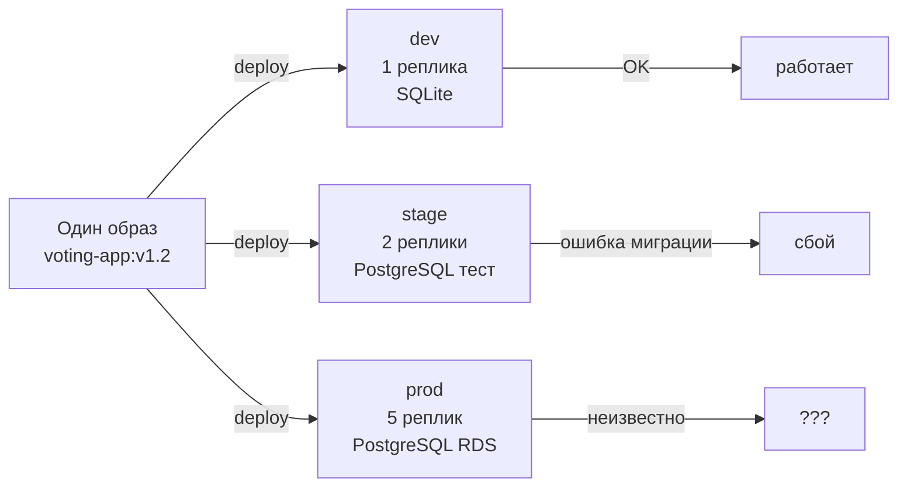

Три класса рисков при неуправляемых средах:

- **Конфигурационный сюрприз** — приложение ведёт себя иначе из-за параметра окружения
- **«Работает у меня»** — разработчик и QA видят разные системы
- **Непредсказуемый прод** — прохождение stage не гарантирует поведение в prod

<!--
Один образ, три среды. Dev: одна реплика, SQLite. Stage: два экземпляра, тестовая PostgreSQL. Prod: пять реплик, управляемая БД в облаке. Ошибка миграции в stage — это баг stage или сигнал о том, что случится в prod? Ответить невозможно, если различия между средами не задокументированы. Управление конфигурацией — контроль различий: знать, что отличается намеренно, а что должно быть идентично.
-->

---
layout: section
---

<div class="section-no">01</div>

# Среды и паритет

Dev, stage, prod — предсказуемые различия и принцип равенства

<!--
12-factor app (Heroku, 2011) выделяет паритет сред в отдельный принцип: dev, stage, prod должны быть максимально похожи по топологии и версиям. Расхождение делает конвейер непредсказуемым: работает в stage — не значит, что заработает в prod.
-->

---

# Три среды: назначение и характеристики

<div class="grid grid-cols-3 gap-3">

<div class="itmo-card">

**dev**

Запускается локально или в кластере разработчика. Минимальная конфигурация, синтетические данные. Быстрый цикл: изменил — увидел.

</div>

<div class="itmo-card">

**stage**

Максимально близка к prod по топологии. Реалистичный объём данных, внешние заглушки. Прогоняются интеграционные тесты перед релизом.

</div>

<div class="itmo-card">

**prod**

Реальная нагрузка, реальные данные. Полный масштаб, внешние системы живые. Изменения только через конвейер, не руками.

</div>

</div>

<div class="itmo-card-accent mt-4">
Среды различаются масштабом и данными. Архитектура и конфигурационная структура должны совпадать.
</div>

<!--
Три среды — три разных контракта. Dev — среда быстрого эксперимента: низкая стоимость ошибки, синтетические данные, упрощённые зависимости. Stage — зеркало prod: та же топология, те же версии зависимостей, изоляция от реального трафика. Prod — боевая система. Различия между средами должны быть намеренными и минимальными. Масштаб и данные — законные различия. Версии библиотек или структура конфигурации — нет.
-->

---

# Принцип паритета сред

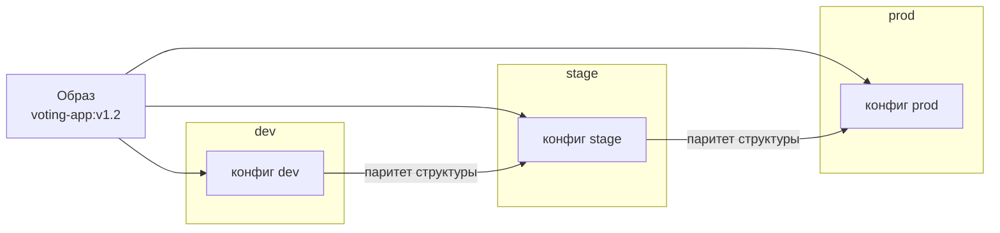

**12-factor, фактор X (dev/prod parity):** минимизировать разрыв между средами — по времени, людям и инструментам.

<!--
Паритет сред — фактор X методологии 12-factor. Разрыв между средами накапливается по трём осям. Временной разрыв: разработчик пишет код сегодня, он попадает в prod через недели. Человеческий разрыв: один человек пишет код, другой разворачивает. Инструментальный разрыв: в dev SQLite, в prod PostgreSQL. Каждый из этих разрывов создаёт потенциальные сюрпризы. Принцип паритета требует минимизировать все три: один образ, одна конфигурационная структура, инструменты максимально похожи — только параметры меняются.
-->

---

# Допустимые и недопустимые различия сред

| Характеристика | dev | stage | prod | Допустимо различаться |
|---|---|---|---|---|
| Версия образа приложения | v1.2 | v1.2 | v1.2 | нет |
| Версии зависимостей | совпадают | совпадают | совпадают | нет |
| Топология (число реплик) | 1 | 2 | 5 | да |
| Тип СУБД | совпадает | совпадает | совпадает | нет |
| Объём данных | синтетика | реалистичный | реальные | да |
| Внешние системы | заглушки | заглушки | реальные | да |

<div class="itmo-card-note mt-3">
Различия документируют явно. Необъяснённое различие — технический долг, который рано или поздно проявится как инцидент.
</div>

<!--
Таблица помогает разграничить два класса различий. Первый — легитимные: масштаб, объём данных, подключение к внешним системам. Эти различия неизбежны и не создают рисков, если задокументированы. Второй класс — опасные различия: разные версии образа, разные версии зависимостей, разный тип базы данных. Именно из них рождаются баги, которые воспроизводятся только в prod. Принцип паритета требует: всё, что не задокументировано как легитимное различие, должно быть устранено. Основной вопрос при аудите среды: «Почему здесь именно так?»
-->

---
layout: section
---

<div class="section-no">02</div>

# Конфигурация как код

Отделение переменного от постоянного, секреты по средам

<!--
Конфигурация отделена от артефакта и хранится отдельно. Один образ — три комплекта переменных. Секреты не хранятся в образе: Vault, AWS Secrets Manager, Kubernetes Secrets монтируются в runtime.
-->

---

# Разделение конфигурации и кода

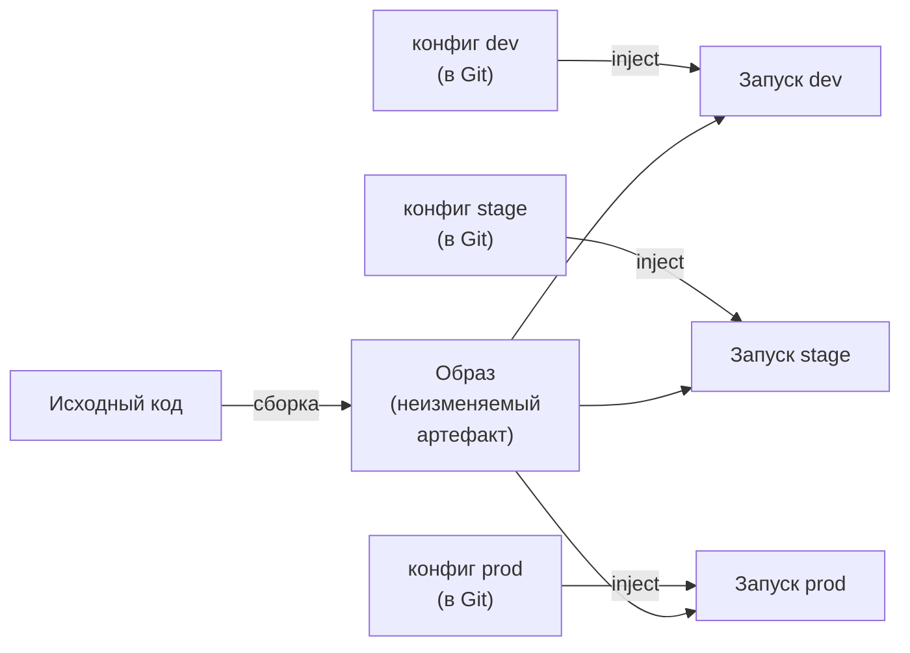

**12-factor, фактор III:** хранить конфигурацию в окружении, не в коде.

Проверочный вопрос: можно ли открыть исходный код без риска раскрытия секретов?

<!--
Разделение конфигурации и кода — один из ключевых принципов 12-factor. Артефакт собирается один раз и не изменяется. Конфигурация хранится отдельно — в переменных окружения, ConfigMap, внешнем хранилище — и подаётся при запуске. Это позволяет продвигать один и тот же образ через все среды без пересборки. Изменение конфигурации не требует нового образа — только новый параметр. Проверочный вопрос звучит так: можно ли открыть репозиторий с исходным кодом без риска раскрытия секретов? Если нет — конфигурация не отделена от кода.
-->

---

# Конфигурация в Kubernetes: ConfigMap и Secret

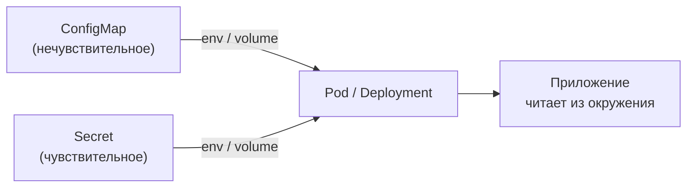

- **ConfigMap** — URL сервисов, таймауты, уровни логирования
- **Secret** — пароли, токены, сертификаты (base64 — не шифрование)
- Приложение читает переменные окружения или файл из тома, не зная источника

<!--
В Kubernetes конфигурация подаётся через ConfigMap и Secret. ConfigMap хранит нечувствительные параметры. Secret — аналогично, но данные закодированы base64: это кодирование, не шифрование. Приложение получает значения через переменные окружения или файлы в томе. Приложение не знает, откуда приходит значение — из ConfigMap, Secret или переменной хоста. Код остаётся неизменным; меняется только источник конфигурации между средами. В лекции 8 ConfigMap и Secret разбирались с точки зрения Pod — здесь смотрим на них в контексте многосредовой системы.
-->

---

# Секреты по средам: разграничение доступа

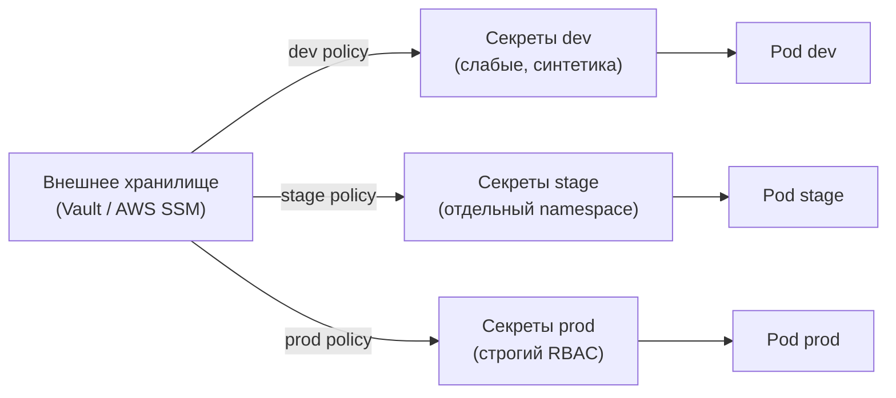

<div class="itmo-card-warn mt-3">
Секреты prod не должны быть доступны разработчикам dev. Разграничение по средам — обязательное требование безопасности.
</div>

<!--
Секреты требуют отдельного управления. Первое правило: секреты prod никогда не попадают в dev. Это не только безопасность, но и практика: разработчик не должен случайно затронуть боевую базу данных. Разграничение реализуется через пространства имён Kubernetes, роли RBAC и внешние хранилища. Внешнее хранилище выдаёт секреты конкретной среде в момент запуска, не храня их в репозитории в открытом виде. Это решает проблему «секрет в Git» — одну из самых распространённых ошибок. Политики доступа описывают, кто и к каким секретам имеет право обратиться.
-->

---

# Sealed Secrets и External Secrets

<div class="grid grid-cols-2 gap-3">

<div class="itmo-card">

**Sealed Secrets**

Шифрует Secret публичным ключом кластера. Зашифрованный объект SealedSecret безопасно хранить в Git. Кластер расшифровывает его своим приватным ключом.

</div>

<div class="itmo-card">

**External Secrets Operator**

Синхронизирует секреты из внешнего хранилища (Vault, AWS SSM, GCP Secret Manager) в объекты Secret Kubernetes. Git хранит только ссылки, не сами значения.

</div>

<div class="itmo-card-accent">

**Общий принцип**

Секреты в открытом виде — не в Git. Либо шифрование перед коммитом (Sealed Secrets), либо ссылка на внешнее хранилище (ESO).

</div>

<div class="itmo-card-note">

**Ротация**

ESO поддерживает автоматическое обновление: после смены пароля в Vault Secret в кластере обновляется без участия человека.

</div>

</div>

<!--
Два подхода к хранению секретов в GitOps-среде. Sealed Secrets — инструмент Bitnami: Secret шифруется публичным ключом кластера, и зашифрованный объект SealedSecret можно смело коммитить в репозиторий. Только кластер с приватным ключом может его расшифровать. External Secrets Operator идёт другим путём: в Git хранится только ссылка на путь в Vault или AWS SSM, а оператор в кластере вытаскивает секрет в рантайме. Второй подход лучше поддерживает ротацию — при смене пароля менять Git не нужно. Оба решают проблему «секрет в репозитории», выбор зависит от наличия внешней системы управления секретами.
-->

---
layout: section
---

<div class="section-no">03</div>

# Продвижение и релиз

Один артефакт через все среды — без пересборки

<!--
Один образ продвигается dev → stage → prod без пересборки. Feature flag отделяет деплой от релиза: код задеплоен, но функция выключена до готовности. LaunchDarkly, Unleash — специализированные системы флагов.
-->

---

# Продвижение: один артефакт по средам

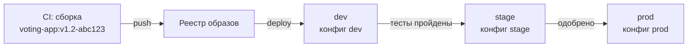

- Образ собирается **один раз** в CI и получает неизменяемый тег с хешем коммита
- При переходе между средами тег остаётся прежним — меняется только конфигурация
- Пересборка перед prod нарушает прослеживаемость: неизвестно, тот ли артефакт

<!--
Принцип продвижения — один из центральных в Continuous Delivery. Образ собирается ровно один раз: в CI, из конкретного коммита, с неизменяемым тегом, обычно включающим хеш коммита. Именно этот образ разворачивается в dev, затем в stage и наконец в prod. При каждом переходе меняется только конфигурация — URL базы данных, количество реплик, секреты. Пересборка перед prod катастрофически нарушает прослеживаемость: мы больше не знаем, тот ли артефакт, что прошёл тестирование, добирается до боевой системы. Уилсон называет это «принципом неизменяемости артефакта».
-->

---

# Прослеживаемость: коммит — образ — среда

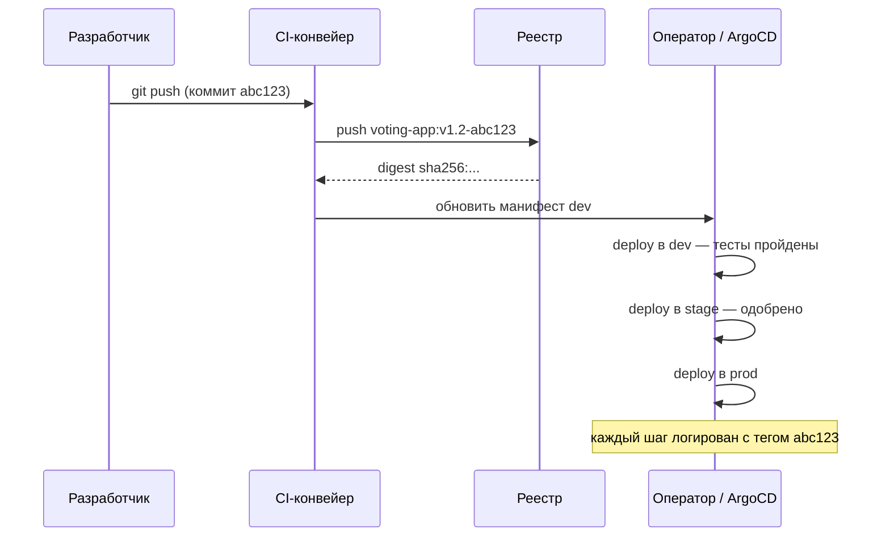

<!--
Прослеживаемость — способность ответить на вопрос: что именно сейчас работает в prod и из какого коммита это собрано? Последовательность такова: разработчик создаёт коммит, CI собирает образ и тегирует его хешем коммита, реестр отдаёт digest образа — криптографически неизменяемый идентификатор. Оператор или ArgoCD продвигает образ по средам, обновляя ссылку на тег в манифестах. В каждой точке можно установить связь: prod запускает digest, digest соответствует тегу, тег соответствует коммиту. Это полная цепочка прослеживаемости, которая позволяет быстро диагностировать инциденты.
-->

---
layout: two-cols
---

# Deploy ≠ Release

## Традиционный подход

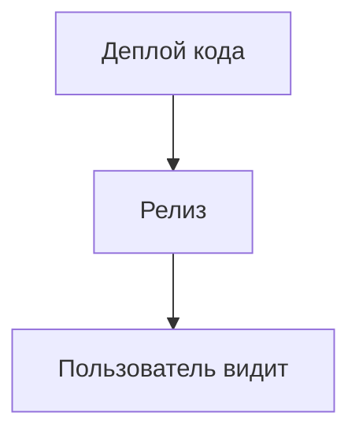

Деплой и релиз — одно событие. Любой деплой сразу виден пользователю.

Риск: нельзя выкатить «тихо».

::right::

## Разделённый подход

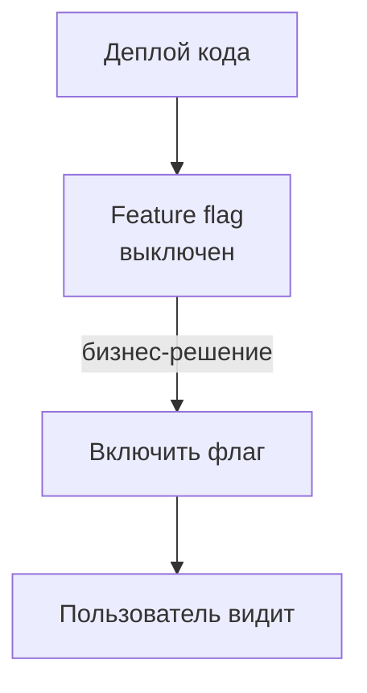

Два независимых события:

- **Технический выкат** — когда готов код
- **Бизнес-решение** — когда включить функцию

<div class="itmo-card-accent mt-3">
Экстренный откат функции — выключить флаг, не откатывать деплой.
</div>

<!--
Разделение деплоя и релиза — одно из ключевых концептуальных различий современной Continuous Delivery. При традиционном подходе деплой автоматически означает, что пользователи видят новый функционал. При разделённом подходе код попадает в прод — но скрыт за feature flag. Бизнес-команда самостоятельно принимает решение: когда и для кого включить флаг. Технические команды могут выкатывать много раз в день, не дожидаясь «правильного момента» для релиза. Если что-то пошло не так — флаг выключают за секунды, без отката деплоя. Это кардинально снижает риск каждого выката.
-->

---

# Feature flags: управление видимостью в рантайме

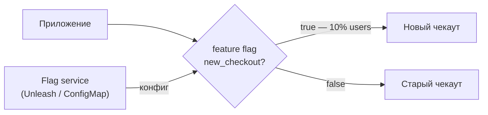

Сценарии применения:

- **Постепенный ввод** — 1% → 10% → 50% → 100% пользователей
- **A/B тест** — разные группы видят разный опыт
- **Kill switch** — мгновенное отключение при сбое

<!--
Feature flags — механизм управления видимостью функций в рантайме. Приложение при каждом запросе проверяет значение флага через SDK или HTTP-запрос к flag service. Флаг может быть простым булевым значением или сложным правилом: включить для 10% пользователей, или только для бета-тестеров, или только в определённом регионе. Постепенный ввод — это canary через флаги без смены инфраструктуры. Kill switch позволяет отключить проблемную функцию за секунды, не трогая деплой. Важно помнить: флаги накапливаются и создают технический долг — устаревшие флаги нужно регулярно убирать из кода.
-->

---
layout: section
---

<div class="section-no">04</div>

# GitOps

Желаемое состояние среды живёт в Git

<!--
GitOps — операционная модель: весь желаемый стейт системы описан в репозитории, изменения вносятся только через коммиты. ArgoCD и Flux — операторы, которые синхронизируют кластер с репо. Drift detection: если кто-то вручную изменил ресурс в кластере — оператор это обнаружит и восстановит.
-->

---

# GitOps: модель операций

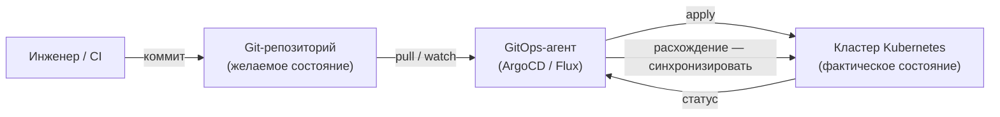

Три принципа GitOps:

- **Git — единственный источник истины** о желаемом состоянии
- **Изменение вносится коммитом**, не командой в кластере
- **Агент** непрерывно синхронизирует кластер с репозиторием

<!--
GitOps — операционная модель, при которой весь инфраструктурный код и манифесты приложений хранятся в Git. Изменение в системе начинается с коммита: инженер или CI обновляет манифест в репозитории. GitOps-агент — ArgoCD или Flux — наблюдает за репозиторием и применяет изменения к кластеру. Если кто-то изменил что-то в кластере вручную, агент обнаружит расхождение и вернёт систему к состоянию в Git. Откат — это git revert или возврат к предыдущему коммиту, а не сложная процедура. История всех изменений — в git log с именами авторов и временными метками.
-->

---

# GitOps workflow: изменение через коммит

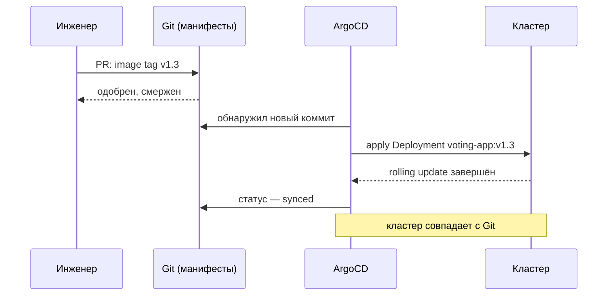

<!--
Посмотрим на GitOps-цикл на конкретном примере. Инженер создаёт pull request с обновлением тега образа с v1.2 на v1.3 в манифесте Deployment. После ревью и одобрения PR вливается в основную ветку. ArgoCD, который непрерывно следит за репозиторием, обнаруживает новый коммит. Он применяет обновлённый манифест к кластеру — запускается rolling update. По завершении ArgoCD обновляет статус синхронизации. Теперь состояние кластера совпадает с тем, что описано в Git. Любое отклонение от этого состояния — ручное изменение в кластере — ArgoCD обнаружит и сообщит о расхождении.
-->

---

# ArgoCD: декларативные приложения

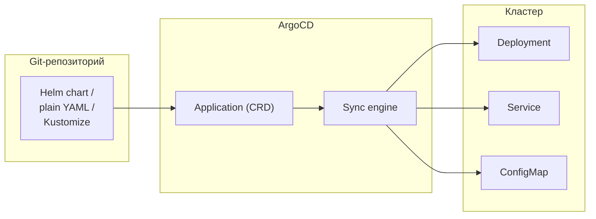

Объект **Application** описывает: источник (репозиторий, ветка, путь), назначение (кластер, Namespace), политику синхронизации (ручная / автоматическая).

<!--
ArgoCD реализует GitOps через собственный CRD — объект Application. Каждое приложение в ArgoCD имеет три ключевых параметра. Источник: откуда брать манифесты — это может быть репозиторий с plain YAML, Helm chart или Kustomize-оверлеи. Назначение: в какой кластер и в какой Namespace разворачивать. Политика синхронизации: ручная — ArgoCD показывает расхождение, но ждёт подтверждения; или автоматическая — ArgoCD применяет изменения сразу после обнаружения. Для prod обычно выбирают ручную синхронизацию с обязательным ревью PR; для dev — автоматическую.
-->

---

# ArgoCD: синхронизация и самовосстановление

<div class="grid grid-cols-2 gap-3">

<div class="itmo-card">

**Статусы синхронизации**

- **Synced** — кластер совпадает с Git
- **OutOfSync** — есть расхождение
- **Unknown** — нет данных о состоянии

</div>

<div class="itmo-card">

**Self-healing**

При включённом self-heal ArgoCD откатывает ручные изменения в кластере — возвращает к состоянию в Git автоматически.

</div>

<div class="itmo-card-warn">

**Ловушка: ложное расхождение**

Если Helm генерирует поля динамически (аннотации, ресурсные версии), ArgoCD может видеть постоянный OutOfSync. Решение — настройка `ignoreDifferences`.

</div>

<div class="itmo-card-note">

**Drift detection без auto-sync**

Даже при ручной синхронизации ArgoCD фиксирует расхождение. Команда видит: кластер отклонился от Git. Это само по себе ценно.

</div>

</div>

<!--
ArgoCD непрерывно сравнивает состояние кластера с тем, что описано в Git, и отображает статус синхронизации. Статус Synced означает: кластер в точности соответствует репозиторию. OutOfSync — расхождение: ручное изменение в кластере или новый коммит, ещё не применённый. Self-healing — опция, при которой ArgoCD автоматически откатывает ручные изменения. Это мощная защита от «хождения в кластер руками». Практическая ловушка: некоторые Helm-чарты генерируют динамические поля, которые меняются при каждом рендере, создавая ложное расхождение — его устраняют через ignoreDifferences. Мониторинг расхождений ценен сам по себе даже без авто-синхронизации.
-->

---

# Стратегии отката

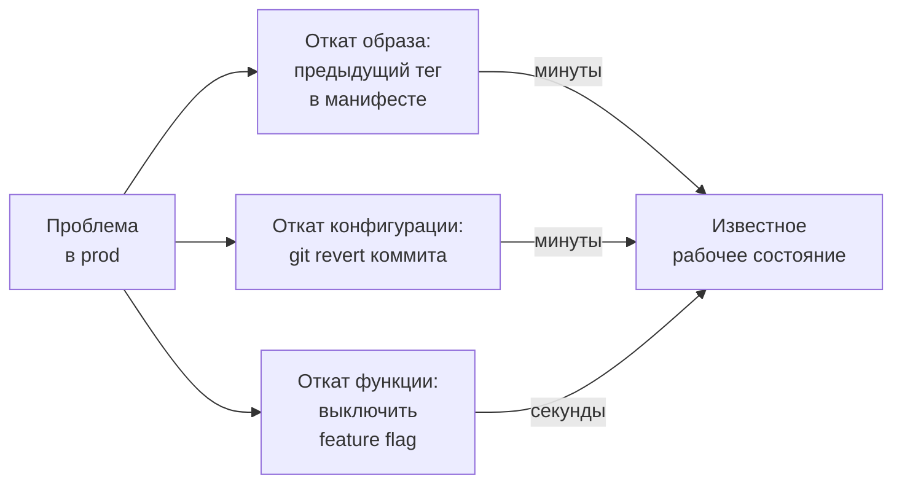

<div class="itmo-card-accent mt-3">
Самый быстрый откат — отключение feature flag (секунды). Наиболее полный — откат образа через GitOps-коммит (минуты).
</div>

<!--
Откат — это контролируемое возвращение к известному рабочему состоянию. В GitOps-среде есть три механизма. Откат образа: обновляем тег в манифесте на предыдущую версию и коммитим — ArgoCD применяет изменение за минуты. Откат конфигурации: делаем git revert коммита, который привёл к проблеме — история конфигурации в Git делает это тривиальным. Откат функции: если проблема в новой функции за feature flag — выключаем флаг за секунды без изменения деплоя. Все три механизма требуют, чтобы система проектировалась с возможностью отката. Уилсон в «Грокаем Continuous Delivery» называет быстрый откат обязательным свойством зрелого конвейера.
-->

---
layout: section
---

<div class="section-no">05</div>

# Критерии и отказы

Где проводить границы, что идёт не так, как проверить

<!--
Где различие сред допустимо, а где нет — решается по одному критерию: влияет ли расхождение на поведение приложения? Масштаб реплик — нет. Версия библиотеки или конфиг-схема — да. Режимы отказа: env-переменная не подставилась, secret не смонтировался, порт захардкожен.
-->

---

# Критерии: где допустимы различия сред

| Характеристика | Паритет обязателен | Различие допустимо |
|---|---|---|
| Версия образа приложения | да | — |
| Версии зависимостей | да | — |
| Структура конфигурации | да | — |
| Число реплик (масштаб) | — | да |
| Объём и характер данных | — | да |
| Доступность внешних систем | — | да (заглушки) |
| Тип облачного провайдера | рекомендовано | переносимость vs стоимость |

<div class="itmo-card-note mt-3">
Различия сред — документированные и явные. Необъяснённое различие — технический долг, который рано или поздно проявится как инцидент.
</div>

<!--
Таблица критериев — инструмент аналитика при проектировании многосредовой системы. Три категории. Паритет обязателен: версия образа, версии зависимостей, структура конфигурации — различие здесь создаёт непредсказуемость. Различие допустимо: масштаб, данные, доступность внешних систем — различие неизбежно и управляемо. Спорный случай: облачный провайдер. Паритет желателен для переносимости, но достижим с существенными затратами; зависит от требований к vendor lock-in. Правило: каждое различие документируется явно. Если его нельзя объяснить за 30 секунд — это проблема.
-->

---

# Режимы отказа

<div class="grid grid-cols-2 gap-3">

<div class="itmo-card-warn">

**Конфигурационный дрейф**

Состояние кластера расходится с описанием в Git. Причина: ручные изменения напрямую в кластере. ArgoCD покажет OutOfSync.

</div>

<div class="itmo-card-warn">

**«Работает у меня»**

Dev и prod используют разные версии зависимостей или разные типы хранилищ. Баг воспроизводится только в prod.

</div>

<div class="itmo-card-warn">

**Рассинхрон Git и кластера**

ArgoCD отключён или потерял доступ к репозиторию. Кластер живёт своей жизнью. Git перестаёт быть источником истины.

</div>

<div class="itmo-card-warn">

**Секрет в репозитории**

Команда закоммитила пароль в открытом виде. История Git хранит его навсегда — ротация обязательна, история не чистится.

</div>

</div>

<!--
Четыре режима отказа в управлении конфигурацией и средами. Конфигурационный дрейф — самый частый: кто-то зашёл в кластер и применил изменение вручную. Теперь факт расходится с Git, и никто не знает точно, что работает. «Работает у меня» — классика: разработчик использует PostgreSQL 14, в prod стоит PostgreSQL 12. Миграция проходит в dev, падает в prod. Рассинхрон Git и кластера опасен ложным ощущением контроля: команда думает, что управляет системой через Git, а на деле кластер живёт отдельно. Секрет в репозитории — необратимая ошибка без ротации: git log всегда покажет коммит с паролем.
-->

---

# Свидетельства: диагностика состояния

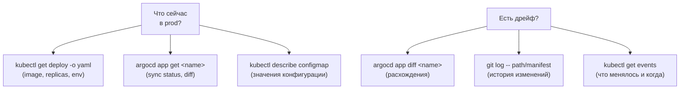

<!--
Арсенал системного аналитика при расследовании конфигурационных проблем. Первый вопрос: что именно сейчас работает в prod? Команда kubectl get deployment с флагом вывода yaml покажет точный образ, переменные окружения и конфигурацию. argocd app get покажет статус синхронизации. Второй вопрос: есть ли дрейф? argocd app diff покажет точные расхождения между Git и кластером. git log по пути к манифесту покажет историю изменений с авторами и временем. kubectl get events покажет хронологию событий в кластере. Совокупность этих команд позволяет восстановить точную картину состояния и истории системы.
-->

---

# Свидетельства: мост к лабораторной

<div class="grid grid-cols-2 gap-3">

<div class="itmo-card-note">

**Диагностика конфигурации**

```bash
# Образ во всех деплойментах
kubectl get deploy -n prod -o wide

# ConfigMap в namespace
kubectl get configmap -n prod
```

</div>

<div class="itmo-card-note">

**Проверка синхронизации ArgoCD**

```bash
# Статус всех приложений
argocd app list

# Детальный diff
argocd app diff voting-app
```

</div>

</div>

<div class="itmo-card-accent mt-3">
Лабораторная работа 3: конвейер CI/CD для voting-app с продвижением образа через среды и проверкой синхронизации ArgoCD.
</div>

<!--
Эти команды составляют базовый инструментарий для лабораторной работы. Первая группа: проверить, что именно работает в кластере. kubectl get deploy с jsonpath позволяет извлечь точный тег образа всех Deployment в namespace — первый шаг при расследовании инцидента. Вторая группа: работа с ArgoCD. argocd app list даёт быстрый обзор статуса всех приложений. argocd app diff показывает точные расхождения между манифестом в Git и тем, что применено в кластере. В лабораторной мы развернём voting-app с конвейером, который автоматически продвигает образ от dev к stage, и настроим ArgoCD для синхронизации между репозиторием и кластером.
-->

---
layout: center
---

# Итоги

- **Паритет сред** — различия между dev, stage и prod должны быть явными; неуправляемое различие становится инцидентом
- **Конфигурация отделена от кода** — один артефакт получает разные параметры в разных средах; секреты не хранятся в репозитории в открытом виде
- **Продвижение без пересборки** — один образ проходит все среды; пересборка нарушает прослеживаемость
- **Deploy ≠ Release** — feature flags разделяют технический выкат и бизнес-решение о включении функции
- **GitOps** — Git как единственный источник истины; ArgoCD синхронизирует кластер и обнаруживает дрейф

**Дальше: Лекция 13** — инфраструктура как код: Terraform и Ansible, декларативная и конвергентная модели управления инфраструктурой.

Опорная литература: К. Уилсон «Грокаем Continuous Delivery». Питер, 2024.

<!--
Подведём итоги лекции. Центральная идея: управление конфигурацией — это управление различиями между средами, а значит, управление риском. Паритет сред — принцип, а не опция: необъяснённые различия превращаются в инциденты. Отделение конфигурации от кода — необходимое условие продвижения артефакта без пересборки. Секреты хранятся отдельно — в зашифрованном виде или во внешних хранилищах. Feature flags позволяют развязать технический цикл выката от бизнес-решения о релизе. GitOps замыкает цикл: Git становится единственным источником истины, ArgoCD — механизмом синхронизации. В следующей лекции перейдём к инфраструктуре как коду.
-->
