<div class="cover-kicker">Лекция 13</div>

# Infrastructure as Code

Когда серверы и сети описываются кодом, как приложение

<!--
Добрый день. Тринадцатая лекция — практика «инфраструктура как код». В прошлой лекции мы разобрали управление конфигурацией и средами: как одно приложение разворачивается в dev, stage и prod через GitOps. Сегодня переходим на уровень ниже: как создаётся сама инфраструктура, на которой эти среды живут. Разберём принципы IaC, два главных инструмента — Terraform и Ansible, критерии их выбора и мост к лабораторной работе 4. Следуем аналитической рамке курса: проблема, модель, границы, критерии, режимы отказа, свидетельства.
-->

---

# Маршрут лекции

- **01 Практика IaC** — принципы, декларативность, идемпотентность, воспроизводимость
- **02 Terraform** — HCL, провайдеры, граф зависимостей, state, plan и apply, модули
- **03 Ansible** — control node, inventory, playbooks, роли, push-модель
- **04 Выбор и границы** — provisioning vs configuration management, immutable vs mutable
- **05 Критерии, отказы, свидетельства** — таблица решений, режимы отказа, диагностика

<!--
Маршрут лекции следует аналитической рамке курса: начинаем с проблемы и модели, затем разбираем два инструмента по отдельности, сравниваем их и завершаем критериями выбора и свидетельствами. Такой порядок позволяет понять каждый инструмент не как набор команд, а как ответ на конкретную задачу. Terraform и Ansible решают разные задачи и хорошо работают вместе — это ключевой вывод, к которому мы придём в четвёртом блоке.
-->

---

# Проблема: ручная настройка не воспроизводима

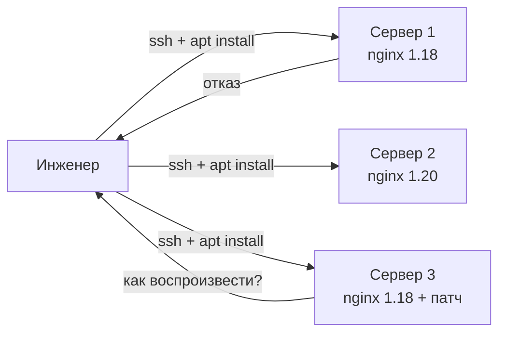

Три класса последствий ручной настройки:

- **Дрейф** — серверы расходятся в конфигурации: версии, патчи, параметры
- **Нет аудита** — кто, когда и зачем изменил настройку — неизвестно
- **Нет воспроизводства** — поднять точную копию окружения невозможно без документа

<!--
Представим типичную картину: три сервера, настроенные вручную по SSH. Первый инженер ставит nginx 1.18, второй — уже вышел 1.20. Третий добавляет патч, который нигде не задокументирован. Через полгода никто не знает точно, что стоит на каждом сервере. При отказе сервера воспроизвести конфигурацию невозможно — придётся снова разбираться по памяти и логам. При масштабировании новый сервер будет немного отличаться. Это и есть проблема, которую решает IaC: ручная настройка не масштабируется и не аудируется.
-->

---
layout: section
---

<div class="section-no">01</div>

# Практика IaC

Принципы, декларативность, идемпотентность, воспроизводимость

<!--
Первый блок — модель. Прежде чем говорить об инструментах, важно понять, что именно делает подход «инфраструктура как код» и почему три принципа — декларативность, идемпотентность и воспроизводимость — образуют единое целое. Без понимания принципов инструменты остаются набором команд.
-->

---

# IaC: инфраструктура под контролем версий

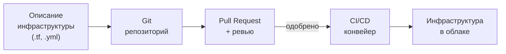

Изменение инфраструктуры проходит тот же путь, что и изменение кода приложения:

- История изменений в Git — кто, когда, зачем
- Ревью перед применением — pull request к инфраструктурному коду
- Откат — `git revert`, а не «вспомнить, что было»

<!--
Практика IaC переворачивает процесс: не инженер настраивает серверы вручную, а конфигурация описана в файлах, которые хранятся в Git. Любое изменение инфраструктуры — это изменение файлов, коммит, pull request, ревью, и только после одобрения — применение через конвейер. Это даёт всё, что мы привыкли получать от Git в разработке: историю с автором и причиной, возможность откатиться к любому предыдущему состоянию, обязательное ревью. В «Руководстве по DevOps» Джина Кима это называют одним из ключевых принципов второго пути.
-->

---
layout: two-cols
---

# Декларативность vs императивность

## Императивная модель

Описываем **шаги**:

```bash
apt-get install -y nginx
systemctl enable nginx
systemctl start nginx
ufw allow 80/tcp
```

Надо знать текущее состояние: если nginx уже установлен, команда вернёт ошибку или сделает лишнее.

::right::

## Декларативная модель

Описываем **желаемое состояние**:

```hcl
resource "aws_instance" "web" {
  ami           = "ami-0c55b159cbfafe1f0"
  instance_type = "t2.micro"
  tags = {
    Name = "web-server"
  }
}
```

Система сама решает, **как** прийти к этому состоянию.

<div class="itmo-card-accent mt-4">
Декларатив — это «что должно быть». Инструмент находит путь от текущего к желаемому.
</div>

<!--
Ключевое различие двух подходов. Императивная модель — список команд: установить, включить, открыть порт. Она работает, если точно знаешь текущее состояние системы. Если nginx уже запущен, повторный запуск команды установки вернёт ошибку или ничего не сделает — поведение непредсказуемо. Декларативная модель описывает конечное состояние. Инструмент сам определяет разницу между тем, что есть, и тем, что должно быть, и выполняет только нужные действия. Файл описывает не процедуру, а намерение.
-->

---

# Идемпотентность и воспроизводимость

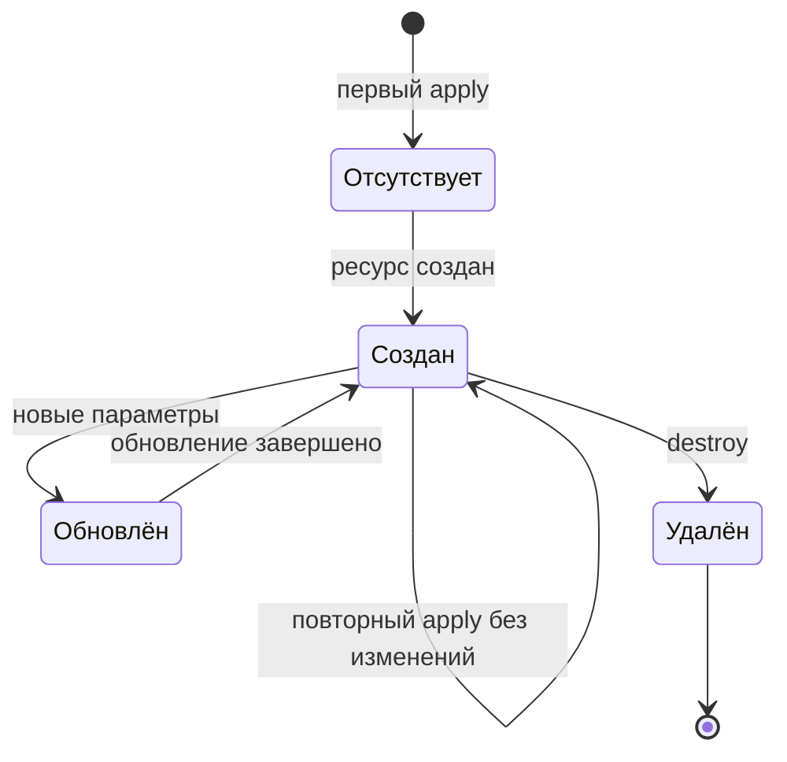

- **Идемпотентность** — повторный apply не меняет систему, уже находящуюся в нужном состоянии
- **Воспроизводимость** — одни и те же файлы дают одну и ту же инфраструктуру в любом окружении

<!--
Два принципа работают вместе. Идемпотентность означает, что `terraform apply` можно запускать сколько угодно раз: если система уже соответствует конфигурации, ничего не произойдёт. Это безопасно встроить в конвейер CI/CD — инструмент применяется при каждом коммите. Воспроизводимость — следствие хранения конфигурации в Git: одни и те же файлы дают одну и ту же инфраструктуру. Мы можем поднять точную копию prod для тестирования, пересоздать окружение после катастрофы или проверить, как выглядела инфраструктура полгода назад, переключившись на нужный коммит.
-->

---
layout: section
---

<div class="section-no">02</div>

# Terraform

HCL, провайдеры, граф зависимостей, state, plan и apply

<!--
Второй блок — Terraform. Это инструмент создания инфраструктуры: виртуальных машин, сетей, баз данных, DNS-записей. Terraform умеет работать с сотнями облачных и on-premise провайдеров через единую декларативную модель. Разберём его устройство — от HCL-описания до механизма обнаружения дрейфа.
-->

---

# Terraform: HCL, провайдеры, ресурсы

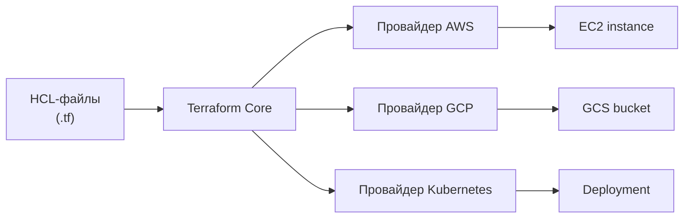

- **HCL** (HashiCorp Configuration Language) — декларативный язык описания ресурсов
- **Провайдер** — плагин, реализующий API конкретного сервиса: AWS, GCP, Azure, Kubernetes, Vault
- **Ресурс** — атомарный объект: виртуальная машина, VPC, S3-бакет, DNS-запись

<!--
Terraform состоит из трёх слоёв. HCL-файлы — человекочитаемое описание ресурсов: что создать, с какими параметрами. Terraform Core читает эти файлы, строит граф зависимостей и определяет порядок операций. Провайдер — плагин, который знает API конкретного облака или сервиса. Провайдеры устанавливаются отдельно; Terraform Registry содержит тысячи провайдеров — от AWS до GitHub и Datadog. Ресурс — минимальный объект: виртуальная машина, сеть, правило файерволла. Каждый ресурс описывается в отдельном блоке HCL. Один набор HCL-файлов может управлять ресурсами в разных облаках одновременно.
-->

---

# Граф зависимостей Terraform

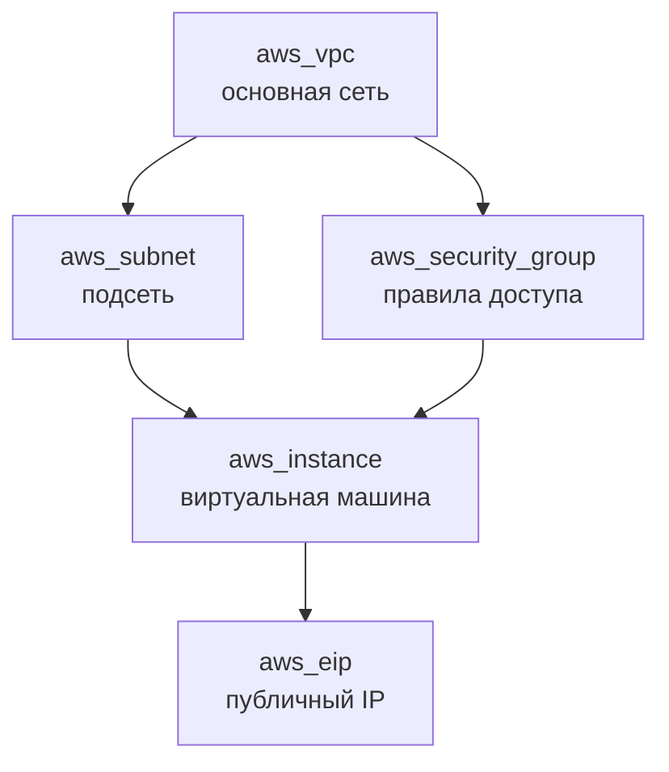

Terraform строит граф автоматически. Ресурсы создаются в топологическом порядке: сначала VPC, затем подсеть и группа безопасности — параллельно, затем виртуальная машина.

<!--
Граф зависимостей — ключевая особенность Terraform. Инженер не указывает порядок создания ресурсов явно: Terraform сам определяет зависимости по ссылкам между ресурсами. Если описание виртуальной машины ссылается на подсеть, Terraform поймёт: сначала нужно создать подсеть, потом машину. Независимые ресурсы создаются параллельно — это ускоряет применение. Граф используется и при удалении: ресурсы удаляются в обратном порядке. Порядок операций всегда корректен, потому что выводится из зависимостей, а не задаётся вручную.
-->

---

# Terraform state: отображение на реальность

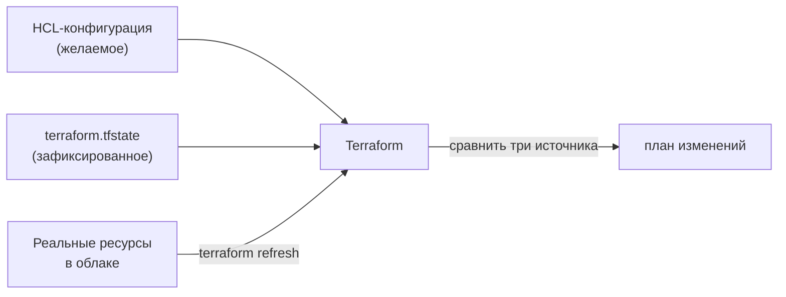

- **State** — файл, сопоставляющий описание с реальными ресурсами и их атрибутами
- Хранит ID ресурсов в облаке, их текущие атрибуты и зависимости
- **Дрейф** — расхождение state с реальностью при ручном изменении ресурсов

<!--
State — это память Terraform. При первом apply инструмент создаёт файл terraform.tfstate, в котором записывает каждый созданный ресурс: его тип, имя, ID в облаке и все атрибуты. При следующем apply Terraform сравнивает три источника: HCL-конфигурацию (что должно быть), state (что Terraform знает о реальности) и реальные ресурсы. Если кто-то изменил ресурс вручную через консоль AWS — state расходится с реальностью. Это и называется дрейфом. Terraform обнаруживает дрейф при планировании и предлагает вернуть ресурс к описанному состоянию.
-->

---
layout: two-cols
---

# Удалённый state и блокировки

## Проблема локального state

- Файл `terraform.tfstate` на ноутбуке разработчика
- Два инженера применяют одновременно — конфликт
- Потеря ноутбука = потеря знания о состоянии инфраструктуры

<div class="itmo-card-warn mt-4">
Локальный state неприемлем в командной работе.
</div>

::right::

## Удалённый state с блокировкой

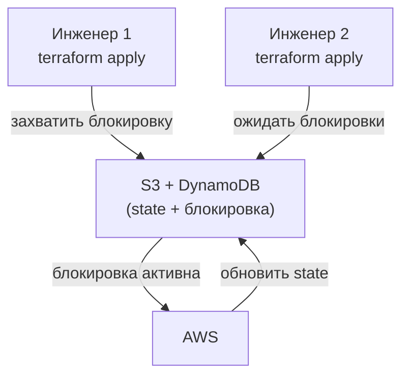

<div class="itmo-card-note mt-3">
Типовой бэкенд: S3 для state + DynamoDB для блокировок.
</div>

<!--
В командной работе локальный state неприемлем. Если файл хранится на ноутбуке одного инженера, второй не знает текущего состояния и рискует создать конфликт. Решение — удалённый бэкенд с блокировками. State хранится в S3 или Terraform Cloud; каждый apply захватывает блокировку через DynamoDB, чтобы только один apply выполнялся одновременно. Блокировка снимается после завершения. Это стандартный паттерн для продуктивных сред: state доступен всей команде, защищён от параллельных изменений и не зависит от конкретного компьютера.
-->

---

# plan и apply: контроль изменений

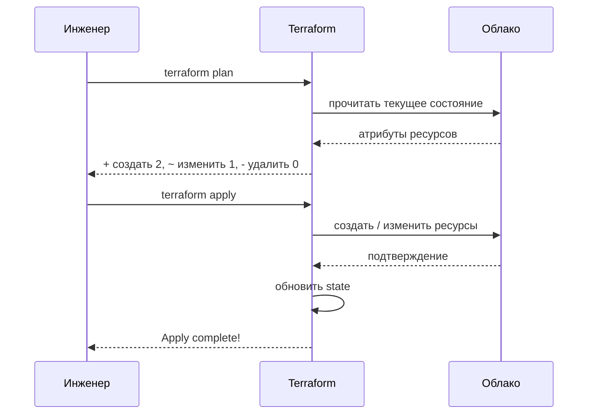

<!--
Разделение plan и apply — важный механизм контроля. `terraform plan` показывает полный список изменений до их наступления: сколько ресурсов будет создано, изменено, удалено и как именно изменятся их атрибуты. Инженер проверяет план, убеждается, что нет неожиданных удалений, и только потом применяет. В конвейере CI/CD это часто реализуется так: plan выполняется автоматически при каждом pull request и публикуется в комментарии; apply требует ручного подтверждения или выполняется только в защищённой ветке. Это прямой аналог ревью кода — только для инфраструктурных изменений.
-->

---

# Terraform модули: переиспользование конфигурации

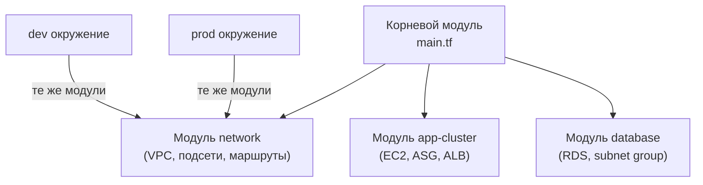

Модуль — упакованная конфигурация с входными переменными и выходными значениями. Один модуль, несколько окружений.

<!--
Модули в Terraform — аналог функций в коде: они упаковывают конфигурацию и принимают параметры. Модуль сети описывает VPC, подсети и маршруты один раз. Dev и prod окружения используют тот же модуль с разными параметрами: разный диапазон IP, разное число подсетей. Это устраняет дублирование — не нужно копировать сотни строк HCL для каждого окружения. Модули публикуются в Terraform Registry: готовые модули для AWS EKS, GCP GKE, Azure AKS — стандартные компоненты для быстрого старта. Хорошая организация модулей — один из главных признаков зрелой IaC-практики.
-->

---
layout: section
---

<div class="section-no">03</div>

# Ansible

Control node, inventory, playbooks, роли, push-модель

<!--
Третий блок — Ansible. Если Terraform создаёт инфраструктуру, Ansible её настраивает: устанавливает пакеты, конфигурирует сервисы, управляет пользователями. Разберём архитектуру Ansible и его ключевую особенность: push-модель через SSH без агентов на целевых узлах.
-->

---

# Ansible: архитектура и push-модель

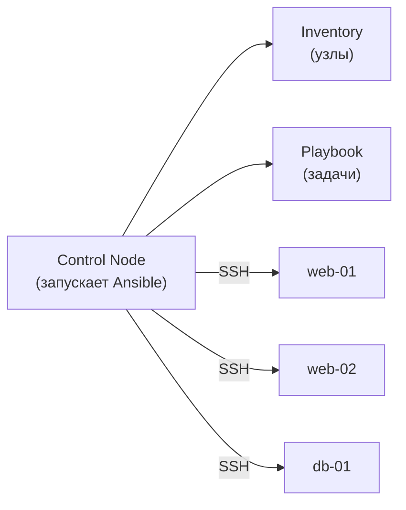

- **Control node** — запускает Ansible; агент на целевых узлах не нужен
- **Inventory** — список узлов с группировкой: `[web]`, `[db]`, `[all]`
- **Push-модель** — control node подключается к узлам по SSH и выполняет задачи

<!--
Ansible работает по push-модели: управляющий узел сам подключается к целевым серверам по SSH и выполняет задачи. Это принципиально отличает его от систем с агентами вроде Puppet или Chef, где на каждом узле нужно устанавливать и поддерживать агента. Для Ansible достаточно иметь SSH-доступ и Python на целевом узле. Inventory — список серверов с группировкой: веб-серверы в группе `[web]`, базы данных в `[db]`. Ansible применяет одни и те же задачи ко всем серверам в группе параллельно. Начать можно в течение часа без сложной инфраструктуры.
-->

---

# Playbook: описание желаемого состояния

```yaml
---
- name: Установить и настроить nginx
  hosts: web
  become: true
  tasks:
    - name: Установить пакет
      ansible.builtin.apt:
        name: nginx
        state: present
    - name: Запустить сервис
      ansible.builtin.service:
        name: nginx
        state: started
        enabled: true
```

Каждый модуль Ansible идемпотентен: `apt` с `state: present` установит пакет только если его нет. Повторный запуск playbook не изменит систему, уже находящуюся в нужном состоянии.

<!--
Playbook — YAML-файл, описывающий набор задач для группы хостов. Каждая задача вызывает модуль Ansible: apt устанавливает пакет, service управляет сервисами. Ключевое свойство: каждый модуль идемпотентен. Модуль apt с `state: present` проверит, установлен ли пакет, и установит только если его нет. Повторный запуск того же playbook не изменит систему, которая уже в нужном состоянии. Это делает playbook безопасным для регулярного применения в конвейере. В «Руководстве по DevOps» Кима этот подход называют конвергенцией состояния: система сама приходит к нужной конфигурации.
-->

---

# Роли Ansible: переиспользование задач

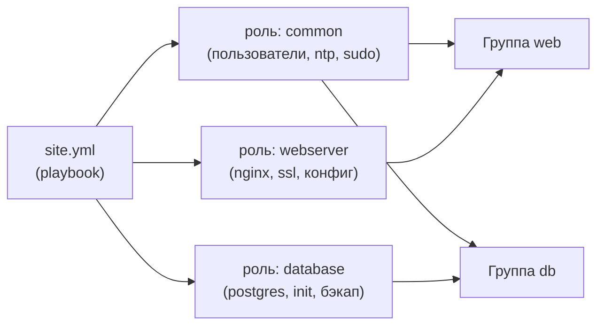

Роль — переиспользуемый набор задач, обработчиков, шаблонов и переменных. Ansible Galaxy содержит тысячи публичных ролей.

<!--
Роли в Ansible — стандартный способ организации и переиспользования конфигурации. Роль common применяется ко всем узлам: создаёт пользователей, настраивает sudo, синхронизирует время. Роль webserver знает всё об установке и настройке nginx. Роль database — о PostgreSQL. Каждый playbook собирается из ролей как из строительных блоков. Роли можно опубликовать в Ansible Galaxy и использовать чужие проверенные роли для типовых задач. Такая организация позволяет поддерживать конфигурацию тысяч серверов, не дублируя логику: изменение в роли common автоматически применится ко всем узлам при следующем запуске.
-->

---
layout: section
---

<div class="section-no">04</div>

# Выбор и границы

Provisioning vs configuration management, immutable vs mutable

<!--
Четвёртый блок — аналитика. Мы изучили два инструмента: Terraform и Ansible. Теперь важно понять, когда применять каждый, как они соотносятся и что означает выбор между изменяемой и неизменяемой инфраструктурой. Это главные вопросы системного аналитика при проектировании IaC-стратегии.
-->

---

# Provisioning и configuration management

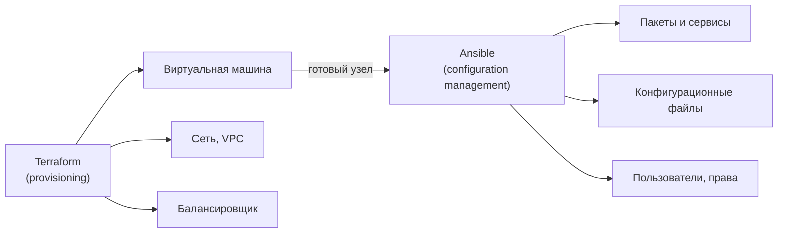

<!--
Разделение ролей между Terraform и Ansible чёткое: это разные задачи, которые хорошо сочетаются. Terraform занимается provisioning — созданием ресурсов: поднимает виртуальные машины, создаёт сети, запускает управляемые базы данных. Результат — список IP-адресов и идентификаторов новых ресурсов. Ansible занимается configuration management — настройкой уже существующих систем: устанавливает пакеты, копирует конфигурации, создаёт пользователей. Типичный сценарий: Terraform создаёт три виртуальные машины, передаёт их IP в inventory Ansible, Ansible настраивает nginx и приложение. Инструменты взаимодополняют, а не конкурируют.
-->

---
layout: two-cols
---

# Изменяемая инфраструктура

Серверы живут долго и **правятся на месте**:

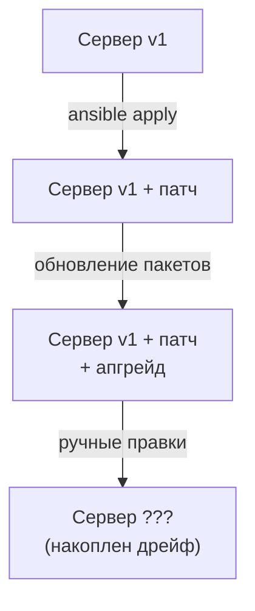

Со временем сервер становится уникальным и непредсказуемым.

::right::

# Неизменяемая инфраструктура

При изменении — **пересоздание из образа**:

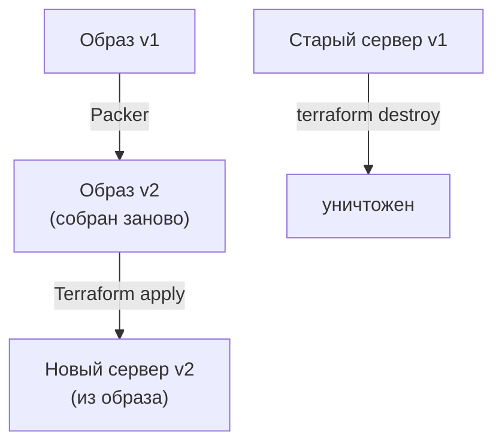

Дрейф исключён — сервер всегда соответствует образу.

<!--
Два принципиально разных взгляда на жизненный цикл инфраструктуры. Изменяемая инфраструктура предполагает, что серверы живут долго и обновляются на месте: установить патч, обновить пакеты, подправить конфигурацию. Со временем такой сервер становится «снежинкой» — уникальным и непредсказуемым: слишком много мелких изменений за месяцы эксплуатации. Неизменяемая инфраструктура работает иначе: при любом изменении собирается новый образ с новой конфигурацией, старые серверы уничтожаются, новые создаются из образа. Дрейф исключён по определению. Контейнеры, которые мы изучали в начале курса, реализуют этот принцип для приложений.
-->

---

# Золотой образ: реализация неизменяемости

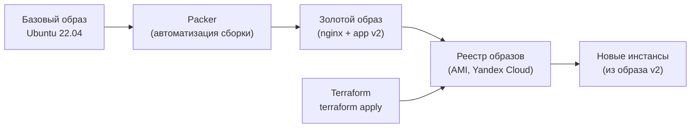

Packer автоматизирует сборку золотого образа — предварительно настроенного образа ВМ для всех окружений.

<!--
Золотой образ — конкретная реализация принципа неизменяемости для виртуальных машин. Packer запускает виртуальную машину из базового образа, применяет к ней конфигурацию через Ansible или shell-скрипты, и создаёт снапшот — «золотой образ». Этот образ публикуется в реестр: AMI для AWS, образ для Yandex Cloud. Terraform использует его как основу при создании новых инстансов. Когда нужно обновить приложение или операционную систему, собирается новый золотой образ, и Terraform пересоздаёт инстансы из него. Каждый сервер всегда в точности соответствует описанию образа. Подход устраняет накопленный дрейф и делает инфраструктуру предсказуемой.
-->

---
layout: section
---

<div class="section-no">05</div>

# Критерии, отказы, свидетельства

Таблица решений, режимы отказа, диагностика

<!--
Финальный блок. Мы изучили практику IaC, Terraform, Ansible, provisioning и неизменяемую инфраструктуру. Теперь — аналитическая часть: критерии выбора инструментов, типичные режимы отказа и команды диагностики. Это практический арсенал системного аналитика инфраструктуры.
-->

---

# Критерии выбора инструмента

| Критерий | Terraform | Ansible | Оба вместе |
|---|---|---|---|
| Задача | Создание ресурсов | Настройка систем | Полный цикл |
| Модель | Декларативная | Декларативная | Декларативная |
| Агент на узле | Не нужен | Не нужен | Не нужен |
| Управление облаком | Широкое (1000+ провайдеров) | Ограниченное | Раздельное |
| Управление ОС | Нет | Да | Раздельное |
| State | Явный (файл) | Проверка в рантайме | Разные модели |
| Порог входа | Средний | Низкий | По задаче |

<div class="itmo-card-note mt-3">
Зрелость команды — ключевой фактор: начинать лучше с Ansible, добавлять Terraform по мере роста инфраструктуры.
</div>

<!--
Таблица критериев помогает принять обоснованное решение. Terraform и Ansible не конкуренты — они решают разные задачи. Terraform незаменим для создания облачных ресурсов: граф зависимостей и state-файл дают точный контроль над жизненным циклом. Ansible силён в настройке существующих систем: низкий порог входа, богатая библиотека модулей, простая отладка. В небольших командах начинают с Ansible — быстрее стартовать. Рост инфраструктуры ставит вопрос о Terraform: ручное создание ресурсов через консоль не масштабируется. Зрелые команды используют оба инструмента вместе, как части одного конвейера.
-->

---

# Режимы отказа IaC

<div class="grid grid-cols-2 gap-3">

<div class="itmo-card-warn">

**Дрейф состояния**

Ресурс изменён вручную — state расходится с реальностью. Следующий `terraform apply` попытается «отменить» ручное изменение. Лечение: вносить все изменения только через IaC.

</div>

<div class="itmo-card-warn">

**Разрушительный apply**

`terraform apply` планирует удалить и пересоздать ресурс с данными (например, RDS). Лечение: всегда читать plan, использовать `prevent_destroy` для критичных ресурсов.

</div>

<div class="itmo-card-warn">

**Конфликт параллельных apply**

Два инженера применяют конфигурацию без блокировки. State повреждён. Лечение: удалённый state с блокировкой DynamoDB, один конвейер — один apply.

</div>

<div class="itmo-card-warn">

**Неидемпотентный Ansible**

Задача с `shell` выполняется при каждом запуске, даже если результат уже достигнут. Лечение: использовать специализированные модули вместо shell, добавлять условие `creates` или `when`.

</div>

</div>

<!--
Четыре типичных режима отказа. Дрейф состояния — самая частая проблема: кто-то изменил ресурс через консоль AWS, и state уже не отражает реальность. При следующем apply Terraform увидит расхождение и предложит откатить ручное изменение. Разрушительный apply опасен для ресурсов с данными: изменение типа инстанса RDS может потребовать пересоздания с потерей данных. Читать plan перед apply — обязательное правило. Конфликт параллельных apply без блокировки повреждает state-файл. Неидемпотентный Ansible возникает при использовании shell без условий: задача выполняется при каждом запуске, накапливая побочные эффекты.
-->

---

# Свидетельства: как убедиться в корректности

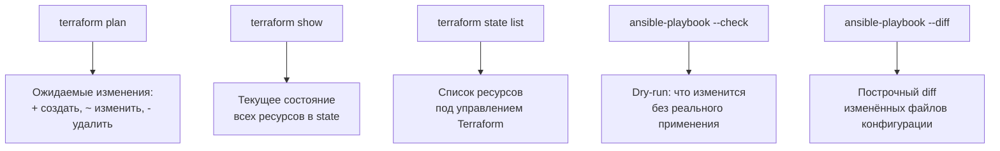

<!--
Диагностика IaC-конфигурации следует той же логике, что и диагностика кода: сначала проверяем, что произойдёт, не применяя изменений. `terraform plan` — основная команда проверки: показывает полный список предстоящих изменений с точными атрибутами. `terraform show` — просмотр зафиксированного состояния: все ресурсы с атрибутами. `terraform state list` — инвентаризация: что именно находится под управлением. `ansible-playbook --check` — dry-run без реального выполнения. `--diff` показывает построчные различия в конфигурационных файлах. Эти команды используются при ревью инфраструктурных PR и при расследовании инцидентов.
-->

---

# Мост к лабораторной работе 4

<div class="grid grid-cols-2 gap-3">

<div class="itmo-card">

**Что делается в Лаб 4**

Описание инфраструктуры voting-app кодом: сеть, виртуальные машины, развёртывание через IaC-инструменты.

</div>

<div class="itmo-card">

**Навыки из лекции**

`terraform plan` и `apply`, чтение state, структура playbook, роли Ansible, ревью инфраструктурных PR.

</div>

<div class="itmo-card-accent">

**Аналитическая задача**

Аудит IaC-конфигурации: найти потенциальный дрейф, неидемпотентные задачи, незащищённые ресурсы. Предложить улучшения.

</div>

<div class="itmo-card-note">

**Принцип ревью**

Инфраструктурный PR проверяется так же, как код: смотрим на вывод `terraform plan` в комментарии, читаем diff playbook, задаём вопросы об идемпотентности.

</div>

</div>

<!--
Лабораторная работа 4 закрепляет всё, что мы разобрали сегодня. Voting-app, который мы используем как сквозной пример с первой лекции, будет описан кодом: сети, виртуальные машины, конфигурация сервисов. Аналитическая задача — не просто написать конфигурацию, а провести её аудит: найти места, где возможен дрейф, проверить идемпотентность задач Ansible, убедиться, что критичные ресурсы защищены от случайного удаления. Умение читать и оценивать IaC-конфигурацию — навык системного аналитика инфраструктуры, который пригодится независимо от конкретного инструмента.
-->

---
layout: center
---

# Итоги

- **IaC переносит практики разработки на инфраструктуру**: ревью, история, откат, CI/CD
- **Декларативность + идемпотентность** обеспечивают воспроизводимость и безопасное применение
- **Terraform** создаёт ресурсы через провайдеров; state фиксирует реальность; plan делает изменения явными
- **Ansible** настраивает системы через SSH; идемпотентные модули; роли для переиспользования
- **Неизменяемая инфраструктура** устраняет дрейф ценой пересборки образа; изменяемая проще в старте

**Дальше: Лекция 14** — наблюдаемость инфраструктуры: метрики, логи, трассировки и методы RED и USE.

Опорная литература: Дж. Ким, П. Дебуа, Дж. Уиллис, Дж. Хамбл «Руководство по DevOps». МИФ, 2018.

<!--
Подведём итоги. Центральная идея лекции: инфраструктура становится таким же артефактом, как код приложения — с историей, ревью и автоматическим применением. Три принципа — декларативность, идемпотентность и воспроизводимость — образуют фундамент. Terraform решает задачу provisioning через граф зависимостей и state; plan делает изменения предсказуемыми. Ansible решает задачу configuration management через push по SSH и идемпотентные модули. Выбор подхода к изменяемости инфраструктуры — архитектурное решение с конкретными компромиссами: неизменяемость даёт предсказуемость, изменяемость — простоту старта. В следующей лекции переходим к наблюдаемости: как видеть, что происходит внутри инфраструктуры в реальном времени.
-->
