<div class="cover-kicker">Лекция 14</div>

# Наблюдаемость инфраструктуры

Как восстановить поведение системы по сигналам

<!--
Наблюдаемость — способность восстановить внутреннее состояние системы по внешним сигналам. Три класса сигналов: метрики (что и сколько), логи (что именно случилось), трассировки (где потерялось время в цепочке сервисов). Каждый закрывает свой вопрос и не заменяет другие.
-->

---

# Маршрут лекции

- **01 Три сигнала** — метрики, логи, трассировки: что каждый отвечает и чего не может
- **02 Prometheus** — pull-модель, экспортёры, типы метрик, PromQL
- **03 Методы RED и USE** — какие метрики собирать в первую очередь
- **04 Алертинг и Grafana** — правила, симптом против причины, дашборды расследования
- **05 Логи** — структурированные события, централизованный сбор
- **06 Трассировки** — путь запроса, OpenTelemetry, корреляция сигналов
- **07 Метод аналитика** — расследование, режимы отказа, свидетельства

<!--
Маршрут лекции выстроен по аналитической рамке курса: сначала модель — три сигнала и что каждый из них умеет. Затем инструменты: Prometheus, логи, трассировки. После инструментов — методы RED и USE, которые задают, что именно собирать. Потом алертинг как механизм реакции. Финал — метауровень: как аналитик работает с сигналами, какие режимы отказа у самих систем наблюдаемости и как проверить это руками.
-->

---

# Проблема: в распределённой системе нет прямого доступа к «правде»

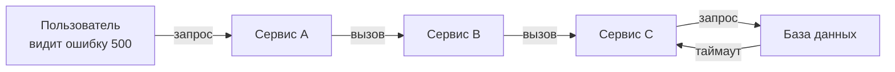

Прямого доступа к состоянию каждого компонента нет — есть только **сигналы**:

- Где именно возникла ошибка — неизвестно до расследования
- Без телеметрии каждый инцидент — угадывание

<!--
Представим ситуацию: пользователь получает ошибку 500. Запрос прошёл через несколько сервисов, где-то по пути что-то сломалось. Без наблюдаемости мы не знаем, на каком этапе — проверяем каждый сервис по очереди вручную. В «Руководстве по DevOps» Ким и соавторы описывают это как «работу в темноте»: распределённая система требует телеметрии, иначе каждый инцидент превращается в поиск с фонариком по неосвещённому зданию. Наблюдаемость — это инструмент реконструкции поведения системы по имеющимся сигналам.
-->

---

# Второй путь DevOps: телеметрия как петля обратной связи

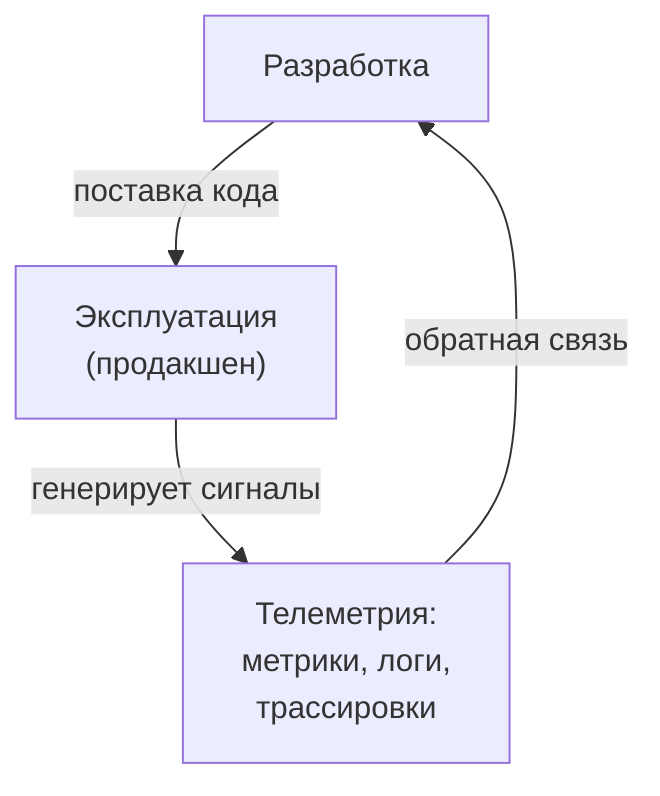

Второй путь DevOps — петля справа налево:

- Производственные сигналы возвращаются в разработку
- Проблемы обнаруживаются до того, как станут инцидентами
- Каждое изменение оценивается по его влиянию на систему

<!--
Второй путь DevOps (Kim, Humble, Debois) — петля обратной связи от эксплуатации к разработке. Метрики, логи и трассировки из продакшена возвращаются к разработчикам: видно последствия каждого деплоя, деградацию обнаруживают раньше пользователей, решения принимают по данным. Без телеметрии команда летит вслепую.
-->

---

# Мост из ОПИ: профилирование и системные метрики

<div class="grid grid-cols-2 gap-3">

<div class="itmo-card">

**Что изучалось в ОПИ**

Профилирование приложений: `perf`, `strace`, `/proc`, утилиты `top`, `iostat`, `netstat`. «Linux за 60 секунд» — первый взгляд на систему при инциденте.

</div>

<div class="itmo-card-accent">

**Фокус этой лекции**

Наблюдаемость инфраструктуры и распределённых сервисов: сбор, агрегация и анализ сигналов через специализированные инструменты на уровне всей системы.

</div>

</div>

<div class="itmo-card-note mt-3">

Сигналы ОПИ (утилиты хоста) и сигналы наблюдаемости (Prometheus, Loki, Jaeger) дополняют друг друга. Первые — локальный взгляд на один узел, вторые — взгляд на систему целиком.

</div>

<!--
Мы сознательно не повторяем то, что уже изучено в курсе ОПИ: профилирование с perf, анализ системных вызовов через strace, чтение /proc, базовые утилиты мониторинга Linux. Всё это — инструменты взгляда на отдельный хост. Сегодня мы поднимаемся на уровень выше: распределённая система из десятков сервисов в Kubernetes. Одна машина уже не единица анализа. Нужны инструменты, которые агрегируют сигналы со всех компонентов и дают целостную картину — именно этим занимаются системы наблюдаемости.
-->

---
layout: section
---

<div class="section-no">01</div>

# Три сигнала

Метрики, логи и трассировки — три разных ответа на три разных вопроса

<!--
Метрика агрегирует: «запросов в секунду». Лог сохраняет событие: «пользователь 42 получил 500». Трассировка показывает путь: запрос прошёл через api-gateway → vote → redis → db, 800ms из 1000 потрачено в db. Путать их — выбирать не тот инструмент для расследования.
-->

---

# Три сигнала: что каждый отвечает

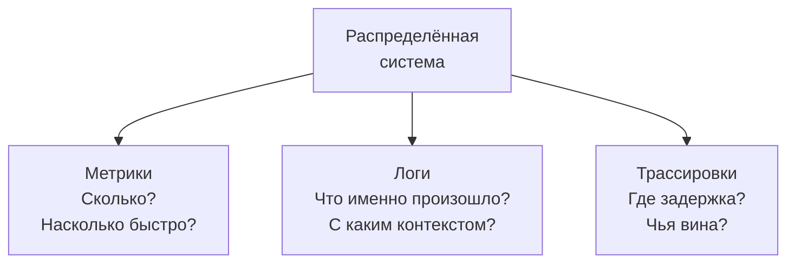

| Сигнал | Вопрос | Характер данных | Пример |
|---|---|---|---|
| **Метрики** | Сколько? Как быстро? | Числа во времени | `http_requests_total = 4200` |
| **Логи** | Что случилось? | Дискретные события | `ERROR: DB timeout after 3s` |
| **Трассировки** | Где задержка? | Путь запроса через сервисы | span API→DB занял 840 мс |

<!--
Три сигнала — три разных угла зрения на поведение системы. Метрики отвечают на вопрос «сколько»: сколько запросов в секунду, какая задержка на 99-м перцентиле, сколько ошибок за последние пять минут. Это агрегированные числа. Логи отвечают «что именно произошло»: конкретное событие с контекстом, полезной нагрузкой, идентификаторами. Трассировки отвечают «где задержка и через какие сервисы прошёл запрос». Ни один сигнал не заменяет другие — они дополняют друг друга, образуя полную картину. Это принцип, который индустрия называет тремя столпами наблюдаемости.
-->

---
layout: section
---

<div class="section-no">02</div>

# Prometheus

Pull-модель, экспортёры, типы метрик, PromQL

<!--
Prometheus работает по pull-модели: сам ходит к таргетам по HTTP /metrics каждые 15 секунд. Четыре типа: Counter (монотонный), Gauge (текущее значение), Histogram (распределение по бакетам), Summary (квантили). PromQL — функциональный язык: `rate()`, `histogram_quantile()`, `topk()`.
-->

---

# Prometheus: pull-модель сбора метрик

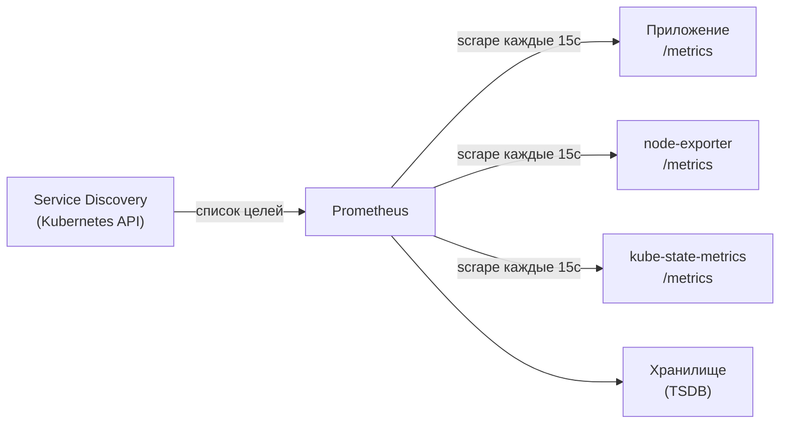

Pull-модель: Prometheus **сам опрашивает** цели по HTTP — не ждёт, пока они пришлют данные.

<!--
Prometheus работает по модели pull: он сам периодически, по умолчанию каждые 15 секунд, обращается к HTTP-эндпоинту /metrics каждой цели и забирает данные. Это отличает его от push-систем, где каждый агент сам отправляет метрики. Преимущество pull: если цель недоступна — Prometheus это сразу знает. Список целей Prometheus узнаёт через service discovery: в Kubernetes это динамический список Pod и Service из API. Exporters — агенты-посредники для систем, которые не умеют сами отдавать метрики: node-exporter снимает системные метрики хоста, kube-state-metrics — состояние объектов Kubernetes.
-->

---

# Типы метрик Prometheus

<div class="grid grid-cols-2 gap-3">

<div class="itmo-card">

**Counter — только растёт**

`http_requests_total` — число запросов. Никогда не убывает (сбрасывается лишь при перезапуске). Используют с `rate()`.

</div>

<div class="itmo-card">

**Gauge — текущее значение**

`memory_usage_bytes` — объём памяти прямо сейчас. Может расти и падать. Используют напрямую.

</div>

<div class="itmo-card-accent">

**Histogram — распределение**

`http_request_duration_seconds` — наблюдения по бакетам. Даёт перцентили через `histogram_quantile`. Предпочтителен для latency.

</div>

<div class="itmo-card-note">

**Summary — аналог histogram**

Вычисляет перцентили на стороне клиента. Плохо агрегируется по нескольким инстансам — в большинстве случаев предпочтительнее histogram.

</div>

</div>

<!--
Четыре типа метрик, и выбор типа определяется природой измеряемой величины. Counter подходит для счётчиков событий: число запросов, ошибок, обработанных сообщений. Он только растёт, и производный показатель rate() даёт скорость роста. Gauge используется для значений, которые меняются в обе стороны: текущий объём памяти, число активных соединений. Histogram разбивает наблюдения по заранее заданным бакетам и позволяет вычислять перцентили на стороне Prometheus при запросе. Summary делает то же самое на стороне клиента, но плохо агрегируется при нескольких инстансах — поэтому в большинстве случаев выбирают histogram.
-->

---

# PromQL: язык анализа состояния

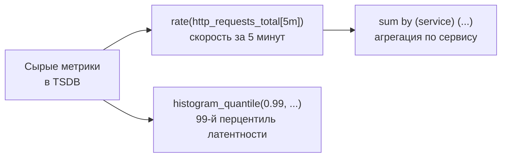

Примеры запросов:

- `rate(http_errors_total[5m])` — скорость ошибок за 5 минут
- `sum by (pod) (container_memory_usage_bytes)` — память по Pod
- `histogram_quantile(0.95, http_request_duration_seconds_bucket)` — p95

<!--
PromQL — язык запросов к временным рядам Prometheus. `rate()` берёт counter за диапазон времени и вычисляет скорость роста; абсолютное значение counter бесполезно, нас интересует интенсивность. `sum by` группирует ряды по лейблу. `histogram_quantile` вычисляет перцентиль по бакетам. PromQL — язык анализа: правила алертинга пишутся на том же PromQL, что и запросы на дашбордах.
-->

---
layout: section
---

<div class="section-no">03</div>

# Методы RED и USE

Какие метрики собирать в первую очередь

<!--
RED (Weave Works) и USE (Brendan Gregg) дают фрейм: какие метрики собирать в первую очередь. RED для сервисов: Rate, Errors, Duration. USE для ресурсов: Utilization, Saturation, Errors. Без фрейма собирают всё подряд и теряются во время инцидента.
-->

---
layout: two-cols
---

# RED и USE: два угла зрения

## RED — для сервиса

- **R**ate — частота запросов (запросов/сек)
- **E**rrors — доля или число ошибок
- **D**uration — задержка ответа (p50, p95, p99)

Описывает **здоровье сервиса** глазами пользователя.

Вопрос: «Сервис справляется?»

::right::

## USE — для ресурса

- **U**tilization — загрузка ресурса (CPU %)
- **S**aturation — насыщение очереди (ожидание)
- **E**rrors — ошибки на уровне ресурса

Описывает **здоровье инфраструктуры** глазами системы.

Вопрос: «Ресурс не стал узким местом?»

<div class="itmo-card-accent mt-4">
RED фиксирует симптом — что ощущает пользователь. USE помогает найти причину — какой ресурс насыщен.
</div>

<!--
RED и USE — два дополняющих метода из практики SRE. RED описывает сервис через три показателя, важных для пользователя: сколько запросов он обрабатывает, сколько из них завершается ошибкой и как быстро. Если RED нормален — с точки зрения пользователя сервис работает. USE описывает ресурс: CPU, память, диск, сеть. Utilization — насколько занят ресурс, Saturation — есть ли очередь, Errors — аппаратные или системные ошибки. Классическая цепочка расследования: RED выявляет симптом — высокую задержку или ошибки, USE помогает найти причину — какой ресурс насыщен.
-->

---

# RED на практике: voting-app

| Метрика | Сервис vote | Сервис result |
|---|---|---|
| **Rate** | POST /vote запросов/сек | GET /result запросов/сек |
| **Errors** | HTTP 5xx % | HTTP 5xx % |
| **Duration p99** | latency голосования | latency отображения |

<div class="grid grid-cols-2 gap-3 mt-4">

<div class="itmo-card-note">

**Минимальный дашборд**

Три панели для каждого сервиса — это первый взгляд при инциденте. Если RED нормален — пользователь не страдает.

</div>

<div class="itmo-card">

**USE для worker**

Utilization CPU и памяти воркера, Saturation очереди Redis, Errors при записи в PostgreSQL.

</div>

</div>

<!--
Применим RED к нашему учебному примеру — voting-app. У нас два пользовательских сервиса: vote принимает голоса, result отображает результаты. Для каждого строим три панели: частота запросов, доля ошибок, задержка на 99-м перцентиле. Этого достаточно, чтобы в первые секунды инцидента понять, затронут ли пользователь. Если rate резко упал — возможно, сервис недоступен. Если errors выросли — фиксируем сбои. Если duration вырос — сервис работает, но медленно. Воркер обрабатывает голоса из Redis и пишет в PostgreSQL, поэтому для него применяем USE: насыщение очереди и ошибки записи важнее числа запросов.
-->

---
layout: section
---

<div class="section-no">04</div>

# Алертинг и Grafana

Правила, симптом против причины, дашборды расследования

<!--
Алерт на симптом (задержка p99 > 1s) бьёт тогда, когда пользователь уже страдает. Алерт на причину (CPU > 80%) бьёт слишком рано и слишком часто. Google SRE рекомендует алертить на симптомы пользователя, а причины искать в дашборде. AlertManager маршрутизирует: severity=page → PagerDuty, severity=warning → Slack.
-->

---

# Алертинг: правила на PromQL

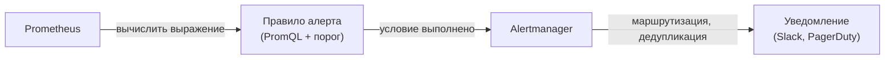

```yaml
alert: HighErrorRate
expr: rate(http_errors_total[5m]) / rate(http_requests_total[5m]) > 0.01
for: 2m
labels:
  severity: critical
```

<!--
Правила алертов в Prometheus записываются на том же языке PromQL. Выражение вычисляется непрерывно: если оно истинно дольше порога `for`, Prometheus отправляет алерт в Alertmanager. Alertmanager занимается маршрутизацией: направляет алерт в нужный канал в зависимости от лейблов, группирует похожие алерты, подавляет дубли. Пример на слайде: если доля ошибок превышает один процент на протяжении двух минут — алерт критический. Параметр `for` важен: без него кратковременный всплеск создаст ложный алерт и перегреет команду зря. Задержка `for` — фильтр шума.
-->

---

# Симптом против причины в алертинге

<div class="grid grid-cols-2 gap-3">

<div class="itmo-card-accent">

**Симптом: алерт на пользовательский эффект**

`HighErrorRate` — пользователи видят ошибки.

`HighLatency` — пользователи ждут дольше нормы.

Симптомные алерты требуют немедленного ответа.

</div>

<div class="itmo-card-note">

**Причина: информационный сигнал**

`HighCPUUsage` — CPU 80%, пользователи не страдают.

`DiskSpaceLow` — заполнено 70% — предупреждение, не инцидент.

Причинные сигналы — для тикетов, не для будильника.

</div>

<div class="itmo-card-warn">

**Усталость от алертов (alert fatigue)**

Слишком много алертов на причины — команда начинает их игнорировать. Принцип: алерт в три часа ночи только если пользователь страдает прямо сейчас.

</div>

<div class="itmo-card">

**Золотое правило**

Каждый алерт требует конкретного действия. Если реакция — «посмотреть и закрыть» — алерт лишний.

</div>

</div>

<!--
Различие между симптомом и причиной — один из важнейших принципов алертинга. Симптомный алерт сигнализирует, что пользователь страдает прямо сейчас: высокий процент ошибок или недопустимая задержка. На такой алерт нужно реагировать немедленно. Причинный алерт сигнализирует о внутреннем показателе: CPU вырос, диск заполняется. Эти сигналы полезны, но не требуют немедленного пробуждения команды. Когда алертов слишком много — команда начинает игнорировать весь поток. В «Руководстве по DevOps» это явление описывается как один из признаков нездоровой культуры эксплуатации.
-->

---

# Grafana: дашборд как инструмент расследования

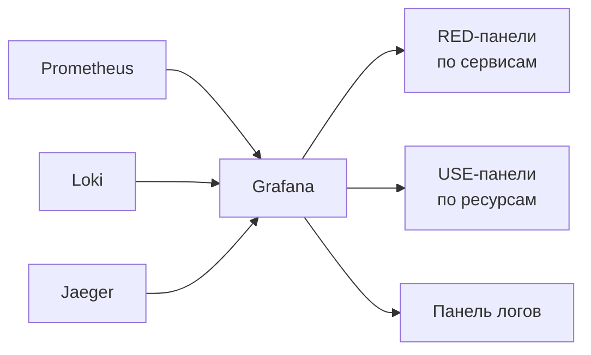

Дашборд не для красоты: он сужает область поиска от «что-то сломалось» до «конкретный сервис, конкретный ресурс».

<!--
Grafana визуализирует данные из нескольких источников: Prometheus для метрик, Loki для логов, Jaeger для трассировок. Дашборд — инструмент расследования: сначала RED — какой сервис деградирует, затем USE — какой ресурс насыщен, затем логи того сервиса в том же временном окне. Временные аннотации отмечают момент деплоя — их сопоставление с изменением метрик реализует второй путь DevOps: сигналы из эксплуатации видны сразу после каждого изменения.
-->

---
layout: section
---

<div class="section-no">05</div>

# Логи

Структурированные события и централизованный сбор

<!--
Лог полезен, если он машиночитаем и содержит trace_id. Без структуры — grep по тексту. С JSON-структурой и trace_id — поиск всех событий одного запроса в секунды. Fluentd/Fluent Bit собирают с нод, Loki хранит без индексирования полного текста (только метки), Elasticsearch индексирует всё.
-->

---
layout: two-cols
---

# Структурированные логи

## Неструктурированный лог

```text
2024-01-15 14:23:01 ERROR user 42
failed to connect db timeout
after 3 retries connection refused
```

Требует regex для парсинга. Хрупко при изменениях формата.

::right::

## Структурированный лог (JSON)

```json
{
  "timestamp": "2024-01-15T14:23:01Z",
  "level": "error",
  "service": "vote",
  "user_id": 42,
  "error": "connection refused",
  "retries": 3,
  "trace_id": "abc123"
}
```

<div class="itmo-card-accent mt-4">
Поля индексируются. Поиск по `service=vote AND level=error` — мгновенно. `trace_id` связывает лог с трассировкой.
</div>

<!--
Структурированный лог — лог, в котором каждое поле имеет имя и тип. В отличие от свободного текста, структурированный лог машиночитаем: система сбора логов индексирует поля и позволяет делать точные запросы. Сравним два примера на слайде. Неструктурированный лог содержит ту же информацию, но извлечь её можно только через регулярные выражения — которые ломаются при любом изменении формата. Структурированный JSON-лог позволяет мгновенно найти все ошибки сервиса vote с тремя и более попытками за последний час. Поле trace_id связывает лог с трассировкой — это ключ корреляции, о котором поговорим в следующем блоке.
-->

---

# Централизованный сбор логов

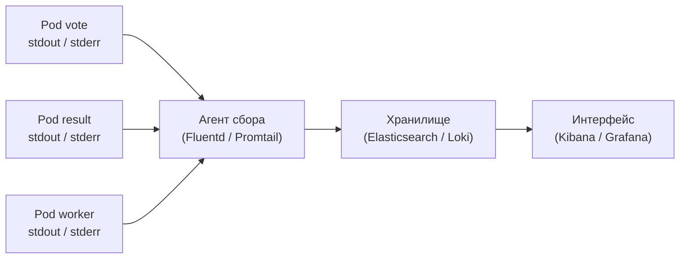

| Стек | Агент | Хранилище | Интерфейс |
|---|---|---|---|
| ELK | Filebeat / Logstash | Elasticsearch | Kibana |
| EFK | Fluentd | Elasticsearch | Kibana |
| PLG | Promtail | Loki | Grafana |

<!--
В Kubernetes контейнер пишет в stdout и stderr — это соглашение двенадцатифакторного приложения. Агент сбора логов, развёрнутый как DaemonSet на каждом узле, читает эти потоки и отправляет в централизованное хранилище. Три популярных стека. ELK и EFK с Elasticsearch — мощное полнотекстовое хранилище, но дорогое в эксплуатации. PLG-стек с Loki принципиально отличается: он не индексирует содержимое логов, только метаданные-лейблы — service, namespace. Это делает Loki дешевле по хранению и нативно интегрирует его с Grafana. Для большинства Kubernetes-проектов PLG — оптимальный старт.
-->

---
layout: section
---

<div class="section-no">06</div>

# Трассировки

Путь запроса через сервисы и корреляция сигналов

<!--
Трассировка — это дерево spans, каждый span захватывает один вызов: start_time, duration, атрибуты, статус. Jaeger и Tempo хранят трассировки. OpenTelemetry (OTEL) — стандартный SDK для инструментирования: один агент вместо вендорных клиентов. trace_id связывает трассировку с логами и метриками одного запроса.
-->

---

# Распределённая трассировка

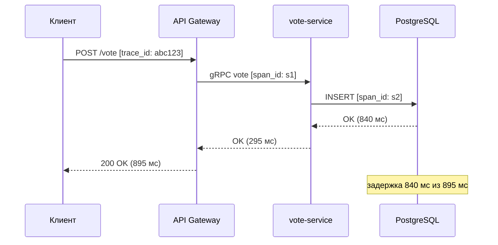

Трассировка показывает: запрос занял 895 мс, из которых **840 мс — это INSERT в PostgreSQL**.

<!--
Распределённая трассировка прослеживает один запрос через всю систему. Каждый компонент создаёт span — запись о своём участке обработки с временными метками. Spans связываются через единый trace_id, который передаётся между сервисами в заголовках HTTP или gRPC. На диаграмме мы видим: запрос потратил 895 мс, из которых 840 мс — это ожидание ответа от PostgreSQL. Без трассировки мы бы видели в метриках высокую задержку API Gateway, но не знали бы, где именно она накапливается. Трассировка немедленно указывает: проблема в базе данных, а не в логике сервиса vote.
-->

---

# OpenTelemetry и Jaeger

<div class="grid grid-cols-2 gap-3">

<div class="itmo-card">

**OpenTelemetry (OTel)**

Вендор-нейтральный стандарт инструментирования: SDK для генерации трассировок, метрик и логов. Один код — любой совместимый бэкенд.

</div>

<div class="itmo-card">

**Jaeger**

Хранилище и UI для трассировок. Принимает данные от OTel. Позволяет искать трассировки по trace_id, сервису, тегу, длительности.

</div>

<div class="itmo-card-accent">

**trace_id — ключ корреляции**

Один идентификатор связывает трассировку, логи и метрики одного запроса. Переход от симптома к логам — без угадывания временного окна.

</div>

<div class="itmo-card-note">

**Sampling**

Передавать каждый запрос полностью дорого. Решение: фиксировать каждый n-й запрос или 100% при наличии ошибок.

</div>

</div>

<!--
OpenTelemetry объединил ранее разрозненные проекты OpenTracing и OpenCensus. Приложение инструментируется один раз с помощью OTel SDK, и данные можно отправлять в любой совместимый бэкенд: Jaeger, Zipkin, Grafana Tempo. Самый важный концепт — trace_id. Этот идентификатор генерируется на входе в систему и передаётся через все сервисы. Если лог содержит trace_id, аналитик мгновенно находит трассировку, соответствующую этой ошибке, и видит полный путь запроса. Это и есть корреляция сигналов — основа эффективного расследования инцидентов.
-->

---

# Корреляция: метрики + логи + трассировки

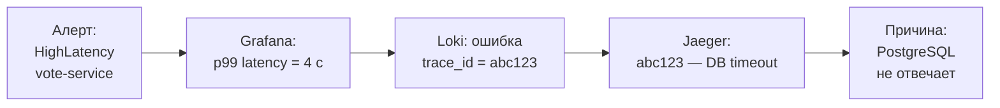

Корреляция по `trace_id` переводит расследование из «осмотра улик» в «следование нити».

<!--
Покажем полный цикл расследования по сигналам. Приходит алерт: задержка в сервисе vote выросла. Открываем Grafana — RED-панель подтверждает: p99 latency достигла четырёх секунд. Переходим в панель логов Loki и фильтруем по сервису vote и уровню error. Находим запись с trace_id abc123. Вставляем trace_id в Jaeger и видим трассировку: запрос потратил почти всё время в вызове к базе данных, которая не ответила. Причина найдена: PostgreSQL. Без trace_id пришлось бы угадывать временное окно и перебирать логи всех сервисов. Корреляция по единому идентификатору делает расследование детерминированным.
-->

---
layout: section
---

<div class="section-no">07</div>

# Метод аналитика

Расследование по сигналам, режимы отказа, свидетельства

<!--
Системы наблюдаемости сами ломаются. Prometheus теряет данные при рестарте без persistent volume. Fluentd забивает буфер при пиковой нагрузке. Loki падает при большом объёме high-cardinality меток. Расследование инцидента начинается с метрик (что сломалось), переходит к логам (когда и у кого), завершается трассировкой (где именно).
-->

---

# Метод аналитика: симптом → причина

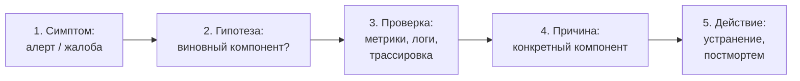

<div class="itmo-card-note mt-3">
Если гипотеза не подтвердилась — возвращаемся к шагу 2 с новой гипотезой. Наблюдаемость делает каждую итерацию быстрой: сигналы сужают область поиска, а не расширяют её.
</div>

<!--
Метод аналитика инфраструктуры — это не угадывание, а цикл научного расследования. Начинаем с симптома: алерт или жалоба пользователя. Формируем гипотезу: «задержка выросла — возможно, проблема в базе данных или в сети между сервисами». Идём к сигналам: смотрим метрики базы данных, трассировки проблемных запросов, логи с ошибками. Если гипотеза не подтверждается — формулируем новую. Если подтверждается — фиксируем причину и переходим к действию. Наблюдаемость превращает расследование из интуитивного перебора в воспроизводимый метод с доказуемыми выводами. Это основа аудита инфраструктуры.
-->

---

# Режимы отказа систем наблюдаемости

<div class="grid grid-cols-2 gap-3">

<div class="itmo-card-warn">

**Потеря метрик при пиковой нагрузке**

Prometheus не успевает снять scrape с перегруженной цели. Метрики пропадают именно тогда, когда они нужнее всего.

</div>

<div class="itmo-card-warn">

**Переполнение хранилища логов**

Всплеск ошибок генерирует лавину логов. Elasticsearch или Loki отстают от ingestion — часть событий теряется.

</div>

<div class="itmo-card-warn">

**Алерт не срабатывает**

Алерт настроен на абсолютный порог, а не на rate(). Нагрузка упала вместе с ошибками: условие не выполняется, хотя доля ошибок 100%.

</div>

<div class="itmo-card-warn">

**Нет трассировок при инциденте**

Sampling отключён ради экономии. Когда нужна трассировка — данных нет. Причина ошибки не восстанавливается.

</div>

</div>

<!--
Системы наблюдаемости сами являются частью инфраструктуры и могут отказывать. Первый режим отказа коварен: при пиковой нагрузке, когда метрики нужнее всего, Prometheus может не успевать снимать данные с перегруженных целей. Второй — лавина логов при инциденте перегружает хранилище, и именно аварийные события теряются первыми. Третий — алерты на абсолютные значения ломаются при изменении нагрузки; правильный подход — алерты на rate() и относительные пороги. Четвёртый — экономия на sampling оставляет команду без трассировок в самый неподходящий момент. Наблюдаемость требует такого же внимания к надёжности, как и основная система.
-->

---

# Критерии выбора инструментов наблюдаемости

| Критерий | Prometheus | Elasticsearch | Loki | Jaeger |
|---|---|---|---|---|
| Тип сигнала | Метрики | Логи | Логи | Трассировки |
| Полнотекстовый поиск | Нет | Да | Нет | По тегам |
| Стоимость хранения | Низкая | Высокая | Низкая | Средняя |
| Сложность эксплуатации | Средняя | Высокая | Низкая | Средняя |
| Интеграция с Kubernetes | Нативная | Требует настройки | Нативная | Через OTel |

<div class="itmo-card-note mt-3">

Выбирать не «или/или», а «какой сигнал в каком инструменте»: метрики в Prometheus, логи в Loki или Elasticsearch, трассировки в Jaeger.

</div>

<!--
Инструменты наблюдаемости не конкурируют — они дополняют друг друга, закрывая разные типы сигналов. Prometheus специализирован на метриках: экономное хранение временных рядов, мощный PromQL, нативная интеграция с Kubernetes. Elasticsearch — мощное полнотекстовое хранилище логов, но дорогое в эксплуатации. Loki — легковесная альтернатива: индексирует только лейблы, хранит сжатые потоки логов, дёшево интегрируется с Grafana. Jaeger специализирован на трассировках. Для большинства Kubernetes-проектов оптимальный старт: Prometheus плюс Grafana плюс Loki. Elasticsearch добавляют при реальной потребности в полнотекстовом поиске.
-->

---

# Свидетельства: проверка наблюдаемости руками

<div class="grid grid-cols-2 gap-3">

<div class="itmo-card">

**Эндпоинт метрик**

`curl http://pod-ip:8080/metrics`

Убедиться: эндпоинт отвечает, метрики в формате Prometheus, нет очевидных пропусков.

</div>

<div class="itmo-card">

**Цели в Prometheus**

`kubectl port-forward svc/prometheus 9090` → UI → Targets

Все цели должны быть в статусе UP. Ошибки scrape видны в поле Last Error.

</div>

<div class="itmo-card">

**Запрос к логам**

Grafana → Explore → Loki:

`{service="vote"} |= "error"`

Убедиться: логи поступают, поля индексированы, timestamp правильный.

</div>

<div class="itmo-card">

**Трассировка по trace_id**

Взять trace_id из лога ошибки. Открыть Grafana → Explore → Jaeger. Найти трассировку. Если есть — корреляция работает.

</div>

</div>

<!--
Свидетельства — это то, как аналитик проверяет систему наблюдаемости руками, не дожидаясь инцидента. Первый шаг: убедиться, что /metrics-эндпоинт приложения отвечает и возвращает данные в правильном формате. Второй: проверить статус целей в интерфейсе Prometheus — все ли в статусе UP, нет ли ошибок scrape. Третий: в Grafana Explore выполнить запрос к Loki и убедиться, что логи сервисов поступают и индексируются. Четвёртый: взять trace_id из лога и найти трассировку в Jaeger. Если вся цепочка работает — система наблюдаемости готова к использованию при инциденте. Это прямой мост к лабораторной работе по настройке наблюдаемости voting-app.
-->

---
layout: center
---

# Итоги

- **Три сигнала** — метрики, логи и трассировки закрывают три разных класса вопросов; ни один не заменяет другие
- **Prometheus** собирает метрики по pull-модели; PromQL — язык анализа состояния, а не только отображения
- **RED и USE** задают, что именно важно измерять: сервис глазами пользователя и ресурс глазами системы
- **Алерты** строятся на симптомах, не на причинах; alert fatigue — признак нездорового алертинга
- **Корреляция** по trace_id соединяет метрику, лог и трассировку в единое расследование
- **Наблюдаемость** — основной инструмент аналитика инфраструктуры: превращает догадки в проверяемые утверждения

**Дальше: Лекция 15** — проектирование надёжности и стоимости: SLI, SLO, error budget и цена каждой «девятки».

Опорная литература: Дж. Ким, П. Дебуа, Дж. Уиллис, Дж. Хамбл «Руководство по DevOps». МИФ, 2018.

<!--
Подведём итоги четырнадцатой лекции. Центральная идея: наблюдаемость — это не набор дашбордов, а метод анализа. Три сигнала — метрики, логи, трассировки — закрывают три разных вопроса и используются совместно. Prometheus и PromQL дают язык для формулирования вопросов к метрикам. Методы RED и USE помогают выбрать, что именно измерять. Правильный алертинг бьёт по симптомам, а не по каждому отклонению. Корреляция по trace_id превращает расследование из угадывания в детерминированный поиск причины. В следующей лекции посмотрим, как сигналы наблюдаемости участвуют в проектировании надёжности через SLI, SLO и бюджет ошибок.
-->
