<div class="cover-kicker">Лекция 15</div>

# Проектирование надёжности и стоимости

Надёжность и стоимость — не побочный эффект, а осознанно спроектированные свойства

<!--
SLO 99,9% — это 43 минуты простоя в месяц. Это не случайное число, а бюджет: командой управляют тем, сколько из него потрачено. Google SRE изобрела этот подход, чтобы снять конфликт между скоростью релизов и стабильностью. Если бюджет цел — деплой. Если исчерпан — стоп.
-->

---

# Маршрут лекции

- **01 SLI, SLO, SLA** — как измерять и задавать целевой уровень надёжности
- **02 Бюджет ошибок** — как он связывает надёжность и темп релизов
- **03 Режимы отказа** — анализ, blast radius, изоляция
- **04 Паттерны устойчивости** — репликация, graceful degradation, bulkhead, circuit breaker
- **05 Ёмкость и ресурсы** — планирование запаса, requests/limits, bin-packing
- **06 Стоимость** — TCO, FinOps, цена каждой «девятки»

<!--
SLI → SLO → SLA: от измерения к цели к контракту. Бюджет ошибок превращает SLO в ресурс. Circuit breaker и bulkhead ограничивают blast radius. Ёмкость планируют через нагрузочные тесты, не через интуицию. Каждая «девятка» стоит денег: 99,9% → 99,99% может удвоить инфраструктурный счёт.
-->

---

# Проблема: 100% надёжности не существует

| Доступность | Простой в год | Простой в месяц |
|---|---|---|
| 99% (2 девятки) | 87,6 ч | 7,3 ч |
| 99,9% (3 девятки) | 8,76 ч | 43,8 мин |
| 99,99% (4 девятки) | 52,6 мин | 4,4 мин |
| 99,999% (5 девяток) | 5,26 мин | 26,3 сек |

<div class="itmo-card-accent mt-4">
Каждая дополнительная «девятка» на порядок сложнее предыдущей и стоит на порядок дороже. Задача — осознанно выбрать уровень, а не стремиться к максимуму.
</div>

<!--
Стопроцентная надёжность физически невозможна: обновления, сетевые сбои и аппаратные отказы случаются всегда. Переход от трёх девяток к четырём сокращает допустимый простой с 43 минут до 4 минут в месяц — это уже операционное требование: плановые работы воскресным вечером в это окно не вписываются. Пять девяток требуют полностью автоматизированного восстановления без участия человека. Надёжность надо проектировать с пониманием цены каждого уровня, а не назначать максимальную для успокоения совести.
-->

---
layout: section
---

<div class="section-no">01</div>

# SLI, SLO, SLA

Как измерять и задавать целевой уровень надёжности

<!--
SLI — измеримая метрика: доля запросов с задержкой < 300ms. SLO — цель: 99,9% запросов выполняются за 300ms. SLA — юридическое обязательство с компенсацией при нарушении. SLO всегда строже SLA: нарушить SLO нельзя, иначе нечем будет платить за нарушение SLA.
-->

---

# SLI: что мы измеряем

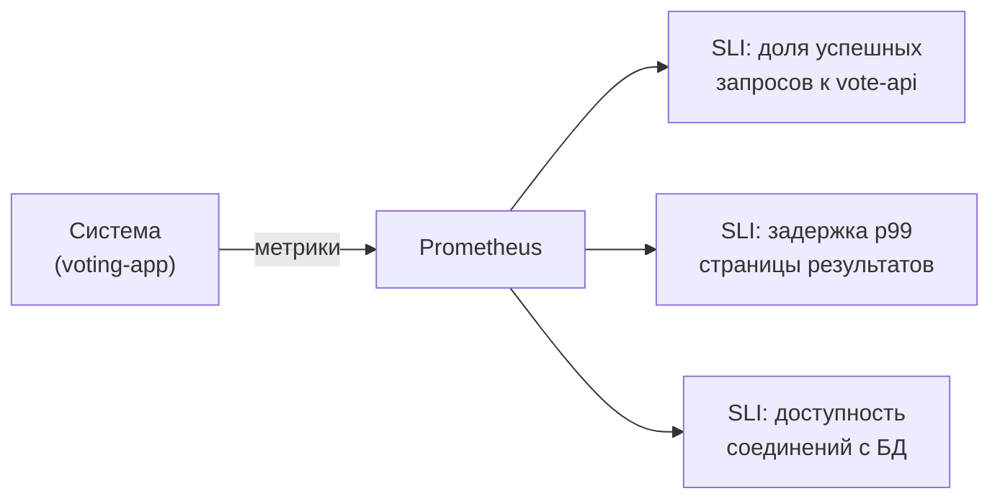

SLI — **Service Level Indicator** — измеримая числовая характеристика работы сервиса, получаемая из метрик или логов в реальном времени.

<!--
SLI — конкретное число, которое система производит прямо сейчас. Хорошие SLI отвечают на вопрос: насколько хорошо система работает с точки зрения пользователя? Для веб-сервиса типичные SLI — доля успешных запросов, задержка p99, доступность. Для voting-app: доля запросов к vote-api с кодом 2xx за скользящее пятиминутное окно. SLI должен быть объективным, вычислимым из телеметрии и отражать пользовательский опыт — не внутреннее состояние компонента.
-->

---
layout: two-cols
---

# SLO и SLA: от цели к обязательству

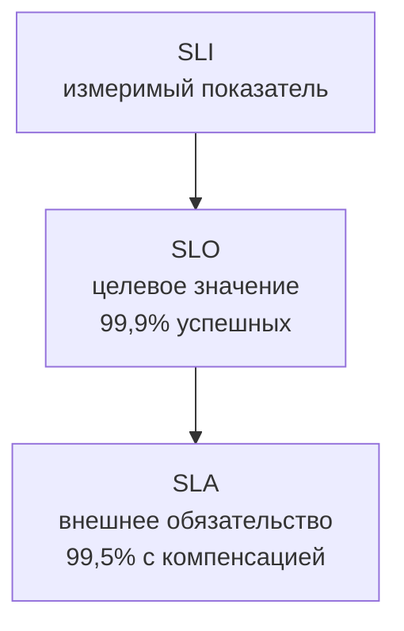

::right::

## Различие на практике

- **SLO** — внутренняя планка команды; нарушение означает действие
- **SLA** — договор с клиентом; нарушение означает компенсацию
- SLO всегда **строже** SLA: запас нужен, чтобы не задеть SLA

<div class="itmo-card-note mt-4">
Если нет SLO — нет основания для разговора об инцидентах. SLO превращает субъективное «работает плохо» в объективное «SLO нарушен».
</div>

<!--
Три термина образуют иерархию. SLI — сырое число из мониторинга. SLO — целевое значение SLI на заданный период, например «доля успешных запросов не ниже 99,9% за месяц». SLA — внешнее обязательство перед клиентами, юридически закреплённое с последствиями за нарушение. SLO намеренно устанавливают строже SLA — обычно на 0,1–0,5 процентного пункта. Это буфер: команда реагирует при нарушении SLO и не доводит до нарушения SLA. В «Руководстве по DevOps» Кима и соавторов именно SLO описывается как язык договора между разработкой и эксплуатацией.
-->

---

# Как формулировать SLO

| Пример SLO | SLI | Окно | Порог |
|---|---|---|---|
| Доступность vote-api | доля запросов 2xx | 30 дней | не менее 99,9% |
| Задержка result-page | p99 latency | 30 дней | менее 500 мс |
| Доступность БД | успешные подключения | 7 дней | не менее 99,95% |
| Ошибки worker | доля обработанных задач | 24 ч | не менее 99,5% |

<div class="grid grid-cols-2 gap-3 mt-4">
<div class="itmo-card-note">
<strong>Скользящее окно</strong> — SLO считается за последние N дней, а не с начала месяца. Это равномернее распределяет давление на команду.
</div>
<div class="itmo-card-warn">
<strong>Не всё нужно покрывать SLO</strong> — выбирайте показатели, на которые влияет команда и которые ощущает пользователь.
</div>
</div>

<!--
Хороший SLO — конкретный и измеримый. В таблице — четыре примера из voting-app. Каждый SLO называет: что измеряем, за какой период и какой порог считается выполнением. Скользящее окно предпочтительнее календарного месяца: нарушение в любой момент одинаково значимо. Важный принцип — не создавать SLO на каждый компонент. Один-три SLO на сервис достаточно. Слишком много SLO создают операционный шум и размывают фокус. Выбирайте то, что пользователь замечает: скорость и доступность. Внутренние метрики компонентов — это SLI-кандидаты, а не обязательно SLO.
-->

---
layout: section
---

<div class="section-no">02</div>

# Бюджет ошибок

Как допустимое нарушение связывает надёжность и темп релизов

<!--
Error budget = 1 − SLO. При SLO 99,9% бюджет — 0,1% = 43,2 минуты в месяц. Потратили 20 минут на инцидент — осталось 23. Бюджет цел — деплой продолжается. Бюджет исчерпан — freeze. Это превращает споры «когда деплоить» в математику, а не переговоры.
-->

---

# Бюджет ошибок: допустимая доля нарушений

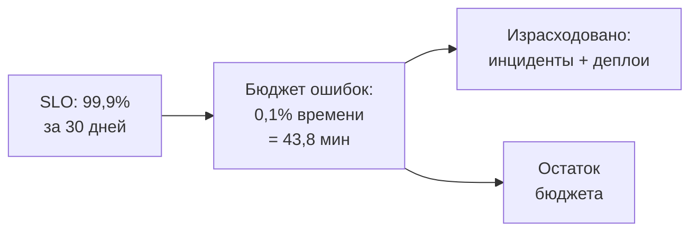

- Бюджет ошибок = 100% — SLO
- При SLO 99,9% за 30 дней бюджет составляет **43 минуты 48 секунд**
- Бюджет тратится на инциденты, плановые работы и деплои с рисками

<!--
Бюджет ошибок — оборотная сторона SLO. SLO 99,9% означает допустимые 0,1% недоступности — ровно 43 минуты 48 секунд за 30 дней. Бюджет — ресурс, который команда расходует сознательно: деплой нового кода несёт риск нарушения SLO. Пока бюджет не исчерпан — деплои разрешены, риск принят количественно. Когда исчерпан — риск новых изменений неприемлем. Это переводит разговор о надёжности с субъективного «сейчас плохое время для релиза» в конкретное числовое ограничение.
-->

---

# Бюджет управляет темпом релизов

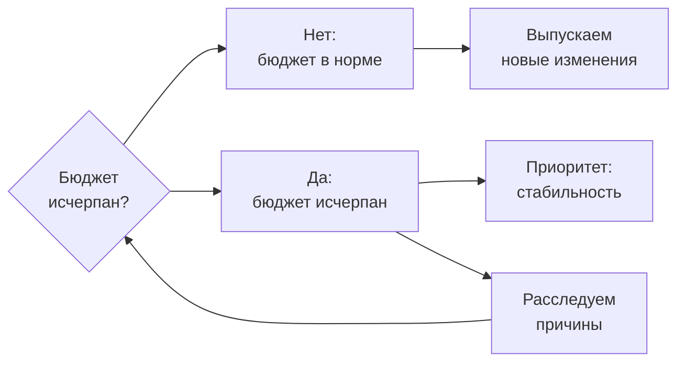

Бюджет ошибок снимает конфликт: разработка и эксплуатация договариваются через общий числовой показатель.

<!--
Главная ценность бюджета ошибок — он снимает хронический конфликт между разработкой, которая хочет выпускать быстрее, и эксплуатацией, которая хочет стабильности. Пока бюджет не исчерпан, разработка свободна выпускать изменения — риск принят количественно. Когда бюджет исчерпан, обе стороны видят одну и ту же цифру и понимают: сейчас надо чинить, а не деплоить. Это решение основано на данных, а не на субъективном «сейчас плохое время для релиза». В «Руководстве по DevOps» Кима и соавторов этот механизм описывается как инструмент создания общей ответственности за надёжность у всей команды.
-->

---

# Скорость расхода бюджета (burn rate)

| Burn rate | Интерпретация | Бюджет закончится | Действие |
|---|---|---|---|
| **1×** | норма | 30 дней | — |
| **2×** | расход вдвое быстрее нормы | 15 дней | Тикет на следующий день |
| **7,5×** | критическое ускорение | 4 дня | Уведомить дежурного |
| **14,4×** | 2% бюджета за 1 час | 2 дня | Немедленный пейджинг |

```
# PromQL: alert когда burn rate > 14.4× за последний час
rate(http_errors_total[1h]) / rate(http_requests_total[1h])
  > 14.4 * (1 - 0.999)
```

<!--
Burn rate — скорость расхода бюджета относительно нормального темпа. При SLO 99,9% норма — тратить 0,1% ошибок за 30 дней. Burn rate 14,4× означает, что за один час сгорело 2% бюджета — если продолжить с той же скоростью, бюджет закончится за два дня. Именно этот порог соответствует правилу «multi-window, multi-burn-rate» из Google SRE Workbook: двухпроцентный быстрый ожог за один час — разбуди дежурного немедленно. PromQL выражение проверяет, превышает ли текущий уровень ошибок допустимый при данном burn rate.
-->

---
layout: section
---

<div class="section-no">03</div>

# Режимы отказа

Анализ, blast radius, изоляция отказов

<!--
FMEA (Failure Mode and Effects Analysis) — систематический перебор: для каждого компонента «что ломается и что происходит». Blast radius определяет приоритет: одиночный сервис против всего потока записи — разные классы. Изолируй сначала то, что убивает всё.
-->

---

# Анализ режимов отказа

| Компонент | Режим отказа | Последствие | Blast radius |
|---|---|---|---|
| vote-api | процесс упал | голосование недоступно | один сервис |
| PostgreSQL | диск заполнен | запись остановлена | весь поток данных |
| Redis | нехватка памяти | кеш сброшен | задержки у всех |
| worker | зависание | очередь растёт | отложенный подсчёт |

<div class="itmo-card-note mt-4">
Анализ режимов отказа (FMEA — Failure Mode and Effects Analysis) перечисляет возможные сбои и их последствия ещё на этапе проектирования. Это инструмент аналитика, а не только операционной команды.
</div>

<!--
Анализ режимов отказа — систематический перебор: для каждого компонента задаём вопрос «что может сломаться и что произойдёт». В таблице — четыре примера из voting-app. Падение vote-api выводит из строя один сервис. Заполненный диск PostgreSQL блокирует весь поток записи данных. Нехватка памяти Redis сбрасывает кеш и увеличивает задержки для всех. Зависание worker не обрывает приём голосов, но откладывает подсчёт. Разный blast radius — площадь затронутого отказом — определяет приоритет мер изоляции. Чем шире blast radius, тем важнее изолировать компонент или устранить его как единую точку отказа.
-->

---

# Blast radius и изоляция отказов

<div class="grid grid-cols-2 gap-3">

<div class="itmo-card">

**Blast radius: одна реплика**

Упала одна реплика vote-api. Балансировщик исключает её. Остальные реплики продолжают работу. Площадь поражения минимальна.

</div>

<div class="itmo-card-warn">

**Blast radius: общая зависимость**

PostgreSQL недоступен. Все компоненты, зависящие от него, отказывают одновременно. Blast radius максимальный.

</div>

<div class="itmo-card-note">

**Namespace в Kubernetes**

Отдельные Namespace с NetworkPolicy изолируют blast radius: сбой в Namespace dev не распространяется на prod.

</div>

<div class="itmo-card-accent">

**Принцип изоляции**

Чем шире потенциальный blast radius компонента — тем важнее его реплицировать или изолировать на уровне ресурсов.

</div>

</div>

<!--
Blast radius — площадь, которую затрагивает конкретный отказ. Один упавший Pod в кластере из трёх реплик пользователь не замечает: балансировщик исключает его, ReplicaSet создаёт замену. Отказ общей зависимости — PostgreSQL или очереди сообщений — разрушает сразу несколько независимых на вид сервисов; общие зависимости требуют отдельного анализа и мер изоляции. Kubernetes Namespace с NetworkPolicy ограничивает blast radius на уровне кластера.
-->

---
layout: section
---

<div class="section-no">04</div>

# Паттерны устойчивости

Репликация, graceful degradation, bulkhead, circuit breaker

<!--
Четыре паттерна — четыре класса проблем. Репликация: если один узел упал, другой отвечает. Bulkhead: медленный сервис не может занять все потоки. Circuit breaker: зависимость не отвечает — отключаем её на время вместо бесконечного ожидания. Graceful degradation: сервис отвечает урезанно, а не падает.
-->

---

# Репликация: убираем единые точки отказа

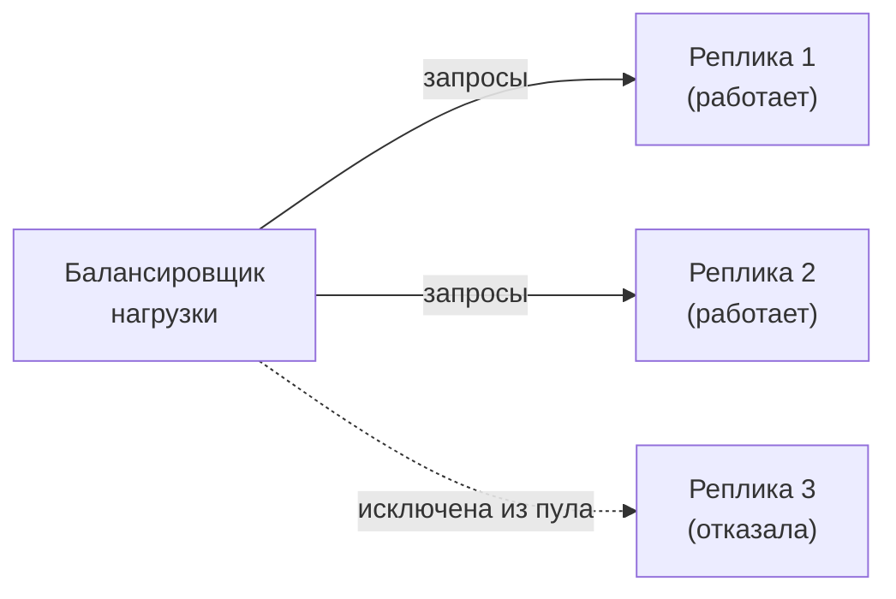

- **SPOF** (Single Point of Failure) — компонент без реплики, отказ которого останавливает всё
- Репликация требует stateless-дизайна или синхронизации состояния между репликами
- Kubernetes Deployment с тремя и более репликами — базовое применение паттерна

<!--
SPOF — компонент, при падении которого вся система или важная её часть становится недоступной. Устранение SPOF — первый шаг в проектировании надёжности. Репликация создаёт несколько экземпляров: балансировщик распределяет запросы и исключает недоступные реплики. Kubernetes Deployment с тремя репликами — стандартный пример: одна упала, две работают, ReplicaSet создаёт замену. Условие репликации: сервис должен быть stateless или синхронизировать состояние через внешнее хранилище. Stateful компонент — базу данных или очередь — реплицируют с учётом консистентности данных.
-->

---

# Graceful degradation: частичная работа при сбое

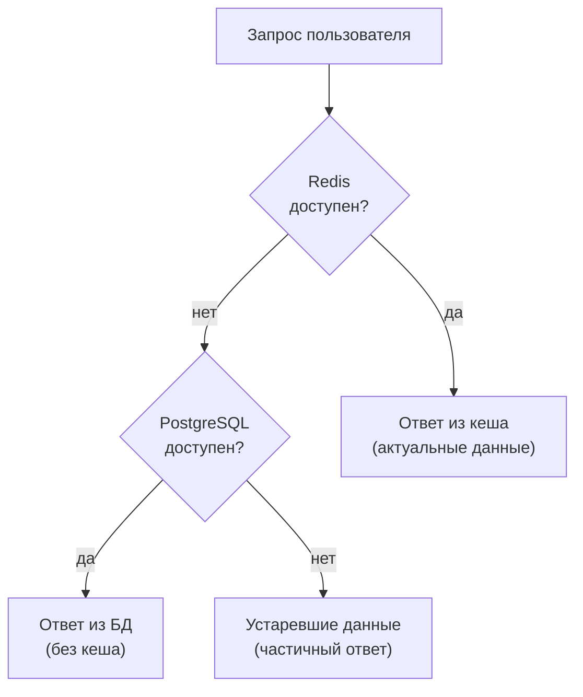

Graceful degradation — система продолжает работу в ограниченном режиме, когда зависимость недоступна.

<!--
Graceful degradation — паттерн, при котором отказ зависимости не означает полный отказ системы. Приложение пробует основной путь, при ошибке переключается на резервный, а если и он недоступен — возвращает частичный результат. В примере: сначала читаем из кеша Redis, при недоступности — из PostgreSQL, а если и база упала — показываем последние известные данные. Пользователь видит немного устаревший результат, а не ошибку. Для систем голосования это приемлемо. Graceful degradation требует явного проектирования fallback-путей и их тестирования — без тестирования они имеют тенденцию ломаться в самый неподходящий момент.
-->

---

# Bulkhead: изоляция пулов ресурсов

<div class="grid grid-cols-2 gap-3">

<div class="itmo-card">

**Без bulkhead**

Все запросы используют общий пул потоков. Медленный сервис поиска занимает все потоки и блокирует сервис оплаты.

</div>

<div class="itmo-card-accent">

**С bulkhead**

Пул А — только для поиска (10 потоков). Пул Б — только для оплаты (5 потоков). Перегрузка поиска не влияет на оплату.

</div>

<div class="itmo-card-note">

**В Kubernetes**

ResourceQuota и LimitRange ограничивают ресурсы по Namespace — это bulkhead на уровне кластерных ресурсов.

</div>

<div class="itmo-card-warn">

**Риск**

Неправильно выбранный размер пула: слишком малый блокирует при пиках, слишком большой нивелирует изоляцию.

</div>

</div>

<!--
Bulkhead — паттерн из кораблестроения: водонепроницаемые переборки изолируют отсеки так, чтобы пробоина в одном не топила остальные. В программных системах bulkhead разделяет общие ресурсы — потоки, соединения с базой, семафоры — на изолированные пулы по функциям. Если сервис поиска занимает все потоки общего пула, пул оплаты остаётся свободным. В Kubernetes аналог — ResourceQuota: Namespace получает фиксированный бюджет CPU и памяти, и перегрузка одного Namespace не истощает ресурсы другого. При проектировании: как разбить систему на булькхеды и какого размера делать каждый пул.
-->

---

# Circuit breaker: размыкание при отказе зависимости

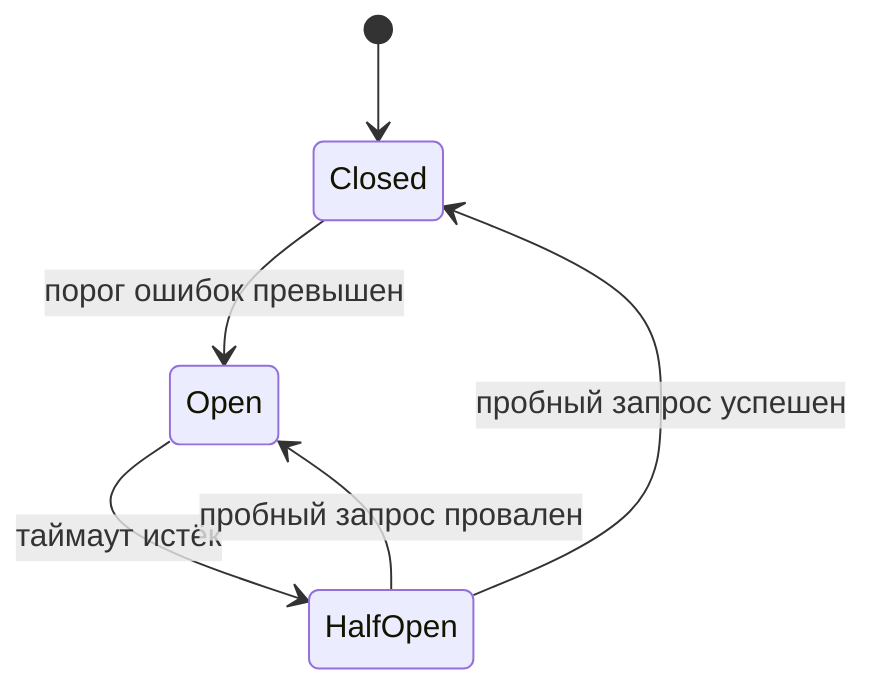

- **Closed** — нормальная работа; ошибки считаются
- **Open** — вызовы блокируются немедленно; зависимость восстанавливается
- **HalfOpen** — пропускается один пробный запрос для проверки

<!--
Circuit breaker назван по аналогии с электрическим предохранителем. В нормальном состоянии (Closed) запросы проходят свободно, схема считает ошибки. Когда их количество за окно превышает порог — цепь разрывается (Open): все запросы к зависимости немедленно отклоняются без попытки выполнить вызов. Это даёт отказавшей зависимости время восстановиться и не перегружает её лавиной повторных попыток. Через таймаут автомат переходит в состояние HalfOpen и пропускает один пробный запрос. Если он успешен — цепь замыкается (Closed). Если нет — снова Open. Паттерн реализуют библиотеки типа Resilience4j или service mesh Istio.
-->

---
layout: section
---

<div class="section-no">05</div>

# Ёмкость и экономика ресурсов

Планирование запаса, requests/limits, bin-packing

<!--
Ёмкость планируют через нагрузочные тесты, не через прогнозирование на глаз. Kubernetes requests — гарантия планировщика; limits — потолок. Без requests планировщик заливает ноду до OOM-kill. Без limits один Pod съедает ресурсы соседей. VPA считает нужные requests автоматически на основе истории.
-->

---

# Планирование ёмкости

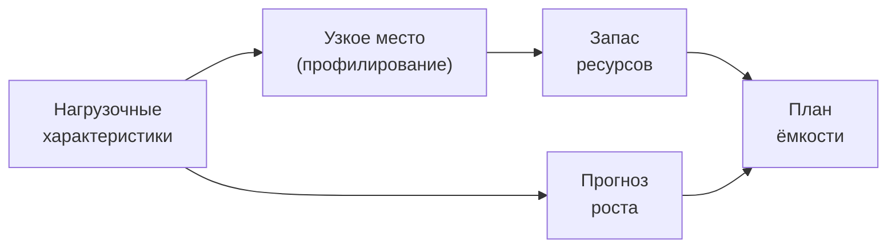

- **Нагрузочные характеристики** — пиковые RPS, размер данных, суточные паттерны трафика
- **Узкое место** — компонент, который первым исчерпает ресурсы при росте нагрузки
- **Запас** — обычно 20–50% сверх ожидаемого пика, чтобы выдержать всплески

<!--
Планирование ёмкости — это прогнозирование: когда и что исчерпается при ожидаемом росте нагрузки. Первый шаг — описание нагрузочных характеристик: сколько запросов в секунду, каков размер типичного запроса, есть ли суточные или сезонные пики. Второй шаг — профилирование: найти узкое место. Теория ограничений из первой лекции курса прямо применима здесь: производительность системы определяется самым слабым звеном. Третий шаг — закладка запаса: типичная практика — держать 20–50% свободных ресурсов, чтобы система выдержала внезапный всплеск или инцидент на одном из узлов. Без запаса любой пик нагрузки превращается в инцидент.
-->

---

# requests и limits: ресурсная модель Kubernetes

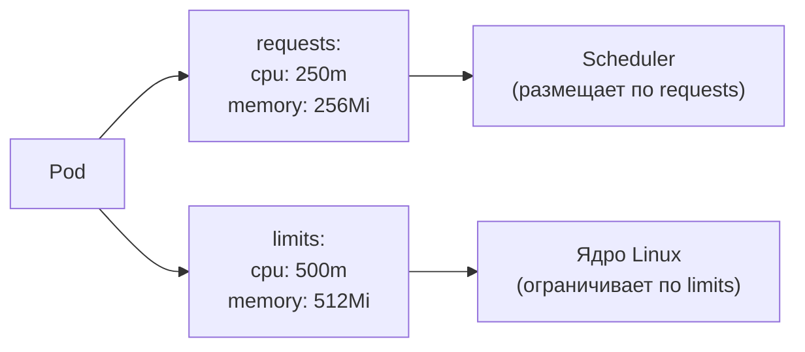

- **requests** — гарантированный минимум; scheduler использует для размещения Pod на узле
- **limits** — потолок; превышение CPU даёт throttling, превышение памяти — OOMKill

<!--
Kubernetes использует двухуровневую модель ресурсов. Requests — то, что Pod гарантированно получит. Scheduler выбирает узел именно по requests: он смотрит, хватает ли свободных ресурсов на узле. Limits — потолок потребления. При превышении CPU-лимита ядро применяет throttling: Pod получает меньше процессорного времени, но не убивается. При превышении лимита памяти — ядро убивает процесс (OOMKill). Поэтому limits по памяти нужно выставлять с запасом относительно реального потребления. Если requests не выставлены, Pod получает класс QoS BestEffort и первым выселяется при нехватке ресурсов. Этот механизм мы кратко разбирали в лекции 8 — здесь видим его связь с планированием ёмкости.
-->

---

# Bin-packing и right-sizing

<div class="grid grid-cols-2 gap-3">

<div class="itmo-card">

**Bin-packing**

Scheduler «упаковывает» Pod на узлы плотно, как в задаче об упаковке ящиков. Цель — максимизировать утилизацию узлов при соблюдении всех requests.

</div>

<div class="itmo-card-accent">

**Right-sizing**

Подбор requests под реальное потребление. Завышенные requests резервируют ресурсы, которые Pod не использует, и снижают плотность упаковки.

</div>

<div class="itmo-card-warn">

**Переподписка (overcommit)**

Сумма requests Pod на узле меньше физических ресурсов. Экономит ресурсы, но при одновременных пиках нагрузки узел может перегрузиться.

</div>

<div class="itmo-card-note">

**Инструменты**

VPA (Vertical Pod Autoscaler) анализирует реальное потребление и рекомендует скорректированные requests. Goldilocks — визуализация рекомендаций VPA.

</div>

</div>

<!--
Bin-packing — задача оптимизации, которую Kubernetes-scheduler решает при размещении Pod. Чем точнее requests соответствуют реальному потреблению, тем плотнее scheduler упаковывает Pod на узлы и тем меньше узлов нужно. Right-sizing — процесс приведения requests в соответствие с реальностью. Распространённая ошибка — выставлять requests «с запасом»: Pod с requests 1 CPU, который реально потребляет 100m, занимает в 10 раз больше места на узле, чем нужно. Переподписка — сознательное решение: суммарные requests Pod на узле превышают физические ресурсы. Это допустимо, когда Pod редко одновременно нагружены до максимума. Риск: пиковая нагрузка на всех Pod одновременно может исчерпать реальные ресурсы узла.
-->

---
layout: section
---

<div class="section-no">06</div>

# Стоимость

TCO, FinOps и цена каждой «девятки»

<!--
TCO — Total Cost of Ownership: compute + storage + network + engineering. Каждая дополнительная «девятка» надёжности экспоненциально дороже: 99% → 99,9% → 99,99%. FinOps (Cloud Financial Management) делает стоимость видимой командам: cost per feature, cost per request. AWS Cost Explorer и Kubecost — типовые инструменты.
-->

---

# TCO: полная стоимость владения

<div class="grid grid-cols-2 gap-3">

<div class="itmo-card">

**Прямые затраты**

Вычисления (CPU, RAM), хранилище, сеть, лицензии на ПО — то, что видно в счёте облачного провайдера.

</div>

<div class="itmo-card">

**Косвенные затраты**

Эксплуатация, обновления, мониторинг, обучение команды, поддержка — часто превышают прямые.

</div>

<div class="itmo-card-accent">

**TCO = прямые + косвенные + стоимость простоя**

Более надёжная архитектура может снизить TCO, даже если её прямые затраты выше — за счёт снижения потерь от инцидентов.

</div>

<div class="itmo-card-note">

**Для аналитика**

TCO — аргумент при выборе архитектуры. «Дешевле» по прямым затратам не означает «дешевле» по TCO.

</div>

</div>

<!--
TCO — Total Cost of Ownership — полная стоимость владения системой за период. Инженерные команды часто видят только прямые затраты: вычисления в облаке, диск, трафик. Косвенные — время на эксплуатацию, устранение инцидентов, обновление компонентов, обучение — нередко превышают прямые. Добавляем стоимость простоя: каждая минута недоступности платёжного сервиса — конкретные потери выручки. Более дорогая инфраструктурно архитектура с высокой надёжностью может иметь меньший TCO, чем дешёвая, но склонная к сбоям. Аналитик включает все три компонента в обоснование решений.
-->

---

# FinOps: инженерные решения через денежную призму

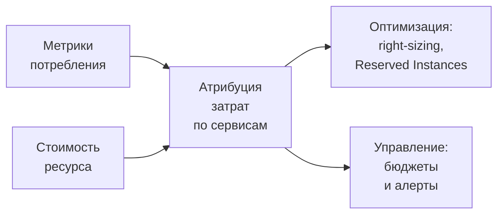

FinOps связывает инженерные решения с денежной ценой в реальном времени.

<!--
FinOps — практика управления облачными затратами, при которой инженерные команды видят и несут ответственность за стоимость своих решений. Первый шаг — атрибуция: понять, сколько стоит каждый сервис или команда. Для этого ресурсы маркируются тегами и затраты распределяются по сервисам на основе метрик потребления. Второй шаг — оптимизация: right-sizing Pod, выбор Reserved Instances для базовой нагрузки и Spot-инстансов для пиков. Третий шаг — управление: бюджеты на Namespace или проект и алерты при превышении. FinOps не означает экономию любой ценой — это инструмент осознанного выбора: тратить там, где это создаёт ценность, и сокращать там, где ресурсы используются неэффективно.
-->

---

# Цена каждой «девятки»

| Целевой уровень | Инфраструктурные требования | Относительная стоимость |
|---|---|---|
| 99% | Один ЦОД, ручной мониторинг | 1× |
| 99,9% | Репликация, автоматические health checks | 2–3× |
| 99,99% | Несколько зон доступности, автовосстановление | 5–10× |
| 99,999% | Multi-region, chaos engineering, дежурство 24/7 | 20–50× |

<div class="itmo-card-accent mt-4">
Каждая дополнительная «девятка» требует устранения очередного класса отказов — и соответствующих инвестиций. Проверяйте: оправдывает ли бизнес-ценность сервиса эту цену.
</div>

<!--
Надёжность не бесплатна, и её цена растёт нелинейно. Для трёх девяток — репликация и проверки здоровья: относительно скромные инвестиции. Четыре девятки требуют нескольких зон доступности и автоматического переключения при отказе зоны. Пять девяток — активное тестирование хаоса, multi-region развёртывание, непрерывное дежурство. Коэффициенты стоимости ориентировочные; зависят от архитектуры и провайдера. Вопрос для аналитика: какова стоимость одной минуты простоя этого сервиса? Если она ниже стоимости дополнительной «девятки» — повышать надёжность нецелесообразно.
-->

---
layout: section
---

<div class="section-no">07</div>

# Критерии, отказы, свидетельства

Как принять решение, что может пойти не так и как проверить

<!--
Решение об уровне надёжности — это экономический выбор. 99,99% оправдано для платёжного сервиса. 99,5% достаточно для внутренней аналитики. Режимы отказа: SLO без алертинга — никто не знает о нарушении. SLO без burn rate — замечают слишком поздно. Chaos engineering (Netflix Chaos Monkey) проверяет паттерны до инцидента.
-->

---

# Критерии выбора уровня надёжности

| Критерий | 2 девятки | 3 девятки | 4+ девятки |
|---|---|---|---|
| Тип сервиса | внутренний, некритичный | пользовательский | платёжный, критичный |
| Стоимость простоя | низкая | средняя | высокая |
| Допустимое окно работ | часы | минуты | секунды |
| Требуется multi-region | нет | нет | да |
| Необходим chaos testing | нет | желательно | обязательно |

<div class="itmo-card-note mt-3">
Выбирайте уровень надёжности по влиянию сервиса на пользователя и бизнес. Избыточная надёжность — тоже ошибка проектирования.
</div>

<!--
Таблица решений помогает обоснованно выбрать целевой уровень надёжности. Внутренний инструмент разработки — система сборки, например — вполне живёт на двух девятках. Пользовательский интерфейс требует трёх. Платёжный сервис, где недоступность означает прямые финансовые потери, — четыре и выше. Три вопроса: какова стоимость одной минуты простоя, насколько пользователь чувствителен к деградации, есть ли у него альтернатива. Завышенный SLO создаёт операционное давление без соответствующей ценности — это перерасход ресурсов команды.
-->

---

# Режимы отказа при проектировании надёжности

<div class="grid grid-cols-2 gap-3">

<div class="itmo-card-warn">

**Исчерпанный бюджет ошибок**

Команда выпускает изменения, не проверив остаток бюджета. SLA нарушен — компенсация выплачена.

</div>

<div class="itmo-card-warn">

**Каскадный отказ**

Отсутствие circuit breaker или bulkhead: сбой одной зависимости блокирует всю систему через общий пул ресурсов.

</div>

<div class="itmo-card-warn">

**OOMKill под нагрузкой**

limits.memory занижен относительно реального потребления. Kubernetes убивает Pod при пиках — кажется, что падает само приложение.

</div>

<div class="itmo-card-warn">

**Скрытый SPOF**

Репликация есть, но все реплики зависят от одного экземпляра БД или очереди. Отказ общей зависимости останавливает всё.

</div>

</div>

<!--
Четыре типичных режима отказа, характерных для темы надёжности и ресурсов. Первый — процессный: команда не следит за бюджетом ошибок и нарушает SLA. Второй — архитектурный: отсутствие паттернов изоляции приводит к каскадному распространению отказов. Третий — операционный: неправильно выставленные limits по памяти приводят к тому, что Kubernetes убивает Pod при пиковой нагрузке. Pod перезапускается, снова набирает нагрузку, снова убивается — OOMKill в петле. Четвёртый — самый коварный: скрытый SPOF прячется за видимостью репликации, пока не падает единственная общая зависимость всех реплик.
-->

---

# Свидетельства: как проверить количественно

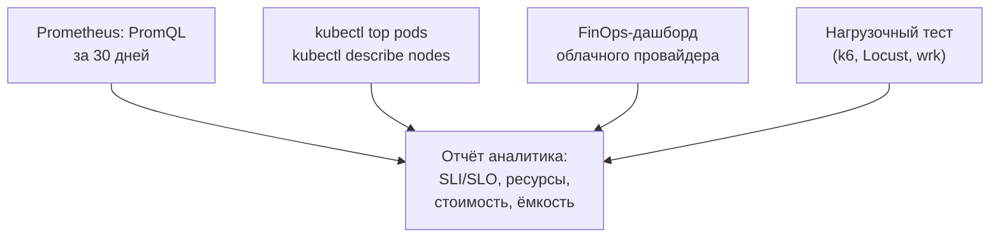

<!--
Свидетельства — практическая проверка того, что цели надёжности достигаются. Четыре источника информации. Первый — Prometheus: PromQL-запрос по метрикам позволяет вычислить текущий SLI и остаток бюджета ошибок за период. Второй — kubectl: `kubectl top pods` показывает реальное потребление CPU и памяти, которое сравнивают с выставленными requests и limits для правки right-sizing. Третий — FinOps-дашборд или отчёт облачного провайдера: стоимость по сервисам подтверждает экономическую обоснованность ресурсной модели. Четвёртый — нагрузочный тест: только под реальной нагрузкой узкое место проявляется однозначно. Все эти инструменты применяются при анализе voting-app в лабораторных работах.
-->

---
layout: center
---

# Итоги

- **SLI, SLO, SLA** — количественный язык надёжности; SLO строже SLA и задаёт внутреннюю планку
- **Бюджет ошибок** — ресурс, которым управляют; связывает надёжность с темпом релизов
- **Режимы отказа** — анализировать заранее; blast radius определяет приоритет изоляции
- **Паттерны устойчивости** — репликация, graceful degradation, bulkhead, circuit breaker
- **Ресурсы** — requests/limits, right-sizing и bin-packing управляют плотностью и стоимостью
- **Стоимость** — нефункциональное требование; каждая «девятка» имеет цену, сопоставимую с ценностью

**Дальше: Лекция 16** — эксплуатация, эволюция и обоснование инфраструктурных решений.

Опорная литература: Дж. Ким, П. Дебуа, Дж. Уиллис, Дж. Хамбл «Руководство по DevOps». МИФ, 2018.

<!--
Подведём итоги. Центральная идея лекции: надёжность и стоимость проектируют количественно, а не достигают случайно. Язык SLI, SLO, SLA превращает субъективное «система работает нормально» в измеримые обязательства. Бюджет ошибок снимает конфликт между скоростью и стабильностью: решение принимается по числу, а не по ощущению. Паттерны устойчивости — конкретные архитектурные решения, которые реализуют изоляцию. Ресурсная модель Kubernetes — инструмент точного управления затратами. Следующая лекция завершает курс: поговорим об эксплуатации, постмортемах и обосновании инфраструктурных решений — всём том, что делает аналитика инфраструктуры специалистом, умеющим проектировать и аргументировать.
-->
