
Лекция 16

# Эксплуатация, эволюция и обоснование инфраструктурных решений

Жизнь системы в эксплуатации и обоснование её изменений

<!--
Добрый день. Это заключительная лекция курса. Мы прошли путь от системного анализа инфраструктуры до конвейеров, безопасности, конфигурации и наблюдаемости. Сегодня замкнём круг: посмотрим, как система живёт в эксплуатации, как она непрерывно улучшается и как аналитик обосновывает и документирует инфраструктурные решения. Три большие темы: управляемая эксплуатация, механизм эволюции и способ принимать решения по критериям, а не по моде. В конце соберём воедино сквозную аналитическую рамку курса и обозначим, что вы понесёте с собой в лабораторные работы и в практику.
-->

---

# Маршрут лекции

- **01 Эксплуатация** — третий путь, toil, инциденты, постмортемы без обвинений
- **02 Эволюция** — непрерывное улучшение, автоматизация операций, обратная связь
- **03 Обоснование** — build vs buy, ADR, модель C4, аудит инфраструктуры
- **Итоги курса** — инфраструктура как проектируемая и обосновываемая система

<!--
Маршрут выстроен по трём смысловым блокам. Первый блок про эксплуатацию: как система работает в проде, что такое рутинная нагрузка и как проходить инциденты. Второй блок про эволюцию: как сделать улучшение ежедневной работой и где уместна автоматизация операций. Третий блок про обоснование: как выбирать между «сделать» и «купить», как фиксировать решения и моделировать систему. В конце соберём всё в единую картину и вспомним аналитическую рамку, которая проходила через каждую лекцию. Порядок неслучаен: сначала как система живёт, потом как она меняется, и только затем как мы это обосновываем.
-->

---

# Проблема: система непрерывно меняется

Меняются нагрузка, требования и окружение. Нужны управляемая эксплуатация, механизм улучшения и способ обоснованно принимать и фиксировать решения.

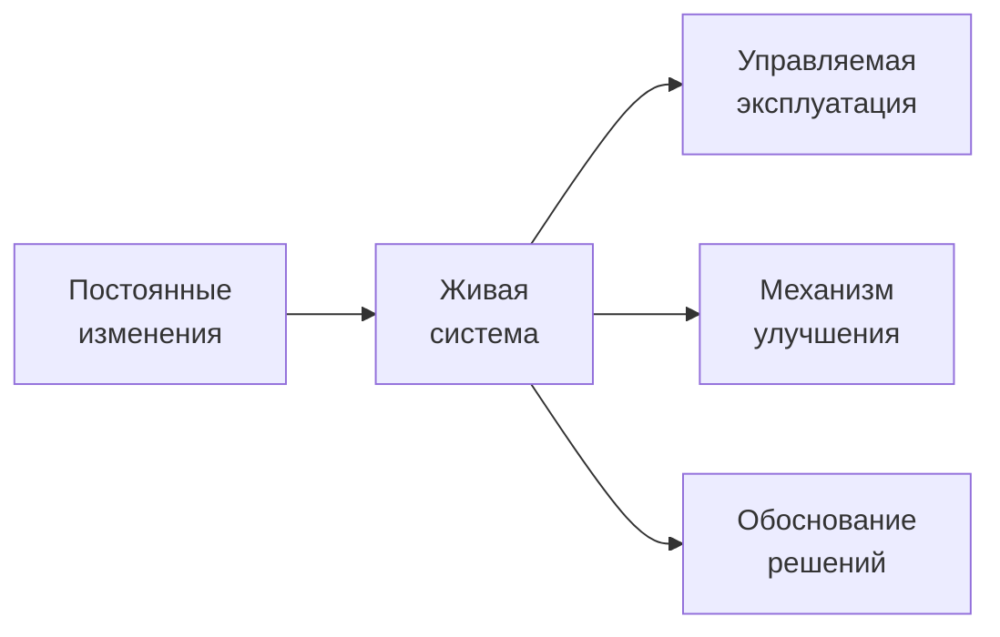

<!--
Главная проблема заключительной темы в том, что система никогда не стоит на месте. Растёт нагрузка, приходят новые требования, меняется окружение, отказывает оборудование. Живая система требует трёх вещей одновременно. Во-первых, управляемой эксплуатации: понятного порядка действий, когда что-то идёт не так. Во-вторых, механизма улучшения: способа становиться лучше не рывками, а постоянно. В-третьих, обоснования решений: чтобы каждое изменение опиралось на критерии и оставляло след для будущих участников. Эти три ветви и задают структуру лекции. Дальше разберём каждую по очереди, начиная с эксплуатации.
-->

---
layout: section
---

01

# Эксплуатация: как система живёт в проде

Третий путь, toil, инциденты и разбор без обвинений

<!--
Первый блок посвящён эксплуатации. Здесь мы смотрим на систему глазами того, кто держит её работающей каждый день. Начнём с культуры: третий путь DevOps как основа непрерывного эксперимента. Затем поговорим о toil — рутинной работе, которая съедает время инженеров. Разберём, как проходить инциденты по этапам, и как устроен разбор без поиска виновных. Всё это вместе и есть управляемая эксплуатация: не героизм отдельных людей, а предсказуемый, отлаженный процесс.
-->

---

# Третий путь DevOps: эксперимент и обучение

Команда безопасно пробует, учится на результатах и закрепляет удачные практики в повседневной работе.

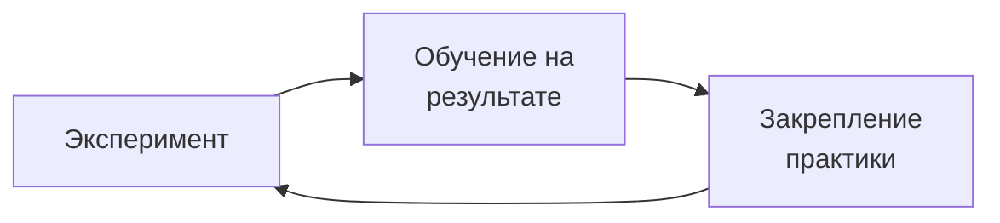

<!--
Третий путь DevOps — это культура непрерывного эксперимента и обучения. В первых двух путях мы выстраивали поток и обратную связь. Третий путь про то, как команда учится. Цикл простой: мы безопасно пробуем новое, извлекаем урок из результата, будь он удачным или нет, и закрепляем то, что сработало, в повседневной работе. Ключевое слово здесь — безопасно. Эксперимент возможен только там, где ошибка не наказывается, а становится материалом для обучения. Этот цикл вращается постоянно, и именно он превращает разовые удачи в устойчивые практики команды. К культуре без обвинений мы ещё вернёмся на разборе инцидентов.
-->

---

# Toil: рутинная работа без долговременной ценности

Toil — ручная, повторяющаяся работа, которую можно автоматизировать. Её измеряют и сокращают.

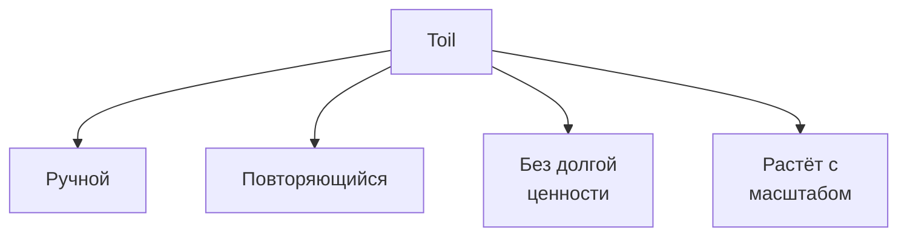

<!--
Toil — это ручная, повторяющаяся операционная работа без долговременной ценности: она не двигает продукт вперёд, но её приходится делать снова и снова. Признаки на схеме: работа выполняется руками, повторяется, не оставляет после себя ничего постоянного и, что особенно важно, растёт вместе с масштабом системы. Последнее — главный сигнал. Если при удвоении числа сервисов удваивается и ручная работа, процесс не масштабируется. Поэтому toil сначала измеряют: оценивают, какую долю времени инженеры тратят на рутину. Что измерено, тем можно управлять. Следующий шаг — сокращение через автоматизацию, о нём поговорим на следующем слайде.
-->

---

# Сокращение toil через автоматизацию

Измеряем долю рутины, выделяем повторяемое и автоматизируем, высвобождая время на инженерную работу.

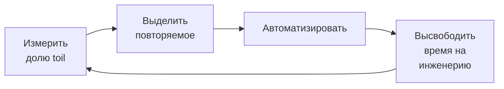

<!--
Сокращение toil — это тоже цикл. Сначала измеряем: какую долю рабочего времени команда тратит на рутину. Затем выделяем то, что действительно повторяемо и предсказуемо — не всякую ручную работу стоит автоматизировать, а именно ту, у которой понятный и стабильный сценарий. Автоматизируем её, и высвобожденное время инженеры вкладывают в развитие системы, включая новую автоматизацию. Цикл замыкается: чем меньше рутины, тем больше ресурса на её дальнейшее сокращение. Важно не превратить это в бесконечную автоматизацию ради автоматизации — критерии уместности мы разберём в блоке про автоматизацию операций.
-->

---

# Инцидент-менеджмент: обнаружение, реакция, восстановление

Инцидент проходят по этапам. Заранее определяют роли, каналы связи и порядок эскалации.

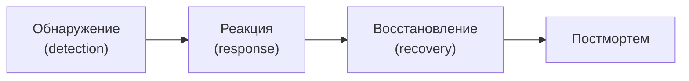

<!--
Управление инцидентом идёт по понятным этапам. Обнаружение: система или мониторинг сигналит о проблеме, и чем раньше, тем лучше — здесь работает наблюдаемость из прошлой лекции. Реакция: команда собирается, локализует проблему и удерживает ущерб. Восстановление: возвращаем сервис в рабочее состояние, иногда обходным путём, а корневую причину чиним позже. И обязательный этап после — постмортем, разбор. Всё это работает только если роли, каналы связи и порядок эскалации определены заранее, а не придумываются под нагрузкой. Когда всё горит, времени договариваться нет. Поэтому договариваются в спокойное время. Про роли — на следующем слайде.
-->

---

# Роли и коммуникация при инциденте

Под нагрузкой действуют слаженно, когда роли распределены заранее.

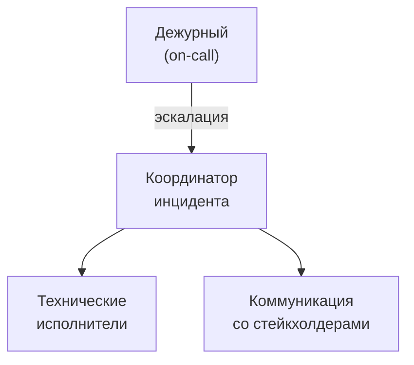

<!--
Слаженность под нагрузкой — результат заранее распределённых ролей. Первым проблему видит дежурный, on-call инженер. Если масштаб превышает его возможности, он эскалирует и назначается координатор инцидента. Важно: координатор не чинит систему руками, он держит общую картину, принимает решения и распределяет работу. От него расходятся две ветви. Технические исполнители занимаются собственно восстановлением. Отдельный человек отвечает за коммуникацию: сообщает стейкхолдерам и пользователям статус, чтобы инженеров не отвлекали вопросами. Такое разделение кажется избыточным на маленькой команде, но именно оно спасает крупный инцидент от хаоса. Каналы связи и шаблоны сообщений тоже готовят заранее.
-->

---

# Постмортемы без обвинений

Разбор фокусируется на причинах и системных недостатках, а итог — уроки и конкретные действия.

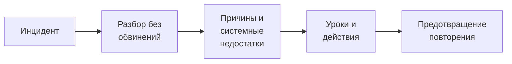

<!--
Постмортем без обвинений — это разбор, который ищет причины, а не виновных. Логика на схеме: после инцидента проводим разбор, выходим на корневые причины и системные недостатки, формулируем уроки и конкретные действия, и эти действия предотвращают повторение. Почему без обвинений — вопрос не только этики, но и качества. Как только за ошибку наказывают, люди начинают скрывать детали, и разбор теряет правдивость. Культура без обвинений повышает честность: человек спокойно рассказывает, что именно пошло не так, и команда чинит систему, а не человека. Хороший постмортем заканчивается не выводом «будьте внимательнее», а конкретными изменениями с ответственными и сроками.
-->

---
layout: section
---

02

# Эволюция: непрерывное улучшение

Kaizen, автоматизация операций и обратная связь из эксплуатации

<!--
Второй блок — про эволюцию системы. Эксплуатация удерживает систему работающей, но этого мало: система должна становиться лучше. Здесь разберём, как сделать улучшение ежедневной привычкой, а не разовой кампанией. Поговорим про самоуправляемые команды, которые сами берут ответственность за улучшения. Разберём автоматизацию операций — runbooks, playbooks, самовосстановление — и, что важно, её границы. И увидим, как наблюдаемость из прошлой лекции замыкает цикл, влияя на то, что мы разрабатываем.
-->

---

# Непрерывное улучшение вместо кампаний

Небольшие постоянные изменения накапливаются в устойчивый результат.

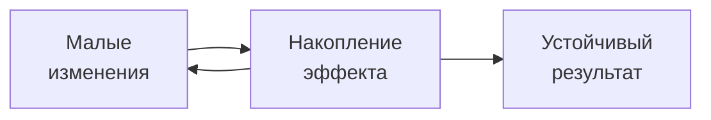

<!--
Непрерывное улучшение — это философия kaizen: улучшение делают ежедневной работой, а не разовой кампанией. Разница принципиальна. Кампания даёт всплеск и затухает, а небольшие постоянные изменения накапливаются и дают устойчивый результат. На схеме это петля: малое изменение, накопление эффекта, снова малое изменение — и параллельно растёт устойчивый результат. Иногда для рывка выделяют короткий период фокусной работы над улучшениями, improvement blitz, но и он встроен в общий ритм, а не заменяет его. Главная мысль: улучшение не проект с началом и концом, а свойство того, как команда работает каждый день.
-->

---

# Самоуправляемые команды и обратная связь

Команда сама владеет улучшениями и питается сигналами из эксплуатации.

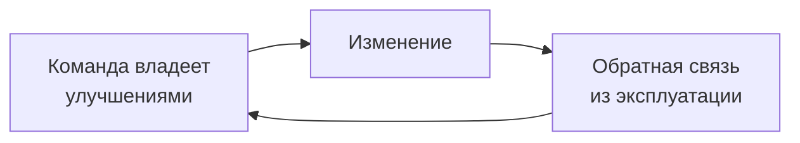

<!--
Ритм непрерывного улучшения поддерживают самоуправляемые команды. Ключевое слово — владеют: команда не ждёт указаний сверху, а сама решает, что улучшать, потому что она ближе всего к системе и её проблемам. Петля обратной связи на схеме: команда вносит изменение, эксплуатация даёт сигнал о результате, и этот сигнал возвращается в команду как основание для следующего шага. Без обратной связи улучшения превращаются в угадывание. Поэтому наблюдаемость и метрики, о которых была прошлая лекция, здесь не просто мониторинг, а топливо для эволюции. Ответственность и обратная связь вместе делают улучшение самоподдерживающимся.
-->

---

# Runbooks и playbooks

Готовые описания действий для типовых ситуаций сокращают время реакции и разброс качества.

| Признак | Runbook | Playbook |
| --- | --- | --- |
| Что описывает | пошаговую процедуру | сценарий реакции |
| Когда применяют | штатная операция | инцидент, нештатная ситуация |
| Форма | последовательность шагов | ветвления по условиям |
| Цель | повторяемость | скорость и слаженность |

<!--
Runbooks и playbooks — это записанное знание о том, как действовать. Runbook описывает штатную повторяемую операцию как последовательность шагов: перезапуск сервиса, ротация ключа, разворачивание окружения. Playbook ближе к инциденту: это сценарий реакции с ветвлениями, что делать, если наблюдаем такой-то симптом. Оба нужны по одной причине: под нагрузкой и в спешке память подводит, а записанная процедура даёт повторяемость и снижает разброс качества между людьми. Хороший runbook ещё и первый кандидат на автоматизацию — если действия расписаны по шагам, их часто можно передать машине. Об этом следующий слайд.
-->

---

# Self-healing и границы автоматизации

Автоматическое восстановление уместно там, где сценарий известен и повторяем.

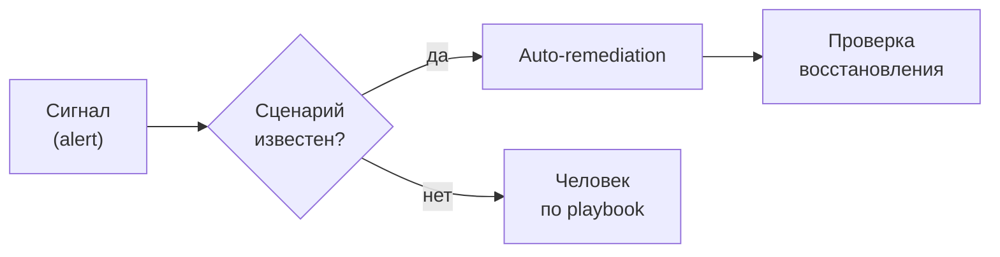

<!--
Self-healing и auto-remediation автоматически восстанавливают систему по известным сценариям: перезапускают упавший под, добавляют реплику, переключают трафик. Но у автоматизации есть граница, и она на схеме в виде развилки. Пришёл сигнал — задаём вопрос: сценарий известен и повторяем? Если да, отрабатывает автоматика, и обязательно проверяет, что восстановление удалось. Если нет — за дело берётся человек по playbook. Опасность в том, чтобы запустить автоматическое лечение на непонятной ситуации: неверное действие способно усугубить инцидент. Поэтому правило простое: автоматизируем известное и предсказуемое, неизвестное оставляем человеку. Это и есть инженерная зрелость — знать, где остановить автоматизацию.
-->

---

# Наблюдаемость влияет на разработку

Сигналы из эксплуатации решают, что улучшать, какие метрики добавить, где упростить.

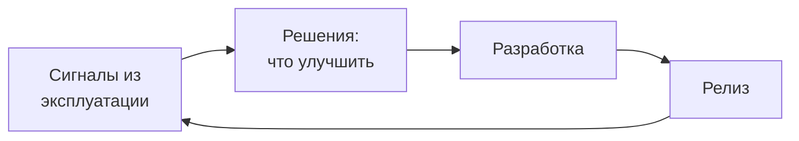

<!--
Наблюдаемость замыкает цикл разработки и эксплуатации. Мы привыкли думать, что сначала разрабатываем, потом эксплуатируем. Но связь двусторонняя: сигналы из эксплуатации возвращаются в разработку и определяют, что делать дальше. По ним решают, что улучшать в первую очередь, какие метрики добавить, чтобы лучше видеть систему, и где код или инфраструктуру стоит упростить. На схеме это полный круг: сигналы, решения, разработка, релиз и снова сигналы. Такой подход называют observability-driven development. Он превращает наблюдаемость из пассивного мониторинга в активный источник приоритетов. Система как бы сама подсказывает, куда приложить усилия.
-->

---
layout: section
---

03

# Обоснование: решения и документация

Build vs buy, ADR, модель C4 и аудит инфраструктуры

<!--
Третий блок — про обоснование. Инженерная зрелость видна не в том, какие технологии выбраны, а в том, как выбраны и как это зафиксировано. Здесь разберём выбор между «сделать» и «купить» по TCO и матрице компромиссов, оценку зрелости технологии, документирование решений через ADR и моделирование системы по C4. Завершим аудитом инфраструктуры, который сводит воедино всё, чему учит курс. Это блок про то, как аналитик превращает интуицию в аргумент.
-->

---

# Build vs buy: решение по критериям

Выбор опирается на ценность, зрелость готовых решений и стоимость владения, а не на моду.

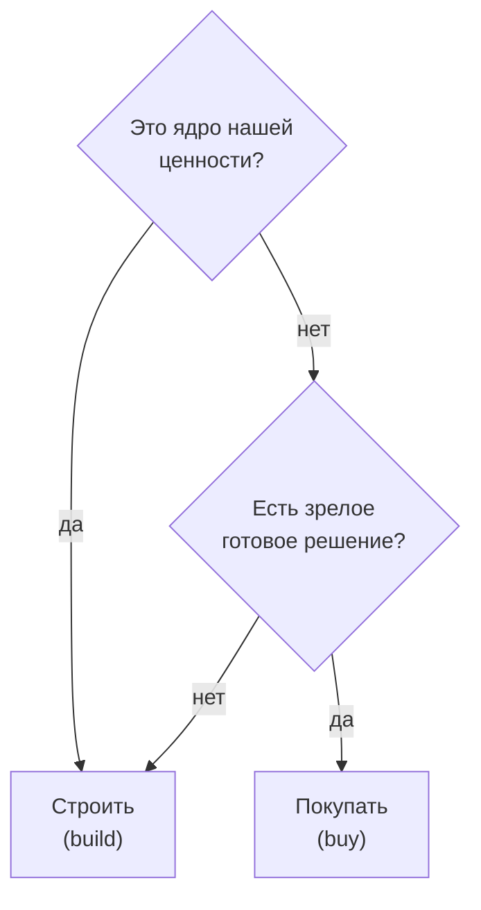

<!--
Выбор между «сделать» и «купить» — классическое инфраструктурное решение, и принимать его стоит по критериям. Первый вопрос: это ядро нашей ценности, то, чем мы отличаемся на рынке? Если да, обычно строим сами, чтобы сохранить контроль и уникальность. Если нет — второй вопрос: есть ли зрелое готовое решение? Если есть, разумно купить и не изобретать велосипед. Если зрелого решения нет, приходится строить, даже если это не ядро. Обратите внимание: в дереве нет ветки «взять, потому что модно». Решение основано на месте компонента в ценности и на зрелости альтернатив. Количественную опору даёт следующий слайд.
-->

---

# TCO и матрица компромиссов

Совокупная стоимость владения делает выбор измеримым.

| Критерий | Build | Buy |
| --- | --- | --- |
| Начальная стоимость | высокая | ниже |
| Скорость старта | медленно | быстро |
| Контроль и гибкость | полный | ограничен вендором |
| Поддержка | своя команда | вендор, SLA |
| Уникальность | максимальная | типовое решение |

<!--
Чтобы решение build vs buy было честным, его переводят в цифры через TCO — совокупную стоимость владения. Ошибка новичка — сравнивать только начальную стоимость. Своё решение кажется дешевле, потому что «мы сами напишем», но в TCO входит вся жизнь компонента: поддержка, обновления, дежурства, обучение людей. Матрица компромиссов раскладывает выбор по критериям. Своё даёт полный контроль и гибкость, но требует своей команды и медленнее стартует. Покупное быстрее и снимает поддержку на вендора, но ограничивает гибкость и привязывает к SLA. Нет универсально правильного столбца — есть выбор, осознанный по этим критериям. Это ровно тот приём таблицы решений, что проходил через весь курс.
-->

---

# Технологический радар: зрелость до внедрения

Технологию оценивают до внедрения, а не после.

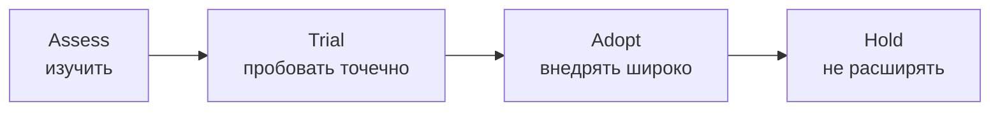

<!--
Технологический радар — инструмент оценки зрелости технологии до того, как мы поставим на неё систему. Идея в стадиях. Assess: изучаем технологию, читаем, смотрим на чужой опыт, но в продакшен не тащим. Trial: пробуем точечно, на некритичном участке, где ошибка недорога. Adopt: технология доказала себя, внедряем широко как стандарт. Hold: не расширяем использование, возможно, сворачиваем — либо технология не оправдала ожиданий, либо устарела. Радар защищает от типичной ошибки: внедрить модную технологию сразу и повсеместно, а потом узнать её слабости на своей проде. Правильный порядок — сначала оценка и проба, потом масштаб.
-->

---

# ADR: фиксируем решение и его контекст

Architecture Decision Record сохраняет обоснование для будущих участников.

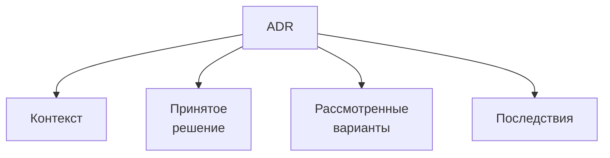

<!--
ADR, Architecture Decision Record — это короткая запись одного принятого решения. Структура на схеме. Контекст: какая ситуация и ограничения вынудили принимать решение. Само решение: что именно выбрали. Рассмотренные варианты: какие альтернативы взвешивали и почему их отклонили. Последствия: что это решение нам даёт и чем ограничивает в будущем. Зачем это нужно: через год никто не вспомнит, почему выбрали именно так, и новый участник либо будет ломать голову, либо переделает по кругу. ADR сохраняет обоснование во времени. Хранят их обычно рядом с кодом, в репозитории, как часть истории проекта. Это дешёвая привычка с большой отдачей.
-->

---

# Модель C4: система на четырёх уровнях

Диаграммы — выход работы аналитика и основа для обсуждения.

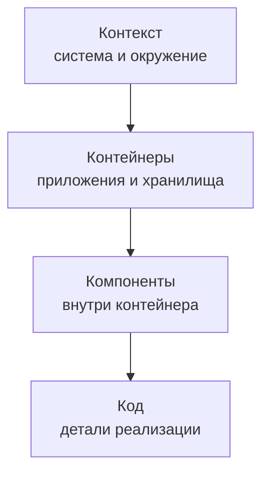

<!--
Модель C4 описывает систему на четырёх уровнях детализации, как последовательное приближение. Верхний уровень, контекст: система целиком и её окружение, кто с ней взаимодействует. Ниже контейнеры: из каких приложений и хранилищ она состоит, здесь слово «контейнер» шире докеровского и означает единицу развёртывания. Ещё ниже компоненты: что внутри одного контейнера. И самый нижний — код, детали реализации. Смысл модели в том, что для разного разговора нужен разный уровень: с заказчиком обсуждают контекст, с командой — компоненты. Диаграммы C4 — это не украшение, а выход работы аналитика и общий язык для обсуждения. Навык их построения вы закрепляете в лабораторных.
-->

---

# Диаграммы как результат работы аналитика

Модель — вход для решения, обсуждения и практики.

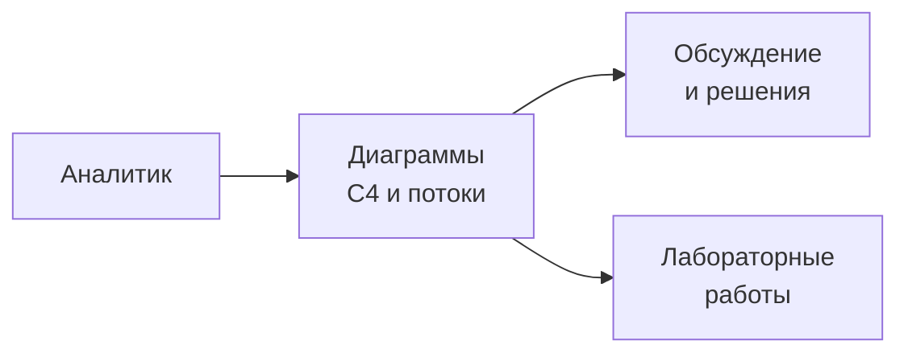

<!--
Соберём мысль о моделировании. Аналитик производит не тексты ради текстов, а модель, которая помогает принимать решения. Диаграмма — это одновременно инструмент мышления и средство коммуникации: рисуя, аналитик сам лучше понимает систему, а показывая, договаривается с командой. От диаграммы расходятся две ветви, важные для вас. Первая — обсуждение и решения, где схема становится общим языком, снимающим недопонимание. Вторая — лабораторные работы курса, где вы строите такие модели своими руками. Это мост в практику: то, что сегодня звучит теорией, в лабораторных станет конкретным навыком построения и защиты диаграмм своей системы.
-->

---

# Аудит инфраструктуры: от чек-листа к предложениям

Аудит выявляет ограничения и риски и завершается аргументированными предложениями.

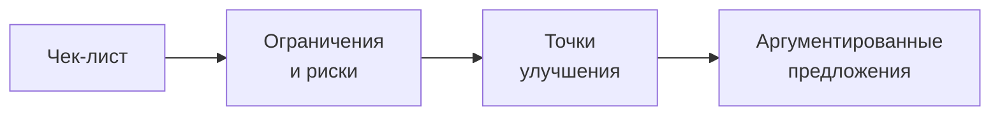

<!--
Аудит инфраструктуры — это способ применить всё, чему учит курс, к конкретной системе. Начинается с чек-листа: набора вопросов по изоляции, поставке, наблюдаемости, надёжности, стоимости и безопасности. По чек-листу мы выявляем ограничения и риски: где система хрупкая, где непрозрачная, где дорогая. Из рисков выводим точки улучшения — что именно стоит менять. И, главное, завершаем не списком претензий, а аргументированными предложениями: что сделать, почему это оправдано и что мы получим. Аудит сводит воедино всю аналитическую рамку курса и есть та работа, которую от вас ждут: не просто заметить проблему, а обосновать решение.
-->

---

# Критерии: когда автоматизировать операцию

| Признак | Автоматизировать | Оставить человеку |
| --- | --- | --- |
| Частота | высокая, регулярная | редкая, разовая |
| Сценарий | понятен и повторяем | нестандартный |
| Риск ошибки | предсказуем | высокий или неясный |
| Стоимость | автоматизация окупается | дороже ручного |

<!--
Соберём критерии автоматизации операций в таблицу решений — фирменный приём курса. Автоматизировать стоит то, что делается часто и регулярно: разовую операцию автоматизировать дороже, чем выполнить руками. Сценарий должен быть понятным и повторяемым — это условие мы уже видели у self-healing. Риск ошибки должен быть предсказуемым: там, где неверное автоматическое действие способно навредить, нужен человек. И автоматизация должна окупаться: время на её создание и поддержку меньше, чем экономия. Ни один критерий не решает в одиночку, но вместе они дают честный ответ. Обратная сторона этого выбора — режимы отказа, к ним переходим.
-->

---

# Режимы отказа

<strong>Toil обгоняет автоматизацию</strong> 
рутина растёт с масштабом быстрее, чем её сокращают, и процесс не масштабируется

<strong>Постмортем с поиском виновных</strong> 
люди скрывают детали, разбор теряет правдивость, причины остаются

<strong>Автоматика на неизвестном сценарии</strong> 
auto-remediation усугубляет инцидент вместо восстановления

<strong>Решение без ADR</strong> 
обоснование теряется, преемники ломают или переделывают по кругу

<!--
Соберём типичные режимы отказа этого блока. Первый: toil растёт быстрее, чем его автоматизируют, верный признак, что процесс не масштабируется, и команда со временем захлебнётся в рутине. Второй: постмортем скатывается в поиск виновных, и тогда люди начинают скрывать детали, а корневые причины остаются нетронутыми. Третий: автоматическое восстановление запускают на непонятной ситуации, и оно усугубляет инцидент вместо помощи. Четвёртый: решение принимают без ADR, обоснование испаряется, и преемники либо боятся тронуть систему, либо переделывают уже пройденное. Каждый из этих отказов дешевле предупредить культурой и дисциплиной, чем расхлёбывать. Как убедиться, что мы их избегаем, на слайде свидетельств.
-->

---

# Свидетельства: как проверить руками

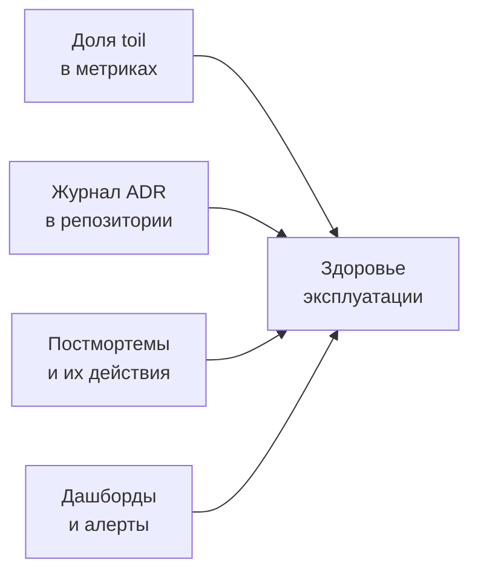

<!--
Как аналитику убедиться, что эксплуатация и обоснование в порядке? По свидетельствам, которые можно проверить руками. Первое: доля toil в метриках, если её измеряют и она снижается, процесс здоров. Второе: журнал ADR в репозитории, наличие записей показывает, что решения обосновывают и фиксируют, а не принимают молча. Третье: постмортемы и, главное, статус их действий, важны не сами разборы, а выполненные по ним изменения. Четвёртое: дашборды и алерты, живая наблюдаемость, а не мёртвые графики. Все четыре сигнала сходятся в одно: здоровье эксплуатации. Отсутствие любого из них повод для вопроса. Это и есть работа аналитика: смотреть не на обещания, а на свидетельства.
-->

---

# Сквозная рамка курса

Каждую тему мы разбирали по одной логике.

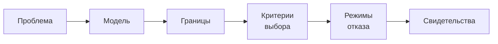

<!--
Прежде чем подвести итог, вспомним рамку, которая проходила через каждую лекцию курса. Мы начинали с проблемы: какую боль решаем. Строили модель: как устроено решение. Очерчивали границы: где модель перестаёт работать. Формулировали критерии выбора: обычно в виде таблицы решений. Разбирали режимы отказа: как оно ломается. И заканчивали свидетельствами: как проверить руками. Эта последовательность не про конкретную технологию, а про способ думать об инфраструктуре. Контейнеры, Kubernetes, конвейеры, наблюдаемость всё мы разбирали по этой логике. Именно её вы уносите с собой: меняются инструменты, а способ анализа остаётся.
-->

---
layout: center
---

# Итоги курса

- Инфраструктура — проектируемая, наблюдаемая и обосновываемая система
- Аналитик умеет её измерять, улучшать и документировать решения
- Рамка «проблема → модель → границы → критерии → отказы → свидетельства» переносится на любую технологию

**Дальше:** защита лабораторных работ и аудит своей инфраструктуры

Опорная литература: Дж. Ким и соавт. «Руководство по DevOps», П. Коннинг «Инструментарий agile-лидера»

<!--
Подведём итог всего курса. Главный вывод в одной фразе: инфраструктура это проектируемая, наблюдаемая и обосновываемая система, а не стихийно выросшее хозяйство. Аналитик умеет с ней работать: измерять её свойства, улучшать её эволюционно и документировать принятые решения. И третье: аналитическая рамка курса переносится на любую технологию, в том числе на те, что появятся после этого курса. Дальше вас ждёт защита лабораторных и аудит собственной инфраструктуры, где всё это станет практикой. Опорная литература «Руководство по DevOps» Кима с соавторами и «Инструментарий agile-лидера» Коннинга. Спасибо за курс. Теперь у вас есть язык, чтобы говорить об инфраструктуре строго и обоснованно.
-->
