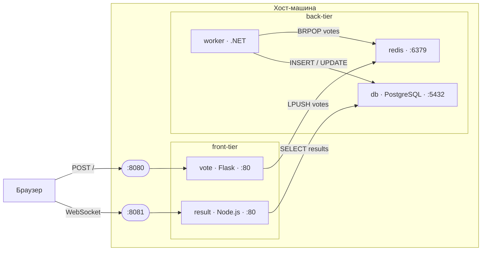
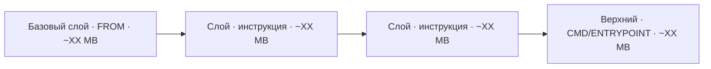
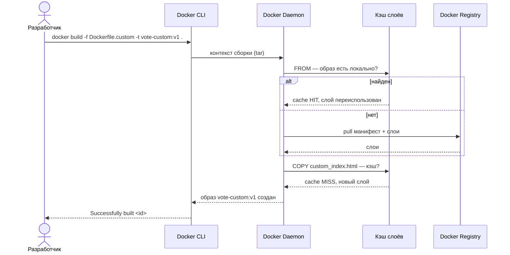
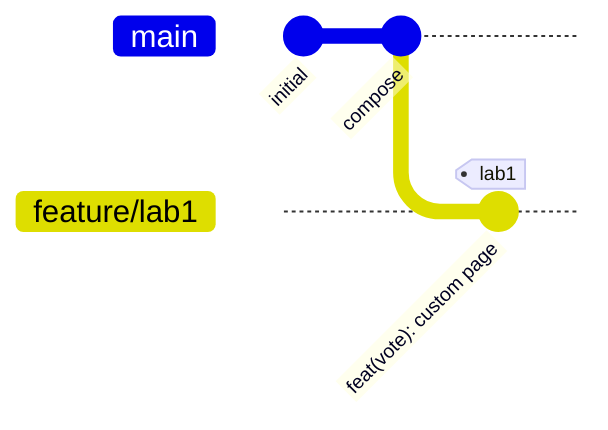
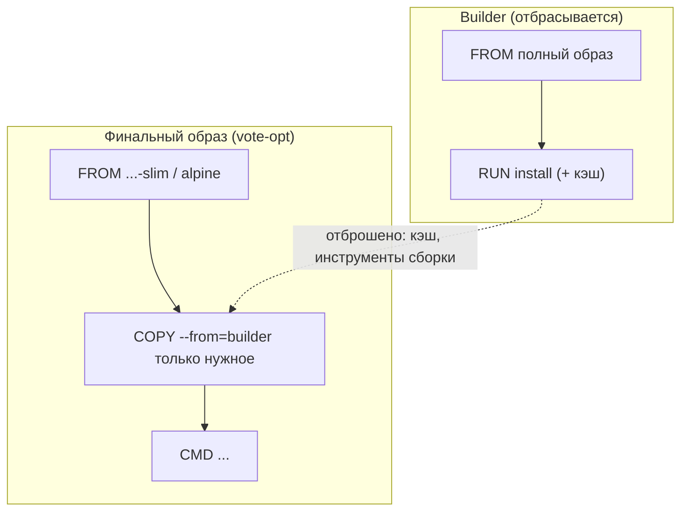

## Контейнеризация приложения — образы, слои и воспроизводимая сборка

## 1. Цель работы

Контейнеризировать многокомпонентное приложение `example-voting-app` и научиться управлять его образами через Docker.
Работа закрепляет материал лекций 1–4 раздела «Основы DevOps и управление разработкой» (жизненный цикл разработки,
контроль версий, образы и контейнеры, слоистая файловая система).

По итогам вы научитесь:

- поднимать многоконтейнерное приложение через Docker Compose и читать его состояние;
- разбирать образ на слои и понимать, из чего складывается его размер;
- собирать пользовательский образ поверх базового, менять содержимое страницы через `COPY`;
- уменьшать образ через multi-stage, alpine-базу и `.dockerignore`, удерживая работоспособность;
- фиксировать работу в git: ветка, коммит по Conventional Commits, аннотированный тег;
- строить технические диаграммы архитектуры, слоёв образа и сборки.

## 2. Формат сдачи, критерии оценки

Артефакт сдачи — **репозиторий**, а не отчёт со скриншотами. Оценивается воспроизводимое состояние: образы, собирающиеся
из ваших файлов, и приложение, которое поднимается вашими командами.

Оценка идёт в два этапа:

1. **Автопроверка (допуск к защите)**. Перед защитой вы прогоняете `make check` - он проверяет, что всё собирается и
   работает. Если все проверки прошли - вы допущены. Прохождение автопроверки не дает вам баллов, а лишь подтверждает
   работоспособность лабораторной.
2. **Защита.** Преподаватель задаёт вопросы по вашим файлам и образам и выдаёт практическую задачу в реальном времени.
   Именно здесь выставляется оценка.

`make check` у вас на машине — тренажёр с мгновенной обратной связью. Гоняйте его сколько угодно. Доверенный прогон
один: на защите, из зафиксированного коммита.

> Зелёный `make check`, полученный без понимания (например, сгенерированный Dockerfile, вставленный без разбора),
> пускает вас в аудиторию, но балл на защите без понимания и беглости не берётся. См. §8.

## 3. Ваш вариант

Параметры варианта детерминированы вашим номером ИСУ. Механика открытая — секрета в ней нет, привязка к личности
держится на canary-токене в артефакте и повторном прогоне на защите.

```bash
cd lab1
python3 seed.py --isu <ваш_ИСУ>
```

Вывод задаёт для вашего варианта:

| Параметр          | Что задаёт                                                                                          |
|-------------------|-----------------------------------------------------------------------------------------------------|
| `PROJECT`         | имя compose-проекта; изолирует контейнеры и сеть варианта, по нему проверка находит ваше приложение |
| `CANARY`          | токен-метка; обязателен в label образа, в тексте страницы vote и в сообщении тега                   |
| `IFRAME_URL`      | URL, который обязан появиться в iframe отданной страницы vote                                       |
| `VOTE_PORT`       | порт публикации vote на хосте (`8080`)                                                              |
| `RESULT_PORT`     | порт публикации result на хосте (`8081`)                                                            |
| `SIZE_BUDGET_PCT` | потолок размера оптимизированного образа: доля от кастомного (60/70/80 %)                           |
| `BREAKFIX_ID`     | какой сбой вам вбросят на защите (готовьтесь ко всем)                                               |

Подставляйте эти значения в команды и файлы. `make check` перечитывает их из сида и сверяет — руками ничего дублировать
не нужно.

## 4. Подготовка окружения

Инструменты ставятся один раз командой `make setup` (`docker` с compose v2, `git`, `curl`, `bats`, `jq`, `python3`+
`flask`, `ttyd`, `coreutils`).

Запустите тренажёр (он один на все лабы):

```bash
git clone <URL-курса> && cd labs
make setup            # один раз: зависимости
make trainer          # откройте http://localhost:8899 и выберите «Лаб 1» в селекторе
```

На странице: селектор лабы, слева задания с подсказками, справа файловое дерево рабочей директории с редактором и
**встроенным терминалом**. Терминал стартует в `workdir/` — рабочей зоне, засеянной из шаблона под ваш вариант.
Приложение и образы вы поднимаете **сами** в терминале — это и есть навык:

```bash
git clone https://github.com/dockersamples/example-voting-app
cd example-voting-app
docker compose -p <PROJECT> -f docker-compose.images.yml up -d
```

Кнопка **«Проверить это задание»** на карточке прогоняет контракты одного блока (секунды) и красит сегменты
зелёным/красным. Она ничего не поднимает — только сверяет текущее состояние Docker с контрактами.

> **Проверка из терминала.** Виджет доступности кластера в тренажёре завязан на Kubernetes и для Docker-лабы блокирует
> кнопку «Проверить» на странице. Гоняйте контракты из терминала — результат тот же:
> ```bash
> cd lab1
> make check ISU=<ваш_ИСУ>                        # все контракты
> make check-suite SUITE=03_custom ISU=<ваш_ИСУ>  # быстрый прогон одного задания
> ```

Файлы `Dockerfile.custom` и `custom_index.html` для заданий 3–4 уже лежат в рабочей директории — пока только с
комментариями-подсказками. Готовых решений нет, дерево файлов правите сами.

## 5. Задания

Каждое задание описывает **что сделать** и **как это проверяет** `make check`. Способ достижения выбираете сами —
контракт смотрит на результат (образ, отданную страницу, размер, объекты git), а не на текст ваших файлов.

### Задание 1. Запуск приложения

Поднять `example-voting-app` через `docker compose` в проекте `PROJECT`. Пять сервисов (`vote`, `result`, `worker`,
`redis`, `db`) должны быть запущены; `vote` отвечать на `VOTE_PORT`, `result` — на `RESULT_PORT`. Проголосовать на форме
vote и убедиться, что голос дошёл до базы и виден в результатах.

**Контракт проверки:** проект `PROJECT` поднят; в нём не менее пяти контейнеров в состоянии running; `vote` отдаёт HTTP
200 на `VOTE_PORT`; `result` отдаёт HTTP 200 на `RESULT_PORT`.

Имя проекта задаёт сид — поднимайте строго с `-p <PROJECT>`, иначе проверка не найдёт ваши контейнеры. `redis` и `db`
стартуют первыми (healthcheck), остальные зависят от них — дождитесь готовности через `docker compose -p <PROJECT> ps`.

### Задание 2. Образ и его слои

Скачать базовый образ vote `dockersamples/examplevotingapp_vote` и разобрать его. Зафиксировать размер образа: он станет
точкой отсчёта для оптимизации в задании 4.

**Контракт проверки:** базовый образ присутствует локально; `docker image history` показывает больше одного слоя.

Compose с `-f docker-compose.images.yml` подтягивает образ сам; отдельно —
`docker pull dockersamples/examplevotingapp_vote`. Слои и их размеры смотрите в
`docker image history dockersamples/examplevotingapp_vote`.

### Задание 3. Кастомный образ vote

Собрать образ `vote-custom:v1` поверх `dockersamples/examplevotingapp_vote`. Навесить на него label
`lab1.canary=<CANARY>`. Подменить шаблон страницы vote так, чтобы она содержала iframe с источником `IFRAME_URL` и токен
`CANARY`, сохранив форму голосования оригинала.

**Контракт проверки:** образ `vote-custom:v1` собран локально; label `lab1.canary` равен вашему `CANARY`, и тот же токен
виден в отданной странице; страница содержит `<iframe>` с вашим `IFRAME_URL` и сохранённую форму голосования
(`name="vote"`).

Собирайте `FROM dockersamples/examplevotingapp_vote` — не пересобирайте приложение с нуля. Токен `CANARY` впишите и в
`LABEL lab1.canary`, и в текст страницы (например, в HTML-комментарий с ФИО и вариантом). Шаблон внутри образа лежит
рядом с приложением (`templates/index.html`) — точный путь уточните командой
`docker run --rm dockersamples/examplevotingapp_vote sh -c 'find / -name index.html 2>/dev/null'` и накройте его через
`COPY`.

### Задание 4. Оптимизация образа

Собрать образ `vote-opt:v2` с той же кастомизацией (iframe `IFRAME_URL`, label `lab1.canary=<CANARY>`, токен в
странице), но легче: применить multi-stage, alpine-базу или `.dockerignore`. Итоговый размер — не более
`SIZE_BUDGET_PCT` % от кастомного образа из задания 3. Контейнер обязан работать: отдавать страницу с формой, iframe и
токеном.

**Контракт проверки:** образ `vote-opt:v2` работает — отдаёт страницу с формой голосования; его размер не превышает
`SIZE_BUDGET_PCT` % от `vote-custom:v1`; кастомизация уцелела — label `lab1.canary`, iframe `IFRAME_URL` и токен
`CANARY` на месте.

Проверка слепа к способу: multi-stage, alpine и `.dockerignore` проходят одинаково — важен размер и работоспособность.
Сравнить размеры: `docker image inspect vote-opt:v2 vote-custom:v1 --format '{{.Size}}'`. Оптимизация не должна ломать
приложение: запустите `vote-opt:v2` и получите 200.

### Задание 5. Git: ветка, коммит, тег

Зафиксировать работу в клоне `example-voting-app`: создать ветку `feature/lab1`, добавить файлы кастомизации отдельным
коммитом с заголовком по Conventional Commits (например `feat(vote): custom page with iframe`) и навесить аннотированный
тег с токеном `CANARY` в сообщении.

**Контракт проверки:** существует ветка с префиксом `feature/lab1`; в её истории есть коммит с заголовком вида
`type(scope): описание` по Conventional Commits; существует аннотированный (не lightweight) тег, в теле сообщения
которого присутствует ваш `CANARY`.

`git checkout -b feature/lab1` → `git commit -m "feat(vote): ..."` → `git tag -a <имя> -m "...<CANARY>..."`. Тег именно
аннотированный (`-a`): проверка отсеивает lightweight-теги по типу объекта. Токен `CANARY` должен попасть в сообщение
тега, а не в имя.

## 6. Фиксация работы

Когда `make check` зелёный, зафиксируйте состояние в клоне приложения:

```bash
git add -A && git commit -m "feat(vote): variant <ИСУ>"
git push
```

Коммит фиксирует вашу работу во времени — переписать историю без следа нельзя. Аннотированный тег с `CANARY` (задание 5)
и label образа связывают артефакт с вашей личностью. Этот коммит и есть точка, из которой преподаватель поднимет ваши
образы на защите.

## 7. Диаграммы

Включите в репозиторий (каталог `docs/`) исходники и рендер. Значения берите из своей работы, не из шаблона: реальные
слои из `docker image history`, реальные хеши из `git log --oneline`.

**Диаграмма 1 — архитектура и поток данных.** Пять сервисов, две сети (`front-tier`, `back-tier`), путь голоса от
браузера до базы. Свяжите с реальным выводом `docker network inspect` и `docker compose ps`.



Вопросы к диаграмме: какие сервисы в обеих сетях и почему; что затронет падение `redis`; как изменится схема с
балансировщиком перед `vote`.

**Диаграмма 2 — слои образа.** По выводу `docker image history` базового образа vote. Каждый узел — один слой, от
базового к верхнему, с реальным размером (поле SIZE). Добавьте/уберите узлы под фактическое число слоёв.



Вопросы: какой слой самый тяжёлый и почему; какие слои переиспользуются из кэша при правке только исходного кода; что
будет с кэшем, если поменять местами `COPY requirements.txt` и `RUN pip install`.

**Диаграмма 3 — процесс сборки образа.** Последовательность `docker build` от команды до готового образа: CLI → daemon →
кэш слоёв → registry.



Вопросы: какая инструкция инвалидирует кэш всех последующих слоёв; что изменится при повторной сборке без правок; зачем
`.dockerignore` для больших проектов.

**Диаграмма 4 — граф веток git.** Состояние репозитория после задания 5: `main`, `feature/lab1`, ваш коммит и тег.
Замените идентификаторы на реальные короткие хеши из `git log --oneline`.



**Диаграмма 5 — стратегия оптимизации.** Разница между кастомным образом (задание 3) и оптимизированным (задание 4). Для
multi-stage покажите, что копируется из builder-стадии и что отбрасывается; для alpine/`.dockerignore` — адаптируйте под
ваш подход. Замените цифры на реальные размеры из своего эксперимента и на свой `SIZE_BUDGET_PCT`.



Вопросы: итоговая экономия в МБ и % относительно вашего бюджета; недостатки подхода (время сборки, поддержка); когда
multi-stage неприменим.

## 8. Допуск и защита

**Допуск:** зелёные ворота `make check` из зафиксированного коммита.

**Персональные вопросы** генерируются из ваших файлов и значений варианта. Примеры формы:

- ваш `vote-opt:v2` уложился в `SIZE_BUDGET_PCT` % — за счёт чего именно ужался образ и какой слой дал основной выигрыш;
- где в артефакте лежит ваш `CANARY` (label, страница, тег) и почему три места, а не одно;
- почему тег аннотированный, а не lightweight — что хранит объект тега сверх указателя на коммит;
- почему `.dockerignore` меняет размер образа, хотя не является инструкцией Dockerfile.

**Практическая задача (live break-fix).** На машине преподавателя в ваше окружение вбрасывается сбой по `BREAKFIX_ID`, у
вас есть время на диагностику и починку. Готовьтесь ко всем вариантам — тренируйтесь ломать и чинить своё окружение
сами.

## 9. Теоретические вопросы

Ответы привязывайте к своим наблюдениям из работы, с конкретными командами и значениями.

#### Блок А: образы и контейнеры (лекция 4)

1. Что такое слой образа? Почему Docker использует слоистую (Union FS) файловую систему? Как это влияет на хранение и
   передачу образов? Сошлитесь на слои из задания 2.
2. Чем образ отличается от контейнера? Разберите аналогию «образ — класс, контейнер — экземпляр». В каких состояниях
   бывает контейнер?
3. Что такое digest образа (sha256)? Где вы его видели в работе? Почему тега недостаточно для воспроизводимости сборки?
4. Как Docker CLI взаимодействует с daemon? Что такое Docker Registry, чем Docker Hub отличается от приватного реестра?
   Что делают `docker pull` и `docker push`?

#### Блок Б: сборка и оптимизация (лекция 4, практика)

5. Как работает кэш слоёв при `docker build`? Какая инструкция инвалидирует кэш всех последующих слоёв? Свяжите с
   диаграммой 3.
6. За счёт чего оптимизация из задания 4 уменьшила образ? Сравните multi-stage, alpine-базу и `.dockerignore` — что
   каждый из них убирает и какой дал ваш выигрыш.
7. Что такое Docker Compose? Чем `docker-compose.yml` отличается от `Dockerfile`? Для каких сред Compose подходит, а для
   каких нет?

#### Блок В: git и DevOps (лекции 1–3)

8. Что такое DevOps? Перечислите принципы CALMS и приведите пример каждого применительно к `example-voting-app`.
9. Зачем нужен формат Conventional Commits? Что даёт `type(scope): описание` для автоматизации (changelog, версии)?
   Приведите ваш коммит из задания 5.
10. Чем аннотированный тег отличается от lightweight? Почему для метки релиза берут аннотированный? Что произойдёт при
    `git push --force` в командной работе?

## 10. Критерии и баллы (0–12)

- **Ворота (автопроверки зелёные): 3 балла.** Обязательное условие допуска.
- **Персональные вопросы (понимание): 5 баллов.**
- **Практическая задача (диагностика/сборка): 4 балла.**

## 11. Типичные ошибки

- Проект поднят без `-p <PROJECT>` — проверка не находит контейнеры варианта.
- `CANARY` только в label, но не в отданной странице (или наоборот) — контракт задания 3 ждёт токен в обоих местах.
- Оптимизация сломала приложение: образ лёгкий, но не отдаёт страницу — задание 4 не зачтено.
- Lightweight-тег вместо аннотированного или `CANARY` в имени тега вместо сообщения — контракт задания 5 краснеет.
- Заголовок коммита не по Conventional Commits (`update files` вместо `feat(vote): ...`).
- Dockerfile, сгенерированный и вставленный без разбора: ворота пройдёте, защиту нет.

## 12. Ресурсы

- Документация Docker: https://docs.docker.com/
- Docker multi-stage builds: https://docs.docker.com/build/building/multi-stage/
- `.dockerignore`: https://docs.docker.com/build/concepts/context/#dockerignore-files
- example-voting-app: https://github.com/dockersamples/example-voting-app
- Git Reference: https://git-scm.com/doc
- Conventional Commits: https://www.conventionalcommits.org/ru/v1.0.0/
- The Twelve-Factor App: https://12factor.net/
- Mermaid — онлайн-редактор: https://mermaid.live/
