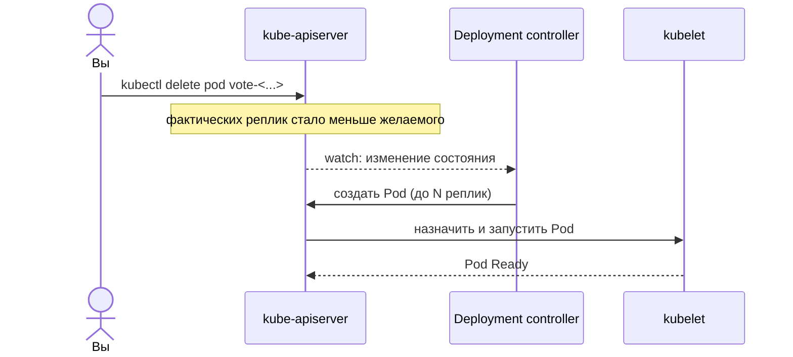

## Оркестрация в Kubernetes — управление по декларативному состоянию

## 1. Цель работы

Развернуть многокомпонентное приложение `example-voting-app` в кластере Kubernetes и научиться управлять им через
декларативное состояние. Работа закрепляет материал лекций 5–8 (данные и состояние, сети, оркестрация, управление
приложением в кластере).

По итогам вы умеете:

- переносить описание из Docker Compose в манифесты Kubernetes;
- разделять stateful- и stateless-сервисы, работать с PersistentVolumeClaim;
- масштабировать Deployment и наблюдать самовосстановление через control loop;
- настраивать readiness/liveness-пробы и понимать их связь с Endpoints сервиса;
- проводить rolling update и откат, выбирая стратегию как управление риском релиза;
- диагностировать сбои в живом кластере.

## 2. Формат сдачи, критерии оценки

Артефакт сдачи — **репозиторий**, а не отчёт со скриншотами. Оценивается воспроизводимое состояние: образы, собирающиеся
из ваших файлов, и приложение, которое поднимается вашими командами.

Оценка идёт в два этапа:

1. **Автопроверка (допуск к защите)**. Перед защитой вы прогоняете `make check` - он проверяет, что всё собирается и
   работает. Если все проверки прошли - вы допущены. Прохождение автопроверки не дает вам баллов, а лишь подтверждает
   работоспособность лабораторной.
2. **Защита.** Преподаватель задаёт вопросы по вашим файлам и образам и выдаёт практическую задачу в реальном времени.
   Именно здесь выставляется оценка.

`make check` у вас на машине — тренажёр с мгновенной обратной связью. Гоняйте его сколько угодно. Доверенный прогон
один: на защите, на машине преподавателя, из зафиксированного коммита.

> Зелёный `make check`, полученный без понимания (например, сгенерированные манифесты, вставленные без разбора), пускает
> вас в аудиторию, но балл на защите без понимания и беглости не берётся. См. §7.

## 3. Ваш вариант

Параметры варианта детерминированы вашим номером ИСУ. Механика открытая — секрета в ней нет, привязка к личности
держится на печати evidence и повторном прогоне (см. §6).

```bash
python3 seed.py --isu <ваш_ИСУ>
```

Вывод задаёт для вашего варианта:

| Параметр        | Что задаёт                                            |
|-----------------|-------------------------------------------------------|
| `NS`            | namespace, в котором живёт всё приложение             |
| `CANARY`        | токен-метка, обязателен в label и env сервиса vote    |
| `REPLICAS_VOTE` | требуемое число реплик vote                           |
| `PVC_SIZE`      | размер тома для PostgreSQL                            |
| `MAX_UNAVAIL`   | `maxUnavailable` в стратегии выката vote              |
| `BREAKFIX_ID`   | какой сбой вам вбросят на защите (готовьтесь ко всем) |

Подставляйте эти значения в манифесты. `make check` перечитывает их из сида и сверяет.

## 4. Подготовка окружения

Инструменты ставятся один раз командой `make setup` (`docker`, `kind`, `kubectl`, `bats`, `jq`, `python3`, `ttyd`).

Запустите тренажёр (он один на все лабы):

```bash
git clone <URL-курса> && cd labs
make setup            # один раз: зависимости
make trainer          # откройте http://localhost:8899 и выберите «Лаб 2» в селекторе
```

На странице: селектор лабы, слева задания с подсказками, справа редактор манифестов и **встроенный терминал**. Кластер и
приложение вы поднимаете **сами** в терминале — это часть работы:

```bash
cd lab2
kind create cluster --name lab2
kubectl apply -f manifests/
```

Кнопка **«Проверить»** кластер не создаёт — только сверяет его состояние с контрактами и красит их зелёным/красным.
**«Проверить это задание»** на карточке — быстрый прогон одного блока (секунды), полная проверка — около минуты.

Манифесты пишете в каталог `manifests/` (прямо в редакторе страницы). Готовых решений нет — заготовки с подсказками уже
лежат в файлах.

## 5. Задания

Каждое задание описывает **что** должно получиться и **как это проверяет** `make check`. Способ достижения выбираете
сами — проверка смотрит на результат, а не на конкретный манифест.

### Задание 1. Развёртывание приложения

Перенесите пять сервисов (`vote`, `result`, `worker`, `redis`, `db`) из `docker-compose.yml` в манифесты Kubernetes и
поднимите их в namespace `NS`. Учётные данные PostgreSQL храните в Secret, а не открытым текстом в переменных
Deployment.

**Контракт проверки:** namespace совпадает с сидом; пять рабочих нагрузок, все поды в состоянии Ready; сквозной путь
работает — голос за вариант отражается на странице result; переменная с паролем БД приходит через `secretKeyRef`.

Исследуйте кластер командами `kubectl get all -n <NS>`, `kubectl describe`, `kubectl logs`, `kubectl get events`.

### Задание 2. Состояние и data gravity

Разверните PostgreSQL с PersistentVolumeClaim размера `PVC_SIZE`. Redis оставьте эфемерным, без тома.

**Контракт проверки:** PVC привязан (Bound), размер совпадает с сидом; после голосования удаление пода БД и его
повторный запуск не сбрасывает счётчик — голос переживает рестарт; у redis тома нет.

Проверка слепа к способу: StatefulSet или Deployment с PVC — оба проходят, если данные сохранились.

### Задание 3. Масштабирование и самовосстановление

Задайте vote `REPLICAS_VOTE` реплик.

**Контракт проверки:** N подов Ready; удаление одного пода не обрывает обслуживание — Service продолжает отвечать,
контроллер поднимает замену, число возвращается к N; повторные запросы в Service попадают минимум в два разных пода.

### Задание 4. Health-пробы

Настройте readinessProbe и livenessProbe на vote и result. На vote добавьте label `lab2.canary=<CANARY>` и одноимённую
переменную окружения.

**Контракт проверки:** пробы присутствуют и рабочие (эндпоинт отвечает 200, путь любой); label и env содержат ваш
`CANARY`.

Разберитесь заранее: что произойдёт с Endpoints сервиса, когда readinessProbe пода начнёт отдавать ошибку.

### Задание 5. Rolling update

Задайте стратегию выката vote с `maxUnavailable=MAX_UNAVAIL`. Выкатите новую версию образа, затем откатитесь.

**Контракт проверки:** `maxUnavailable` совпадает с сидом; во время выката фоновые запросы к Service проходят без
ошибок; история выката содержит не менее двух ревизий; `kubectl rollout undo` возвращает предыдущую.

## 6. Фиксация работы

Когда `make check` зелёный, соберите evidence и зафиксируйте состояние:

```bash
make evidence      # снимает состояние кластера, считает хеш E, печатает scorecard
git add -A && git commit -m "feat(lab2): variant <ИСУ>"
git push
```

`make evidence` сохраняет дампы `kubectl ... -o json`, историю выката, пары «до/после» для самовосстановления и
персистентности, выборку pod-id балансировки и ваш scorecard. Всё сворачивается в хеш `E`. Коммит фиксирует `E` во
времени — переписать историю без следа нельзя. Этот коммит и есть точка, из которой преподаватель поднимет ваш кластер
на защите.

## 7. Допуск и защита

**Допуск:** зелёные ворота `make check` из зафиксированного коммита.

**Персональные вопросы** генерируются из ваших манифестов, с вашими значениями. Примеры формы (реальные подставят ваши
числа):

- vote на N реплик — что станет с голосами в очереди redis, если все N упадут разом, кто и когда их обработает;
- `maxUnavailable=<v>` — сколько подов минимум держат трафик в момент выката и почему выбрано именно это значение;
- у redis нет PVC, у db есть — обоснуйте асимметрию через blast radius;
- readinessProbe result отдаёт 500 — куда пойдёт трафик, что станет с Endpoints.

**Практическая задача (live break-fix).** На машине преподавателя к вашим манифестам вбрасывается сбой по `BREAKFIX_ID`,
у вас ~10 минут на диагностику и починку в живом кластере. Возможные сбои: под БД масштабирован в ноль; подменён пароль
в Secret; readinessProbe указывает на несуществующий путь; образ с несуществующим тегом; рассогласование selector
Service и label подов; повреждённый PVC. Готовьтесь ко всем шести — тренируйтесь ломать и чинить свой кластер сами.

## 8. Диаграммы

Включите в репозиторий (каталог `docs/`) исходники и рендер. Значения берите из своего кластера, не из шаблона.

**Диаграмма 1 — граф объектов Kubernetes.** Deployment → ReplicaSet → Pod, Service → Endpoints, ConfigMap/Secret/PVC.
Реальные имена из `kubectl get all -n <NS>`.

**Диаграмма 2 — control loop.** Sequence вашего события самовосстановления: удаление пода, расхождение желаемого и
фактического состояния, реакция контроллера.



**Диаграмма 3 — путь запроса.** Браузер → Service → Pod, разделение front/back. Свяжите с диаграммой потока данных из
Лаб 1.

**Диаграмма 4 — таймлайн выката.** Ревизии и окно `maxUnavailable` при вашем значении.

## 9. Теоретические вопросы

Ответы привязывайте к своим наблюдениям из работы.

#### Блок А: декларативное состояние и control loop (лекция 7)

1. Что такое желаемое и фактическое состояние? На каком вашем событии из задания 3 вы наблюдали их расхождение и
   сведе́ние?
2. Роль etcd в кластере. Что именно там хранится и почему это единственный источник истины?
3. Чем Deployment отличается от ReplicaSet и от Pod? Почему вы описывали Deployment, а не Pod напрямую?

#### Блок Б: состояние и сети (лекции 5–6)

4. Что такое data gravity? Как задание 2 показало разницу в цене потери redis и потери db?
5. Как Service находит поды? Что содержит объект Endpoints и когда пода в нём не оказывается?
6. Что произойдёт с трафиком, если readinessProbe пода начнёт отдавать ошибку? А если livenessProbe?

#### Блок В: управление релизом (лекция 8)

7. Чем rolling update отличается от blue/green и canary? В каком случае ваше значение `maxUnavailable` даёт выкат без
   простоя?
8. Что делает `kubectl rollout undo` на уровне ReplicaSet? Почему откат быстрый.

## 10. Критерии и баллы (0–12)

- **Ворота (автопроверки зелёные, evidence консистентно): 3 балла.** Обязательное условие допуска.
- **Персональные вопросы (понимание): 5 баллов.**
- **Практическая задача (диагностика сбоя): 4 балла.**

## 11. Типичные ошибки

- Пароль БД открытым текстом в Deployment вместо Secret.
- PVC на redis «на всякий случай» — потеря смысла контраста stateful/stateless.
- readinessProbe на порт, который приложение ещё не слушает: поды вечно NotReady, Endpoints пуст.
- Один «дамп-коммит» в конце вместо инкрементальной истории — красный флаг при фиксации.
- Манифесты, сгенерированные и вставленные без разбора: ворота пройдёте, защиту нет.

## 12. Ресурсы

- Kubernetes Concepts: https://kubernetes.io/ru/docs/concepts/
- kind — Quick Start: https://kind.sigs.k8s.io/docs/user/quick-start/
- kubectl Cheat Sheet: https://kubernetes.io/docs/reference/kubectl/cheatsheet/
- example-voting-app: https://github.com/dockersamples/example-voting-app
- Rolling Update / Deployment: https://kubernetes.io/docs/concepts/workloads/controllers/deployment/
