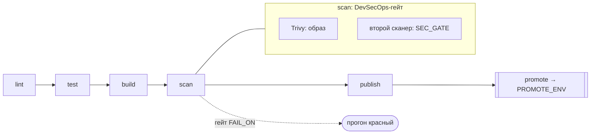
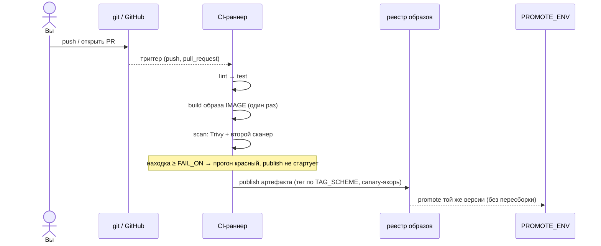
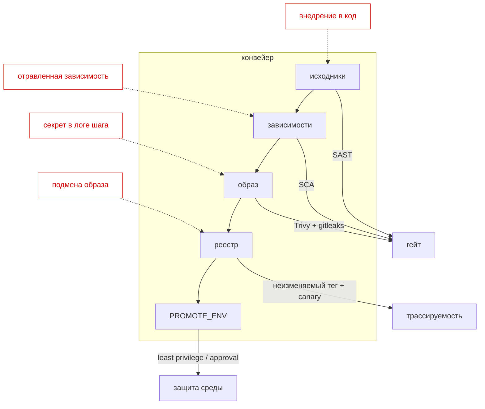

## Конвейер доставки — CI/CD с гейтами и цепочкой поставки под контролем

## 1. Цель работы
Собрать для `example-voting-app` конвейер непрерывной интеграции и поставки: от пуша в git до опубликованного неизменяемого артефакта, продвинутого в следующую среду. Работа закрепляет материал лекций Раздела 3 (git в контуре доставки, анатомия pipeline, артефакты и реестры, DevSecOps, управление конфигурацией и средами).

По итогам вы умеете:
- строить pipeline из стадий с гейтами между ними, где красная стадия останавливает изменение;
- собирать образ один раз и версионировать артефакт по осмысленной стратегии тегирования;
- встраивать в конвейер DevSecOps-гейты (сканирование образа и зависимостей/кода/секретов) так, чтобы находки роняли сборку, а не просто печатали отчёт;
- продвигать прошедший артефакт из среды в среду без пересборки через GitHub Environment;
- считать метрики DORA по git-истории и защищать связь конвейера с этими числами.

## 2. Что вы сдаёте и как это оценивается
Артефакт сдачи — **репозиторий с конвейером**, а не отчёт со скриншотами. Оценивается воспроизводимое состояние: ваши workflow-файлы, git-история и скрипты. Кластер тут не нужен — субстрат работы это git и CI.

Оценка идёт в два канала:

1. **Автоматические ворота допуска.** Локальный прогон `make check` статически разбирает ваши `.github/workflows/*.yml`, git-историю и скрипты. Все ворота зелёные — вы допущены к защите. Ворота не ставят балл сами по себе, они подтверждают «конвейер собран и свойства настоящие».
2. **Защита.** Балл выставляет преподаватель на живом прогоне: персональные вопросы по вашему конвейеру и одна практическая задача на разбор сбоя цепочки поставки.

`make check` у вас на машине — тренажёр с мгновенной обратной связью. Гоняйте его сколько угодно. Доверенный прогон один: на защите, из зафиксированного коммита.

> Зелёный `make check`, полученный без понимания (например, сгенерированный workflow, вставленный без разбора), пускает вас в аудиторию, но балл на защите без понимания и беглости не берётся. См. §7.

## 3. Ваш вариант
Параметры варианта детерминированы вашим номером ИСУ. Механика открытая — секрета в ней нет, привязка к личности держится на canary-якоре в артефакте и повторном прогоне (см. §6).

```bash
python3 seed.py --isu <ваш_ИСУ>
```

Вывод задаёт для вашего варианта:

| Параметр | Что задаёт |
| --- | --- |
| `IMAGE` | имя образа сервиса vote, который собирает конвейер |
| `CANARY` | canary-якорь, обязателен в OCI-лейбле образа или в trailer коммита релиза |
| `TAG_SCHEME` | стратегия тегирования артефакта: `semver`, `sha` или `branch` |
| `SEC_GATE` | второй сканер сверх Trivy: `sca` (зависимости), `sast` (код) или `secrets` |
| `FAIL_ON` | порог сканера образа: сборка валится начиная с этого уровня (`CRITICAL`/`HIGH`) |
| `PROMOTE_ENV` | среда промоушена: `stage`, `preprod` или `qa` |
| `BREAKFIX_ID` | какой сбой цепочки поставки вам вбросят на защите (готовьтесь ко всем) |

Подставляйте эти значения в workflow и скрипты. `make check` перечитывает их из сида и сверяет.

## 4. Подготовка окружения
Инструменты ставятся один раз командой `make setup` (`git`, `bats`, `jq`, `python3`, `ttyd`; PyYAML для точного разбора workflow). Кластера и `kubectl` для этой лабы не нужно.

Запустите тренажёр (он один на все лабы):
```bash
git clone <URL-курса> && cd labs
make setup            # один раз: зависимости
make trainer          # откройте http://localhost:8899 и выберите «Лаб 3» в селекторе
```

На странице: селектор лабы, слева задания с подсказками, справа редактор файлов и **встроенный терминал**. Терминал стартует в вашей рабочей директории `workdir/`. Первым делом инициализируйте репозиторий — конвейер работает по git-истории:
```bash
git init && git add . && git commit -m 'feat: ci pipeline'
```

Workflow-ы кладёте в `.github/workflows/` (прямо в редакторе страницы). Заготовка `ci.yml` с TODO уже лежит там — замените placeholder на свой конвейер. Готового решения нет.

Кнопка **«Проверить»** ничего не собирает и не запускает тяжёлый CI — она статически читает состав вашего конвейера и красит контракты зелёным/красным. **«Проверить это задание»** на карточке — быстрый прогон одного блока (секунды).

> Виджет статуса кластера всегда покажет «кластер не найден» — для CI-лабы кластера нет. На проверки это не влияет, статус-строку по кластеру игнорируйте.

## 5. Задания
Каждое задание описывает **что сделать** и **как это проверяется**. Способ выбираете сами — контракт смотрит на свойство конвейера, а не на конкретный YAML. Стадии могут быть отдельными jobs или именованными шагами; инструмент сборки и сканеры — любые из нужного класса.

### Задание 1. Анатомия конвейера
Собрать в `.github/workflows/` конвейер из пяти стадий с гейтами между ними: `lint → test → build → scan → publish`. Выстроить стадии по порядку — последующая ждёт предыдущую через зависимости (`needs`). Запускать конвейер и на `push`, и на `pull_request`. Сделать так, чтобы красная стадия валила прогон и гейт не пропускал изменение дальше.

**Контракт проверки:** есть хотя бы один workflow, который парсится как YAML; в конвейере видны все пять стадий (`lint`, `test`, `build`, `scan`, `publish` — по имени job, имени шага или команде); хотя бы один job объявляет `needs` (есть цепочка гейтов); блок `on:` содержит и `push`, и `pull_request`.

Разберитесь заранее: почему `needs` — это именно гейт, а не просто порядок вывода. Что происходит с последующей стадией, когда предыдущая падает.

### Задание 2. Стратегия тегирования артефакта
Собрать образ `IMAGE` один раз и пометить его по схеме `TAG_SCHEME`:
- `semver` — тег вида `vX.Y.Z` из релизного git-тега (`github.ref` / `github.ref_name`);
- `sha` — короткий commit-sha как трассируемая метка;
- `branch` — имя ветки как подвижная ссылка.

Вшить canary-якорь `CANARY` в артефакт: как OCI-лейбл образа (`--label lab3.canary=…` или `org.opencontainers.image.revision`) **либо** как trailer коммита релиза (`git commit --trailer 'Canary: …'`). Собрать один неизменяемый артефакт с прослеживаемой версией.

**Контракт проверки:** в конвейере есть шаг сборки образа (`docker build` / `buildx` / `build-push-action` / `kaniko` / `nerdctl` — любой); тег проставлен по вашей схеме `TAG_SCHEME` (проверка ищет соответствующий маркер в тексте `run:`/`uses:`); `CANARY` присутствует либо в шагах конвейера (лейбл), либо в trailer/теле коммита git-истории.

Соберите образ ровно один раз. Дальше по конвейеру артефакт только продвигается, не пересобирается.

### Задание 3. DevSecOps-гейт
Встроить в стадию `scan` два гейта безопасности:
- сканер образа **Trivy** с порогом `FAIL_ON`;
- второй сканер по варианту `SEC_GATE`: `sca` — зависимости (`trivy fs`/`grype`/`osv-scanner`/`snyk`); `sast` — статический анализ кода (`semgrep`/`codeql`/`bandit`/`sonar`); `secrets` — поиск секретов в истории (`gitleaks`/`trufflehog`/`detect-secrets`).

Настроить гейт так, чтобы он **ронял сборку** на находках уровня `FAIL_ON` и выше (`exit-code: 1` у Trivy, `--error` у semgrep, ненулевой код у gitleaks), а не печатал отчёт. Поставить `scan` до `publish` — гейт останавливает конвейер до публикации.

**Контракт проверки:** конвейер упоминает `trivy`; присутствует второй сканер нужного класса из `SEC_GATE`; у сканеров задан признак падения на находке (`exit-code`/`severity`/`fail-on`/`--error`) и упомянут ваш порог `FAIL_ON`; есть job публикации (`publish`/`push`/`release`/`deploy`), и в конвейере есть зависимости `needs` — то есть `scan` предшествует `publish`.

Отчёт без ненулевого кода выхода — это не гейт. Проверьте, что на модельной уязвимости прогон реально краснеет.

### Задание 4. Промоушен сред
Продвинуть прошедший артефакт из dev в среду `PROMOTE_ENV` без пересборки: та же версия образа, что прошла `scan`, разворачивается дальше. Привязать джоб промоушена к GitHub Environment `PROMOTE_ENV` (точка approval и защиты) и поставить его после `publish` через `needs`. Продвигать артефакт, а не исходники.

**Контракт проверки:** есть job с полем `environment:`, чьё имя совпадает с `PROMOTE_ENV`; у этого job объявлены `needs`, тянущиеся к `publish`/`build`/`scan`; в run-шагах джоба промоушена нет повторной сборки образа (`docker build`/`buildx build`/`build-push-action`) — он деплоит/тегирует уже готовый артефакт.

Разберитесь заранее: чем GitHub Environment отличается от простой переменной `env:` и зачем к нему привязывают approval.

### Задание 5. Метрики DORA
Добавить в репозиторий скрипт `metrics/dora.sh` или `metrics/dora.py`, который по git-истории считает не менее двух метрик DORA:
- **частоту развёртываний** — по релизным тегам (`git tag` / `git for-each-ref refs/tags`);
- **время поставки изменения (lead time)** — разница дат между коммитом и включившим его релизным тегом (`%ct`/`%ci`/`committerdate`/`creatordate`).

Сделать скрипт исполняемым, запускаемым без аргументов из корня репозитория; он печатает числа.

**Контракт проверки:** файл `metrics/dora.*` существует, запускается без аргументов и завершается кодом 0; текст скрипта считает частоту развёртываний по тегам (упоминает `git tag`/`refs/tags`/deployment frequency); текст скрипта считает lead time (упоминает `lead time`/`%ct`/`%ci`/`committerdate`/`creatordate`).

Значения берите из git-истории **своего** репозитория, не хардкодьте. На защите скрипт запустят на вашем коммите.

## 6. Фиксация работы
Когда `make check` зелёный, зафиксируйте состояние. Здесь фиксируется сам репозиторий с конвейером — git-история и есть evidence:

```bash
git add -A && git commit -m "feat(lab3): variant <ИСУ>"
git tag v1.0.0                 # релизный тег: по нему считаются DORA и, при semver, тег образа
git push --follow-tags
```

Инкрементальная история с осмысленными коммитами и релизными тегами — часть работы: по ней конвейер тегирует артефакт и считает DORA, по ней преподаватель воспроизводит прогон. Один «дамп-коммит» в конце обесценивает и то и другое.

## 7. Допуск и защита
**Допуск:** зелёные ворота `make check` из зафиксированного коммита.

**Персональные вопросы** генерируются из вашего конвейера, с вашими значениями. Примеры формы (реальные подставят ваши параметры):
- у вас `TAG_SCHEME=<v>` — почему эта схема, что она даёт для трассировки инцидента в проде и что теряет по сравнению с двумя другими;
- ваш второй гейт — `SEC_GATE=<v>` — какой класс угроз он закрывает и какой Trivy на образ пропустит;
- порог `FAIL_ON=<v>` — почему сборка валится с этого уровня; что произойдёт, если опустить порог на ступень ниже;
- промоушен в `PROMOTE_ENV=<v>` без пересборки — что именно гарантирует «тот же артефакт» и как ломается гарантия, если пересобрать образ в среде промоушена;
- ваши числа DORA — как их сдвинет добавление ручного approval на промоушен.

**Практическая задача (live break-fix).** На машине преподавателя в ваш конвейер вбрасывается сбой цепочки поставки по `BREAKFIX_ID`, у вас ~10 минут на диагностику и починку. Возможные сбои: гейт scan переведён в режим отчёта (не роняет сборку); тег образа стал подвижным вместо неизменяемого; canary-якорь потерян при сборке; промоушен пересобирает образ вместо продвижения; `needs` разорван и publish обгоняет scan; секрет реестра утёк в лог шага. Готовьтесь ко всем шести — тренируйтесь ломать и чинить свой конвейер сами.

## 8. Диаграммы
Включите в репозиторий (каталог `docs/`) исходники и рендер. Значения берите из своего конвейера, не из шаблона.

**Диаграмма 1 — стадии конвейера и гейты.** Пять стадий с зависимостями `needs`; где стоит DevSecOps-гейт и где среда промоушена. Реальные имена ваших jobs.



**Диаграмма 2 — путь артефакта.** Sequence от пуша до опубликованного и продвинутого образа: push → build → scan → publish → promote. Отметьте, где артефакт собирается один раз и где гейт может оборвать путь.



**Диаграмма 3 — модель угроз по этапам.** На тот же конвейер наложите поверхности атаки цепочки поставки: скомпрометированный код, отравленная зависимость, утечка секрета в лог, подмена образа в реестре. Против каждой — ваш контроль (SAST/SCA/gitleaks/неизменяемый тег + canary + least privilege).



## 9. Теоретические вопросы
Ответы привязывайте к своему конвейеру и своим значениям.

#### Блок А: git в контуре доставки и анатомия pipeline
1. Чем trunk-based отличается от release trains как стратегия релиза? Какую из них поддерживает ваша схема тегирования?
2. Что делает `needs` гейтом, а не просто порядком? Опишите на своём конвейере, где прогон останавливается и почему изменение не идёт дальше.
3. Что такое неизменяемый артефакт и почему один и тот же образ проходит все среды без пересборки? Как ваша `TAG_SCHEME` обеспечивает трассируемость от прода к коммиту?

#### Блок Б: DevSecOps и цепочка поставки
4. Постройте модель угроз для своего конвейера по этапам (код → зависимости → образ → реестр → среда). Какой ваш гейт какую поверхность закрывает?
5. Чем SAST отличается от сканирования зависимостей (SCA) и от сканирования образа? Что из этого поймает уязвимость в базовом образе, а что — в вашем коде?
6. Почему гейт обязан ронять сборку, а не печатать отчёт? Что даёт порог `FAIL_ON` именно на вашем уровне и чем опасен режим «warn only»?
7. Что такое least privilege в контексте токена реестра и секретов конвейера? Как секрет может утечь в лог шага и как это предотвратить?

#### Блок В: конфигурация, среды и метрики
8. Зачем промоушен привязан к GitHub Environment, а не к обычной переменной? Где здесь точка approval и что она защищает?
9. Что считают ваши метрики DORA и как конвейер на них влияет? Как изменится lead time и частота развёртываний, если вставить ручной approval перед `PROMOTE_ENV`?

## 10. Критерии и баллы (0–12)
- **Ворота (автопроверки зелёные, история консистентна): 3 балла.** Обязательное условие допуска.
- **Персональные вопросы (понимание): 5 баллов.**
- **Практическая задача (разбор сбоя цепочки поставки): 4 балла.**

## 11. Типичные ошибки
- Стадия scan печатает отчёт, но не роняет сборку: гейт есть только на бумаге, publish уходит с уязвимостью.
- Образ пересобирается в среде промоушена — «тот же артефакт» нарушен, scan продвигаемой версии ничего не гарантирует.
- Подвижный тег (`latest` или имя ветки там, где нужен неизменяемый): нельзя привязать прод к коммиту.
- Canary-якорь теряется при сборке (не попал в лейбл или коммит) — работу нельзя привязать к вам.
- `needs` не проставлен: стадии идут параллельно, publish обгоняет scan, гейта фактически нет.
- Хардкод чисел в скрипте DORA вместо расчёта по git-истории: на защите на вашем коммите цифры не сойдутся.
- Workflow сгенерирован и вставлен без разбора: ворота пройдёте, защиту нет.

## 12. Ресурсы
- GitHub Actions — Workflow syntax: https://docs.github.com/actions/using-workflows/workflow-syntax-for-github-actions
- GitHub Environments и approval: https://docs.github.com/actions/deployment/targeting-different-environments
- Trivy: https://aquasecurity.github.io/trivy/
- gitleaks: https://github.com/gitleaks/gitleaks · semgrep: https://semgrep.dev/docs/
- DORA metrics: https://dora.dev/
- SLSA — цепочка поставки: https://slsa.dev/
- example-voting-app: https://github.com/dockersamples/example-voting-app
