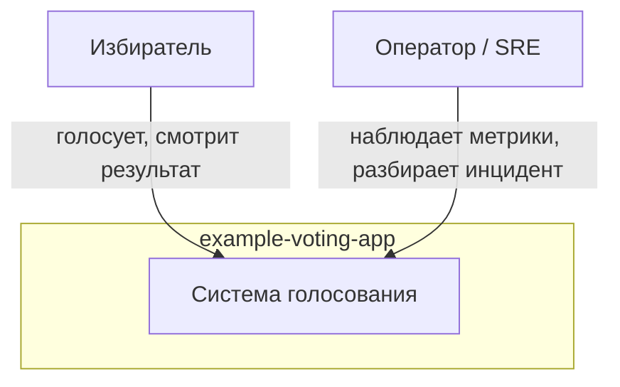
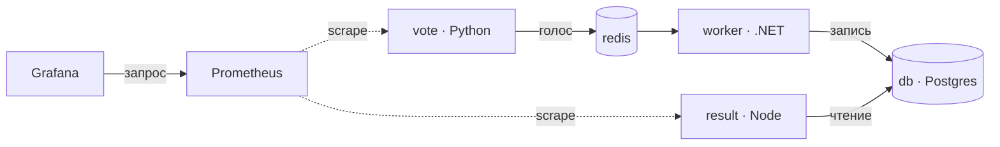
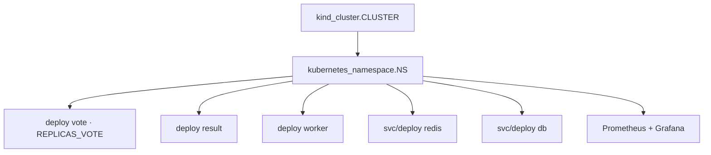
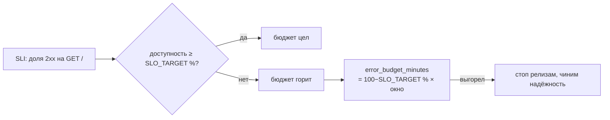
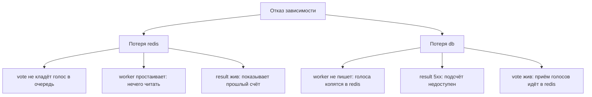

## Инфраструктура как код — воспроизводимость, наблюдаемость и надёжность (капстоун)

## 1. Цель работы

Собрать всё `example-voting-app` из кода: описать инфраструктуру в Terraform, привести конфигурацию Ansible к
идемпотентному состоянию, поднять наблюдаемость на Prometheus и Grafana, задать SLI/SLO с бюджетом ошибок и
задокументировать решения через ADR и C4. Работа закрывает Раздел 4 (лекции 13–16) и сводит воедино весь курс:
контейнеризацию (Лаб 1), оркестрацию (Лаб 2), CI/CD и безопасность (Лаб 3). Это **капстоун раздела с двойным весом** —
он проверяет не отдельный навык, а способность держать систему целиком.

По итогам вы умеете:

- описывать инфраструктуру декларативно и проходить путь `validate → plan → apply`;
- отличать идемпотентную конфигурацию от разовых команд и ловить дрейф между кодом и кластером;
- писать идемпотентные Ansible-плейбуки на модулях, а не на `shell`;
- разворачивать наблюдаемость и разбирать инцидент методом симптом → гипотеза → причина;
- формулировать SLI/SLO, считать бюджет ошибок в минутах и оценивать blast radius отказа;
- обосновывать инфраструктурные решения через ADR и рисовать систему в нотации C4.

## 2. Формат сдачи, критерии оценки

Артефакт сдачи — **репозиторий**, а не отчёт со скриншотами. Оценивается воспроизводимое состояние: образы, собирающиеся
из ваших файлов, и приложение, которое поднимается вашими командами.

Оценка идёт в два этапа:

1. **Автопроверка (допуск к защите)**. Перед защитой вы прогоняете `make check` - он проверяет, что всё собирается и
   работает. Если все проверки прошли - вы допущены. Прохождение автопроверки не дает вам баллов, а лишь подтверждает
   работоспособность лабораторной.
2. **Защита.** Преподаватель задаёт вопросы по вашим файлам и образам и выдаёт практическую задачу в реальном времени.
   Именно здесь выставляется оценка.

`make check` у вас на машине — тренажёр с мгновенной обратной связью. Гоняйте его сколько угодно. Доверенный прогон
один: на защите, из зафиксированного коммита.

> Капстоун весит вдвое. Зелёный `make check`, полученный без понимания (сгенерированный HCL, вставленный без разбора),
> пускает вас в аудиторию, но балл на защите берётся только беглостью и разбором своих же решений. См. §7.

## 3. Ваш вариант

Параметры варианта детерминированы вашим номером ИСУ. Механика открытая — секрета в ней нет, привязка к личности
держится на canary-токене в артефакте и повторном прогоне на защите (см. §6).

```bash
python3 seed.py --isu <ваш_ИСУ>
```

Вывод задаёт для вашего варианта:

| Параметр          | Что задаёт                                                |
|-------------------|-----------------------------------------------------------|
| `NS`              | namespace, в котором живёт всё приложение                 |
| `CLUSTER`         | имя kind-кластера, который поднимает Terraform            |
| `CANARY`          | токен-метка, обязателен в аннотации/теге дашборда Grafana |
| `REPLICAS_VOTE`   | требуемое число реплик vote (дрейф-тест)                  |
| `SLO_TARGET`      | цель доступности SLO для vote (в `slo.yaml`)              |
| `SLO_WINDOW_DAYS` | окно расчёта бюджета ошибок, дней                         |
| `BREAKFIX_ID`     | какой инцидент вам вбросят на защите (готовьтесь ко всем) |

Подставляйте эти значения в код и документы. `make check` перечитывает их из сида и сверяет точным совпадением по якорям
(canary, цель SLO, окно, число реплик).

## 4. Подготовка окружения

Инструменты ставятся один раз командой `make setup` из `labs/` (`docker`, `kind`, `kubectl`, `terraform`, `ansible`,
`bats`, `jq`, `python3`, `ttyd`).

Запустите тренажёр (он один на все лабы):

```bash
git clone <URL-курса> && cd labs
make setup            # один раз: зависимости
make trainer          # откройте http://localhost:8899 и выберите «Лаб 4» в селекторе
```

На странице: селектор лабы, слева задания с подсказками, справа редактор рабочей директории и **встроенный терминал**
(он стартует в вашей рабочей директории). Кластер вы поднимаете **сами** — здесь это делает Terraform:

```bash
terraform init
terraform validate
terraform apply
kubectl config use-context kind-lab4
```

Раскладка рабочей директории свободная: контракты смотрят на состояние кластера и на артефакты-исходы, а не на
конкретный текст HCL. В редакторе уже лежат заготовки с подсказками — `main.tf`, `playbook.yml`, `slo.yaml`, `adr/`,
каталог `docs/`. Правьте дерево под себя: создавайте и удаляйте файлы и папки.

Кнопка **«Проверить»** кластер не создаёт — только сверяет состояние с контрактами и красит их зелёным или красным.
**«Проверить это задание»** на карточке гоняет один блок контрактов; полная проверка идёт дольше, потому что поднимает
эфемерные поды внутри кластера и вносит дрейф.

## 5. Задания

Каждое задание описывает **что** должно получиться и **как это проверяет** `make check`. Способ выбираете сами —
контракты слепы к реализации, они наблюдают исход. Порядок связный: задание N опирается на поднятое в N−1.

### Задание 1. Инфраструктура кодом: plan и apply

Описать инфраструктуру в Terraform (HCL) и применить её. Провайдером kind поднять кластер `CLUSTER`, в нём создать
namespace `NS` и развернуть все пять сервисов приложения (`vote`, `result`, `worker`, `redis`, `db`). Пройти путь
`terraform validate → plan → apply`.

**Контракт проверки:** `terraform validate` проходит в рабочем каталоге; kind-кластер `CLUSTER` поднят и его API
отвечает (контекст `kind-<CLUSTER>`); namespace совпадает с сидом и существует в кластере; сервисы существуют с точными
именами `db` и `redis` — приложение ходит по ним.

Namespace создавайте ресурсом `kubernetes_namespace`, а не `kubectl` вручную — иначе Terraform не увидит его в
состоянии. Провайдер кластера — `tehcyx/kind` или аналог. Исследуйте состояние командами `terraform state list`,
`terraform show`, `kubectl get all -n <NS>`.

### Задание 2. Идемпотентность и дрейф

Добиться, чтобы повторный `terraform plan` после `apply` показывал ноль изменений. Затем убедиться, что внесённый мимо
Terraform дрейф обнаруживается на этапе `plan`, а `apply` возвращает кластер к декларации.

**Контракт проверки:** `terraform plan -detailed-exitcode` после `apply` возвращает код 0 (изменений нет). Проверка сама
вносит дрейф — масштабирует `vote` мимо Terraform — и после этого `plan` обязан вернуть код 2 (расхождение найдено).
Затем `apply` лечит дрейф: число реплик `vote` возвращается к `REPLICAS_VOTE`.

Код 2 на «чистом» `plan` значит, что конфигурация недетерминирована — что-то тянется на каждом прогоне (вычисляемое
поле, отсутствующий `lifecycle`, ресурс без стабильного идентификатора). Разберитесь заранее: чем `plan` отличает дрейф
от ошибки конфигурации.

### Задание 3. Ansible идемпотентно

Написать Ansible-playbook, который приводит приложение к желаемому состоянию (применяет конфигурацию или метки в
кластере). Первый прогон меняет состояние, повторный проходит без изменений.

**Контракт проверки:** первый прогон завершается без ошибок (`failed=0`); повторный прогон идемпотентен — в сводке
`play recap` стоит `changed=0`. Проверка читает recap двух подряд прогонов вашего playbook.

Идемпотентность — свойство модулей, не команд. Используйте `kubernetes.core.k8s` с декларативным `state`, а не
`command`/`shell`: у `shell` нет встроенной проверки «уже в нужном состоянии», поэтому он рапортует `changed` каждый
раз.

### Задание 4. Наблюдаемость: Prometheus, Grafana, инцидент

Развернуть Prometheus и Grafana (частью Terraform или Ansible). Prometheus должен собирать метрики с целей, Grafana —
нести дашборд с метрикой доступности `vote` и меткой `canary=CANARY`. Разобрать заготовленный инцидент в
`docs/incident.md`.

**Контракт проверки:** Prometheus скрейпит хотя бы одну живую цель (`"health":"up"` в `/api/v1/targets`); Grafana
отвечает `ok` на `/api/health`; дашборд (JSON в рабочем каталоге) содержит упоминание `vote` и ваш сид-`CANARY`;
`docs/incident.md` построен по методу симптом → гипотеза → причина и ссылается на конкретную метрику или панель (имя
метрики, PromQL, `up`, `rate(`, `_total`, `%`), а не на общие слова.

Проверка ходит к сервисам изнутри кластера через эфемерный под — порт-форвардов нет, разворачивайте Prometheus и Grafana
в namespace `NS`. Имя сервиса Prometheus у разных чартов различается (`prometheus`, `prometheus-server`,
`prometheus-operated`) — контракт перебирает варианты, вам достаточно любого рабочего.

### Задание 5. SLI/SLO, бюджет ошибок, blast radius

Оформить `slo.yaml` для сервиса `vote`: SLI доступности, цель SLO `SLO_TARGET`% на окне `SLO_WINDOW_DAYS` дней, формула
бюджета ошибок. Посчитать бюджет в минутах за окно и описать blast radius отказа зависимостей.

**Контракт проверки:** `slo.yaml` — валидный YAML; цель SLO и окно совпадают с сидом (допускается запись `99.9` и
`99.9%`, `30` и `30d`); поле `error_budget_minutes` близко к `(100 − SLO_TARGET)/100 × окно × 24 × 60` (допуск 5 % на
округление); секция blast radius называет отказ `redis` и отказ `db` (`db`/`postgres`/`база`).

Бюджет ошибок — это не «сколько можно ломать», а допустимый простой за окно: при 99.9 % на 30 дней вам отпущено ≈ 43
минуты. Blast radius опишите через локализацию: потеря `redis` рвёт приём голосов, потеря `db` рвёт подсчёт и страницу
result — но обе не роняют весь кластер, отказ ограничен своим сервисом.

### Задание 6. ADR и C4

Задокументировать инфраструктурные решения: не менее двух ADR в каноническом формате в `docs/adr/`. Построить
C4-диаграммы уровней Context и Container в Mermaid в `docs/c4.md`.

**Контракт проверки:** в `docs/adr/` минимум два `.md`-файла, и каждый несёт все четыре секции — Context, Decision,
Status, Consequences (в любом регистре, ru/en); в `docs/c4.md` есть блок ```` ```mermaid ````, помеченный как context
(уровень Context); и блок с контейнерами уровня Container, где присутствуют реальные компоненты системы — `vote` и
`prometheus`/`grafana`, а не placeholder.

ADR — короткий файл на одно решение: контекст и ограничения, что выбрано и почему, статус, последствия и риски. Два
примера тем: «kind vs managed-кластер», «pull-метрики (Prometheus) vs push». C4 рисуйте с реальными именами из своей
развёрнутой системы, не из шаблона.

## 6. Фиксация работы

Когда `make check` зелёный, зафиксируйте состояние:

```bash
git add -A && git commit -m "feat(lab4): variant <ИСУ>"
git push
```

Коммит фиксирует ваш scorecard и артефакты во времени — переписать историю без следа нельзя. Из этого коммита
преподаватель поднимет вашу инфраструктуру на защите: `terraform apply` из вашего кода, затем `make check`. Собирайте
историю инкрементально — один «дамп-коммит» в конце читается как красный флаг.

## 7. Допуск и защита

**Допуск:** зелёные ворота `make check` из зафиксированного коммита.

**Персональные вопросы** генерируются из вашего кода, с вашими значениями. Примеры формы (реальные подставят ваши
числа):

- `plan` после `apply` вернул код 2 без ваших правок — какое поле недетерминировано и как это чинится;
- дрейф внесли `kubectl scale` — почему `plan` его видит, а не только `apply`; где хранится «желаемое» состояние;
- цель SLO `<v>` % на окне `<w>` дней — сколько минут бюджета ошибок и что вы делаете, когда он выгорел до защиты
  релиза;
- потеряли `redis` — что именно деградирует, что продолжает работать и почему отказ локализован;
- Prometheus не видит цель — с чего начинаете диагностику по методу симптом → гипотеза → причина.

**Практическая задача (live break-fix).** На машине преподавателя в вашу инфраструктуру вбрасывается инцидент по
`BREAKFIX_ID`, у вас ~10 минут на диагностику и починку в живом кластере. Диагностику ведите методом симптом →
гипотеза → причина, опираясь на свои метрики и дашборд. Готовьтесь ко всем сценариям — тренируйтесь ломать и чинить свою
инфраструктуру сами: внесите дрейф, убейте зависимость, испортите цель скрейпа и восстановитесь.

## 8. Диаграммы

Держите исходники в каталоге `docs/`. Значения берите из своей системы, не из шаблона. C4-диаграммы обязательны (задание
6); остальные усиливают разбор на защите.

**Диаграмма 1 — C4 Context.** Пользователь и внешние системы вокруг приложения. Уровень Context показывает границу
системы, а не её внутренности.



**Диаграмма 2 — C4 Container.** Контейнеры системы и связи между ними: пять сервисов приложения плюс наблюдаемость.



**Диаграмма 3 — граф ресурсов Terraform.** Как ваши ресурсы зависят друг от друга: провайдер kind поднимает кластер, на
нём — namespace, внутри namespace — сервисы. Это тот граф, что Terraform обходит на `apply` и хранит в state.



**Диаграмма 4 — SLO и бюджет ошибок.** Окно SLO, порог доступности и выгорание бюджета во времени. Отметьте свой
`SLO_TARGET` и посчитанный бюджет в минутах.



**Диаграмма 5 — дерево отказов (blast radius).** Что деградирует при потере каждой зависимости и почему отказ
локализован. Свяжите с секцией blast radius в `slo.yaml`.



## 9. Теоретические вопросы

Ответы привязывайте к своим наблюдениям из работы.

#### Блок А: инфраструктура как код (лекция 13)

1. Что такое декларативность? Чем описание «желаемого состояния» в Terraform отличается от императивного скрипта,
   который вы бы написали на bash?
2. Что такое дрейф конфигурации и где Terraform его обнаруживает — на `plan` или на `apply`? На каком вашем событии из
   задания 2 вы это видели?
3. Что хранит Terraform state и почему он единственный источник истины о том, чем управляет Terraform? Что случится,
   если удалить `.tfstate`?
4. Почему идемпотентность — свойство модулей Ansible, а не команд `shell`? Приведите пример из своего playbook.

#### Блок Б: наблюдаемость (лекция 14)

5. Чем метрики, логи и трассировки дополняют друг друга при реконструкции поведения системы? Что из них дал вам разбор
   инцидента?
6. Как Prometheus узнаёт, какие цели скрейпить, и что значит `health: up` в `/api/v1/targets`? Модель pull против push —
   что вы выбрали и почему.
7. Разберите свой инцидент по методу симптом → гипотеза → причина. На какую метрику или панель вы опёрлись?

#### Блок В: надёжность и решения (лекции 15–16)

8. Чем отличаются SLI, SLO и SLA? Как из вашей цели SLO получается бюджет ошибок в минутах и зачем он нужен инженеру, а
   не только менеджеру?
9. Что такое blast radius? Как задание 5 показало разницу в цене потери `redis` и потери `db`?
10. Зачем нужен ADR, если решение можно просто обсудить устно? Какие два решения вы задокументировали и по каким
    критериям выбирали?

## 10. Критерии и баллы (0–24, двойной вес)

Капстоун весит вдвое против обычной лабы. Пропорции те же, суммы удвоены:

- **Ворота (автопроверки зелёные, история консистентна): 6 баллов.** Обязательное условие допуска.
- **Персональные вопросы (понимание): 10 баллов.**
- **Практическая задача (live break-fix): 8 баллов.**

## 11. Типичные ошибки

- Namespace создан `kubectl`, а не ресурсом Terraform: `plan` каждый раз хочет его создать, идемпотентности нет.
- Недетерминированная конфигурация: `plan` после `apply` возвращает код 2 без ваших правок — вычисляемое поле или ресурс
  без стабильного идентификатора.
- `command`/`shell` вместо модулей в Ansible: повторный прогон рапортует `changed`, задание 3 краснеет.
- Prometheus и Grafana в другом namespace, чем `NS`: контракт ходит эфемерным подом в `NS` и цели не находит.
- Дашборд без сид-`CANARY` или без упоминания `vote`: якорь личности не находится.
- `error_budget_minutes` посчитан от процента, а не от окна в минутах — число расходится с ожиданием более чем на 5 %.
- C4 с placeholder-именами вместо реальных `vote`/`prometheus`/`grafana`.
- HCL, сгенерированный и вставленный без разбора: ворота пройдёте, защиту нет — а вес двойной.

## 12. Ресурсы

- Terraform — Getting Started: https://developer.hashicorp.com/terraform/tutorials
- Terraform kind provider (`tehcyx/kind`): https://registry.terraform.io/providers/tehcyx/kind/latest/docs
- Ansible `kubernetes.core`: https://docs.ansible.com/ansible/latest/collections/kubernetes/core/
- Prometheus — Getting Started: https://prometheus.io/docs/prometheus/latest/getting_started/
- Grafana — Dashboards: https://grafana.com/docs/grafana/latest/dashboards/
- Google SRE — SLO и error budget: https://sre.google/sre-book/service-level-objectives/
- Architecture Decision Records: https://adr.github.io/
- C4 model: https://c4model.com/
- example-voting-app: https://github.com/dockersamples/example-voting-app
